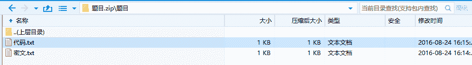
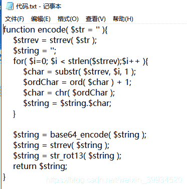
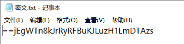
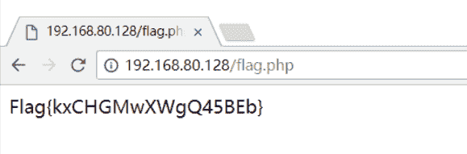

<!--yml
category: 未分类
date: 2022-04-26 14:48:05
-->

# CTF-加密与解密（十八）_红烧兔纸的博客-CSDN博客_曼联加密

> 来源：[https://blog.csdn.net/weixin_39934520/article/details/108088963](https://blog.csdn.net/weixin_39934520/article/details/108088963)

> # **声明：以下CTF题均来自网上收集，在这里主要是给新手们涨涨见识，仅供参考而已。需要题目数据包的请私信或在下方留言。**

> # **                            35.传感器（来源：网络）**

> ## **1.关卡描述**

* * *

**5555555595555A65556AA696AA6666666955
这是某压力传感器无线数据包解调后但未解码的报文(hex)

已知其ID为0xFED31F，请继续将报文完整解码，提交hex。**

**提示1：曼联**

> ## **2.解题步骤**

* * *

**2.1 题目提示曼联，猜想到可能是曼彻斯特编码。**

**2.2 曼彻斯特编码（Manchester Encoding），也叫做相位编码（ Phase Encode，简写PE），是一个同步时钟编码技术，被物理层使用来编码一个同步位流的时钟和数据。它在以太网媒介系统中的应用属于数据通信中的两种位同步方法里的自同步法（另一种是外同步法），即接收方利用包含有同步信号的特殊编码从信号自身提取同步信号来锁定自己的时钟脉冲频率，达到同步目的。**

**2.3 5555555595555A65556AA696AA6666666955转为二进制，根据01->1,10->0。可得到： 
0101->11 
0110->10 
1010->00 
1001->01**

**2.4 decode得到：
11111111 11111111 01111111 11001011 11111000 00100110 00001010 10101010 10011111 
bin->hex，对比ID并不重合，根据八位倒序传输协议将二进制每八位reverse，转hex即可 
flag：FFFFFED31F645055F9**

> # **                                    36.算法逆向（来源：网络）**

> ## **1.关卡描述**

* * *

**此逆向非彼逆向。**

**题目：**

****

****

****

> ## **2.解题步骤**

* * *

**2.1 根据题意，我们将给出的代码算法进行逆向即可，具体exp如下：**

```
<?php
function decode( $string = '' ){
    $string = str_rot13( $string );
    $string = strrev( $string );
    $string = base64_decode( $string );
    $deString = '';
    for( $i = 0; $i<strlen($string);$i++ ){
        $char = substr( $string, $i, 1 );
        $ordChar = ord( $char ) - 1;
        $char = chr( $ordChar );
        $deString = $deString . $char;
    }
    $deString = strrev( $deString );
	echo $deString;
}
	decode('==jEgWTn8kJrRyRFBuKJLuzH1LmDTAzs');
?>
```

**2.2 然后把后缀名改为php，打开文件，用浏览器打开即可得到flag值。**



**Flag{kxCHGMwXWgQ45BEb}**