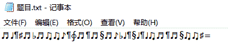
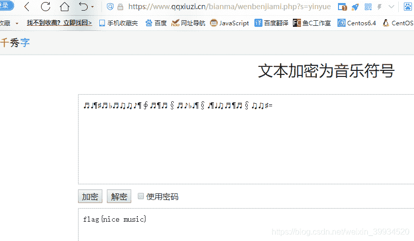
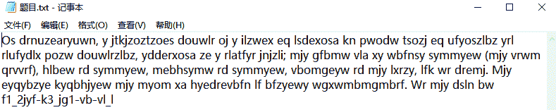
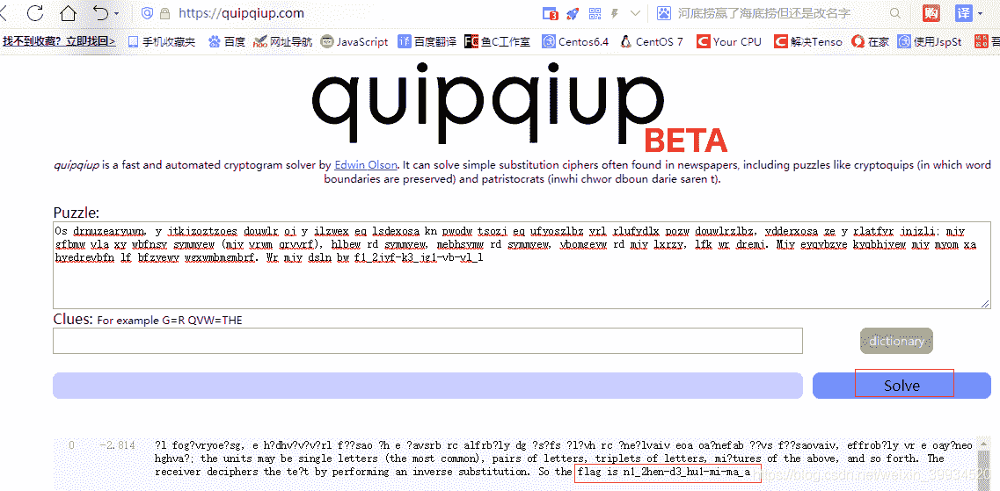

<!--yml
category: 未分类
date: 2022-04-26 14:54:02
-->

# CTF-加密与解密（十六）_红烧兔纸的博客-CSDN博客_文本加密为音乐符号

> 来源：[https://blog.csdn.net/weixin_39934520/article/details/108063966](https://blog.csdn.net/weixin_39934520/article/details/108063966)

> # **声明：以下CTF题均来自网上收集，在这里主要是给新手们涨涨见识，仅供参考而已。需要题目数据包的请私信或在下方留言。**

> # **                                  31.I like music（来源：网络）**

> ## **1.关卡描述**

* * *

**我喜欢听音乐。**

> ## **2.解题步骤**

* * *

**2.1 打开题目，发现是一串音乐符号。**

**2.2 判断是文本加密。**

**2.3 文本加密可以将正常文本内容打乱为不可连读的文字或符号(汉字，数字，字母，音乐符号等)，换行等格式信息也会被清除，达到加密的作用。在进行文本加密时可以设定一个密码，这样只有知道密码的人才能解密文本。密码可以是数字、字母和下划线。**

**2.4 到在线网站上解密，得到flag。**

**http://www.qqxiuzi.cn/bianma/wenbenjiami.php?s=yinyue**

**flag{nice music}**

> # **                               32.Old-fashion （来源：强网杯）**

> ## **1.关卡描述**

* * *

**古老的加密。**

> ## **2.解题步骤**

* * *

**2.1 打开题目，发现是一串密文。**

**2.2 提示是古典密码，这里分成了两句，以;分隔。**

**2.3 到在线网站上解密，得到flag。**

**https://quipqiup.com/**

