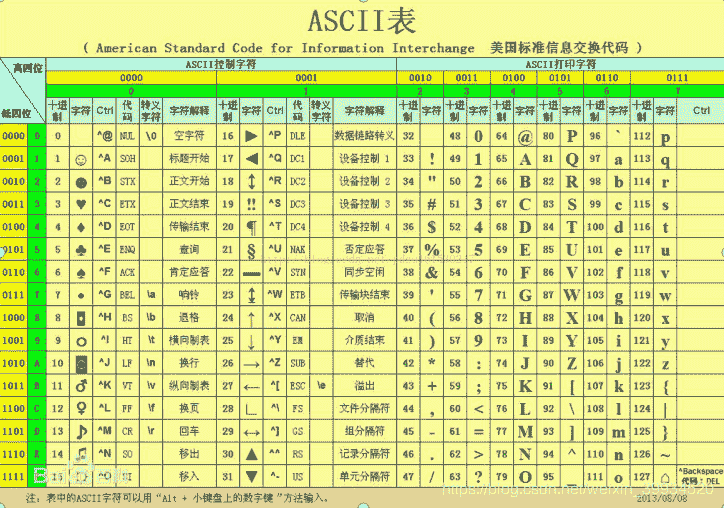
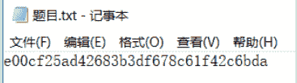
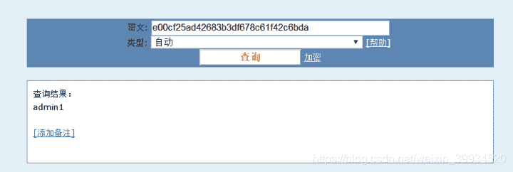

<!--yml
category: 未分类
date: 2022-04-26 14:53:14
-->

# CTF-加密与解密（十四）_红烧兔纸的博客-CSDN博客

> 来源：[https://blog.csdn.net/weixin_39934520/article/details/108027739](https://blog.csdn.net/weixin_39934520/article/details/108027739)

> # **声明：以下CTF题均来自网上收集，在这里主要是给新手们涨涨见识，仅供参考而已。需要题目数据包的请私信或在下方留言。**

> # **                               27.一串数字 （来源：网络）**

> ## **1.关卡描述**

* * *

**真的是一串数字。**

> ## **2.解题步骤**

* * *

**2.1 打开题目，发现是一串密文。**

**2.2 判断是ASCII编码。**

**2.3 对照ASCII码表，得到flag**

**ASCII CODE**

> # **                        28.MD5  （来源：网络）**

> ## **1.关卡描述**

* * *

**这个应该不难吧！**

> ## **2.解题步骤**

* * *

**2.1 打开题目，发现是一串密文。**

**2.2 判断是MD5加密。**

**2.3 MD5加密的原理：**

**MD5消息摘要算法是一种被广泛使用的密码散列函数，可以产生出一个128位（16字节）的散列值（hash value），用于确保信息传输完整一致。**

**注意：md5的值范围在0-9，a-f**

**2.4 到在线网站上解密**

**[http://www.cmd5.com/](http://www.cmd5.com/)**

**admin1**