<!--yml
category: 未分类
date: 2022-04-26 14:32:57
-->

# CTF-安全杂项（六）_红烧兔纸的博客-CSDN博客

> 来源：[https://blog.csdn.net/weixin_39934520/article/details/108291168](https://blog.csdn.net/weixin_39934520/article/details/108291168)

> # **声明：以下CTF题均来自网上收集，在这里主要是给新手们涨涨见识，仅供参考而已。需要题目数据包的请私信或在下方留言。**

> # **                          11.Paint&Scan（来源：实验吧）**

> ## **1.关卡描述**

* * *

**                                             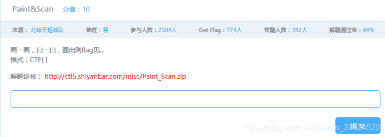**

> ## **2.解题步骤**

* * *

**分析：**

**解压下载的文件并查看：**

**                                                    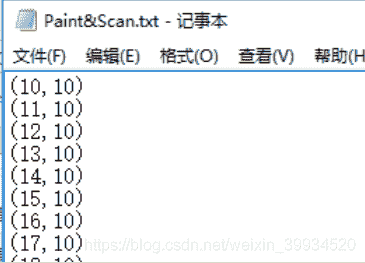**

**坐标都有了，直接画图**

**只给出了坐标，肯定是要求作图的咯
先把数据保存下来，然后跑python
(很多大神用Matlab,但是体积太大；有用matplotlib库的，但是安装麻烦） **

```
# -*- coding:utf8 -*-

import sys
from PIL import Image
fin = open("Paint&Scan.txt",'r')
sys.stdin = fin
size = (500,500)
img = Image.new('RGB',size,(255,255,255))
data = img.getdata()
xy=(0,0)
while True:
        try:
                xy=input()
                data.putpixel(xy,(0,0,0))
        except:
                break

img.save('out.png') 
```

**点击查看图片，发现是二维码，那么使用工具，或者在线解二维码：**

**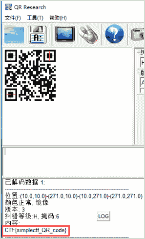**

**这里再提供第二个脚本：**

```
# -*- coding:utf-8 -*-
from PIL import Image, ImageDraw
import sys
images = Image.new('RGB',(280,280),'#FFFFFF')
imagesDraw = ImageDraw.Draw(images,'RGB')
re = open('Paint&Scan.txt','r')
for n in re.readlines():
    n = n[1:len(n)-2]
    k = n.split(',')
    k[0] = int(k[0])
    k[1] = int(k[1])
    imagesDraw.point(tuple(k),'#000000')

images.save('out2.png') 
```

**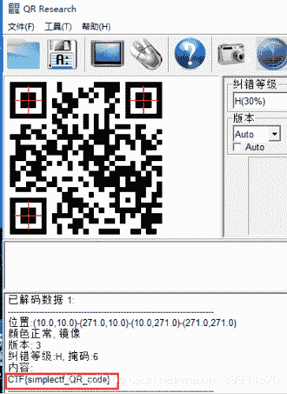**

**CTF{simplectf_QR_code}**

**关于脚本还可以参考官方文档：[<u><u>http://www.effbot.org/imagingbook/image.htm</u></u>](http://www.effbot.org/imagingbook/image.htm)**

> # **                            12.64格（来源：实验吧）**

> ## **1.关卡描述**

* * *

**                              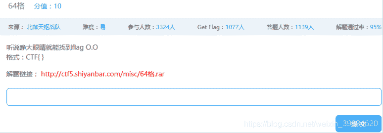**

> ## **2.解题步骤**

* * *

**分析：**

**下载题目解压得到64格.gif，打开提示图像损坏，**

**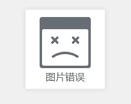**

**扔winhex，没有看见熟悉的"GIF89a"，补全头得到正常的gif；**

**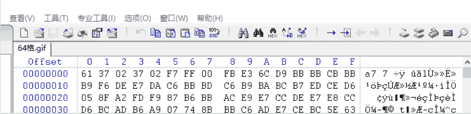**

**Gif文件头：47 49 46 38 39**

**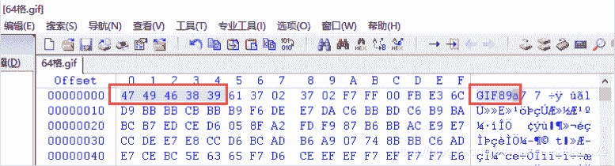**

**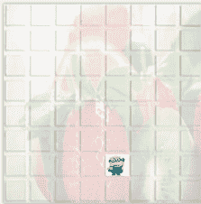**

**打开gif，可以看到一只可（yin）爱（dang）的小黄人在乱跑，随便找个gif分离软件，得到19帧的bmp；**

**Gifsplitter:**

**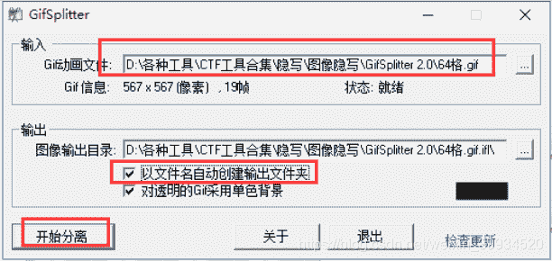**

**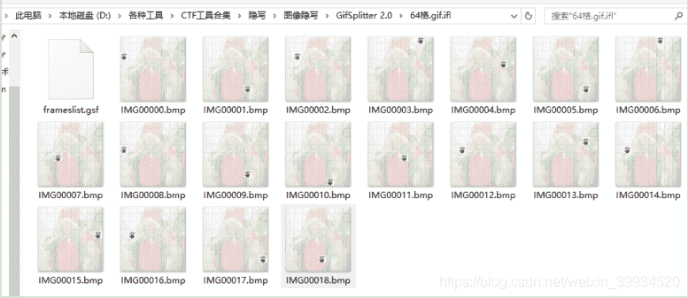**

**使用工具：Stegsolve:**

**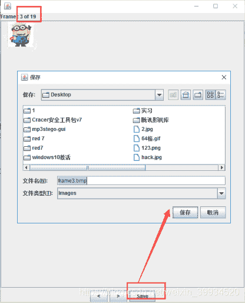**

**题目叫64格，脑洞至六十四进制、Base64等，度娘一下六十四进制瞄到一张跟本题一致的64宫格图及Base64索引表**

****

**                                                        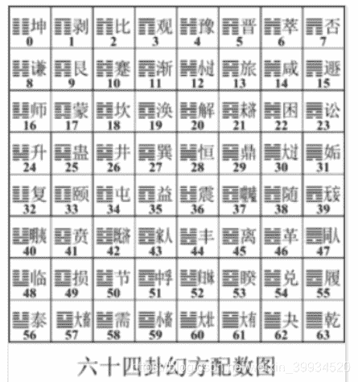**

**                                            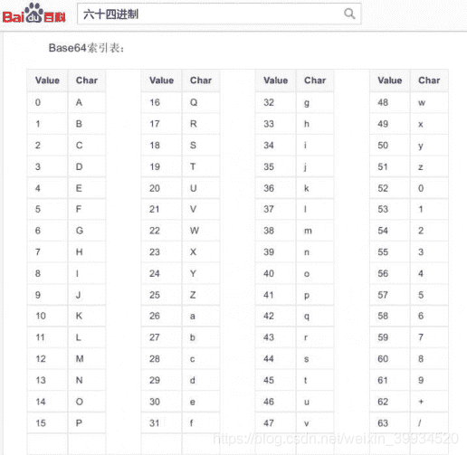**

**将分离好的19帧小黄人位置一一对应解码，得到base64编码后的字符串：Q1RGe2FiY19kZWZfZ30**

**                                 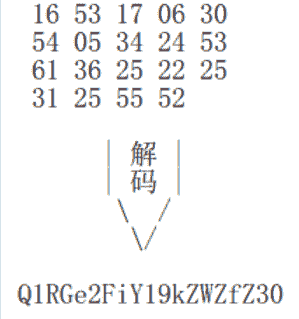**

**                      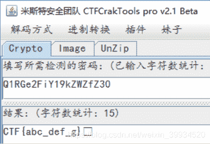**

**Base64四个一组，不足的用=代替**

**                     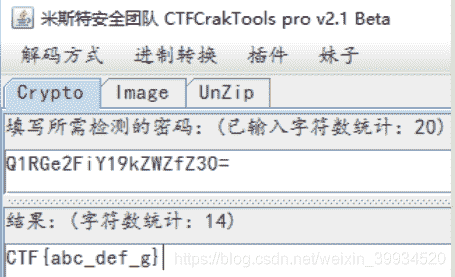**

**CTF{abc_def_g}**