<!--yml
category: 未分类
date: 2022-04-26 14:36:32
-->

# CTF-安卓逆向入门题目_Thunder_J的博客-CSDN博客_ctf 安卓逆向

> 来源：[https://blog.csdn.net/CharlesGodX/article/details/86602958](https://blog.csdn.net/CharlesGodX/article/details/86602958)

# 0x00：介绍

以下题目都是比较简单的安卓逆向题目，主要训练目的是熟悉安卓逆向的一些基础题目，如果是第一次接触安卓逆向，建议先去学一点安卓开发的相关知识，这样做题目就更快一些，当然题目做多了自然也就熟悉了，题目我都上传到Github上了，需要的可以下载。

# 0x01：题目

## 题目1-androideasy

### 链接：

https://github.com/ThunderJie/CTF-Practice/tree/master/CTF-Andorid%20Reverse/androideasy

### 解题思路：

既然是入门题目，那就说详细一点，文件下载后发现是zip格式，我们可以将后缀改为.apk然后后用jeb打开进行分析。
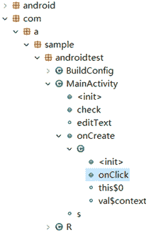
我们可以看到有这么多复杂的东西，不要紧张，对于一般比较简单的题目，我们只需要找到函数的入口，即MainActivity中onCreate方法下的onClick点击事件，因为是找注册码(flag)，那就肯定有一个按钮负责判断注册码是否正确，这个按钮的点击事件就是用onClick实现的，所以大部分这种题目直接找onClick就对了。我们双击之后可以看到以下的代码，这里是smail代码，可以说是Android下的汇编代码，看不懂没关系，右键选择Decompile反汇编查看java代码就明白了
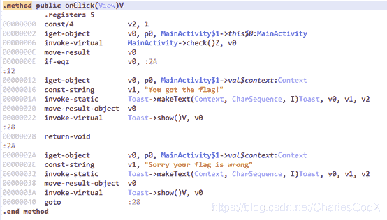
下面是java代码
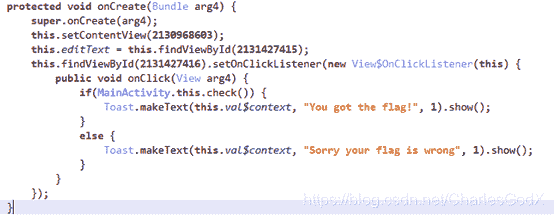
上面是主要函数的内容，这里是要调用MainActivity的check()函数来判断flag是否正确，我们直接定位到check()函数
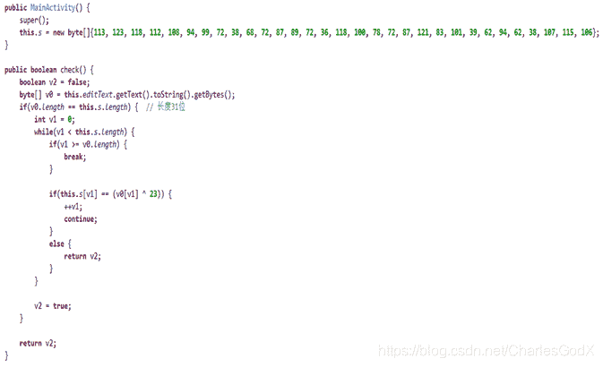
分析函数内容，可以看出数组v0即是我们输入的注册码，根据if语句可以确定注册码的长度和s[]数组一样有31位，下面又有一个if语句判断即为我们的关键语句：s[v1] == (v0[v1] ^ 23)
因为flag字符都是ASCII码在0-127中，所以这种题目我们直接用python进行爆破，我们用m替换v1，范围是(0,31)，用i替换v0[v1]，i即为flag中的一个一个字符，最后爆破得到flag
python代码:

```
s = [113, 123, 118, 112, 108, 94, 99, 72, 38, 68, 72, 87, 89, 72, 36, 118, 100, 78, 72, 87, 121, 83, 101, 39, 62, 94, 62, 38, 107, 115, 106]

flag = ""

for m in range(0,31):
	for i in range(0,127):
		if(s[m] == (i ^ 23)):
			flag += chr(i)
print(flag) 
```

## 题目2-simplecheck

### 链接：

https://github.com/ThunderJie/CTF-Practice/tree/master/CTF-Andorid%20Reverse/simplecheck

### 解题思路：

因为是.apk文件，我们直接放入虚拟机里面运行一下，非常简单，也是一个判断注册码的题目
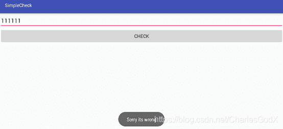
还是用jeb打开分析，我们先看看MainActivity里面的内容

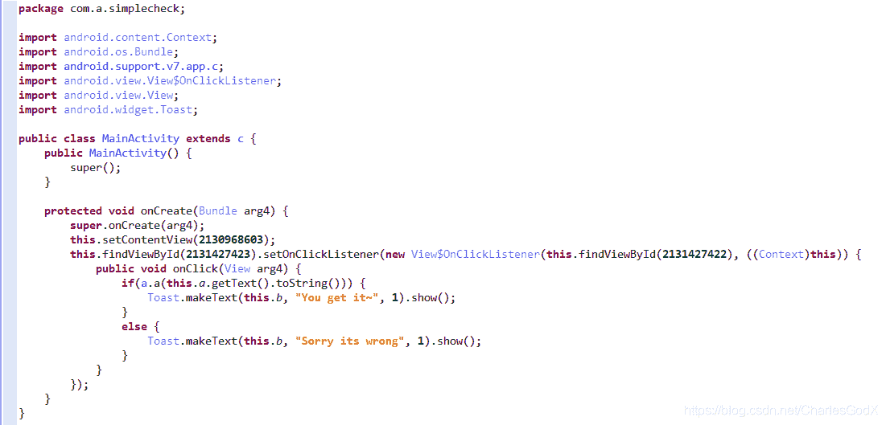这里通过a方法来判断正确与否，所以我们主要研究a方法，可以看到我们输入的即为v4，因为v4[0] = 0所以我们第一个循环为(1,34)，可以通过：
a[m]== b[m] * v4[m]* v4[m] + c[m] * v4[m] + d[m]
a[m+ 1] == b[m] * v4[m+ 1] * v4[m+ 1] + c[m] * v4[m+ 1] + d[m]
将v4[m]替换为要爆破的i：
(a[m] == b[m] * i * i + c[m] * f + d[m])||(a[m] == b[m-1] * i * i + c[m-1] * i + d[m-1])

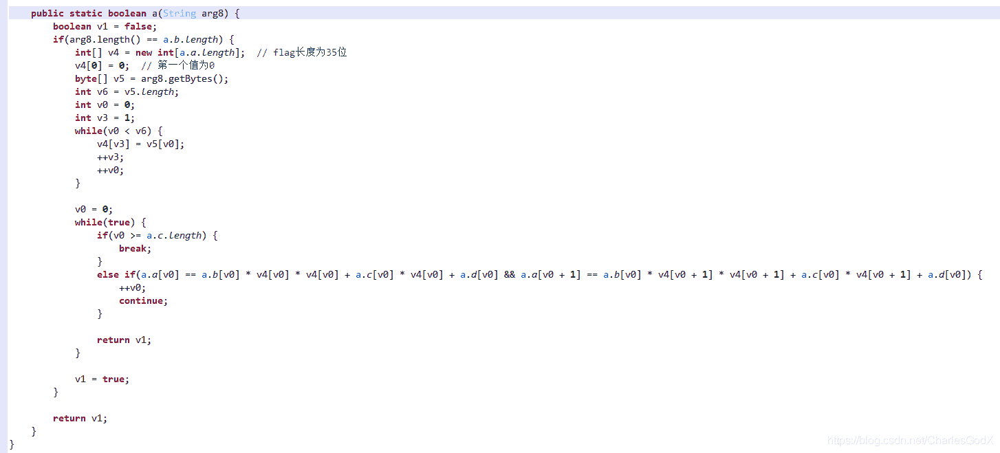脚本如下:

```
a = [0, 146527998, 205327308, 94243885, 138810487, 408218567, 77866117, 71548549, 563255818, 559010506, 449018203, 576200653, 307283021, 467607947, 314806739, 341420795, 341420795, 469998524, 417733494, 342206934, 392460324, 382290309, 185532945, 364788505, 210058699, 198137551, 360748557, 440064477, 319861317, 676258995, 389214123, 829768461, 534844356, 427514172, 864054312]

b = [13710, 46393, 49151, 36900, 59564, 35883, 3517, 52957, 1509, 61207, 63274, 27694, 20932, 37997, 22069, 8438, 33995, 53298, 16908, 30902, 64602, 64028, 29629, 26537, 12026, 31610, 48639, 19968, 45654, 51972, 64956, 45293, 64752, 37108]

c = [38129, 57355, 22538, 47767, 8940, 4975, 27050, 56102, 21796, 41174, 63445, 53454, 28762, 59215, 16407, 64340, 37644, 59896, 41276, 25896, 27501, 38944, 37039, 38213, 61842, 43497, 9221, 9879, 14436, 60468, 19926, 47198, 8406, 64666]

d = [0, -341994984, -370404060, -257581614, -494024809, -135267265, 54930974, -155841406, 540422378, -107286502, -128056922, 265261633, 275964257, 119059597, 202392013, 283676377, 126284124, -68971076, 261217574, 197555158, -12893337, -10293675, 93868075, 121661845, 167461231, 123220255, 221507, 258914772, 180963987, 107841171, 41609001, 276531381, 169983906, 276158562]

flag = ""
for m in range (1,34):
	for i in range (0,127):
					if((a[m] == b[m] * i * i + c[m] * i + d[m])&(a[m] == b[m-1] * i * i + c[m-1] * i + d[m-1])):
						flag+=chr(i)

print(flag) 
```

最后得到flag，测试成功(加个右括号)
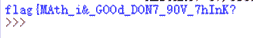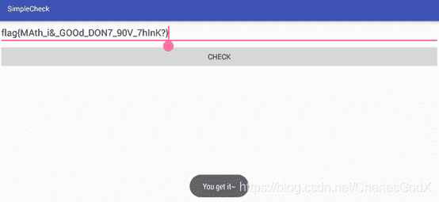

## 题目3- DD-Android Easy

### 链接：

https://github.com/ThunderJie/CTF-Practice/tree/master/CTF-Andorid%20Reverse/DD%20-%20Android%20Easy

### 解题思路：

这道题和上面的类似，就当一道练习题了，掌握了上面的两道题目这道应该很简单，进入FlagActivity分析，简单明了，判断i函数
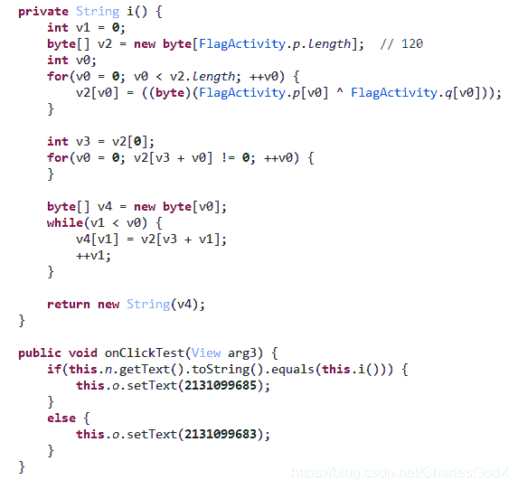
直接贴脚本

```
p = [-40, -62, 107, 66, -126, 103, -56, 77, 122, -107, -24, -127, 72, -63, -98, 64, -24, -5, -49, -26, 79, -70, -26, -81, 120, 25, 111, -100, -23, -9, 122, -35, 66, -50, -116, 3, -72, 102, -45, -85, 0, 126, -34, 62, 83, -34, 48, -111, 61, -9, -51, 114, 20, 81, -126, -18, 27, -115, -76, -116, -48, -118, -10, -102, -106, 113, -104, 98, -109, 74, 48, 47, -100, -88, 121, 22, -63, -32, -20, -41, -27, -20, -118, 100, -76, 70, -49, -39, -27, -106, -13, -108, 115, -87, -1, -22, -53, 21, -100, 124, -95, -40, 62, -69, 29, 56, -53, 85, -48, 25, 37, -78, 11, -110, -24, -120, -82, 6, -94, -101]

q = [-57, -90, 53, -71, -117, 98, 62, 98, 101, -96, 36, 110, 77, -83, -121, 2, -48, 94, -106, -56, -49, -80, -1, 83, 75, 66, -44, 74, 2, -36, -42, -103, 6, -115, -40, 69, -107, 85, -78, -49, 54, 78, -26, 15, 98, -70, 8, -90, 94, -61, -84, 64, 112, 51, -29, -34, 126, -21, -126, -71, -31, -24, -60, -2, -81, 66, -84, 85, -91, 10, 84, 70, -8, -63, 26, 126, -76, -104, -123, -71, -126, -62, -23, 11, -39, 70, 14, 59, -101, -39, -124, 91, -109, 102, -49, 21, 105, 0, 37, -128, -57, 117, 110, -115, -86, 56, 25, -46, -55, 7, -125, 109, 76, 104, -15, 82, -53, 18, -28, -24]

v2 = []
v1 = 0
flag = ''
v0 = 0

for i  in range(len(q)):
	v2.append(p[i]^q[i])

v3  = v2[0]

while v2[v3 + v0]!=0:
    v0+=1
while v1 < v0:
	flag += chr(v2[v3 + v1])
	v1+=1
print flag 
```

得到flag
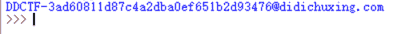

## 题目4-smali

### 链接：

https://github.com/ThunderJie/CTF-Practice/tree/master/CTF-Andorid%20Reverse/smali

### 解题思路：

这道题直接给了个smali文件让我们分析，我们可以直接进行分析也可以用工具进行转化，这里单纯为了做题，直接用工具转换，建议自己翻译几句smali代码熟悉熟悉，我们将smail文件放入Smali2JavaUI工具中转换为Java代码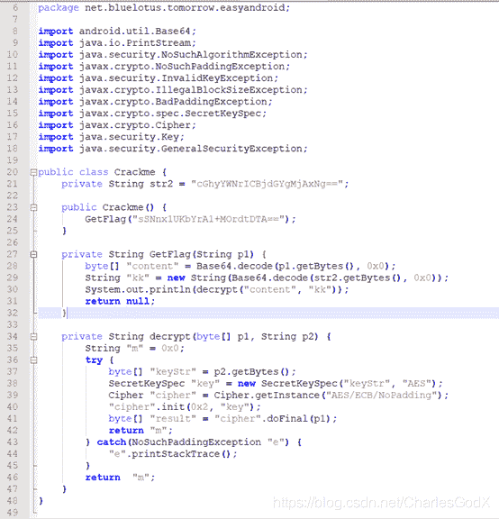
分析代码就是两次base64一次AES，str2的值base64解密以后，作为key，AES解密flag

```
import base64
from Crypto.Cipher import AES

cipher = "sSNnx1UKbYrA1+MOrdtDTA=="
cipher = base64.b64decode(cipher)

key = "cGhyYWNrICBjdGYgMjAxNg=="
key = base64.b64decode(key)

cryptor = AES.new(key, AES.MODE_ECB)
flag = cryptor.decrypt(cipher)

print(flag) 
```

## 题目5- CFF2016-爬楼梯

### 链接：

https://github.com/ThunderJie/CTF-Practice/tree/master/CTF-Andorid%20Reverse/CFF2016-%E7%88%AC%E6%A5%BC%E6%A2%AF

### 解题思路：

查看题目是需要我们点击到对应的层数显示flag，考虑直接暴力破解
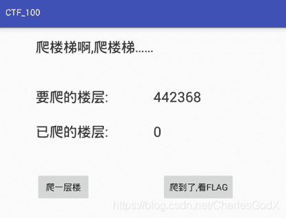
setClickable()函数作用是设置控件点击无效，但是可以点击，颜色不会变灰色，也就是右边的按钮是否能够点击，能够的话那就可以显示flag，那思路就清楚了，我们修改文件使右边按钮参数可点击就可以直接得到flag了。
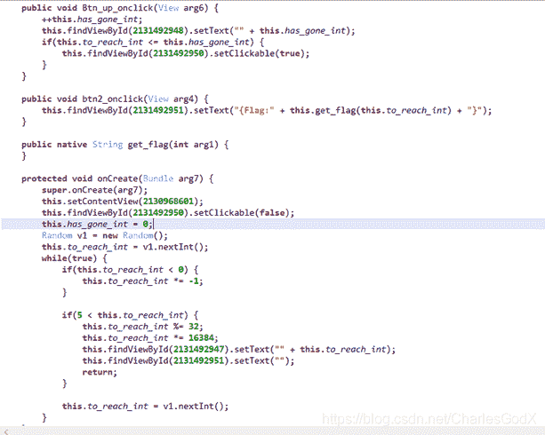
我们用Apktool Box对文件进行反编译apk得到一个文件夹
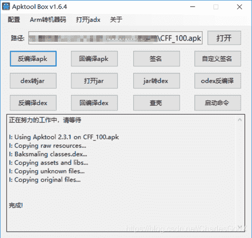
我们在文件夹目录\smali\com\ctf\test\ctf_100下找到MainActivity.smali文件进行查看主函数内容，搜索到两处setClickable()函数，两处的setClickable对应着java代码看

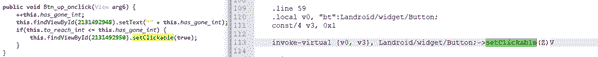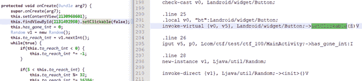
推测V5和V3即为true或false的标记位，v3一直为0x1，v5一直为0x0，因此考虑修改v5为0x1
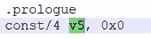
修改之后保存，然后将文件夹拖入Apktool Box回编译apk就行了
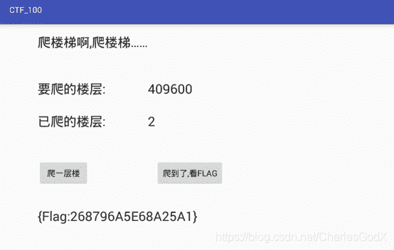

# 0x02：总结

题目都是非常基础的，主要是通过它们来熟悉做题过程，熟悉各种工具，熟悉了之后再慢慢深入，总之逆向大多数都是算法分析，会分析算法其他无非就是各种工具的使用，脚本的编写。