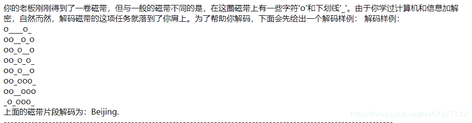
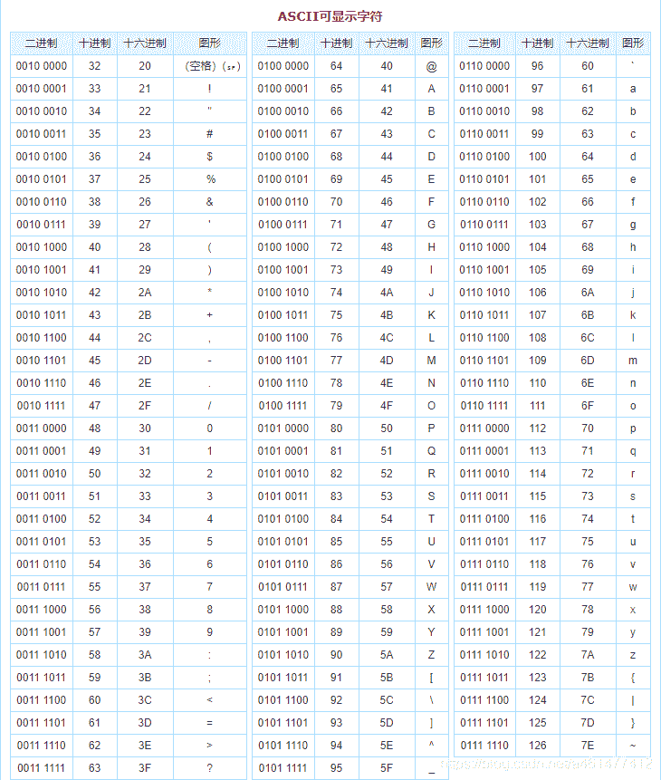

<!--yml
category: 未分类
date: 2022-04-26 14:48:22
-->

# CTF-实验吧-解码磁带_kongcz的博客-CSDN博客

> 来源：[https://blog.csdn.net/a461477412/article/details/98529415](https://blog.csdn.net/a461477412/article/details/98529415)

# 题目：

在这圈磁带上有一些字符'o'和下划线'_'。解码磁带

格式：simCTF{ }

解题链接： 

# 解题思路：

题目中给了一个样例，看着o和_很容易想到是二进制，那么首先用o作为1，_作为0试试解第一个字符出来的数字是66。既然数字对应字符那么很容易想到是ASCII码，顺手查了下66对应的就是B。所以思路是对的，照着这个思路写个python脚本开搞就行了。





# TIPS:

```
　　ASCII（American Standard Code for Information Interchange，美国信息互换标准代码，ASCⅡ）是基于拉丁字母的一套电脑编码系统。它主要用于显示现代英语和其他西欧语言。它是现今最通用的单字节编码系统，并等同于国际标准ISO/IEC 646。

　　ASCII第一次以规范标准的型态发表是在1967年，最后一次更新则是在1986年，至今为止共定义了128个字符，其中33个字符无法显示（这是以现今操作系统为依归，但在DOS模式下可显示出一些诸如笑脸、扑克牌花式等8-bit符号），且这33个字符多数都已是陈废的控制字符，控制字符的用途主要是用来操控已经处理过的文字，在33个字符之外的是95个可显示的字符，包含用键盘敲下空白键所产生的空白字符也算1个可显示字符（显示为空白）。
```

Python代码（写的比较烂。。。）

```
import math

flag = ''

f = open('flag.txt','r')
list = f.readlines()

for line in list:
    line = line.replace('o','1')
    line = line.replace('_','0')
    line = line.replace(' ','')
    line = line.replace('\n','')

    m  = 0
    for i in range(0,7):

        m += math.pow(2,(6-i))*int(line[i])

    flag = flag + chr(int(m))
print(flag)
```

运行结果是***Where there is a will,there is a way. ***按题目要求构造flag，提交成功