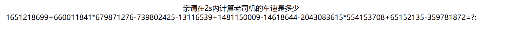
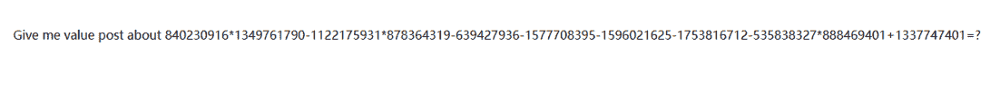
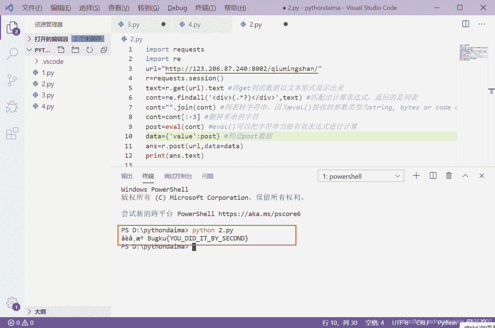

<!--yml
category: 未分类
date: 2022-04-26 14:35:31
-->

# CTFWeb——Bugku秋名山老司机 详细题解_日熙！的博客-CSDN博客_ctf秋名山

> 来源：[https://blog.csdn.net/weixin_44953600/article/details/107930323](https://blog.csdn.net/weixin_44953600/article/details/107930323)



# 解答:

刷新提示让我们以post方式传入计算的值。
此题是快速反弹Post请求类题目，因为所给时间很短而且计算比较复杂，所以只能写脚本。
python中有eval函数可以快速计算,满足要求。

这道题的脚本如下：

```
 import requests   
import re         
url="http://123.206.87.240:8002/qiumingshan/"
r=requests.session()  
text=r.get(url).text  
cont=re.findall('<div>(.*?)</div>',text) 

cont="".join(cont) 
cont=cont[:-3] 
post=eval(cont) 
data={'value':post}  
ans=r.post(url,data=data)
print(ans.text) 
```

如果代码后面的注释也看不懂的话，建议先看看这篇文章：[详解 CTF Web 中的快速反弹 POST 请求](https://blog.csdn.net/qq_26090065/article/details/81583009#%E3%80%90Bugku-CTF%E3%80%91-Web-%E2%80%94%E2%80%94-%E7%A7%8B%E5%90%8D%E5%B1%B1%E8%80%81%E5%8F%B8%E6%9C%BA)

参考链接：https://blog.csdn.net/zyl_wjl_1413/article/details/83958862

在VScode执行该脚本响应如下图所示：



如果第一次写python爬虫类题目，有些操作不太懂的可以参考该教程：[如何用VScode（ Visual Studio Code）编写、运行python代码](https://blog.csdn.net/weixin_44953600/article/details/107906573)

得到Flag：Bugku{YOU_DID_IT_BY_SECOND}