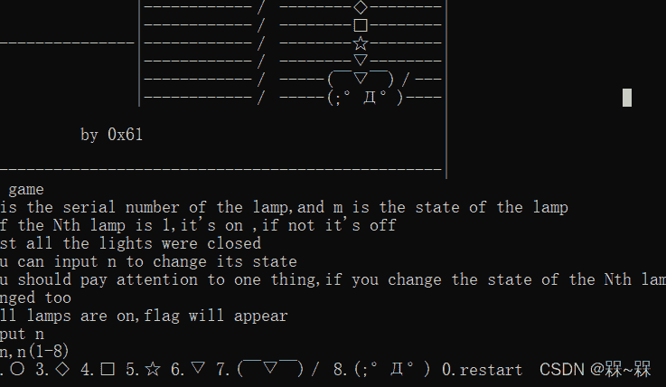
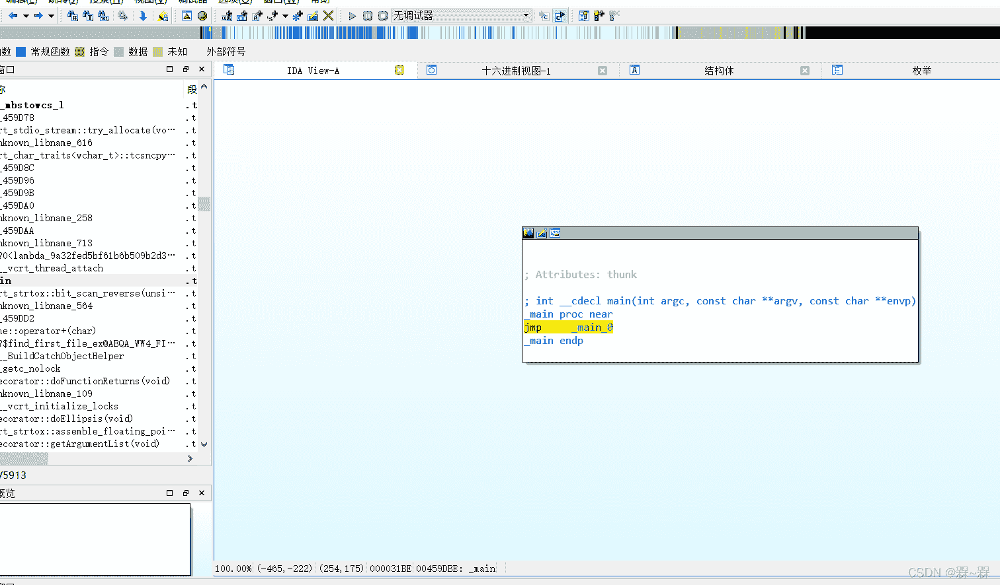
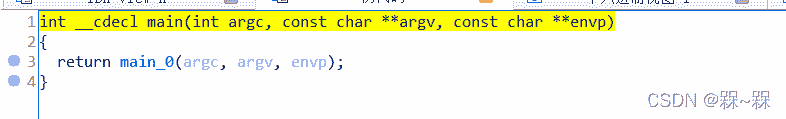
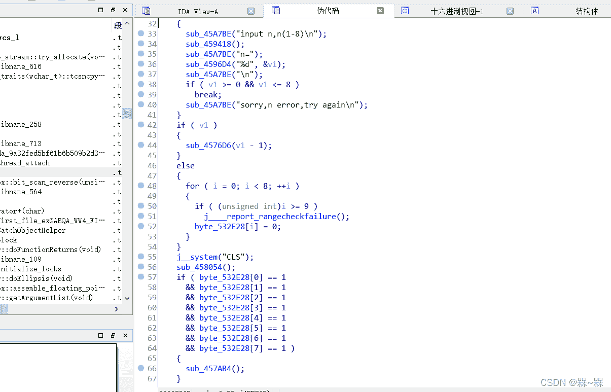
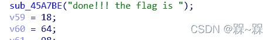
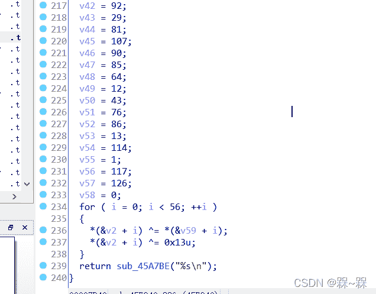
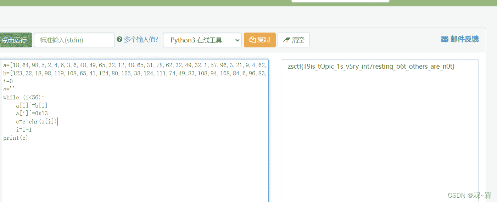

<!--yml
category: 未分类
date: 2022-04-26 14:33:20
-->

# CTF_REVERSE做题解析_槑~槑的博客-CSDN博客

> 来源：[https://blog.csdn.net/qq_63676207/article/details/122757522](https://blog.csdn.net/qq_63676207/article/details/122757522)

1

game

这个题刚开始点进去是这种不管如何输入都是死循环

怎莫搞直接拖入IDA中注意是32位的

然后显示这个页面点击F5查看伪代码是这个

然后直接跟进进入后 

 是这个其他的看不懂这个也应该没啥问题当这八个都为一时进入下面这个地址猜测这个为末端

 是个异或然后再与十六进制13进行异或

由上面的数字自己写个脚本进行尝试运行

 

 得出flag   注意：IDA中函数用sub_地址编号    那个v后面的数字啥的别抄错本人生有体会