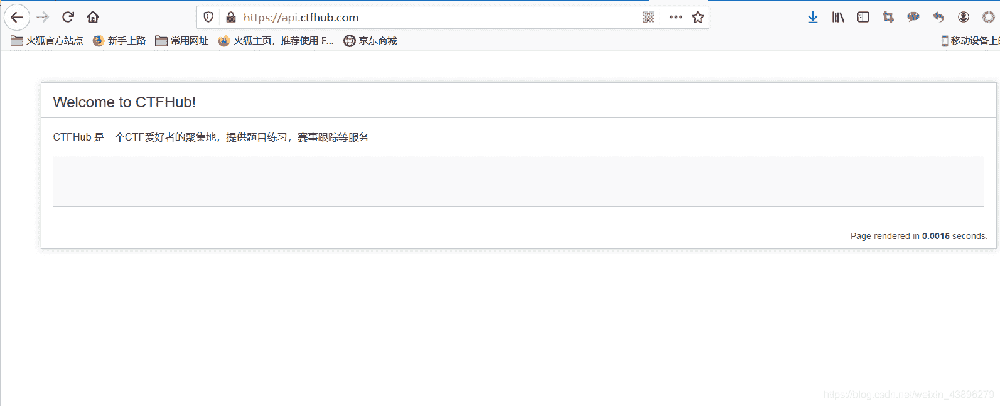

<!--yml
category: 未分类
date: 2022-04-26 14:43:09
-->

# CTFhub平台题解（技能树 彩蛋部分）_zhi_chu的博客-CSDN博客

> 来源：[https://blog.csdn.net/weixin_43896279/article/details/104646415](https://blog.csdn.net/weixin_43896279/article/details/104646415)

# CTFhub平台题解（技能树 彩蛋部分）

最近ctfhub平台上线了，平台挺好，让我一顿好肝。作为一个菜鸡想写web的writeup，但我做不出来。
![img-lUgzBBPs-1583281035015)(C:\Users\renjianwen\Desktop\新建文件夹 (2)]\412590B756AE316CAEAF8F2870F810A5.jpg](img/f7bfde1e774e640214996e99ee25956d.png)

只能拿彩蛋部分过过瘾，彩蛋部分脑洞有的真是挺大的，也有几个题相似，闲话不多说，上手。

## 首页

脑洞还可以：根据提示说在*.ctfhub.com中，但他这个题目名字有点误导人，千万不要直接跑首页翻。前面说应该是在一个子域名中，但具体是啥不太清楚，上网搜个在线域名爆破，跑他！！

![[外链图片转存失败,源站可能有防盗链机制,建议将图片保存下来直接上传(img-w5i16hWJ-1583281035016)(C:\Users\renjianwen\Desktop\新建文件夹 (2)]\QQ截图20200304061556.png)](img/7db64ed224080a8544e835683ec8324d.png)

然后根据跑出来的网站，我们一个一个找，大多数都是打不开或者无反应，其中一个是这样的

唯一一个能打开的网站，肯定不能放过，查看网页源代码，往下翻，差不多在最下面出现了flag
![[外链图片转存失败,源站可能有防盗链机制,建议将图片保存下来直接上传(img-yUaHnaId-1583281035016)(C:\Users\renjianwen\Desktop\新建文件夹 (2)]\QQ截图20200304062739.png)](img/cfa8423173404e0c2c2ab7b9f1447c1f.png)

## 公众号

这个比较简单了，明显提示，掏出手机，找到公众号（手机一般是交互或者藏在哪个文章里）我把想要的发了出去，然后就得到了 ![[外链图片转存失败,源站可能有防盗链机制,建议将图片保存下来直接上传(img-UWZlnutR-1583281035017)(C:\Users\renjianwen\Desktop\新建文件夹 (2)]\0AE17334547539F7E526365AAF3C1FDB.jpg)](img/e363324c2569270efd0c919b2ba3921c.png)

## 题目入口

这个我得到完全就是巧合，在做题时，抓包改包，不小心网址中加了换行，就发出去了。然后给我回了一个这样页面 ![[外链图片转存失败,源站可能有防盗链机制,建议将图片保存下来直接上传(img-qus4HHyl-1583281035017)(C:\Users\renjianwen\Desktop\新建文件夹 (2)]\E[8~~EDQHMOC%0YB}AVS071.png)](img/aec2c161d861a106c5c0140d4e00a82b.png)

然后我就拿着 flag往我正在做的那题填，怎么都不对，我还以为自己找到漏洞了，自动返回flag哈哈哈

后来做到***题目入口***时 ，就想到了 （这题应该是困住了好多人）

## writeup

提示在writeup也有一个，我们来到writeup专栏，第一页顺便翻翻没有（这么重要东西能一眼让你找到吗）

我们直接来到最后一页

不寻常的题目，就是他了

![[外链图片转存失败,源站可能有防盗链机制,建议将图片保存下来直接上传(img-ntgpj2cZ-1583281035018)(C:\Users\renjianwen\Desktop\新建文件夹 (2)]\QQ截图20200304064646.png)](img/f88550c46dcdbca3e110178bd78dc14d.png)

打开后我们可以看到flag![[外链图片转存失败,源站可能有防盗链机制,建议将图片保存下来直接上传(img-MHZSONW7-1583281035018)(C:\Users\renjianwen\Desktop\新建文件夹 (2)]\QQ截图20200304064737.png)](img/fee00b72c08df5a6db302189011f4b02.png)

## 工具

和上题类似，我们来到工具，一看有搜索功能，试试。没搜到什么，照旧直达最后，历史总是如此相似，连关键字都没变

![[外链图片转存失败,源站可能有防盗链机制,建议将图片保存下来直接上传(img-dlLYSWkF-1583281035019)(C:\Users\renjianwen\Desktop\新建文件夹 (2)]\QQ截图20200304065302.png)](img/afdc932b4659d4d2c54e18f95a733f2a.png)

同样与历史又有不同（容我感慨一下嘿嘿嘿）点了发现是一个404 不能啊 正常来说这个就应该是啊

掏出burp，发现他返回的是304状况码 ![[外链图片转存失败,源站可能有防盗链机制,建议将图片保存下来直接上传(img-TlRtmroq-1583281035020)(C:\Users\renjianwen\Desktop\新建文件夹 (2)]\QQ截图20200304065047.png)](img/351c0e7ad8aaaf8d4e962fd20e60c626.png)

有蹊跷 但还是没找到flag啊 就开始一步步放包 终于发现了flag 将返回的包第一个放过去 第二个拦下 浏览器网页完成不了调整 在地址栏我们可以找到flag![[外链图片转存失败,源站可能有防盗链机制,建议将图片保存下来直接上传(img-wXb7Vsmj-1583281035020)(C:\Users\renjianwen\Desktop\新建文件夹 (2)]\QQ截图20200304065602.png)](img/645937f5814e24d3d90c37465a65ffe6.png)

## 赛事

我们按着提示来到赛事栏 看到这张表我就在想会不会flag 在表里面藏着 有可能是ctfhub平台上线日期那里

但感觉太麻烦，这个表先放一下吧。![[外链图片转存失败,源站可能有防盗链机制,建议将图片保存下来直接上传(img-Udwrjjfp-1583281035020)(C:\Users\renjianwen\Desktop\新建文件夹 (2)]\QQ截图20200304070341.png)](img/d4ef171745820eae329979cb01cac966.png)

页面往下拉 看到有和前面几道题类似的东西，跳到最后一个页面 熟悉的名字 。egg——彩蛋 有点意思

![[外链图片转存失败,源站可能有防盗链机制,建议将图片保存下来直接上传(img-7xIJF5sa-1583281035020)(C:\Users\renjianwen\Desktop\新建文件夹 (2)]\QQ截图20200304070852.png)](img/51df4a2c8c3a10f98b53e35eba9c6ed3.png)

## 真题

前面和前几道题类似 然后我们可以找到flag 但不能点开 也不能花钱开环境，只能手打或者截图，识别文字 懒得推荐第二个 ![[外链图片转存失败,源站可能有防盗链机制,建议将图片保存下来直接上传(img-1V4a9aHN-1583281035021)(C:\Users\renjianwen\Desktop\新建文件夹 (2)]\QQ截图20200304071045.png)](img/b82a992662ae845778235d62a5569216.png)

## 投稿提交

这题没做出来啊啊啊 我tcl 不会做

介于不能让他空着 我把我的一些线索发出来吧 有思路的大神 讨论区带带弟弟

按照提示 我们可以到两个文章末尾找到 两个线索

![[外链图片转存失败,源站可能有防盗链机制,建议将图片保存下来直接上传(img-ihYOZ1jZ-1583281035021)(C:\Users\renjianwen\Desktop\新建文件夹 (2)]\QQ截图20200304074640.png)](img/b06c18dc1022f3c421753cc5d7d48373.png) ![[外链图片转存失败,源站可能有防盗链机制,建议将图片保存下来直接上传(img-mkyiMygq-1583281035021)(C:\Users\renjianwen\Desktop\新建文件夹 (2)]\QQ截图20200304074724.png)](img/d2f994d23d01c46b91515e34cd8c689f.png)

然后在模板说明中 有一个链接 下载Demo是可以下载一个压缩包的

![[外链图片转存失败,源站可能有防盗链机制,建议将图片保存下来直接上传(img-VHinVZHP-1583281035022)(C:\Users\renjianwen\Desktop\新建文件夹 (2)]\QQ截图20200304074821.png)](img/f35bb3404e2d573bb88fc68018741228.png)

压缩包解压后里面有这几条线索

markdown里面 ![[外链图片转存失败,源站可能有防盗链机制,建议将图片保存下来直接上传(img-qR30Sx1H-1583281035022)(C:\Users\renjianwen\Desktop\新建文件夹 (2)]\QQ截图20200304075029.png)](img/78c02e7555963d883b582efc863c8191.png)

里面一个文件 egg—flag.txt ![[外链图片转存失败,源站可能有防盗链机制,建议将图片保存下来直接上传(img-RJ5P4Y2e-1583281035023)(C:\Users\renjianwen\Desktop\新建文件夹 (2)]\QQ截图20200304080439.png)](img/0c023e4136f73ebc5bdea7ce361c35f8.png)

还有一个 不确定 在题目环境文章里面 这都是github上面链接 感觉里面应该也有 flag的透漏信息

![[外链图片转存失败,源站可能有防盗链机制,建议将图片保存下来直接上传(img-jVuGRPCJ-1583281035023)(C:\Users\renjianwen\Desktop\新建文件夹 (2)]\QQ截图20200304080618.png)](img/c6d3be6351ac2f0bec2394bfc6fb8b40.png)

投稿提交 这题交给各位大佬了

![[外链图片转存失败,源站可能有防盗链机制,建议将图片保存下来直接上传(img-5Xpgmkiy-1583281035023)(C:\Users\renjianwen\Desktop\新建文件夹 (2)]\51874CC69570E8938E44BC74E7E90BED.jpg)](img/154eb3a9d2cf55e51ac32a69bf6b4c2f.png)