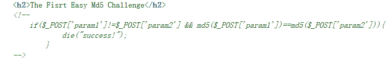

<!--yml
category: 未分类
date: 2022-04-26 14:36:55
-->

# CTFweb题目中的md5弱类型题解_神林丶的博客-CSDN博客_ctf md5题目

> 来源：[https://blog.csdn.net/qq_41079177/article/details/82988272](https://blog.csdn.net/qq_41079177/article/details/82988272)



md5弱比较，为0e开头的会被识别为科学记数法，结果均为0

payload：

```
param1=QNKCDZO&param2=aabg7XSs
```

 ````
md5强比较，没有规定字符串如果这个时候传入的是数组不是字符串，md5（）函数无法解出其数值并且不会报错，就会得到数值相等；
```

payload：

```
param1[]=111&param2[]=222
```

 ````
真实md5碰撞，因为此时不能输入数组了，只能输入字符串
```

payload：

param1=M%C9h%FF%0E%E3%5C%20%95r%D4w%7Br%15%87%D3o%A7%B2%1B%DCV%B7J%3D%C0x%3E%7B%95%18%AF%BF%A2%00%A8%28K%F3n%8EKU%B3_Bu%93%D8Igm%A0%D1U%5D%83%60%FB_%07%FE%A2&param2=M%C9h%FF%0E%E3%5C%20%95r%D4w%7Br%15%87%D3o%A7%B2%1B%DCV%B7J%3D%C0x%3E%7B%95%18%AF%BF%A2%02%A8%28K%F3n%8EKU%B3_Bu%93%D8Igm%A0%D1%D5%5D%83%60%FB_%07%FE%A2

给出两个关于md5碰撞的网站：

[md5碰撞1](https://www.jianshu.com/p/c9089fd5b1ba)

[md5碰撞2](https://crypto.stackexchange.com/questions/1434/are-there-two-known-strings-which-have-the-same-md5-hash-value)``