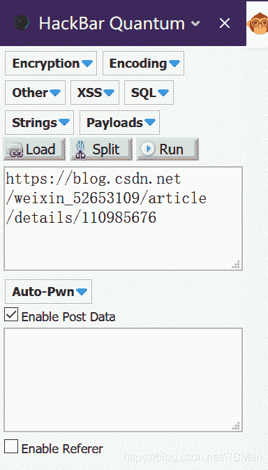
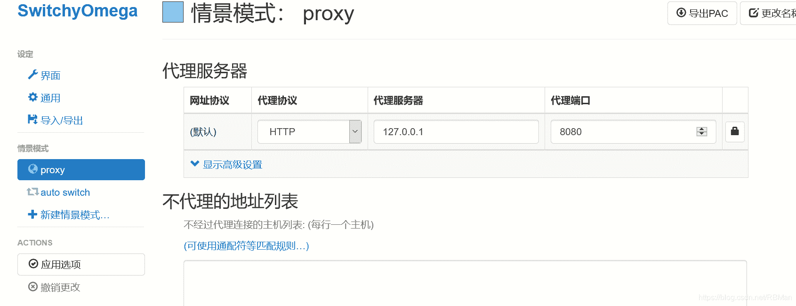
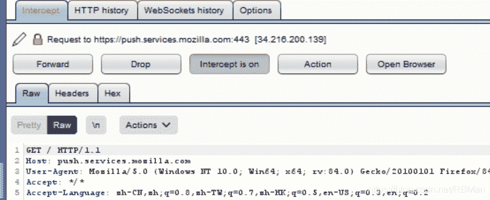

<!--yml
category: 未分类
date: 2022-04-26 14:32:52
-->

# CTF之WEB（BUGku Ctf 1-7 题解）_嗅探的博客-CSDN博客

> 来源：[https://blog.csdn.net/rbman/article/details/111397880](https://blog.csdn.net/rbman/article/details/111397880)

```
这几天做的一些CTF之WEB方向的题，才入门所以会写一些心得。1~7题的心得，不喜勿喷。我会坚持下去的。 
```

一.post和get请求方式的不同
1.get：较为简单，如果叫你输入数值的话，直接在URL后面加就行了。格式如下：
www.123123123.com/?abc=ABC(所需要提交的参数)
2.post：需要使用火狐上的插件HackBar,先打开该插件，再打开网页，然后URL就会出现在上面的大框中。图片如下：



然后，在下面的框中输入需要的提交的参数，就可以了。

二.关于get请求方式中遇到问题：
is_numeric()函数是用于判断该值，是否为数值或者字符串。
在get请求方式中，如果需要提交数字，必须要在该值的前面或者后面加上 %00，这样就可以提交数值了。

三.CTF中常见的编码
1.ASCII编码
2.URL编码
特点：使用 百分号% + 十六进制数字 在URL中表示特殊字符的编码方式。
3.HTML实体编码
4.Base编码
5.Unicode编码
6.莫尔斯电码(Morse Code)

四.BurpSuite的抓包使用笔记

第一步：首先必须要在，BO上配置好代理模块，一般来说就是在proxy中进行操作，不做具体说明，一般都是：IP地址：197.0.0.1 端口为：8080，然后这方面就可以了。

第二步：在浏览器上，按照上述的格式也进行配置，之前需要下载下载插件Proxy SwitchyOmega。截图如下：



下面的不代理地址列表，一定要删除干净，否则会代理不了。然后点击应用选项，就可以了。

第三步：进行数据包的抓取：
1.


上图中的 选项"intercept is on"，就是在告诉我们，已经开始抓包了，这个时候，服务器发来的请求就已经只发向BP了，浏览器就暂停服务了。“Action” 这个选项可以将截获的数据包发送至其他模块。
“Forward”:该选项，可以让服务继续进行，即发送到浏览器。
“Drop”:丢包。