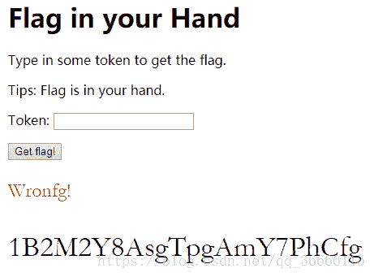
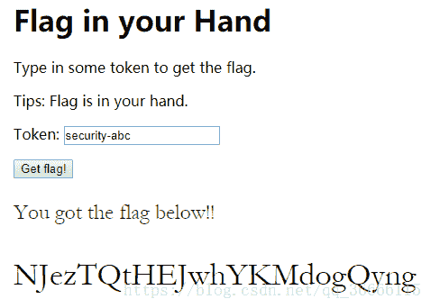

<!--yml
category: 未分类
date: 2022-04-26 14:31:35
-->

# CTF习题解答--查找正确的密码 [JS题型]_乌恩大侠的博客-CSDN博客

> 来源：[https://blog.csdn.net/qq_36666115/article/details/80137538](https://blog.csdn.net/qq_36666115/article/details/80137538)

# 首先发题

## 小黑客们，坐好了，老司机要开车了！

**这是密码错误的提示**

**当我们输入正确的密码，会提示**


### 首页的代码

```
<html>
    <head>
        <title>Flag in your Hand</title>
        <style type="text/css"> body {
                padding-left: 30%;
            }

            #flag {
                font-family: Garamond, serif;
                font-size: 36px;
            }

            #flagtitle {
                font-family: Garamond, serif;
                font-size: 24px;
            }

            .rightflag {
                color: green;
            }

            .wrongflag {
                color: red;
            } </style>
        <script src="script-min.js"></script>
        <script type="text/javascript"> var ic = false;
            var fg = "";

            function getFlag() {
                var token = document.getElementById("secToken").value;
                ic = checkToken(token);             
                fg = bm(token); 
                showFlag()
            }
            function showFlag() {
                var t = document.getElementById("flagTitle");
                var f = document.getElementById("flag");
                t.innerText = !!ic ? "You got the flag below!!" : "Wronfg!";
                t.className = !!ic ? "rightflag" : "wrongflag";
                f.innerText = fg;
            } </script>
    </head>
    <body>
        <h1>Flag in your Hand</h1>
        <p>Type in some token to get the flag.</p>
        <p>Tips: Flag is in your hand.</p>
        <div>
            <p>
                <span>Token:</span>
                <span><input type="text" id="secToken"/></span>
            </p>
            <p>
                <input type="button" value="Get flag!" onclick="getFlag()" />
            </p>
        </div>
        <div>
            <p id="flagTitle"></p>
            <p id="flag"></p>
        </div>
    </body>
</html>
```

**JS代码**

```
function hm(s) {
    return rh(rstr(str2rstr_utf8(s)));
}
function bm(s) {                                
    return rb(rstr(str2rstr_utf8(s)));
}
function rstr(s) {
    return binl2rstr(binl(rstr2binl(s), s.length * 8));
}
function checkToken(s) {
    var b = s === "FAKE-TOKEN"
    console.log(b)
    return b;
}
function rh(ip) {
    try {
        hc
    } catch (e) {
        hc = 0;
    }
    var ht = hc ? "0123456789ABCDEF" : "0123456789abcdef";
    var op = "";
    var x;
    for (var i = 0; i < ip.length; i++) {
        x = ip.charCodeAt(i);
        op += ht.charAt((x >>> 4) & 0x0F) + ht.charAt(x & 0x0F);
    }
    return op;
}
function rb(ip) {
    try {
        bp
    } catch (e) {
        bp = '';
    }
    var b = "ABCDEFGHIJKLMNOPQRSTUVWXYZabcdefghijklmnopqrstuvwxyz0123456789+/";
    var op = "";
    var len = ip.length;
    for (var i = 0; i < len; i += 3) {
        var t = (ip.charCodeAt(i) << 16) | (i + 1 < len ? ip.charCodeAt(i + 1) << 8 : 0) | (i + 2 < len ? ip.charCodeAt(i + 2) : 0);
        for (var j = 0; j < 4; j++) {
            if (i * 8 + j * 6 > ip.length * 8)
                op += bp;
            else
                op += b.charAt((t >>> 6 * (3 - j)) & 0x3F);
        }
    }
    return op;
}
function ck(s) {
    try {
        ic
    } catch (e) {
        return;
    }

    var a = [118, 104, 102, 120, 117, 108, 119, 124, 48, 100, 101, 102];
    var b = [115, 101, 99, 117, 114, 105, 116, 121, 45, 97, 98, 99]
    if (s.length == a.length) {
        for (i = 0; i < s.length; i++) {
            if (a[i] - s.charCodeAt(i) != 3){
                console.log(a[i] - s.charCodeAt(i))
                return ic = false;
            }
        }
        return ic = true;
    }
    return ic = false;
}
function str2rstr_utf8(input) {        
    var output = "";
    var i = -1;
    var x, y;                          
    while (++i < input.length) {
        x = input.charCodeAt(i);                                    
        y = i + 1 < input.length ? input.charCodeAt(i + 1) : 0;     
        if (0xD800 <= x && x <= 0xDBFF && 0xDC00 <= y && y <= 0xDFFF) {  

            x = 0x10000 + ((x & 0x03FF) << 10) + (y & 0x03FF);

            i++;
        }
        if (x <= 0x7F)  
            output += String.fromCharCode(x); 
        else if (x <= 0x7FF)                       
            output += String.fromCharCode(0xC0 | ((x >>> 6) & 0x1F), 0x80 | (x & 0x3F));
        else if (x <= 0xFFFF)
            output += String.fromCharCode(0xE0 | ((x >>> 12) & 0x0F), 0x80 | ((x >>> 6) & 0x3F), 0x80 | (x & 0x3F));
        else if (x <= 0x1FFFFF)                   
            output += String.fromCharCode(0xF0 | ((x >>> 18) & 0x07), 0x80 | ((x >>> 12) & 0x3F), 0x80 | ((x >>> 6) & 0x3F), 0x80 | (x & 0x3F));
    }                                               
    return output;
}
function rstr2binl(input) {
    var output = Array(input.length >> 2);   
    for (var i = 0; i < output.length; i++)
        output[i] = 0;  
    for (var i = 0; i < input.length * 8; i += 8)
        output[i >> 5] |= (input.charCodeAt(i / 8) & 0xFF) << (i % 32);
    return output;
}
function binl2rstr(i) {
    var o = "";
    for (var j = 0; j < i.length * 32; j += 8)
        o += String.fromCharCode((i[j >> 5] >>> (j % 32)) & 0xFF);
    return o;
}
function binl(x, len) {
    s = binl2rstr(x);

    x[len >> 5] |= 0x80 << ((len) % 32);
    x[(((len + 64) >>> 9) << 4) + 14] = len;
    var a = 1732584193;
    var b = -271733879;
    var c = -1732584194;
    var d = 271733878;
    for (var i = 0; i < x.length; i += 16) {
        var olda = a;
        var oldb = b;
        var oldc = c;
        var oldd = d;
        a = ff(a, b, c, d, x[i + 0], 7, -680876936);
        d = ff(d, a, b, c, x[i + 1], 12, -389564586);
        c = ff(c, d, a, b, x[i + 2], 17, 606105819);
        b = ff(b, c, d, a, x[i + 3], 22, -1044525330);
        a = ff(a, b, c, d, x[i + 4], 7, -176418897);
        d = ff(d, a, b, c, x[i + 5], 12, 1200080426);
        c = ff(c, d, a, b, x[i + 6], 17, -1473231341);
        b = ff(b, c, d, a, x[i + 7], 22, -45705983);
        a = ff(a, b, c, d, x[i + 8], 7, 1770035416);
        d = ff(d, a, b, c, x[i + 9], 12, -1958414417);
        c = ff(c, d, a, b, x[i + 10], 17, -42063);
        b = ff(b, c, d, a, x[i + 11], 22, -1990404162);
        a = ff(a, b, c, d, x[i + 12], 7, 1804603682);
        d = ff(d, a, b, c, x[i + 13], 12, -40341101);
        c = ff(c, d, a, b, x[i + 14], 17, -1502002290);
        b = ff(b, c, d, a, x[i + 15], 22, 1236535329);
        ck(s);
        a = gg(a, b, c, d, x[i + 1], 5, -165796510);
        d = gg(d, a, b, c, x[i + 6], 9, -1069501632);
        c = gg(c, d, a, b, x[i + 11], 14, 643717713);
        b = gg(b, c, d, a, x[i + 0], 20, -373897302);
        a = gg(a, b, c, d, x[i + 5], 5, -701558691);
        d = gg(d, a, b, c, x[i + 10], 9, 38016083);
        c = gg(c, d, a, b, x[i + 15], 14, -660478335);
        b = gg(b, c, d, a, x[i + 4], 20, -405537848);
        a = gg(a, b, c, d, x[i + 9], 5, 568446438);
        d = gg(d, a, b, c, x[i + 14], 9, -1019803690);
        c = gg(c, d, a, b, x[i + 3], 14, -187363961);
        b = gg(b, c, d, a, x[i + 8], 20, 1163531501);
        a = gg(a, b, c, d, x[i + 13], 5, -1444681467);
        d = gg(d, a, b, c, x[i + 2], 9, -51403784);
        c = gg(c, d, a, b, x[i + 7], 14, 1735328473);
        b = gg(b, c, d, a, x[i + 12], 20, -1926607734);
        a = hh(a, b, c, d, x[i + 5], 4, -378558);
        d = hh(d, a, b, c, x[i + 8], 11, -2022574463);
        c = hh(c, d, a, b, x[i + 11], 16, 1839030562);
        b = hh(b, c, d, a, x[i + 14], 23, -35309556);
        a = hh(a, b, c, d, x[i + 1], 4, -1530992060);
        d = hh(d, a, b, c, x[i + 4], 11, 1272893353);
        c = hh(c, d, a, b, x[i + 7], 16, -155497632);
        b = hh(b, c, d, a, x[i + 10], 23, -1094730640);
        a = hh(a, b, c, d, x[i + 13], 4, 681279174);
        d = hh(d, a, b, c, x[i + 0], 11, -358537222);
        c = hh(c, d, a, b, x[i + 3], 16, -722521979);
        b = hh(b, c, d, a, x[i + 6], 23, 76029189);
        a = hh(a, b, c, d, x[i + 9], 4, -640364487);
        d = hh(d, a, b, c, x[i + 12], 11, -421815835);
        c = hh(c, d, a, b, x[i + 15], 16, 530742520);
        b = hh(b, c, d, a, x[i + 2], 23, -995338651);
        a = ii(a, b, c, d, x[i + 0], 6, -198630844);
        d = ii(d, a, b, c, x[i + 7], 10, 1126891415);
        c = ii(c, d, a, b, x[i + 14], 15, -1416354905);
        b = ii(b, c, d, a, x[i + 5], 21, -57434055);
        a = ii(a, b, c, d, x[i + 12], 6, 1700485571);
        d = ii(d, a, b, c, x[i + 3], 10, -1894986606);
        c = ii(c, d, a, b, x[i + 10], 15, -1051523);
        b = ii(b, c, d, a, x[i + 1], 21, -2054922799);
        a = ii(a, b, c, d, x[i + 8], 6, 1873313359);
        d = ii(d, a, b, c, x[i + 15], 10, -30611744);
        c = ii(c, d, a, b, x[i + 6], 15, -1560198380);
        b = ii(b, c, d, a, x[i + 13], 21, 1309151649);
        a = ii(a, b, c, d, x[i + 4], 6, -145523070);
        d = ii(d, a, b, c, x[i + 11], 10, -1120210379);
        c = ii(c, d, a, b, x[i + 2], 15, 718787259);
        b = ii(b, c, d, a, x[i + 9], 21, -343485551);
        a = sa(a, olda);
        b = sa(b, oldb);
        c = sa(c, oldc);
        d = sa(d, oldd);
    }
    return Array(a, b, c, d);
}
function cmn(q, a, b, x, s, t) {
    return sa(br(sa(sa(a, q), sa(x, t)), s), b);
}
function ff(a, b, c, d, x, s, t) {
    return cmn((b & c) | ((~b) & d), a, b, x, s, t);
}
function gg(a, b, c, d, x, s, t) {
    return cmn((b & d) | (c & (~d)), a, b, x, s, t);
}
function hh(a, b, c, d, x, s, t) {
    return cmn(b ^ c ^ d, a, b, x, s, t);
}
function ii(a, b, c, d, x, s, t) {
    return cmn(c ^ (b | (~d)), a, b, x, s, t);
}
function sa(x, y) {
    var lsw = (x & 0xFFFF) + (y & 0xFFFF);
    var msw = (x >> 16) + (y >> 16) + (lsw >> 16);
    return (msw << 16) | (lsw & 0xFFFF);
}
function br(n, c) {
    return (n << c) | (n >>> (32 - c));
} 
```

## 正式 开始了

当看到这个题，我们第一反应可能是看js代码，然后 找字符串，然后试一试。就像我第一次找了“FAKE-TOKEN”这个字符串，其实结果也是很正常的，一定是错误的。
接下来，就开始看html的代码。发现了按钮执行的函数，然后 按照一步一步的调用，逐行逐句的进行代码的阅读，一开始阅读代码还不是特别的费力，比如大家看到我在代码中的注释，基本上把这个加密算法的一部分的原理过程给破译了，但有用么？？这才是关键，破译解密算法是没有用的。应该怎么做？，我们可以继续看看下面这个函数：

```
function checkToken(s) {
    return s === "FAKE-TOKEN";
}
```

这个函数就是我第一次找到字符串的，误以为密码的。其实 输入“FAKE-TOKEN”返回值确实是True；那么问题到底出在哪哪里？？在一头雾水的时候，看html文件吧；

```
 function getFlag() {
                var token = document.getElementById("secToken").value;  
                ic = checkToken(token);  
                fg = bm(token);          
                showFlag()               
            }

            function showFlag() {
                var t = document.getElementById("flagTitle");
                var f = document.getElementById("flag");
                t.innerText = !!ic ? "You got the flag below!!" : "Wronfg!";
                t.className = !!ic ? "rightflag" : "wrongflag";
                f.innerText = fg;
            }
```

可以看得出来，**ic**的值确实是True，而执行到***showFlag()*** 这个函数的时候，发现，***ic=False***，那么就一定是因为执行***fg = bm(token);*** 的时候，导致ic的值发生了变化，那么，我们就去js文件找一找是否存在导致ic变化的东西。从这里就可以得出了一个结论，其实对于加密算法，是没有用的，是完全不会影响到你的解题。
我改变***ic***值的代码拷贝出来，我们来细细的分析一下；

```
function ck(s) {
    try {
        ic
    } catch (e) {
        return;
    }
    var a = [118, 104, 102, 120, 117, 108, 119, 124, 48, 100, 101, 102];
    if (s.length == a.length) {
        for (i = 0; i < s.length; i++) {
            if (a[i] - s.charCodeAt(i) != 3)
                return ic = false;
        }
        return ic = true;
    }
    return ic = false;
}
```

是不是有一点： 山重水复疑无路，柳暗花明又一村；的感觉。简化一下，只看核心

```
function ck(s) {
    var a = [118, 104, 102, 120, 117, 108, 119, 124, 48, 100, 101, 102];

    if (s.length == a.length) {
        for (i = 0; i < s.length; i++) {
            if (a[i] - s.charCodeAt(i) != 3)
                return ic = false;
        }
        return ic = true;
    }

    return ic = false;
}
```

为了**True**，所以 必须 s.length = a.length； 所以我们知道了密码的长度 就是数组的长度；接下来 我们必须执行***return ic = true;*** 才行；
重任 就落在了for循环了：

```
 for (i = 0; i < s.length; i++) {
            if (a[i] - s.charCodeAt(i) != 3)
                return ic = false;
        }
```

必须让if都执行失败；那么就是

```
if (a[i] - s.charCodeAt(i) = 3) 
```

我们通过换算，得到

```
s.charCodeAt(i) = a[i] - 3
```

终于得出了答案了：我们发现了；
s就是最后要得出的密码；

# 解决脚本

```
var bb = [115, 101, 99, 117, 114, 105, 116, 121, 45, 97, 98, 99]
var s = ""
function qwert() {
    for (var i = 0; i < bb.length; i++) 
        s += String.fromCharCode(bb[i])
}

consolo.log(s)
```

# 喜欢CTF的黑客 大家一起交流哇！

# 总结：

这些题 确实有意思。大家还是提升自己阅读代码能力，，200行的代码量筛选也是挺麻烦的。
我js是前端中学的，迁移到信安也是第一次，不过，看代码，还是需要忽略一些 东西的，太看重语言问题，那就没戏了。