<!--yml
category: 未分类
date: 2022-04-26 14:49:06
-->

# CTF从入门到提升（十四）session phpinfo包含及例题详解_anquanniu牛油果的博客-CSDN博客

> 来源：[https://blog.csdn.net/anquanniu/article/details/100883100](https://blog.csdn.net/anquanniu/article/details/100883100)

**具体场景——session**

PHP默认生成的session文件往往存放在/tmp目录下
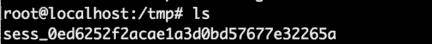

**举栗子**
​

题目内容：看看我的notebooktips；

tips：文件包含phpinfo是不是有新的发现

用给到的内容去做题目，我们可以看一下这道题目，进来之后首页找到url。
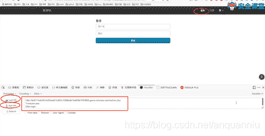

如果把php删掉，会发现登录入口不存在，初步推断php是后缀名会自动拼接到URL后面。
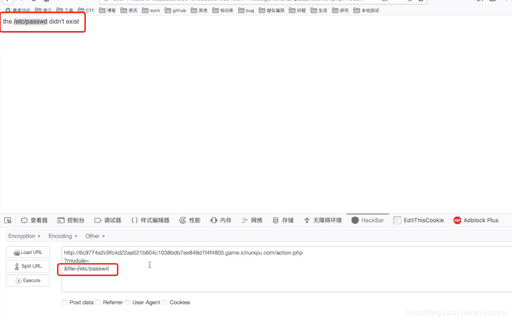

有了这个设想判断后，我们去读文件login改成password会发现不存在登录入口。

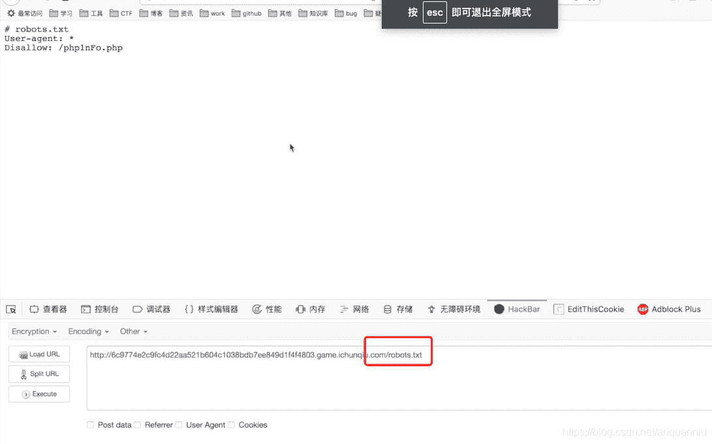

我们注册用户来看一下，线索已经用完了，我们要发掘新的线索新的功能，有管理员账号可以进去看源代码会不会有提示。

比如admin账号和密码去爆破，或者注入，扫后台扫备份文件，我们会看到一个phpinfo文件，因为题目中的提示提到了文件包含，它必然是一个非常重要的点，那就需要我们考虑它到底有什么用。
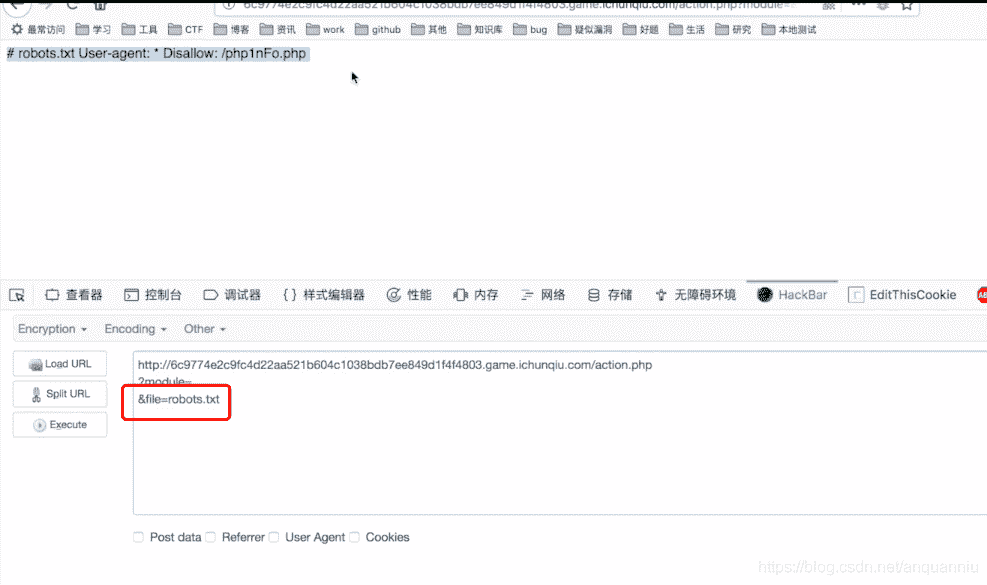
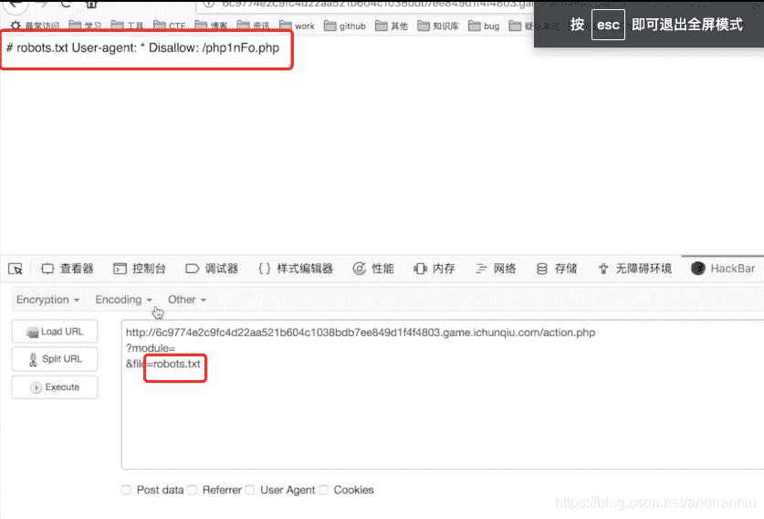

我们可以包含这个文件试一下，按照刚才的文件名后缀发现可以读出文件。
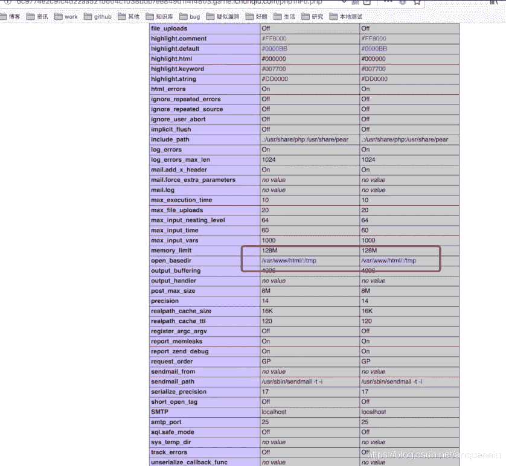
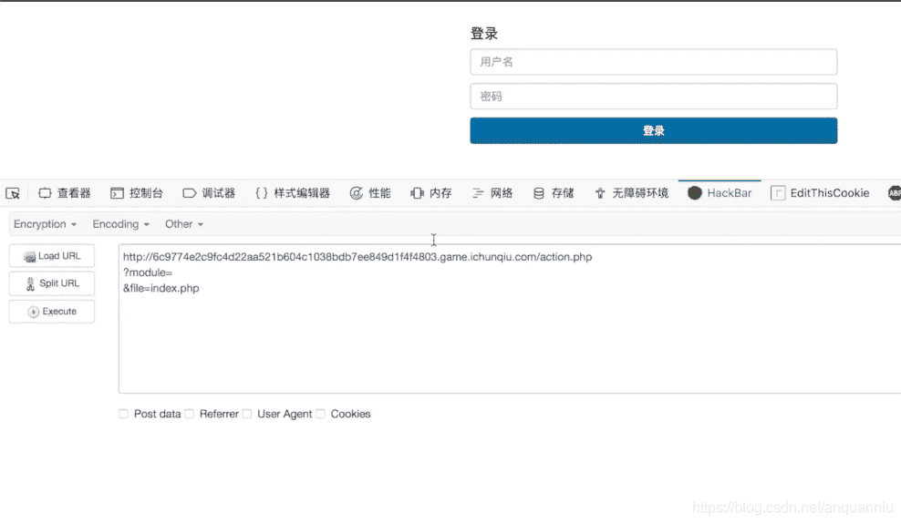
只有访问以上两个目录才能够被读取。

如果file读取文件换成index.php会怎样呢？发现它能够回来然后又跳转到UL。

​
**具体场景——远古魔法**
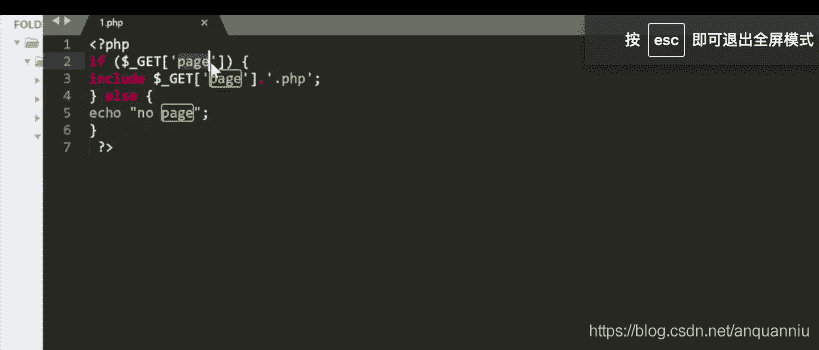

**举栗子**

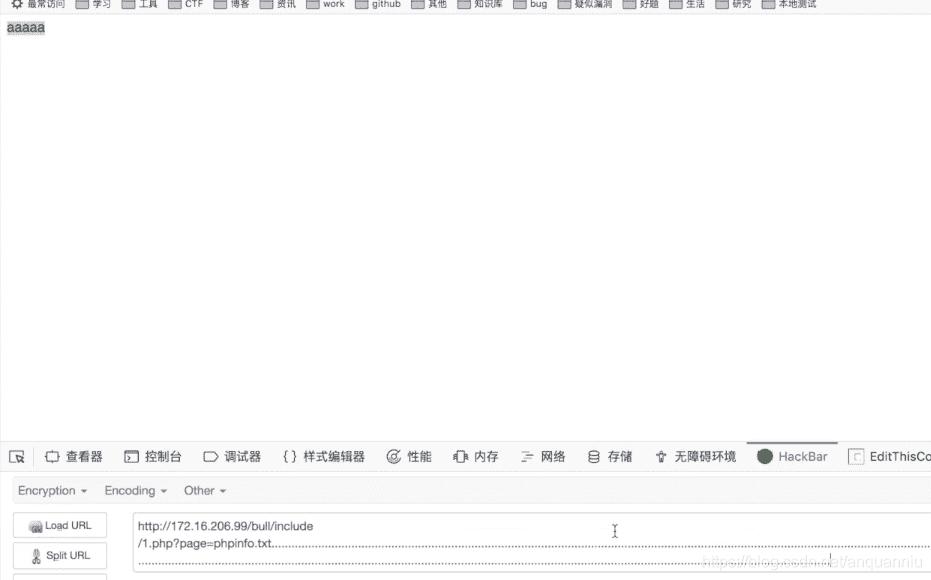
get去传一个配置的值，然后去包含下面的一文件名，配合.php为后缀名进行截断，不停的敲点或者点杠。

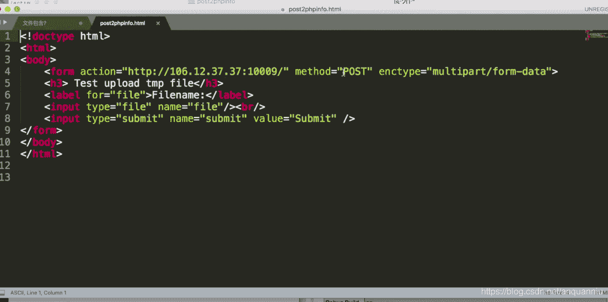

具体场景——phpinfo

文件上传无论后台有没有接受我传上的文件这个功能它都是会有文件先传上去的这个步骤，文件上传的函数代码逻辑是形成一个临时文件，然后把临时文件移过来。所以我们对php文件去做上传操作都会产生临时文件，后台如果没有这些函数，临时文件生成后又会被删掉，如果过手速够快，是有办法能够访问到临时文件的，用文件包含的操作去包含它，会触发临时文件中的代码，能拿到临时文件就可以getshell，但是难点在于临时文件的文件名我们不知道，也不知道在哪个路径下。
​
**演示**
​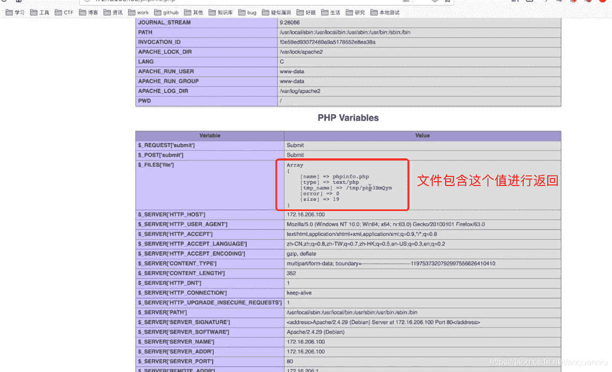
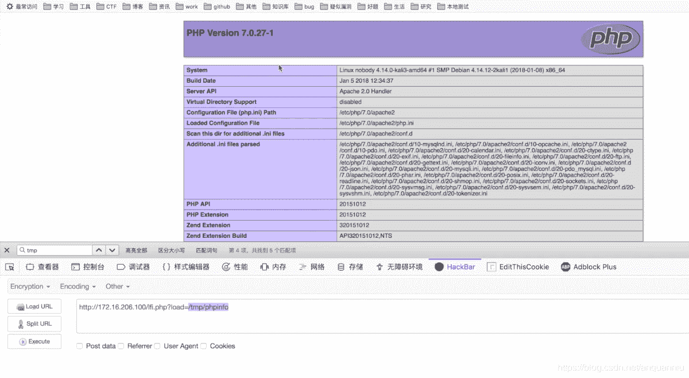

以上内容参考安全牛课堂《CTF从入门到提升》