<!--yml
category: 未分类
date: 2022-04-26 14:49:17
-->

# CTF从入门到提升（四）基于时间盲注例题及解法_anquanniu牛油果的博客-CSDN博客_ctf 时间盲注

> 来源：[https://blog.csdn.net/anquanniu/article/details/99941796](https://blog.csdn.net/anquanniu/article/details/99941796)

基于时间的盲注，本次内容会涉及到写一些脚本。
​​这里我先简单的示范，有两个网址推荐给大家，

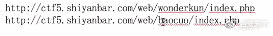

看一下到底能不能影响到这个数据，这里用一个插件。

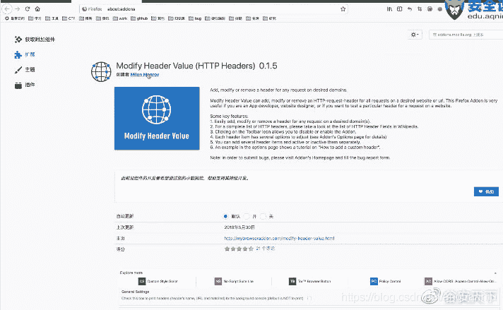

​

这个插件更新之前还挺好用的，更新之后就不太好用了。这里添加三个参数。

第一个，添加字段头用哪一个网址，这里添加了Headername，添加字段的名称X-Forwarded-For，然后到页面开启。

我们会发现它可以成功去修改它回写的内容，这个数据段是可控的，用字段去做一个注入，它就变成了一道注入题。

（在这里我做一个演示，如果大家想看可以到安全牛课堂的视频里看动手操作 CTF从入门到提升 课时4：4分16秒）

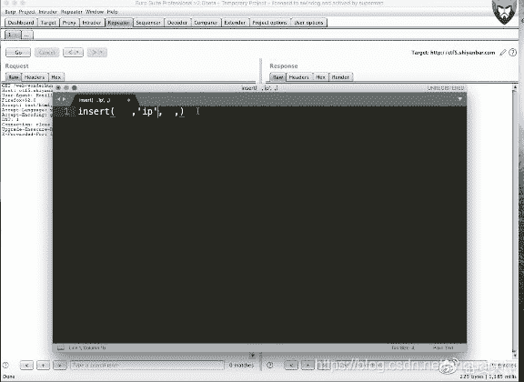
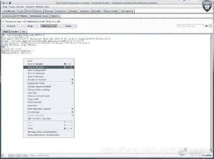
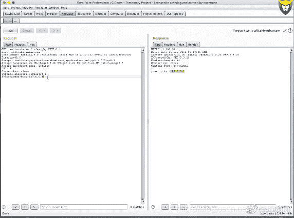

所以有的时候你也肯定是可以的，如果可以做事的话，向着相对会麻烦一些。我们就要考虑到如有没有说不用注释的方式去它做一个注入。而且我们这个时候你会发现，其实因为之前不回选题到了吗？我们这个时候必然考虑的是使用一个基于时间的一个盲注来做一个注入的，那么就是如何实现的问题了。如何来实现呢？

我们希望SLEEP引用的是一个计算过程。我们可以看一下看，到底是不是？

（在这里我做一个演示，如果大家想看可以到安全牛课堂的视频里看动手操作 CTF从入门到提升 课时4：10分39秒）
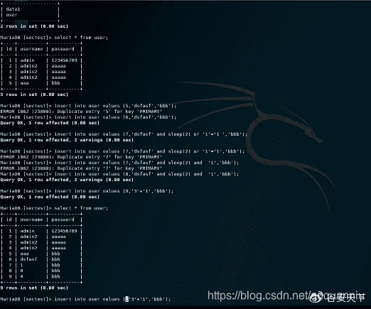
​
入的是数据。

在实际环境中’闭合是什么样呢？看一下操作

（在这里我做一个演示，如果大家想看可以到安全牛课堂的视频里看动手操作 CTF从入门到提升 课时4：12分34）

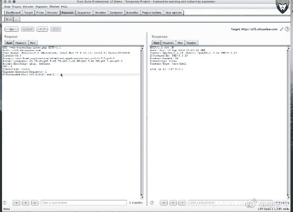

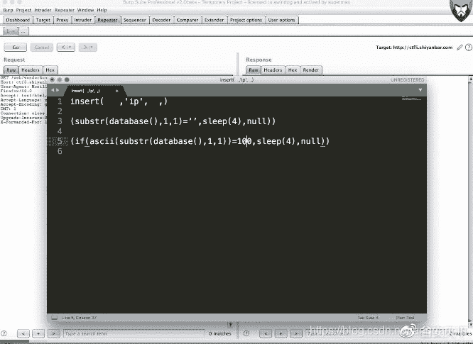

逗号来自于if条件，除了if以外还有另一种方法。就是使用CASE WHEN这种形式去做一个触发。

用select case的方式。

（在这里我做一个演示，如果大家想看可以到安全牛课堂的视频里看动手操作 CTF从入门到提升 课时4：19分21秒）

如果是写脚本怎么写呢，

（在这里我做一个演示，如果大家想看可以到安全牛课堂的视频里看动手操作 CTF从入门到提升 课时4：22分38秒）

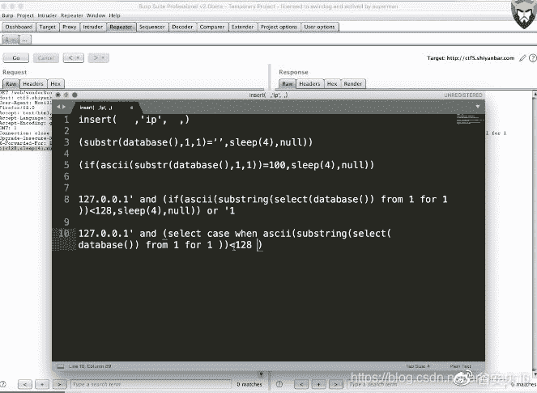

​

我们做循环的时候，先从数据库中读出的数据段的长度来考虑。一般不会太长。这是第外层循环，然后是内层循环，内存循环就是类似于阿斯科码值。

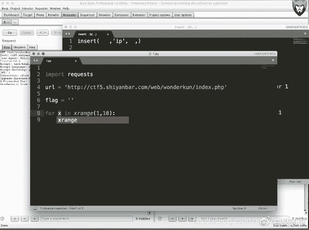

类似于字典，比如说dic定义一个变量，

（在这里我做一个演示，如果大家想看可以到安全牛课堂的视频里看动手操作 CTF从入门到提升 课时4：27分39秒）

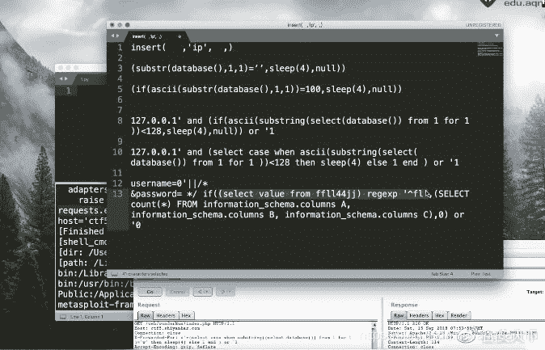
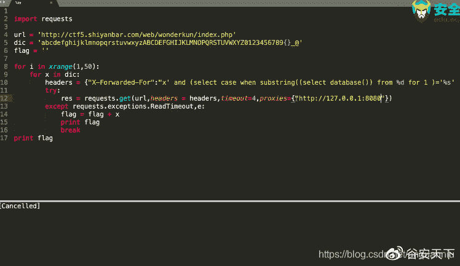

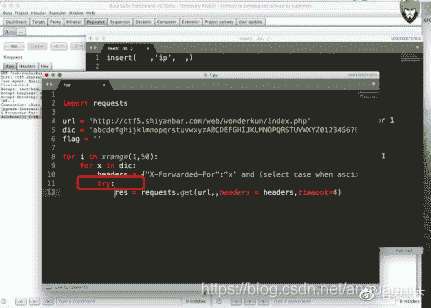

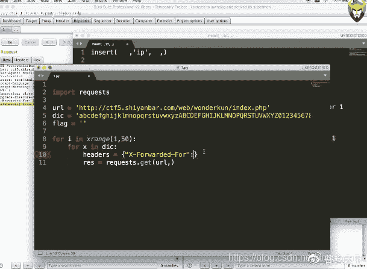
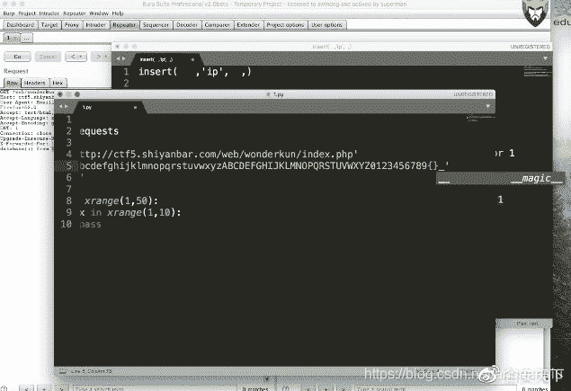
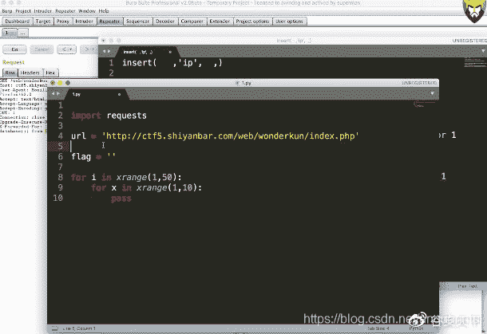

其实这种写脚本总体思路还是比较简单，很多时候要注意一下一些细节。多试一试，其实就会好一些。

以上动手演示可见：安全牛课堂《[CTF从入门到提升](https://www.aqniukt.com/my/course/8954%E2%80%8B%E2%80%8B%E2%80%8B%E2%80%8B%E2%80%8B%E2%80%8B%E2%80%8B%E2%80%8B?from=csdn)》

课程地址：https://www.aqniukt.com/my/course/8954​​​​​​​​