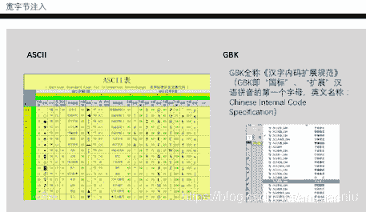
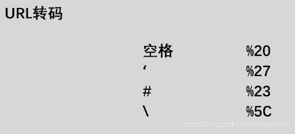
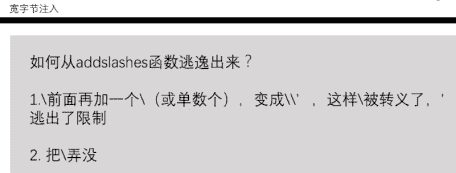
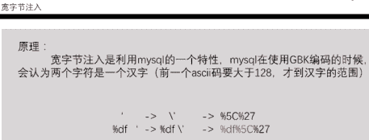
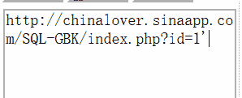
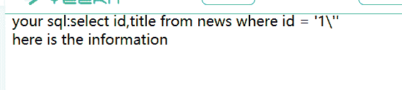
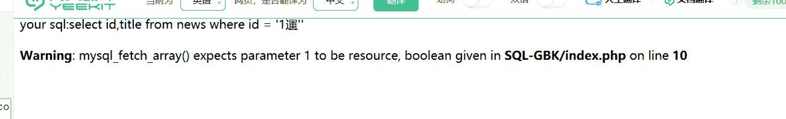

<!--yml
category: 未分类
date: 2022-04-26 14:34:00
-->

# CTF入门第一课(附一道小题)_anquanniu牛油果的博客-CSDN博客

> 来源：[https://blog.csdn.net/anquanniu/article/details/98507018](https://blog.csdn.net/anquanniu/article/details/98507018)

CTF（Capture The Flag）中文一般译作夺旗赛，在网络安全领域中指的是网络安全技术人员之间进行技术竞技的一种比赛形式。CTF起源于1996年DEFCON全球大会，以代替之前们通过互相发起真实***进行技术比拼的方式。发展至今，已经成为全球范围网络安全圈流行的竞赛形式。

竞赛模式：

1、解题模式

给你一道题目你要做出解答，通过线下或者线上解题，你会拿到flag的一个东西，提交flag，如果是正确的那就会得分，这就是常规竞赛，很多比赛你拿到前三名，比如一血二血会额外加分，也有其他的比赛，一道题目解答的人越多那么你拿到的分数就越低。

2、攻防模式

这个会更有意思一些，参赛队伍在比赛中攻防，每个队伍会拿到一个自己的服务器，首先要对自己的服务器加固，其他队伍对我们的服务器进行攻击，如果攻击成功，他们就会获得一个flag。比赛规则每轮10~15分钟，每轮只能得多少分数，因为你的对手很多，谁都能来攻击你的服务器，如果你的一个漏洞没有得到及时修复被无限时攻击那对比赛来说也没有意义，所以比赛中会有刷新。当然如果你的服务器被攻宕机了 那么对方也会被减分，这些都是比赛的一些规则，没有特别的标准，具体都是按照实际比赛赛制来定。

目前国内还有工控形式的比赛，一套现实中的工控环境对他渗透，你来获得一个flag，之后ctf比赛类型也会越来越有趣。

CTF比赛题型：

1、MISC 杂项类型，常规的 隐写术，信息隐藏技术，视频音频的使用去

2、PPC 编程类的，交互式

3、CRYPTO 算法，密文，提取flag

4、PWN 逆向 逻辑分析

5、WEB 题型较多很常见的

CTF赛事：

1、DEFCON CTF ：CTF赛事中的 “世界杯”，往年都是美国夺冠，去年是韩国的战队

2、XCTF全国联赛等

3、其他各种赛事

比赛前要多多练习，上手试试。

加个‘

addslasher函数实锤了，

那么要从中逃逸出去。

考虑到宽字节注入。

输入%df’宽字节，那么现在就开始用常规套路了。爆破各种table ,column.用order by 猜测字段：

1 [http://chinalover.sinaapp.com/SQL-GBK/index.php?id=1�’](http://chinalover.sinaapp.com/SQL-GBK/index.php?id=1%df%E2%80%99) 2 order by 2%23

2和三之间，

如果大一点的话可以用二分法去找，这样比较快。

用union找出库名：

[http://chinalover.sinaapp.com/SQL-GBK/index.php?id=1�’](http://chinalover.sinaapp.com/SQL-GBK/index.php?id=1%df%E2%80%99)

union select 1,database()%23

再找表名，再根据表名找column

再找出可疑的·

其中有一个要注意的，

就是在查询ctf表中时，

=ctf

是不行的，这时候可以用十六进制转码。

0x 转码后内容！(小技巧）

找到pw后解密就OK

学习路径推荐：CTF从入门到提升

地址：[https://www.aqniukt.com/course/8954](https://www.aqniukt.com/course/8954)