<!--yml
category: 未分类
date: 2022-04-26 14:18:17
-->

# CTF入门题_题解_weixin_30795127的博客-CSDN博客

> 来源：[https://blog.csdn.net/weixin_30795127/article/details/96055940](https://blog.csdn.net/weixin_30795127/article/details/96055940)

题目源文件下载l链接：[https://pan.baidu.com/s/1eQO3ccXc6G-qofE6tbR1_g](https://pan.baidu.com/s/1eQO3ccXc6G-qofE6tbR1_g)  

题目一：

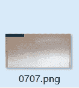

题解：

1.对于本题目，先用UE打开，查看图片的文件头标示是否正确

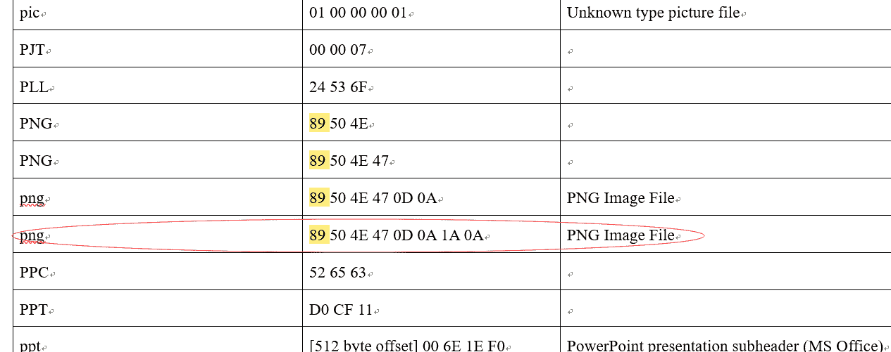

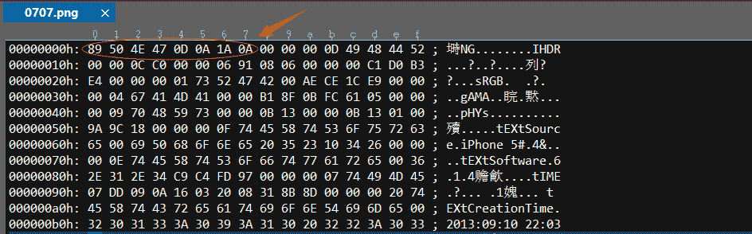

2.对比源图片，发现格式相符

3.再考虑是否是图片的格式出现了问题呢？于是在网上查看资料，发现调整图片格式的相应操作如下：

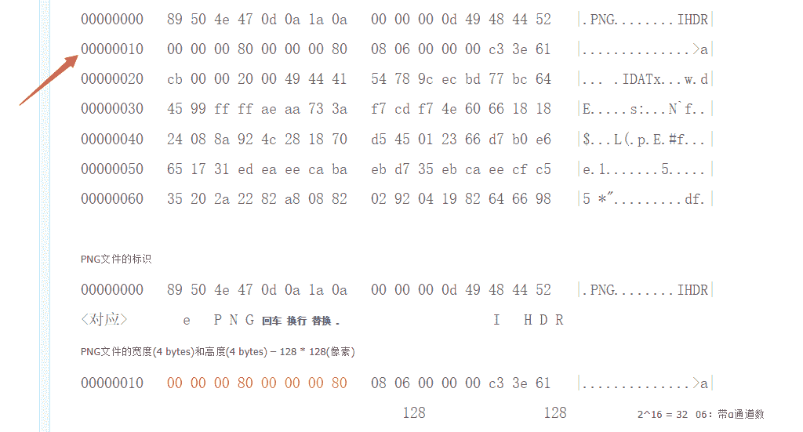

 相关资料链接:[http://blog.chinaunix.net/uid-25799257-id-3358174.html](http://blog.chinaunix.net/uid-25799257-id-3358174.html)

 4.于是将图片的大小进行修改，如下:

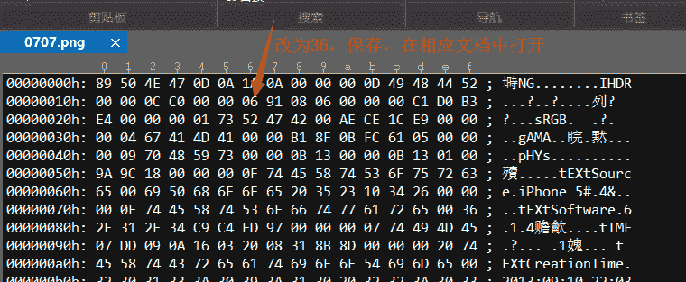

会发现图片大小发生了变化

5.将其放大，得到相应flag

 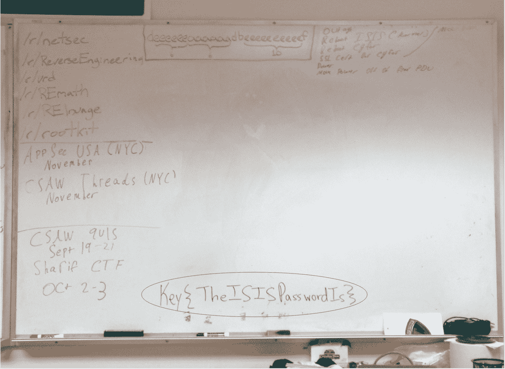

* * *

* * *

题目二：

题解：

 1.解答本题相应的方法与题目一类似，在这里就不多说了

2.应用相应的方法

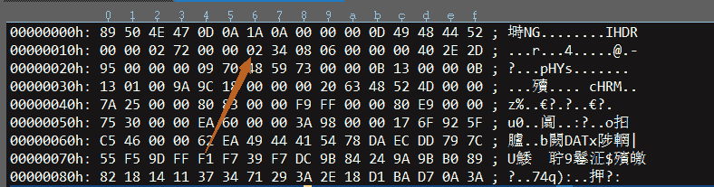

3.保存打开图片，得到 flag：

 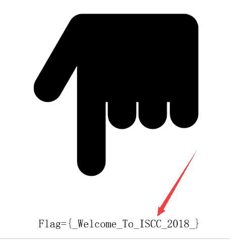

* * *

* * *

题目三：

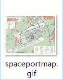

题解：

常规思路：查看本题的文件投标示是否正确，用UE打开进行对比，发现没问题

 1.对于本题，是一个gif动图，打开图片会发现，在右下角处，有一个动画闪动非常快，猜想可能是此处出现了问题

2.用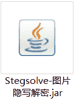此软件打开

3.因为是动图，可能和桢(Frame)有关，于是浏览图片的桢变化

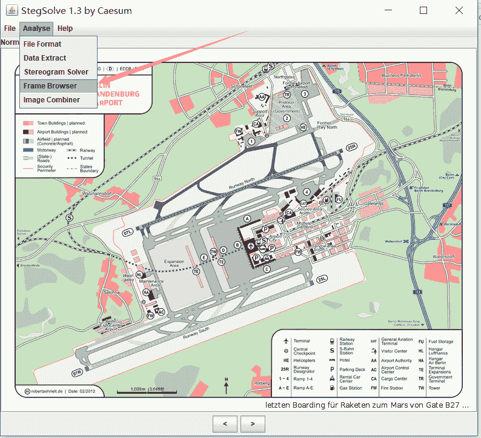

4.发现在第四个图时，发现了原图闪动很快的文字

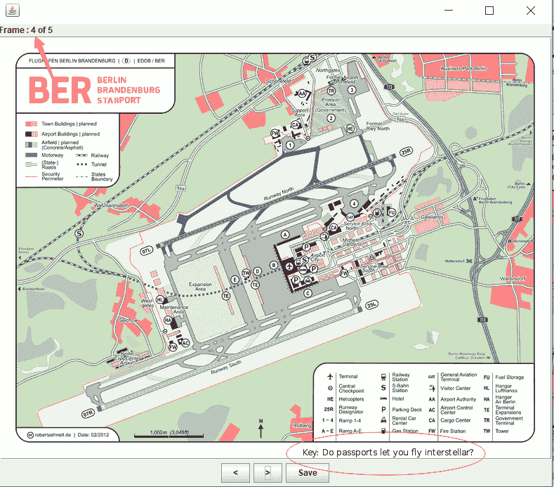

即flag

* * *

* * *

题目四：

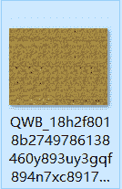

题解:

 1.本图片为bmp格式，首先对比文件头标示，查看相应的文件头标示正确

2.在用本软件打开进行分析

3.查看Stereogram Solver，将其Offset调到100，即可得到答案

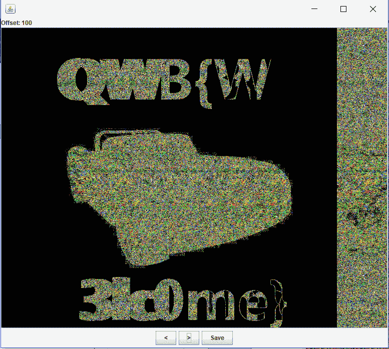

* * *

* * *

下面附上相应软件的用发详情及其文件下载地址：

stegsolve下载地址：[http://www.caesum.com/handbook/Stegsolve.jar](http://www.caesum.com/handbook/Stegsolve.jar)

stegsolve安装配置：配置好Java环境变量（就是需要安装Java，然后配环境变量）配置好环境之后直接打开就可以使用

stegsolve功能简介：

　　　　　　　　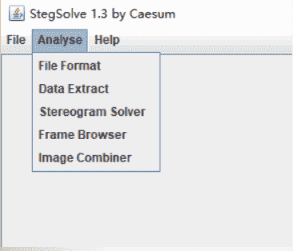

　　　　　　　　上面是软件打开的界面，界面简单。主要供能为analyse，下面对Analyse下面几个功能键作简单介绍：

　　　　　　　　File Format:文件格式，这个主要是查看图片的具体信息

　　　　　　　　Data Extract:数据抽取，图片中隐藏数据的抽取

　　　　　　　　Frame Browser:帧浏览器，主要是对GIF之类的动图进行分解，动图变成一张张图片，便于查看

　　　　　　　　Image Combiner:拼图，图片拼接