<!--yml
category: 未分类
date: 2022-04-26 14:33:23
-->

# CTF刷题02_Atkxor的博客-CSDN博客

> 来源：[https://blog.csdn.net/qq_46150940/article/details/108717330](https://blog.csdn.net/qq_46150940/article/details/108717330)

## [极客大挑战 2019]EasySQL

访问网址
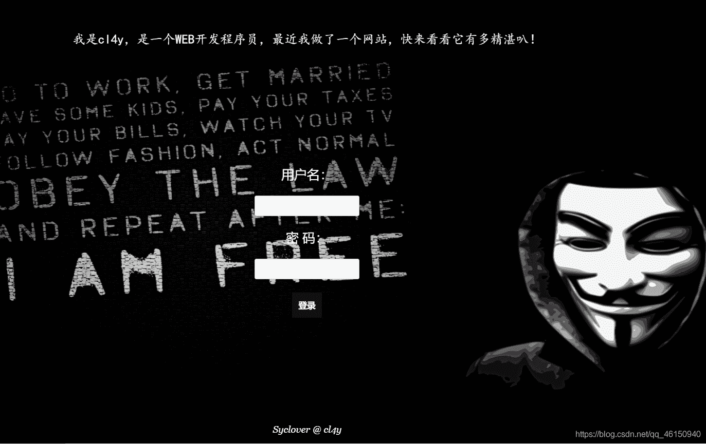
试试万能密码`admin" or 1=1#`登录
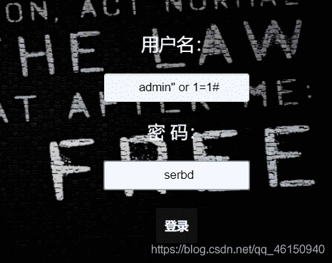
登录失败

再试试`admin' or 1=1#`登录

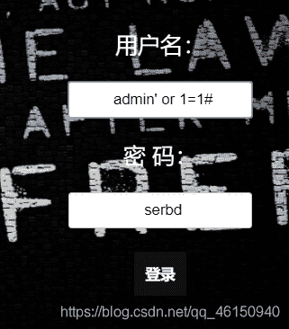
登录成功，得到flag


## [BugKu]Web4

访问题目网址
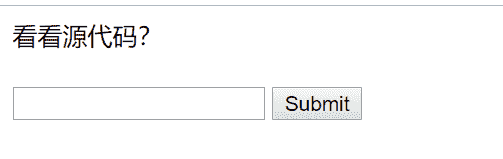
提示查看源码，可以看到两串奇怪的编码

分析代码，发现是unescape编码

```
var p1 = '%66%75%6e%63%74%69%6f%6e%20%63%68%65%63%6b%53%75%62%6d%69%74%28%29%7b%76%61%72%20%61%3d%64%6f%63%75%6d%65%6e%74%2e%67%65%74%45%6c%65%6d%65%6e%74%42%79%49%64%28%22%70%61%73%73%77%6f%72%64%22%29%3b%69%66%28%22%75%6e%64%65%66%69%6e%65%64%22%21%3d%74%79%70%65%6f%66%20%61%29%7b%69%66%28%22%36%37%64%37%30%39%62%32%62';
var p2 = '%61%61%36%34%38%63%66%36%65%38%37%61%37%31%31%34%66%31%22%3d%3d%61%2e%76%61%6c%75%65%29%72%65%74%75%72%6e%21%30%3b%61%6c%65%72%74%28%22%45%72%72%6f%72%22%29%3b%61%2e%66%6f%63%75%73%28%29%3b%72%65%74%75%72%6e%21%31%7d%7d%64%6f%63%75%6d%65%6e%74%2e%67%65%74%45%6c%65%6d%65%6e%74%42%79%49%64%28%22%6c%65%76%65%6c%51%75%65%73%74%22%29%2e%6f%6e%73%75%62%6d%69%74%3d%63%68%65%63%6b%53%75%62%6d%69%74%3b';
eval(unescape(p1) + unescape('%35%34%61%61%32' + p2)); 
```

进行[unescape解密](https://tool.chinaz.com/Tools/escape.aspx)

```
var p1 = 'function checkSubmit(){var a=document.getElementById("password");if("undefined"!=typeof a){if("67d709b2b';
var p2 = 'aa648cf6e87a7114f1"==a.value)return!0;alert("Error");a.focus();return!1}}document.getElementById("levelQuest").οnsubmit=checkSubmit;';
eval(unescape(p1) + unescape('54aa2' + p2)); 
```

将这些字符串拼接成一个字符串

```
67d709b2b54aa2aa648cf6e87a7114f1 
```

点击Submit，即可得到flag
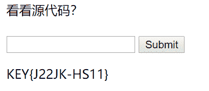

## [HCTF 2018]WarmUp

打开链接后是一个滑稽脸表情包

查看源码，发现注释里面有source.php
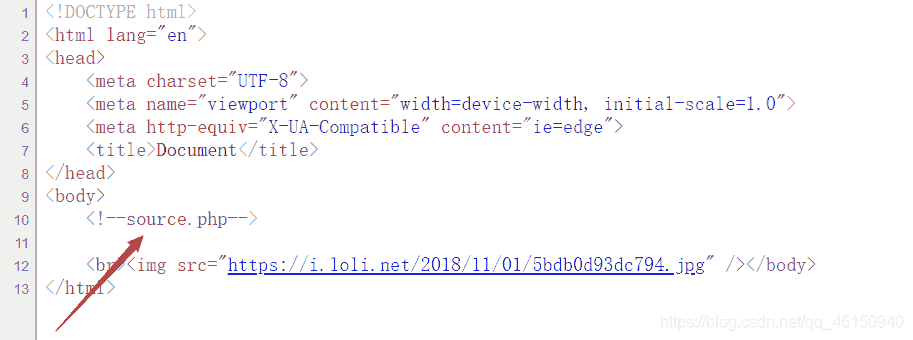

打开source.php，看到了hint.php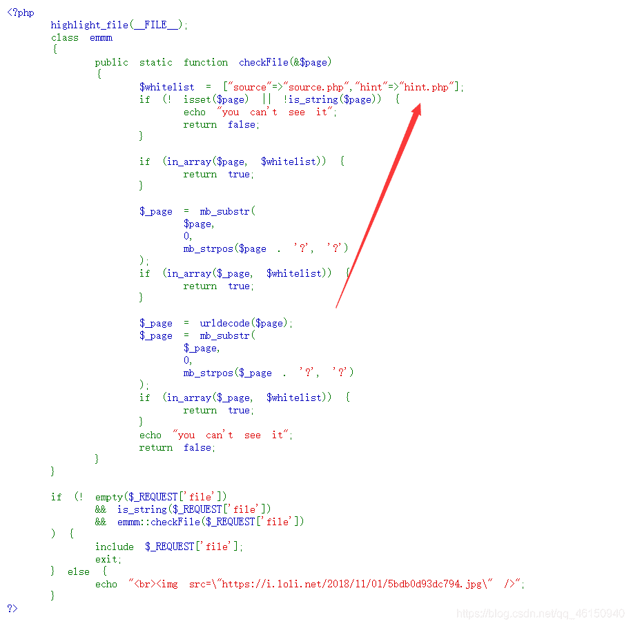

打开hint.php，意思是flag在ffffllllaaaagggg里面
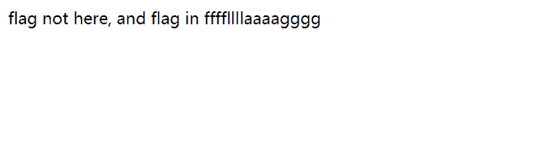
代码审计

```
 $whitelist = ["source"=>"source.php","hint"=>"hint.php"];
            if (! isset($page) || !is_string($page)) {         
                echo "you can't see it";
                return false;         
            }
            if (in_array($page, $whitelist)) {   //判断$page是否存在于$whitelist数组中
                return true;      //存在，返回true
            }

            $_page = mb_substr(             //mb_substr() 函数返回字符串的一部分
                $page,
                0,                   
                mb_strpos($page . '?', '?')  //mb_strpos()函数返回要查找的字符串在别一个字符串中首次出现的位置
            );
            if (in_array($_page, $whitelist)) {
                return true;
            }

            $_page = urldecode($page);         //对字符串进行URL解码
            $_page = mb_substr(
                $_page,
                0,
                mb_strpos($_page . '?', '?')  //截取?前面的字符串
            );
            if (in_array($_page, $whitelist)) {   //判断?的字符串部分是否存在于$whitelist中
                return true;    //存在则返回 true
            }
            echo "you can't see it";
            return false;
        } 
```

第一个 if 语句，对变量进行检验，要求$ page为字符串，否则返回 false。
第二个 if 语句，判断$ page是否存在于$ whitelist数组中，存在则返回 true。
第三个 if 语句，截取传进参数中首次出现?之前的部分，判断该部分是否存在于$ whitelist数组中，存在则返回 true。
第四个 if 语句，先对构造的 payload 进行 url 解码，再截取传进参数中首次出现?之前的部分，并判断该部分是否存在于$ whitelist中，存在则返回 true。

若以上四个if语句满足一个即可返回 true，若均未满足，则返回 false。

构造payload：

```
?file=source.php?/../../../../ffffllllaaaagggg 
```

得到flag
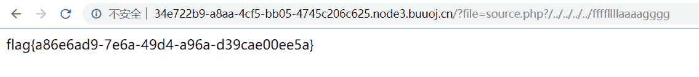

本题，所涉及到的php函数

| 函数 | 描述 |
| --- | --- |
| isset | 用于检测变量是否已设置并且非 NULL，若是返回false。 |
| is_string | 检测变量是否是字符串，若存在返回true。 |
| in_array() | 函数搜索数组中是否存在指定的值，若存在返回true |
| mb_substr() | 返回字符串的一部分 |
| mb_strpos(） | 查找字符串在另一字符串中第一次出现的位置。 |

这道题卡了我很长时间，看了别人写的wp才有了思路

## 掀桌子

题目描述：菜狗截获了一份报文如下c8e9aca0c6f2e5f3e8c4efe7a1a0d4e8e5a0e6ece1e7a0e9f3baa0e8eafae3f9e4eafae2eae4e3eaebfaebe3f5e7e9f3e4e3e8eaf9eaf3e2e4e6f2，生气地掀翻了桌子(╯°□°）╯︵ ┻━┻

分析这一串字符串，发现由a-z的字母和数字组合而成，我们将字符串整理一下，可以看出是16进制数，其中一组十六进制数fa转化为十进制数是250，所以将每组十六进制数转化为十进制后再减去128
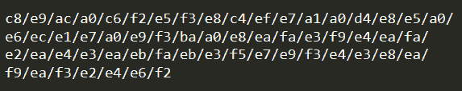
编写python脚本进行解密

```
s = "c8e9aca0c6f2e5f3e8c4efe7a1a0d4e8e5a0e6ece1e7a0e9f3baa0e8eafae3f9e4eafae2eae4e3eaebfaebe3f5e7e9f3e4e3e8eaf9eaf3e2e4e6f2"
flag =""

for i in range(0, len(s), 2):
    hex = s[i: i + 2]  
    flag += chr(int(hex, 16) - 128)
print(flag) 
```

得到flag
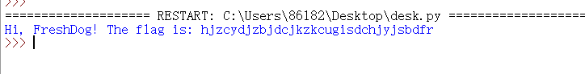

## 基础破解

题目描述：给你一个压缩包，你并不能获得什么，因为他是四位数字加密的哈哈哈哈哈哈哈。。。不对= =我说了什么了不得的东西。。 注意：得到的 flag 请包上 flag{} 提交

下载附件，解压里面是个加密的压缩包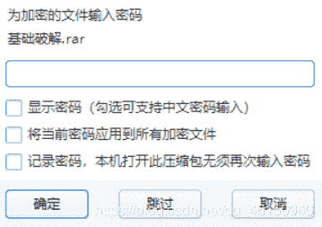
提示是四位数字加密，把压缩包拖入ARCHPR进行暴力破解。
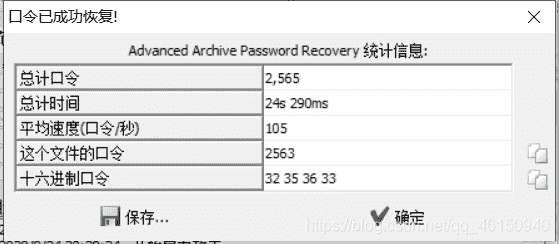
复制口令，然后解压，得到一个flag.txt文件
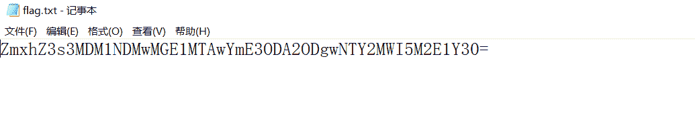
看见字符串最后的`=`，显然是Base64,进行Base64解密。
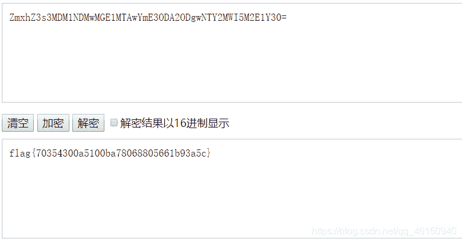