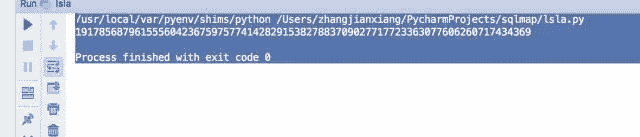

<!--yml
category: 未分类
date: 2022-04-26 14:19:02
-->

# CTF加密题型解析：RSA算法的CTF解法之一_weixin_30666943的博客-CSDN博客

> 来源：[https://blog.csdn.net/weixin_30666943/article/details/94917488](https://blog.csdn.net/weixin_30666943/article/details/94917488)

# **RSA****介绍**

根据加密原理，可以将大部分的加密算法分为两大类:对称加密算法和非对称加密算法。对称加密算法的加密和解密采用的是同一套算法规则。而非对称加密算法加密时用的是公钥(公开给所有人)，解密时用的是私钥(只有相关人员拥有)，

非对称加密算法中使用最广泛的就是RSA算法。RSA算法非常可靠，密钥越长，就越难破解。当今互联网中已经纰漏的破解方法是针对768位密钥。所以一般认为1024位的密钥加密是安全的，2048位是绝对安全的

# **RSA算法原理**

RSA的算法是基于一个大因数是很难计算分解这一原理的。要想理解RSA原理需要了解一些基础的数论概念

# **素数**

素数又称质数，指在一个大于1的自然数中，除了1和此整数自身外，不能被其他自然数整除的数

# **互质数**

公因数只有1的两个数，叫做互质数

两个不同的质数一定是互质数。例如，2与7、13与19。一个质数，另一个不为它的倍数，这两个数为互质数。例如，3与10、5与 26。相邻的两个自然数是互质数。如 15与 16。相邻的两个奇数是互质数。如 49与 51。较大数是质数的两个数是互质数。如97与88。小数是质数，大数不是小数的倍数的两个数是互质数。例如 7和 16。2和任何奇数是互质数。例如2和87。1不是质数也不是合数，它和任何一个自然数在一起都是互质数。如1和9908。辗转相除法。

# **指数运算**

指数运算又称乘方计算，计算结果称为幂

# **模运算**

模运算即求余运算。“模”是“Mod”的音译。和模运算紧密相关的一个概念是“同余”。数学上，当两个整数除以同一个正整数，若得相同余数，则二整数同余。

# **RSA加密步骤**

1. 随机选择两个不相等的质数p和q(这里选择了61和53。（实际应用中，这两个质数越大，就越难破解。））

2. 获取p和q的乘积n, n = 61×53 = 3233

3. 获取n的欧根函数φ(n) = (p-1)(q-1),φ(3233)等于60×52，即3120

4. 随机选择一个整数e，条件是1< e < φ(n)，且e与φ(n) 互质。则在1到3120之间，随机选择了17

5. 计算e对于φ(n)的模反元素d,ed ≡ 1 (mod φ(n)),17x+3120y=1,算出一组整数解为 (x,y)=(2753,-15)，即 d=2753

6. 将n和e封装成公钥，n和d封装成私钥。在例子中，n=3233，e=17，d=2753，所以公钥就是 (3233,17)，私钥就是（3233, 2753）

# **加密消息**

　　假设Bob想给Alice送一个消息m，他知道Alice产生的N和e。他使用起先与Alice约好的格式将m转换为一个小于N的整数n，比如他可以将每一个字转换为这个字的Unicode码，然后将这些数字连在一起组成一个数字。假如他的信息非常长的话，他可以将这个信息分为几段，然后将每一段转换为n。用下面这个公式他可以将n加密为c：

　　ne ≡ c (mod N)

计算c并不复杂。Bob算出c后就可以将它传递给Alice。

# **解密消息**

Alice得到Bob的消息c后就可以利用她的密钥d来解码。她可以用以下这个公式来将c转换为n：

　　cd ≡ n (mod N)

得到n后，她可以将原来的信息m重新复原。

回顾上面的密钥生成步骤，一共出现了六个数字

两个质数p和q， 乘积n, n的欧根函数φ(n), 随机质数e, 和模反元素d

以上六个数字中，公开的是n和e。其余四个数字都是不公开的。其中最关键的是d，因为n和d组成了私钥，一旦d泄漏，就等于私钥泄漏

这样的话要想破解RSA有三个途径

1\. ed≡1 (mod φ(n))。只有知道e和φ(n)，才能算出d。2\. φ(n)=(p-1)(q-1)。只有知道p和q，才能算出φ(n)。3\. n=pq。只有将n因数分解，才能算出p和q

# **RSA CTF一:VeryeasyRSA**

已知RSA公钥生成参数：

| p = 3487583947589437589237958723892346254777q = 8767867843568934765983476584376578389e = 65537求d =         请提交PCTF{d} |

1   按照RSA的加密流程，先算出n的值 n= p*q = 3487583947589437589237958723892346254777*8767867843568934765983476584376578389=3487583947589437589237958723892346254777*8767867843568934765983476584376578389

2  求φ(n)的值 φ(n)=(q-1)*(q-1)=(3487583947589437589237958723892346254777-1)*(8767867843568934765983476584376578389-1)=30578675145816634962204467309994126952472217172016094210686211003345383381088

3   计算d的值 根据ed ≡ 1 (mod φ(n)),转化公式65537d+30578675145816634962204467309994126952472217172016094210686211003345383381088y=1

```
def egcd(a, b): if a == 0: return (b, 0, 1) else:
        g, y, x = egcd(b % a, a) return (g, x - (b // a) * y, y)
 def modinv(a, m):

    g, x, y = egcd(a, m) if g != 1:
        raise Exception('modular inverse   does not exist') else: return x % m
#d=modinv(e,(p-1)*(q-1))
d = modinv(17, (61-1)*(53-1))
print d
```



获得d的值

19178568796155560423675975774142829153827883709027717723363077606260717434369