<!--yml
category: 未分类
date: 2022-04-26 14:40:51
-->

# CTF基础-图片隐写篇_Sn1Per_395的博客-CSDN博客_ctf图片隐写

> 来源：[https://blog.csdn.net/Dog_Captain/article/details/89028552](https://blog.csdn.net/Dog_Captain/article/details/89028552)

## 0x0前言：本人作为一个ctf菜鸟，在学习的过程中遇到了很多的疑问，大多数时候都是通过百度或谷歌解决。但由于没有一个整合的帖子，所以很多资料都十分零散，为了自己能方便浏览，也为了能方便更多新手，于是决定写下这篇文章。错误的地方欢迎大家指正。

【工具及题目链接：https://pan.baidu.com/s/1up969RLLbDP0Wlky4QdSew 提取码：f62y 】

## **0x1常见隐写类型：**

**【以下题目多来源于各大ctf题库或网站，仅修改了文件名以便于讲解】**

**1.利用binwalk工具分离图片**

**2.stegsovle工具的利用**

**3.txt简单隐写**

**4.关键字搜索**

**5.十六进制文件头补全及修改**

**6.png格式IHDR的问题**

**7.属性隐写+文件类型**

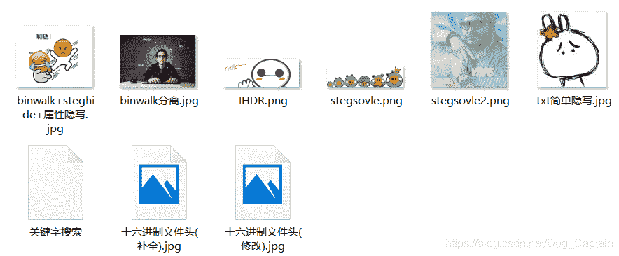

### 0x2常用工具：

1.kali虚拟机【binwalk、foremost】

2.十六进制编辑器【Winhex或Hexedit】

3.记事本或其他文本编辑器

4.stegsovle【基于java运行，需配置java环境】

### 1x0题目详解：

**1x1利用binwalk工具分离图片：**

1.首先将文件放到kali下，利用binwalk命令查看图片，通过查看描述可以发现图片中还隐藏了另外一张图片。

2.接着利用binwalk -e或foremost命令来分离他们。

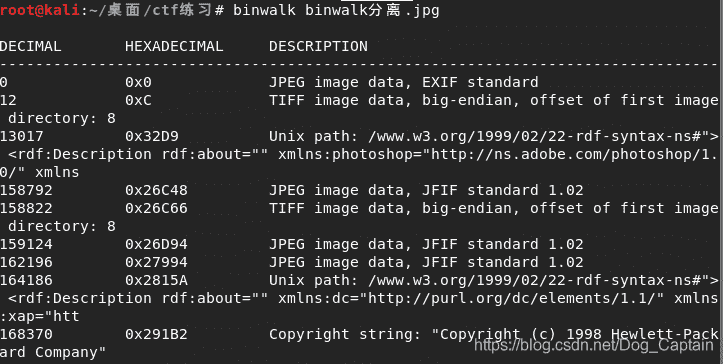

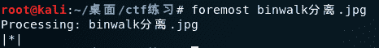

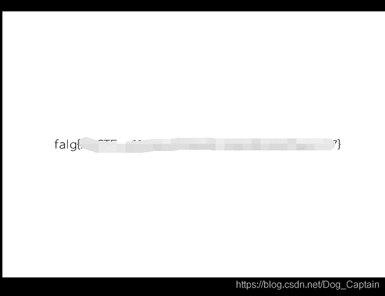

3.在生成的目录中，我们可以发现被隐藏的图片，从而得到flag。

**1x2stegsolve工具的利用：**

1.首先打开stegsolve，并open题目图片

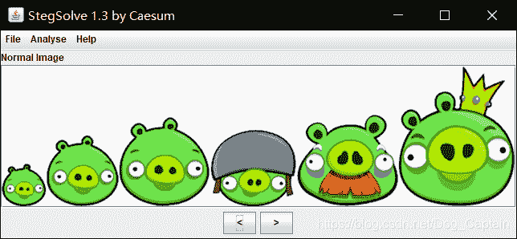

2.通过点击左右箭头，来查看图片在其它文件格式下的图像，然后在Gray bits格式下，发现一张隐藏的二维码，扫描二维码即可得到flag

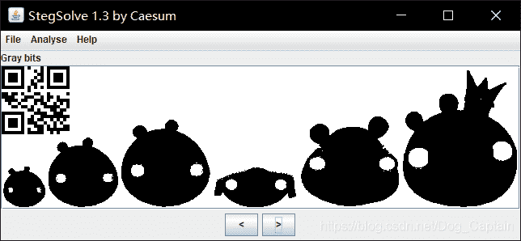

3.在其它格式下也可能会有提示信息，例如这张图

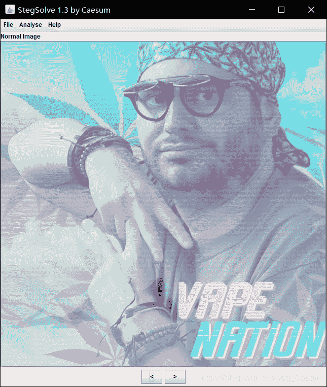

4.在Green plane0格式下直接发现了flag

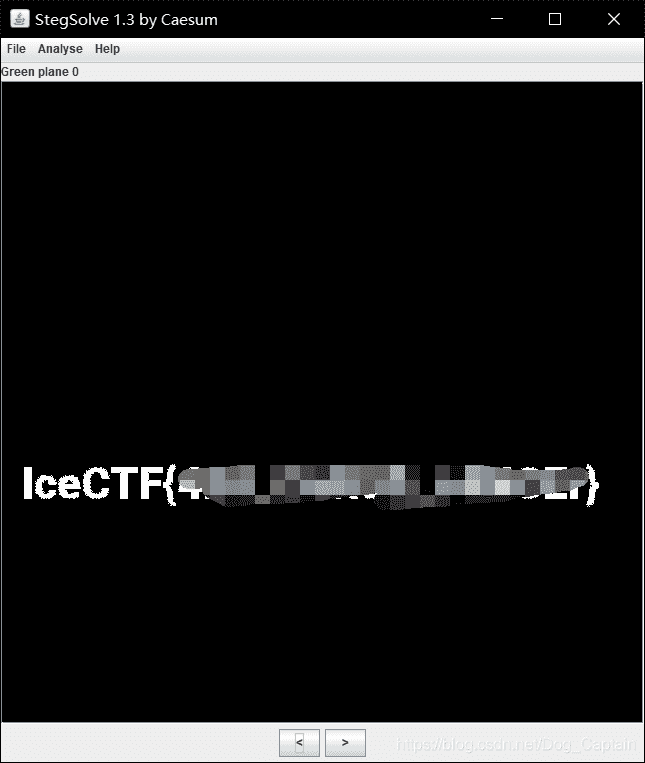

**1x3 txt简单隐写**

【此类题目可以说是最简单的一类题，通过直接使用记事本或者其它文本编辑软件，可直接查看。一般拿到图片后，大多先用记事本查看，从而判断是否为txt简单隐写。一般flag会位于文本开头或结尾，少数情况会在文本中间，这类情况后面会单独介绍】

1.拿到图片后，直接用记事本打开，在文本结尾发现了一串编码，学习过密码学的人应该很容易认出这是Unicode加密。我在之前的帖子里，也介绍过这种编码方式【[https://blog.csdn.net/Dog_Captain/article/details/82690338](https://blog.csdn.net/Dog_Captain/article/details/82690338)】

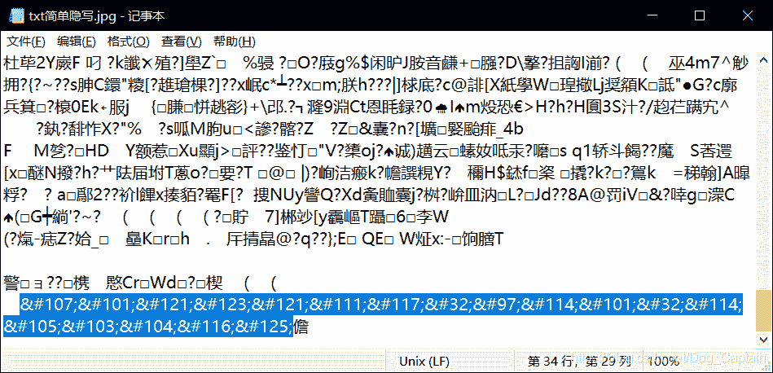

2.利用解码器可直接解flag

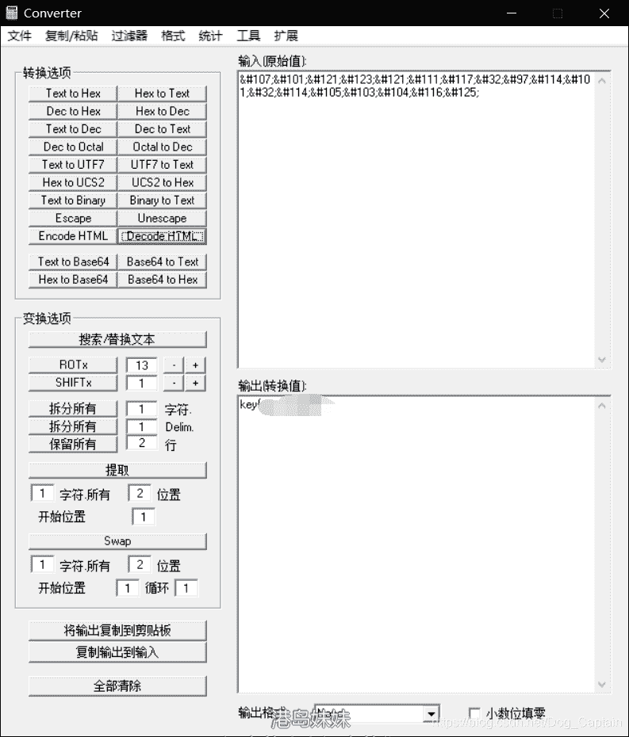

**1x4 关键字搜索**

【这类题目与txt简单隐写类似，但flag大多隐藏在文本中间，当文本过长的时候，只靠肉眼查找会浪费很多时间，我们可以直接用ctrl+f搜索关键字，例如：flag、FLAG、key、KEY或根据赛方要求的格式进行查找】

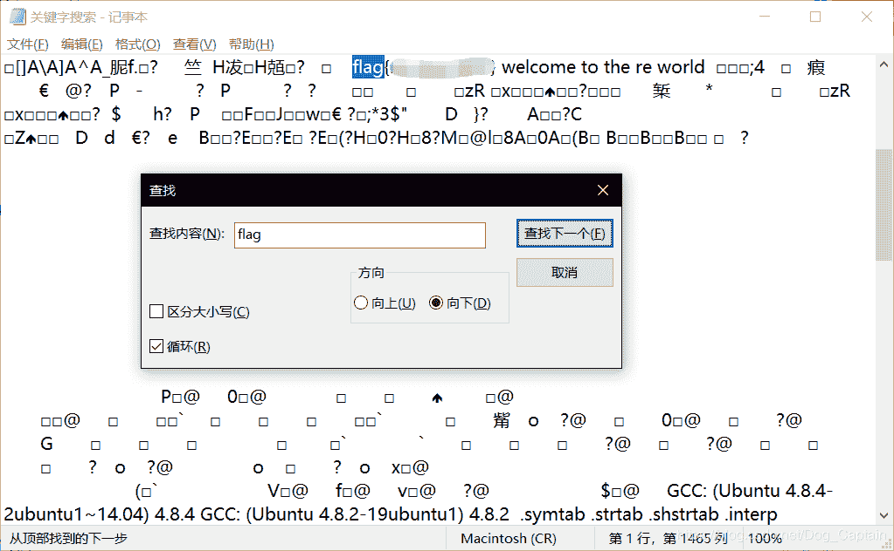

1x5 十六进制文件头补全及修改

【首先，我们需要知道文件头是位于文件开头，用处承担一定任务的数据，我们可以通过文件头来判断文件类型。因此，当文件头被删除或修改后，文件可能会打不开，这种情况我们就要根据所给文件的后缀，补全或修改文件头】

1.先观察所给的文件类型，发现是jpg格式，我们就要想到jpg文件的文件头为FFD8FF

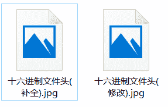

2.利用Winhex打开图片，查看文件的十六进制，观察后我们会发现，相比于正常的jpg文件，这张图的文件头缺失了三位

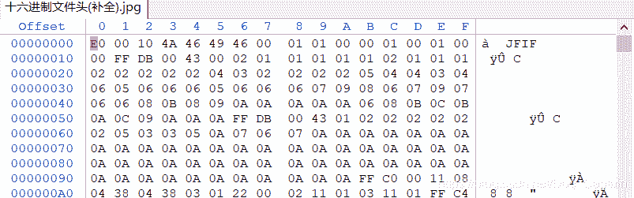

3.将文件头补全后保存，系统会自动生成一个备份文件，防止修改错误，而原文件则会变为正常图片

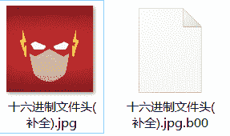

4.文件头修改同理，观察文件头前几位，将其修改为正确格式，保存后即可得到正常图片

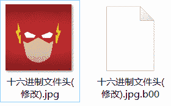

1x6 png格式的IHDR问题

【这类题目最大的标志：图片格式为png，或当你感觉这张图片好像被裁掉一部分时，要考虑的这类问题。这类题目的原理我理解的并不是很深刻，仅仅局限于解题方法...】

1.先查看一下原图

2.用十六进制编辑器打开图片后，我们会发现他的标志IHDR，对应左边十六进制的49 48 44 52，我们以此为界，后面的四位为图片宽度，再向后四位为图片高度

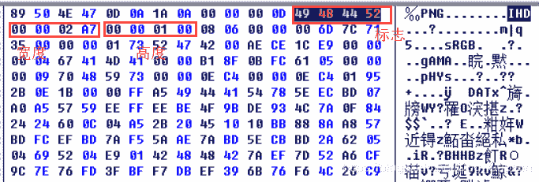

2.接下来，我们根据实际情况，将宽度和高度改为相同数值，然后保存

3.再次查看图片，发现隐藏的flag

**1x7 属性隐写+文件格式**

详情请见我写过的题目解析【[https://blog.csdn.net/Dog_Captain/article/details/84567858](https://blog.csdn.net/Dog_Captain/article/details/84567858)】

**2x0 小结**

以上，就是我所遇到的常见的基础隐写题目，在各大ctf比赛中，直接出现的机率较小，即使出现，分值一般也较低。大多数情况都是结合密码题或其它类型的题目一同出现，所以仅仅掌握这些常见的隐写方式只是基础。希望各位初学者不要以为掌握了这些题目就可以驰骋ctf赛场，前面的路还很长（笑）。

最后，谢谢大家的阅读与学习~