<!--yml
category: 未分类
date: 2022-04-26 14:55:20
-->

# CTF基础解题_destin_love的博客-CSDN博客_ctf解题

> 来源：[https://blog.csdn.net/weixin_52084568/article/details/120530419](https://blog.csdn.net/weixin_52084568/article/details/120530419)

# 密码学

密码学（在西欧语文中，源于希腊语kryptós“隐藏的”，和gráphein“书写”，所以一般在CTF中都会以crypto命名密码学题目）是研究如何隐密地传递信息的学科。在现代特别指对信息以及其传输的数学性研究，常被认为是数学和计算机科学的分支，和信息论也密切相关。著名的密码学者Ron Rivest解释道：“密码学是关于如何在敌人存在的环境中通讯”，自工程学的角度，这相当于密码学与纯数学的异同。密码学是信息安全等相关议题，如认证、访问控制的核心。密码学的首要目的是隐藏信息的涵义，并不是隐藏信息的存在。密码学也促进了计算机科学，特别是在于电脑与网络安全所使用的技术，如访问控制与信息的机密性。密码学已被应用在日常生活：包括自动柜员机的芯片卡、电脑使用者存取密码、电子商务等等。
密码是通信双方按约定的法则进行信息特殊变换的一种重要保密手段。依照这些法则，变明文为密文，称为加密变换；变密文为明文，称为脱密变换。密码在早期仅对文字或数码进行加、脱密变换，随着通信技术的发展，对语音、图像、数据等都可实施加、脱密变换。

## 专业术语

密钥：分为加密密钥和解密密钥。

明文：没有进行加密，能够直接代表原文含义的信息。

密文：经过加密处理处理之后，隐藏原文含义的信息。

加密：将明文转换成密文的实施过程。

解密：将密文转换成明文的实施过程。

密码算法：密码系统采用的加密方法和解密方法，随着基于数学密码技术的发展，加密方法一般称为加密算法，解密方法一般称为解密算法。

直到现代以前，密码学几乎专指加密(encryption）算法：将普通信息（明文,plaintext）转换成难以理解的数据（密文,ciphertext）的过程；解密(decryption）算法则是其相反的过程：由密文转换回明文；加解密包含了这两种算法，一般加密即同时指称加密(encrypt或encipher）与解密(decrypt或decipher）的技术。
加解密的具体运作由两部分决定：一个是算法，另一个是密钥。密钥是一个用于加解密算法的秘密参数，通常只有通讯者拥有。历史上，密钥通常未经认证或完整性测试而被直接使用在密码机上。

密码协议（cryptographic protocol）是使用密码技术的通信协议（communication protocol）。近代密码学者多认为除了传统上的加解密算法，密码协议也一样重要，两者为密码学研究的两大课题。在英文中，cryptography和cryptology都可代表密码学，前者又称密码术。但更严谨地说，前者（cryptography）指密码技术的使用，而后者（cryptology）指研究密码的学科，包含密码术与密码分析。密码分析（cryptanalysis）是研究如何破解密码学的学科。但在实际使用中，通常都称密码学（英文通常称cryptography），而不具体区分其含义。
口语上，编码（code）常意指加密或隐藏信息的各种方法。然而，在密码学中，编码有更特定的意义：它意指以码字（code word）取代特定的明文。例如，以‘苹果派’（apple pie）替换‘拂晓攻击’（attack at dawn）。编码已经不再被使用在严谨的密码学，它在信息论或通讯原理上有更明确的意义。
在汉语口语中，电脑系统或网络使用的个人帐户口令（password）也常被以密码代称，虽然口令亦属密码学研究的范围，但学术上口令与密码学中所称的钥匙（key）并不相同，即使两者间常有密切的关连。

```
加密特征

加密散列函数 （消息摘要算法，MD算法）　
加密散列函数
消息认证码
Keyed-hash message authentication code
EMAC (NESSIE selection MAC)
HMAC (NESSIE selection MAC; ISO/IEC 9797-1,FIPS and IETF RFC)
TTMAC 也称 Two-Track-MAC (NESSIE selection MAC; K.U.Leuven (Belgium) & debis AG (Germany))
UMAC (NESSIE selection MAC; Intel,UNevada Reno,IBM,Technion,& UCal Davis)
MD5 （系列消息摘要算法之一，由MIT的Ron Rivest教授提出； 128位摘要）
SHA-1 (NSA开发的160位摘要，FIPS标准之一；第一个发行发行版本被发现有缺陷而被该版本代替； NIST/NSA 已经发布了几个具有更长'摘要'长度的变种； CRYPTREC推荐 (limited))
SHA-256 (NESSIE 系列消息摘要算法，FIPS标准之一180-2，摘要长度256位 CRYPTREC recommendation)
SHA-384 (NESSIE 列消息摘要算法，FIPS标准之一180-2，摘要长度384位； CRYPTREC recommendation)
SHA-512 (NESSIE 列消息摘要算法，FIPS标准之一180-2，摘要长度512位； CRYPTREC recommendation)
RIPEMD-160 （在欧洲为 RIPE 项目开发，160位摘要；CRYPTREC 推荐 (limited))
Tiger (by Ross Anderson et al)
Snefru
Whirlpool (NESSIE selection hash function,Scopus Tecnologia S.A. (Brazil) & K.U.Leuven (Belgium))
公/私钥加密算法（也称 非对称性密钥算法)
ACE-KEM (NESSIE selection asymmetric encryption scheme; IBM Zurich Research)
ACE Encrypt
Chor-Rivest
Diffie-Hellman(key agreement; CRYPTREC 推荐）
El Gamal （离散对数）
ECC（椭圆曲线密码算法） （离散对数变种）
PSEC-KEM (NESSIE selection asymmetric encryption scheme; NTT (Japan); CRYPTREC recommendation only in DEM construction w/SEC1 parameters) )
ECIES (Elliptic Curve Integrated Encryption System; Certicom Corp)
ECIES-KEM
ECDH （椭圆曲线Diffie-Hellman 密钥协议； CRYPTREC推荐）
EPOC
Merkle-Hellman (knapsack scheme)
McEliece
NTRUEncrypt
RSA （因数分解）
RSA-KEM (NESSIE selection asymmetric encryption scheme; ISO/IEC 18033-2 draft)
RSA-OAEP (CRYPTREC 推荐）
Rabin cryptosystem （因数分解）
Rabin-SAEP
HIME(R)
XTR
公/私钥签名算法
DSA（zh:数字签名;zh-tw:数位签章算法） （来自NSA,zh：数字签名；zh-tw：数位签章标准（DSS）的一部分； CRYPTREC 推荐）
Elliptic Curve DSA (NESSIE selection digital signature scheme; Certicom Corp); CRYPTREC recommendation as ANSI X9.62,SEC1)
Schnorr signatures
RSA签名
RSA-PSS (NESSIE selection digital signature scheme; RSA Laboratories); CRYPTREC recommendation)
RSASSA-PKCS1 v1.5 (CRYPTREC recommendation)
Nyberg-Rueppel signatures
MQV protocol
Gennaro-Halevi-Rabin signature scheme
Cramer-Shoup signature scheme
One-time signatures
Lamport signature scheme
Bos-Chaum signature scheme
Undeniable signatures
Chaum-van Antwerpen signature scheme
Fail-stop signatures
Ong-Schnorr-Shamir signature scheme
Birational permutation scheme
ESIGN
ESIGN-D
ESIGN-R
Direct anonymous attestation
NTRUSign用于移动设备的公钥加密算法，密钥比较短小但也能达到高密钥ECC的加密效果
SFLASH (NESSIE selection digital signature scheme (esp for smartcard applications and similar); Schlumberger (France))
Quartz
秘密钥算法 （也称 对称性密钥算法)
流密码
A5/1,A5/2 (GSM移动电话标准中指定的密码标准）
BMGL
Chameleon
FISH (by Siemens AG)
二战'Fish'密码
Geheimfernschreiber （二战时期Siemens AG的机械式一次一密密码，被布莱奇利（Bletchley）庄园称为STURGEON)
Schlusselzusatz （二战时期 Lorenz的机械式一次一密密码，被布莱奇利（Bletchley）庄园称为[[tunny)
HELIX
ISAAC （作为伪随机数发生器使用）
Leviathan (cipher)
LILI-128
MUG1 (CRYPTREC 推荐使用）
MULTI-S01 (CRYPTREC 推荐使用）
一次一密 (Vernam and Mauborgne,patented mid-'20s; an extreme stream cypher)
Panama
Pike (improvement on FISH by Ross Anderson)
RC4 (ARCFOUR) (one of a series by Prof Ron Rivest of MIT; CRYPTREC 推荐使用 (limited to 128-bit key))
CipherSaber (RC4 variant with 10 byte random IV，易于实现)
SEAL
SNOW
SOBER
SOBER-t16
SOBER-t32
WAKE
分组密码
分组密码操作模式
乘积密码
Feistel cipher （由Horst Feistel提出的分组密码设计模式）
Advanced Encryption Standard （分组长度为128位； NIST selection for the AES,FIPS 197,2001 -- by Joan Daemen and Vincent Rijmen; NESSIE selection; CRYPTREC 推荐使用）
Anubis (128-bit block)
BEAR （由流密码和Hash函数构造的分组密码，by Ross Anderson)
Blowfish （分组长度为128位； by Bruce Schneier,et al)
Camellia （分组长度为128位； NESSIE selection (NTT & Mitsubishi Electric); CRYPTREC 推荐使用）
CAST-128 (CAST5) (64 bit block; one of a series of algorithms by Carlisle Adams and Stafford Tavares,who are insistent (indeed,adamant) that the name is not due to their initials)
CAST-256 (CAST6) (128位分组长度； CAST-128的后继者，AES的竞争者之一）
CIPHERUNICORN-A （分组长度为128位； CRYPTREC 推荐使用）
CIPHERUNICORN-E (64 bit block; CRYPTREC 推荐使用 (limited))
CMEA － 在美国移动电话中使用的密码，被发现有弱点.
CS-Cipher (64位分组长度)
DESzh：数字；zh-tw：数位加密标准（64位分组长度； FIPS 46-3,1976)
DEAL － 由DES演变来的一种AES候选算法
DES-X 一种DES变种，增加了密钥长度.
FEAL
GDES －一个DES派生，被设计用来提高加密速度.
Grand Cru (128位分组长度）
Hierocrypt-3 (128位分组长度； CRYPTREC 推荐使用））
Hierocrypt-L1 (64位分组长度； CRYPTREC 推荐使用 (limited))
International Data Encryption Algorithm (IDEA) (64位分组长度--苏黎世ETH的James Massey & X Lai)
Iraqi Block Cipher (IBC)
KASUMI (64位分组长度； 基于MISTY1，被用于下一代W-CDMAcellular phone 保密）
KHAZAD (64-bit block designed by Barretto and Rijmen)
Khufu and Khafre (64位分组密码）
LOKI89/91 (64位分组密码）
LOKI97 (128位分组长度的密码，AES候选者）
Lucifer (by Tuchman et al of IBM,early 1970s; modified by NSA/NBS and released as DES)
MAGENTA (AES 候选者）
Mars (AES finalist,by Don Coppersmith et al)
MISTY1 (NESSIE selection 64-bit block; Mitsubishi Electric (Japan); CRYPTREC 推荐使用 (limited))
MISTY2 （分组长度为128位：Mitsubishi Electric (Japan))
Nimbus (64位分组)
Noekeon （分组长度为128位）
NUSH （可变分组长度（64 - 256位））
Q （分组长度为128位）
RC2 64位分组，密钥长度可变.
RC6 （可变分组长度； AES finalist,by Ron Rivest et al)
RC5 (by Ron Rivest)
SAFER （可变分组长度）
SC2000 （分组长度为128位； CRYPTREC 推荐使用）
Serpent （分组长度为128位； AES finalist by Ross Anderson,Eli Biham,Lars Knudsen)
SHACAL-1 (256-bit block)
SHACAL-2 (256-bit block cypher; NESSIE selection Gemplus (France))
Shark (grandfather of Rijndael/AES,by Daemen and Rijmen)
Square (father of Rijndael/AES,by Daemen and Rijmen)
3-Way (96 bit block by Joan Daemen)
TEA（小型加密算法）（by David Wheeler & Roger Needham)
Triple DES (by Walter Tuchman,leader of the Lucifer design team -- not all triple uses of DES increase security,Tuchman's does; CRYPTREC 推荐使用 (limited),only when used as in FIPS Pub 46-3)
Twofish （分组长度为128位； AES finalist by Bruce Schneier,et al)
XTEA (by David Wheeler & Roger Needham)
多表代替密码机密码
Enigma （二战德国转轮密码机--有很多变种，多数变种有很大的用户网络）
紫密（Purple) （二战日本外交最高等级密码机；日本海军设计）
SIGABA （二战美国密码机，由William Friedman,Frank Rowlett，等人设计）
TypeX （二战英国密码机）
Hybrid code/cypher combinations
JN-25 （二战日本海军的高级密码； 有很多变种）
Naval Cypher 3 (30年代和二战时期英国皇家海军的高级密码）
可视密码
有密级的 密码 （美国）
EKMS NSA的电子密钥管理系统
FNBDT NSA的加密窄带话音标准
Fortezza encryption based on portable crypto token in PC Card format
KW-26 ROMULUS 电传加密机（1960s - 1980s)
KY-57 VINSON 战术电台语音加密
SINCGARS 密码控制跳频的战术电台
STE 加密电话
STU-III 较老的加密电话
TEMPEST prevents compromising emanations
Type 1 products 
```

```
破译密码

被动攻击
选择明文攻击
选择密文攻击
自适应选择密文攻击
暴力攻击
密钥长度
唯一解距离
密码分析学
中间相会攻击
差分密码分析
线性密码分析
Slide attack cryptanalysis
Algebraic cryptanalysis
XSL attack
Mod n cryptanalysis
弱密钥和基于口令的密码
暴力攻击
字典攻击
相关密钥攻击
Key derivation function
弱密钥
口令
Password-authenticated key agreement
Passphrase
Salt
密钥传输/交换
BAN Logic
Needham-Schroeder
Otway-Rees
Wide Mouth Frog
Diffie-Hellman
中间人攻击
伪的和真的随机数发生器
PRNG
CSPRNG
硬件随机数发生器
Blum Blum Shub
Yarrow (by Schneier,et al)
Fortuna (by Schneier,et al)
ISAAC
基于SHA-1的伪随机数发生器， in ANSI X9.42-2001 Annex C.1 (CRYPTREC example)
PRNG based on SHA-1 for general purposes in FIPS Pub 186-2 (inc change notice 1) Appendix 3.1 (CRYPTREC example)
PRNG based on SHA-1 for general purposes in FIPS Pub 186-2 (inc change notice 1) revised Appendix 3.1 (CRYPTREC example)
匿名通讯　Dining cryptographers protocol (by David Chaum)
匿名投递
pseudonymity
匿名网络银行业务
Onion Routing 
```

## 常见码制

```
加密数据：flag{destin love}
Base 64编码： ZmxhZ3tkZXN0aW4gbG92ZX0=
ASCII编码\u0066\u006c\u0061\u0067\u007b\u0064\u0065\u0073\u0074\u0069\u006e\u0020\u006c\u006f\u0076\u0065\u007d
MD5： B979FC0C210EBFF2CFFF20FAD9914D1E
SHA-1： 2c64dcaf9f60499485f25a9ccea2b97f974132c3
URL编码： flag%7Bdestin%20love%7D
HEX编码：666c61677b64657374696e206c6f76657d
JsFuck：(![]+[])[+[]]+(![]+[])[!+[]+!+[]]+(![]+[])[+!+[]]+(![]+[+[]]+([]+[])[([][(![]+[])[+[]]+([![]]+[][[]])[+!+[]+[+[]]]+(![]+[])[!+[]+!+[]]+(![]+[])[!+[]+!+[]]]+[])[!+[]+!+[]+!+[]]+(!![]+[][(![]+[])[+[]]+([![]]+[][[]])[+!+[]+[+[]]]+(![]+[])[!+[]+!+[]]+(![]+[])[!+[]+!+[]]])[+!+[]+[+[]]]+([][[]]+[])[+!+[]]+(![]+[])[!+[]+!+[]+!+[]]+(!![]+[])[+[]]+(!![]+[])[+!+[]]+([][[]]+[])[+[]]+([][(![]+[])[+[]]+([![]]+[][[]])[+!+[]+[+[]]]+(![]+[])[!+[]+!+[]]+(![]+[])[!+[]+!+[]]]+[])[!+[]+!+[]+!+[]]+(!![]+[])[+[]]+(!![]+[][(![]+[])[+[]]+([![]]+[][[]])[+!+[]+[+[]]]+(![]+[])[!+[]+!+[]]+(![]+[])[!+[]+!+[]]])[+!+[]+[+[]]]+(!![]+[])[+!+[]]])[!+[]+!+[]+[+[]]]+(!![]+[][(![]+[])[+[]]+([![]]+[][[]])[+!+[]+[+[]]]+(![]+[])[!+[]+!+[]]+(![]+[])[!+[]+!+[]]])[!+[]+!+[]+[+[]]]+([][[]]+[])[!+[]+!+[]]+(!![]+[])[!+[]+!+[]+!+[]]+(![]+[])[!+[]+!+[]+!+[]]+(!![]+[])[+[]]+([![]]+[][[]])[+!+[]+[+[]]]+([][[]]+[])[+!+[]]+(+[![]]+[][(![]+[])[+[]]+([![]]+[][[]])[+!+[]+[+[]]]+(![]+[])[!+[]+!+[]]+(![]+[])[!+[]+!+[]]])[+!+[]+[+!+[]]]+(![]+[])[!+[]+!+[]]+(!![]+[][(![]+[])[+[]]+([![]]+[][[]])[+!+[]+[+[]]]+(![]+[])[!+[]+!+[]]+(![]+[])[!+[]+!+[]]])[+!+[]+[+[]]]+(+(!+[]+!+[]+!+[]+[+!+[]]))[(!![]+[])[+[]]+(!![]+[][(![]+[])[+[]]+([![]]+[][[]])[+!+[]+[+[]]]+(![]+[])[!+[]+!+[]]+(![]+[])[!+[]+!+[]]])[+!+[]+[+[]]]+([]+[])[([][(![]+[])[+[]]+([![]]+[][[]])[+!+[]+[+[]]]+(![]+[])[!+[]+!+[]]+(![]+[])[!+[]+!+[]]]+[])[!+[]+!+[]+!+[]]+(!![]+[][(![]+[])[+[]]+([![]]+[][[]])[+!+[]+[+[]]]+(![]+[])[!+[]+!+[]]+(![]+[])[!+[]+!+[]]])[+!+[]+[+[]]]+([][[]]+[])[+!+[]]+(![]+[])[!+[]+!+[]+!+[]]+(!![]+[])[+[]]+(!![]+[])[+!+[]]+([][[]]+[])[+[]]+([][(![]+[])[+[]]+([![]]+[][[]])[+!+[]+[+[]]]+(![]+[])[!+[]+!+[]]+(![]+[])[!+[]+!+[]]]+[])[!+[]+!+[]+!+[]]+(!![]+[])[+[]]+(!![]+[][(![]+[])[+[]]+([![]]+[][[]])[+!+[]+[+[]]]+(![]+[])[!+[]+!+[]]+(![]+[])[!+[]+!+[]]])[+!+[]+[+[]]]+(!![]+[])[+!+[]]][([][[]]+[])[+!+[]]+(![]+[])[+!+[]]+((+[])[([][(![]+[])[+[]]+([![]]+[][[]])[+!+[]+[+[]]]+(![]+[])[!+[]+!+[]]+(![]+[])[!+[]+!+[]]]+[])[!+[]+!+[]+!+[]]+(!![]+[][(![]+[])[+[]]+([![]]+[][[]])[+!+[]+[+[]]]+(![]+[])[!+[]+!+[]]+(![]+[])[!+[]+!+[]]])[+!+[]+[+[]]]+([][[]]+[])[+!+[]]+(![]+[])[!+[]+!+[]+!+[]]+(!![]+[])[+[]]+(!![]+[])[+!+[]]+([][[]]+[])[+[]]+([][(![]+[])[+[]]+([![]]+[][[]])[+!+[]+[+[]]]+(![]+[])[!+[]+!+[]]+(![]+[])[!+[]+!+[]]]+[])[!+[]+!+[]+!+[]]+(!![]+[])[+[]]+(!![]+[][(![]+[])[+[]]+([![]]+[][[]])[+!+[]+[+[]]]+(![]+[])[!+[]+!+[]]+(![]+[])[!+[]+!+[]]])[+!+[]+[+[]]]+(!![]+[])[+!+[]]]+[])[+!+[]+[+!+[]]]+(!![]+[])[!+[]+!+[]+!+[]]]](!+[]+!+[]+!+[]+[!+[]+!+[]])+(!![]+[])[!+[]+!+[]+!+[]]+([][(![]+[])[+[]]+([![]]+[][[]])[+!+[]+[+[]]]+(![]+[])[!+[]+!+[]]+(![]+[])[!+[]+!+[]]]+[])[(![]+[])[!+[]+!+[]+!+[]]+(![]+[])[!+[]+!+[]]+([![]]+[][[]])[+!+[]+[+[]]]+([][(![]+[])[+[]]+([![]]+[][[]])[+!+[]+[+[]]]+(![]+[])[!+[]+!+[]]+(![]+[])[!+[]+!+[]]]+[])[!+[]+!+[]+!+[]]+(!![]+[])[!+[]+!+[]+!+[]]]((+((+(+!+[]+[+!+[]]+(!![]+[])[!+[]+!+[]+!+[]]+[!+[]+!+[]]+[+[]])+[])[+!+[]]+[+[]+[+[]]+[+[]]+[+[]]+[+[]]+[+[]]+[+[]]+[+[]]+[+[]]+[+!+[]]])+[])[!+[]+!+[]]+[+!+[]])
Html编码：flag{destin love}
Unicode编码：\u0066\u006c\u0061\u0067\u007b\u0064\u0065\u0073\u0074\u0069\u006e\u0020\u006c\u006f\u0076\u0065\u007d
shellcode编码：\x7f\x74\x68\x65\x7f\x6c\x61\x7a\x79\x7f\x64\x6f\x67
Quoted-printable：=BF=87=E4=BA=86=E6=87=92=E6=83=B0=E7=9A=84=E7=8B=97
XXencode编码：FNalVNrhYNLBoOKsUP4xqNLo+
UUencode编码：19FQA9WMD97-T:6X@;&]V97T`
Escape/Unescape编码：%u0066%u006c%u0061%u0067%u007b%u0064%u0065%u0073%u0074%u0069%u006e%u0020%u006c%u006f%u0076%u0065%u007d
敲击码：21 31 11 22 14 15 43 44 24 33 31 34 51 15
莫尔斯电码：..-./.-../.-/--./----.--/-.././.../-/../-./.-../---/...-/./-----.-
各种文本加密：圯这奴撺籍启抡嚼铤枨喵疆这岁纾抡馑= 
```

## 换位密码

```
 把加密的明文分成N个一组，然后把每组的第1个字符组合，每组第2个字符组合...每组的第N(最后一个分组可能不足N个)个字符组合，最后连起来就是密文，2栏栅栏为例

明文：THERE IS A CIPHER
抽取空格：THEREISACIPHER
分组：TH ER EI SA CI PH ER
抽取第一组：TEESCPE
抽取第二组：HRIAIHR
密文：TEESCPEHRIAIHR 
```

```
 将明文按照一定的行列进行排列，形成密文，并规定曲路路经，按规定路径游走逐个字符添加，解密 
```

```
 通过规则将明文打乱混合成密文。(事先约定填充的行列数，如果明文不能填充完表格可以约定使用某个字母进行填充)
将明文按照一定行列进行排列，规定密钥，密钥长度为列数，将密钥对应放在列上，并按照密钥字母顺序对列重新进行排序，形成密文

列移位密码变化密码有Amsco密码 (Amsco Cipher)和 Cadenus密码 (Cadenus Cipher)。 
```

## 替换加密

```
 一种以字母倒序排列作为特殊密钥的替换加密
密钥
ABCDEFGHIJKLMNOPQRSTUVWXYZ
ZYXWVUTSRQPONMLKJIHGFEDCBA
flag{destin love}
uozt{wvhgrm olev} 
```

```
 明文中的所有字母都在字母表上向后（或向前）按固定数进行偏移后替换成密文
偏移量=1
密文：ufsnjobups
明文：terminator
偏移量=5
flag{destin love}
kqfl{ijxyns qtaj} 
```

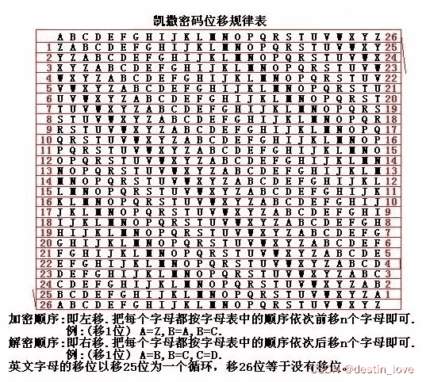

```
 码元位置顺序替换暗码。具有可逆性，可自我解密，用于快速浏览，或机器读取

ROT5 是 rotate by 5 places 的简写，意为旋转5个位置，其它皆同。

ROT5：只对数字进行编码，用当前数字往前数的第5个数字替换当前数字，例如当前为0，编码后变成5，当前为1，编码后变成6，以此类推顺序循环。

ROT13：只对字母进行编码，用当前字母往前数的第13个字母替换当前字母，例如当前为A，编码后变成N，当前为B，编码后变成O，以此类推顺序循环。

ROT18：将ROT5和ROT13组合在一起，命名为ROT18。

ROT47：对数字、字母、常用符号进行编码，ASCII值进行位置替换，用当前字符ASCII值往前数的第47位对应字符替换当前字符，例如当前为小写字母z，编码后变成大写字母K，当前为数字0，编码后变成符号_。

用于ROT47编码的字符其ASCII值范围是33－126，具体可参考ASCII编码
flag{destin love}
7=28L56DE:? =@G6N 
```

```
 以每个明文字母被与之唯一对应且不同的字母替换的方式实现的，不同于恺撒密码，因为密码字母表的字母不是简单的移位，而是完全是混乱的。 
随意进行字母的对照，只需要对应唯一且不同的字母即可

flag{destin love}
密钥：qwertyuiopasdfghjklzxcvbnm
ysqu{rtlzof sgct} 
```

```
 基于线性代数多重代换密码，每个字母转换成26进制数字：A=0, B=1, C=2...Z=25一串字母当成n维向量，跟一个n×n的矩阵相乘，再将得出的结果MOD26。
先得到明文矩阵，在进行获取密钥矩阵，将两个矩阵相乘，得到的矩阵并转换成26进制，得到密文，解密过程为先求密钥矩阵的逆矩阵并转换26进制，再与密文矩阵进行相乘并转换进制，得到明文
flag{destin love}
密钥：destinwww
FOBQGFIMFAWJXJLOKD

较长的二元矩阵（2×2的希尔密码）频率分析可能有帮助，但是对于较短的密文分析没有实际作用。

基础的希尔密码用已知明文攻击的方式是可攻破的，由于加密完全是线性的，所以截取到部分明文/密文字符对可以轻松建立一个线性系统，轻松搞定希尔密码，如果不能完全确定线性系统，那么只需要添加部分明文/密文对即可。已知明文攻击时最好的方式去破解写入密码，如果明文一无所知，那就进行推测猜出部分明文。 
```

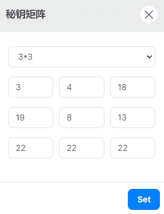

```
 九宫格密码、朱高密码、共济会密码或共济会员密码，以格子为基础的简单替代式密码 
```

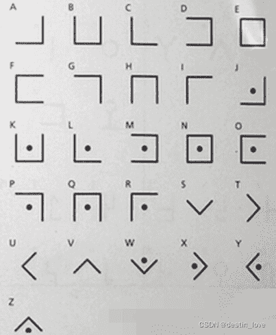

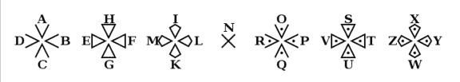

```
其他变种 
```

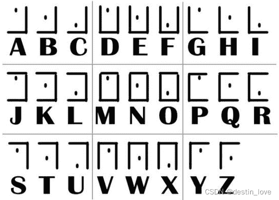
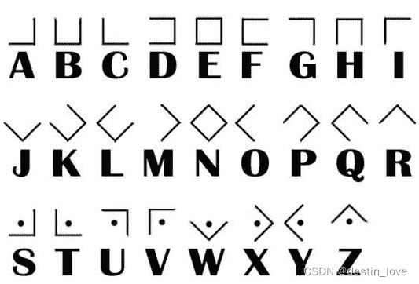
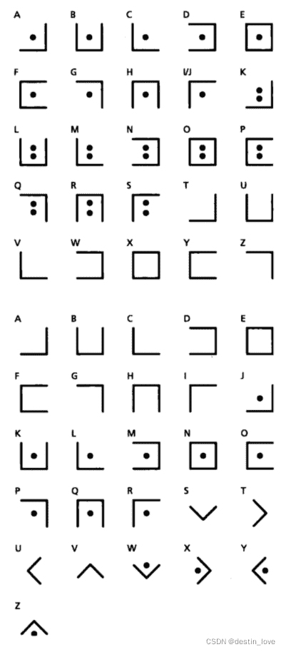

```
 棋盘密码的一种，利用波利比奥斯方阵进行加密的密码方式，字母排列好，用坐标(行列)的形式表现出来。字母是密文，明文是字母的坐标。
flag{destin love}
21311122{1415434433 31345115} 
```

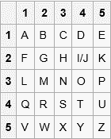

```
 《死亡之链》塑造夏多这一英雄人物中所自创的密码
上所示字母表密钥底部，列有四个附加符号1，2，3，4.可以放在密文中的任何地方。每个附加符号指示，如何转动写有密文的纸张，再进行加密或解密操作，直到出现另一个附加符号。每个附加符号中的那根线是指示针，指示纸张的上端朝上，朝右，朝下，朝左。如果出现符号3，纸张应该转动180度，上端朝下； 符号2表示纸张上端朝右，依次类推。 
```

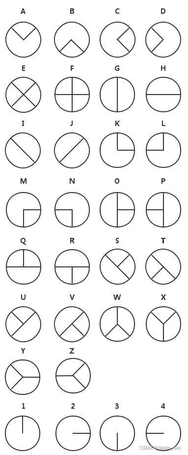

```
 第一种用于实际的双字替换密码，用双字加密取代了简单代换密码的单字加密，密文更难破译，因为简单替换密码的频率分析基本没有作用，虽然频率分析，通常仍然可以进行，但是有25×25=625种可能而不是25种可能，可以分为三个步骤，即编制密码表、整理明文、编写译文
升级版Double Playfair，二方密码 (Two-square Cipher),在之后又有四方密码(Four-square Cipher) 
```

```
(1)编制密码表
1.整理密钥字母destin，如果有重复字母需要去掉重复字母
2.用上一步得到的字母自上而下填补5乘5的纵列（也可横排），空白按照相同的顺序用字母表中剩余的字母依次填补完整，得到如下的方格

整理密钥字母时，如果出现"Z"，需要去除，因为"Z"使用频率最低，如果是德文，将"I"与"J"当作一个字母看待，法语去掉"W"或"K" 
```


```
(2)整理明文
原则“两个一组”，得到若干个两两成对的字母对，用到的是明文 flag destin love

1.将明文两两一组按顺序排开，得到： FL AG DE ST IN LO VE

2.对于末尾的单个字母要加上一个" X "使之成对

对于相连字母相同的，每个后面都需要加" X "，例如 RABBIT ，需要写成： RA BX BX IT 
```

```
(3)编写密文
对于每个字母对，严格遵循如下原则：

1.如果两个字母在同一行则要用它右邻的字母替换，如果已在最右边，则用该行最左边的替换，如明文为" CE "，依据上表，应替换为" EG "；

2.如果两个字母在同一列则要用它下边的字母替换，如果已在最下边，则用该行最上边的替换，如明文为" OQ "，依据上表，应替换为" PS "；

3.如果两个字母在不同的行或列，则应在密码表中找两个字母使四个字母组成一个矩形，明文占据两个顶点，需用另外两个顶点的字母替换，如明文为" HX "，可以替换为" WI/J "或" I/JW "（下面的例子将按照横向替换原则即同行优先）。

按照上述原则，将明文 FL AG DE ST IN LO VE 转换得到 LR NH ST TI FD HR VA （/表示或者，一般用I不用J，所以分析密文时看25个字母都有而只差一个字母没有用到可以考虑这种加密方式）将得到的字母改为大写并五个一组列好，得到密文 LRNHS TTIFD HRVA。 
```

```
 单一恺撒密码的基础上扩展出多表代换密码，根据密钥(当密钥长度小于明文长度时可以循环使用)决定用哪一行的密表进行替换，以此对抗字频统计 
```


```
明文： flag {destin love}

密钥(循环使用，密钥越长相对破解难度越大)： destin

加密过程：如果第一行为明文字母，第一列为密钥字母，那么明文字母'F'列和密钥字母'D'行的交点就是密文字母'I'，以此类推

密文： ipsz {lrvxag tbyi} 
```

```
未知密钥破解
第一步确定密钥长度，使用重合指数算法确定密钥长度，在确定密钥长度后尝试确定密钥，通常使用卡方检验找到每个字母的偏移量， 
```

```
（4）变种
格罗斯费尔德密码(Gronsfeld cipher)实际上和维吉尼亚密码相同，除了使用数字代替字母以外没有什么区别。数字可选择一种数列，如斐波那契数列，或一些其他的伪随机序列。格罗斯费尔德密码密码分析过程和维吉尼亚密码大同小异，不过，自动密钥密码不能使用卡西斯基算法 (kasiski)破译，自动密钥密码的密钥不重复循环使用，破译自动密钥密码的方法的是从密文不断尝试猜测其中明文或密钥的一部分 
```

```
 多表替换密码，与维吉尼亚密码相关，使用不同的方法生成密钥，比维吉尼亚密码更安全。自动密钥密码有两种，关键词自动密钥密码和原文自动密钥密码

明文： FLAG{DESTIN LOVE}

关键词： DESTIN FLAG{DESTIN LOVE}

自动生成密钥： DESTIN

接下来的加密过程和维吉尼亚密码类似，从密表可得：

密文： ipsz{lrundefinedytn royi} 
```

```
 类似于维吉尼亚密码的代换密码，知名的应用是Hagelin M-209密码机。属于对等加密，加密演算法与解密演算法相同

明文： FLAG{DESTIN LOVE}

密钥(循环使用，密钥越长相对破解难度越大)： DESTIN

加密过程：如果第一行为明文字母，第一列为密文字母，那么沿明文字母'F'列出现密钥字母'D'的行号就是密文字母'Y'，以此类推。

密文： YTSN{FJLLKG XZIA} 
```

```
 （1）介绍
和维吉尼亚密码有相同的加密机制，区别是密钥选取，维吉尼亚使用的密钥简短，而且重复循环使用，滚动密钥密码使用很长的密钥，比如引用一本书作为密钥。目的是不重复循环使用密钥，使密文更难破译，因为有关于密钥和明文的统计分析模式可供利用，如果滚动密钥密码使用统计上的随机密钥来源，那么理论上是不可破译，因为任何可能都可以成为密钥，并且所有的可能性都是相等的。

明文： FALG{DESTIN LOVE}

密钥：选取"A wise man does not fall in love, but a fool is trapped by his feelings"，去掉非字母部分作为密钥(实际选取的密钥很长，长度至少不小于明文长度)。

加密过程：加密过程和维吉尼亚密码加密过程相同

密文: FWTYHQSGLBPGIS 
```

```
 多表代换密码，具有加密解密过程的是相同的特点 
```

密码表
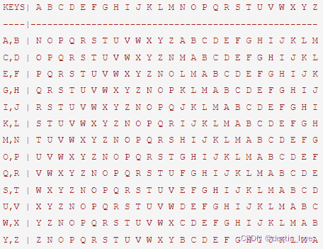

```
明文： FLAG{DESTIN LOVE}

密钥(循环使用，密钥越长相对破解难度越大)： DESTIN

加密过程：明文字母'F'列与密钥字母'D'行交点就是密文字母'T',以此类推。

密文： TNWPUXEEREPIHT 
```

```
 单字母被其他几种密文字母同时替换的密码，比标准替换密码破解更加困难，破解标准替换密码最简单的方法就是分析字母出现频率，通常在英语中字母'E'(或'T')出现的频率最高，如果允许字母'E'同时被3种不同字符代替，那就不能还是以普通字母的频率分析破解，如果允许代替字符越多，密文就难破译 
```

常见代换规则表
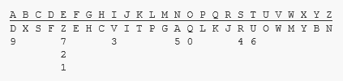

```
明文: FLAG{DESTIN LOVE}

密文(其中一种)： EPDH{FZRUVA PQWZ} 
```

```
 单表代换密码，字母表中的每个字母相应的值使用简单的数学函数映射到对应的数值，再把对应数值转换成字母。每个字母加密都会返回一个相同的字母，本质上是一种标准替代密码。具有所有替代密码的弱点。每一个字母都是通过函数（ax + b）mod m加密，其中B是位移量，为了保证仿射密码的可逆性，a和m需要满足gcd(a , m)=1，一般m为设置为26。 
```

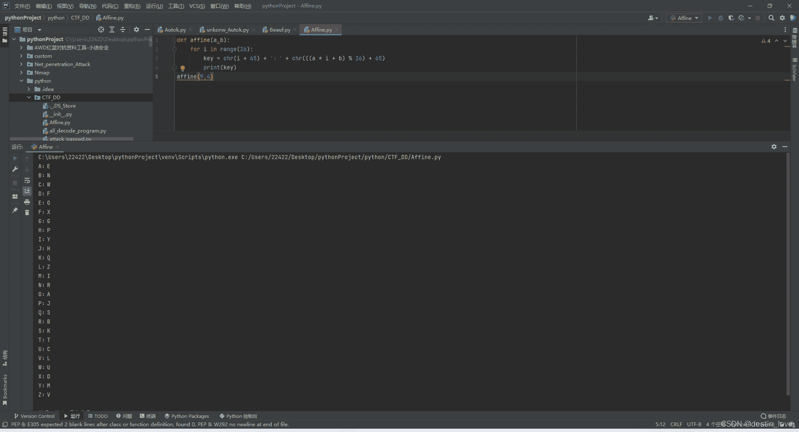

```
明文: FLAG{DESTIN LOVE}

密文： XZEG{FOKTMR ZALO} 
```

```
 替换密码，每个明文字母被一个由5字符组成的序列替换，最初的加密方式由'A'和'B'组成序列替换明文(也可以用别的字母)，比如字母'D'替换成"aaabb"，以下是全部的对应关系(另一种对于关系是每个字母都有唯一对应序列，I和J与U/V各自都有不同对应序列)： 
```

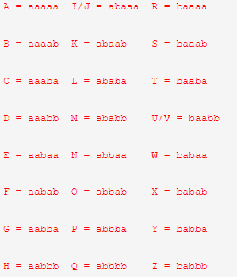

```
明文: FLAG{DESTIN LOVE}

密文： aabaa ababa aaaaa aabba{aaabb aabaa baaab baaba abaaa abbaa ababa abbab baabb aabaa} 
```

```
 （1）ADFGX密码
结合了改良过的Polybius方格替代密码与单行换位密码的矩阵加密密码，使用了5个合理的密文字母：A，D，F，G，X，这些字母之所以这样选择是因为当转译成摩尔斯电码(ADFGX密码是德国军队在一战发明使用的密码)不易混淆，目的是尽可能减少转译过程的操作错误。 
```

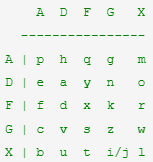

```
明文: FLAG{DESTIN LOVE}

密文： FA XX DD AG {FD DA GF XF XG DG XX DX GD DA} 
```

```
通过矩阵再次加密密文 
```

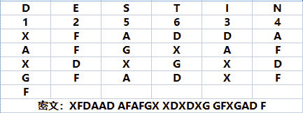

```
（2）ADFGVX密码
ADFGX密码的扩充升级版，一样具有ADFGX密码相同的特点，加密过程也类似，密文字母增加了V，可以使用10数字替换明文 
```

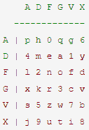

```
加密方式与ADFGX相同 
```

```
 结合了波利比奥斯方阵换位密码，采用分级实现扩散，“双”指用2个密钥进行加密。还有一个 两方密码 (Two-Square)与四方密码类似， 共轭矩阵双密码 (Conjugated Matrix Bifid Cipher)也是双密码的变种。 
```

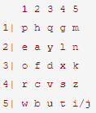

```
明文: FLAG{DESTIN LOVE}

密文： 行3221 324552 2342
	  列2424 324455 4131
	  合并32212424{324552324455 23424131} 
```

```
 结合换位和替换，三分密码与双密码相似，差别之处是用3x3x3 密阵 
```

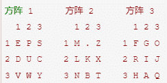
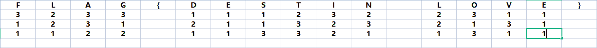

```
E(111)表示E在第一个方阵第一行第一列的位置 
```

```
分组(分组密钥以5为例) 
```


```
合并
32331 12312 11221 11232 11323 13321 2311 2131 1311 
```

```
经过密阵转换后密文
JFNMLPRWOIRNDFF 
```

```
 类似普莱菲尔密码双字母加密密码，这样使加密效果强于其他替换密码
使用4个预先设置的5×5字母矩阵，每个矩阵包括25个字母，通常字母'j'被融入到'i'中(维基百科上说'q'被忽略，因为'q'和'j'都是很少出现的字母)，通常左上和右下矩阵式是标准字母排序明文矩阵，右上和左下矩阵是打乱顺序的密钥矩阵。 
```

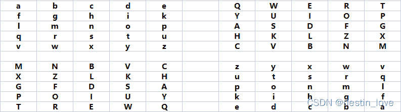

```
明文： FLAG{DESTIN LOVE}

整理明文(分组不够时用'X'填充)： FL AG DE ST IN LO VE

加密过程：分别在明文矩阵中找到'FL'，分别找到他们在右上矩阵有左下矩阵的交点字母'PG'就是密文，以此类推。

密文： PG RP QW KL LS SG CT 
```

```
 使用一个波利比奥斯方阵和两个密钥作为密阵的替换密码，通常在波利比奥斯方阵中J字母往往被包含在I字母中 
```

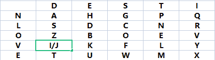

```
经过密阵替换:

明文:FLAG{DESTIN LOVE}
密文:VS VT ND NS LE NH NG NP NQ LT VT OS OI OT 
```

```
 替换密码，这种密码在结合其他加密方式，加密效果会更好 
```

选择1，4进行替换


```
明文:FLAG{DESTIN LOVE}
密文:13 3 44 6 {7 0 11 41 18 5 3 10 46 0}

还可以用其他的加密方式对跨棋盘密码加密出的结果再进行加密
通过一串其他的数字进行相加取得个位数重新排列，并在以上棋盘内再次进行加密处理
密钥：65 7 12 7 0 9 12 47 12 3 0 97 51 5
得到密文：78 0 56 3 7 9 23 88 20 8 3 07 97 5
得到最终密文：DYENGLLDRLMYYLEYMEDRDN 
```

```
 首先把明文转换为莫尔斯电码，每个字母之间用 x 分开，每个单词用 xx 分开。然后使用密钥生成替换密表，这个密表包含所有 . - x 组合的情况(因为不会出现 xxx 的情况，所以一共26种组合)。
密表下半部分是固定的，密表的安全性及加密效果取决于密钥 
```

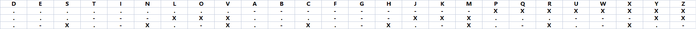

```
明文： FLAG{DESTIN LOVE}

(类似)摩尔斯电码
..-.X.-..X.-X--.XX{-..X.X...X-X..X-.XX.-..X---X...-X.
明文转换为(类似)摩尔斯电码后进行每3个字符分组，再进行密表的查表
..- .X. -.. X.- X-- .XX {-.. X.X ... X-X ..X -.X X.- ..X --- X.. .-X .}
密文(经过密表替换): ELAQW VARDX SCQSG PND 
```

```
 换位密码和替换密码的组合，使用两个波利比奥斯方阵，一个明文字母方阵，使用一个随机的数字(一般小于1000000)生成一个密钥矩阵同时作为第一轮明文划分分组，比如666这个数字翻译为英文便是SIX THOUSAND SIX HUNDRED SIXTY SIX,从第一个字母T开始选取不重复的字母，之后再从字母表中按序选取没有出现的字母组成密钥矩阵。 
```

```
明文矩阵 
```

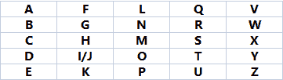

```
密钥矩阵 
```

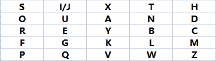

```
明文分组:
6   6   6   6   6
FLA GDE STI NLO VE
分组明文反序:
ALF EDG ITS OLN EV

使用密钥矩阵替换:
SXI UFP GLB KXA PH

'A'在明文矩阵对应到密钥矩阵的位置就是'S' 
```

```
 使用两个密钥分别生成类似波利比奥斯方阵的3x9方格的密表。，主要有3分组和4分组两类。

第一个方阵密钥: DESTIN

第二个方阵密钥: LOVE 
```

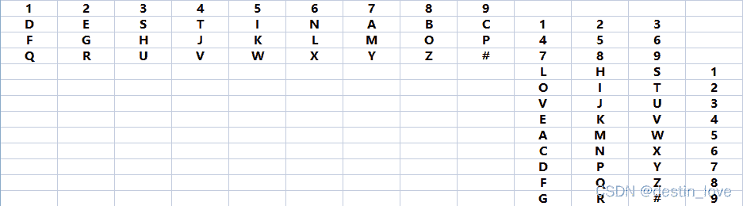

```
明文： FLAG{DESTIN LOVE}

密表转换(以4分组为例) 
```

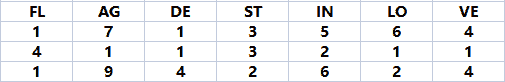

```
F在第一矩阵第1列，L在第二矩阵第1行，F所在的行与L所在的列相交的位置数字为4，所以FL表示为141 
```

```
转换密文
171 356 441 132 111 942 624
QL  HN  JL  DT  DL  PO  NK 
```

```
 替换密码的一种，使用88字母的单词横向填充8x8方阵，且第一列为一个单词，并且在方阵中26个字母都必须出现一次以上。 
```

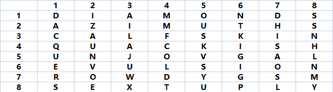

```
明文：FLAG{DESTIN LOVE}
密文：34 33 21 56 { 11 61 81 84 46 16 33 67 62 61 }

明文中的字母在密阵位置可能不止一个，所以加密结果可能有多种，但不影响解密。密阵还有6x6，7x7，9x9,10x10几种。密阵越大每个字母被替换的情况就越多，加密效果更好 
```

```
 有三份密码，当然这里说的是已被破解第二份，是一种类似书密码的替换密码。
以第二密码为例，每一个数字代表美国《独立宣言》的文本中的第几个词的首字母，如1代表第1个词的首字母“w”，2代表第2个词首字母“i”。 
```

```
键盘密码
一般用到的键盘密码就是手机键盘和电脑键盘两种 
```

## 其他有趣的机械密码

```
恩尼格玛密码
用于加密与解密文件的密码机。确切地说，恩尼格玛是对二战时期纳粹德国使用的一系列相似的转子机械加解密机器的统称，包括许多不同型号，为密码学对称加密算法的流加密。

代码混淆加密
1. asp混淆加密

2.[php language="混淆加密"][/php] 118

3.[css language="/js混淆加密"][/css] 119

4. VBScript.Encode混淆加密

5. ppencode-Perl把Perl代码转换成只有英文字母的字符串。

6.rrencode可以把ruby代码全部转换成符号。

7.jjencode将JS代码转换成只有符号的字符串，类似于rrencode，aaencode可以将JS代码转换成常用的网络表情，也就是颜文字js加密。

8.JSFuck 可以只用 6 个字符 [ ]( ) ! + 编写 JavaScript 程序。

9.jother运用于javascript语言中利用少量字符构造精简的匿名函数方法对于字符串进行的编码方式。其中8个少量字符包括： ! + ( ) [ ] { } 。只用这些字符就能完成对任意字符串的编码。

10.brainfuck一种极小化的计算机语言，按照"Turing complete（完整图灵机）"思想设计的语言，设计思路是：用最小的概念实现“简单”的语言，BrainF**k 语言只有八种符号，所有的操作都由这八种符号( > < + - . , [ ] )的组合来完成。 
```

```
其他一些CTF常见密码学

将中文和数字进行转化的密码，算法简单:当前汉字有多少笔画出头，就是转化成数字几

王夫 井工 夫口 由中人 井中 夫夫 由中大：67 84 70 123 82 77 125  

明文FLAG{DESTIN LOVE}无密匙加密后密文为U2FsdGVkX18rEpyZoZwb+l+peo1fkcjCE36TNqcOn2e7

明文FLAG{DESTIN LOVE}密匙为666加密后密文为U2FsdGVkX1/nQBo08IEdrKpKTgkrB1b84TWqItKCiIsb

夏洛克福尔摩斯在《归来记》中侦探案件使用的一种加密方式 
```

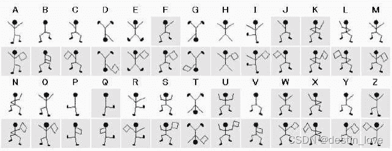

```
 公钥加密体制，其数学基础是利用椭圆曲线上的有理点构成Abel加法群上椭圆离散对数的计算困难性。公钥密码体制根据其所依据的难题一般分为三类:大整数分解问题类、离散对数问题类、椭圆曲线类。有时也把椭圆曲线类归为离散对数类。

实现机制使加密的各段数据之间有了联系。实现的机理如下

加密步骤如下：

（1）首先将数据按照8个字节一组进行分组得到D1D2…Dn（若数据不是8的整数倍，用指定的PADDING数据补位）

（2）第一组数据D1与初始化向量I异或后的结果进行DES加密得到第一组密文C1（初始化向量I为全零）

（3）第二组数据D2与第一组的加密结果C1异或以后的结果进行DES加密，得到第二组密文C2

（4）之后的数据以此类推，得到Cn

（5）按顺序连为C1C2C3…Cn即为加密结果。
解密是加密的逆过程，步骤如下：

1）首先将数据按照8个字节一组进行分组得到C1C2C3…Cn

2）将第一组数据进行解密后与初始化向量I进行异或得到第一组明文D1（注意：一定是先解密再异或）

3）将第二组数据C2进行解密后与第一组密文数据进行异或得到第二组数据D2

4）之后依此类推，得到Dn

5）按顺序连为D1D2D3…Dn即为解密结果。

这里注意一点，解密的结果并不一定是我们原来的加密数据，可能还含有你补得位，一定要把补位去掉才是你的原来的数据。

特点：

不容易主动攻击,安全性好于ECB,适合传输长度长的报文,是SSL、IPSec的标准。
each ciphertext block depends on all message blocks/每个密文块依赖于所有的信息块
thus a change in the message affects all ciphertext blocks/明文消息中一个改变会影响所有密文块
need Initial Vector (IV) known to sender & receiver/发送方和接收方都需要知道初始化向量
3.加密过程是串行的，无法被并行化(在解密时，从两个邻接的密文块中即可得到一个平文块。因此，解密过程可以被并行化)。
2.CFB（Cipher Feedback）/ 密文反馈模式
密文反馈模式类似于CBC，可以将块密码变为自同步的流密码；工作过程亦非常相似，CFB的解密过程几乎就是颠倒的CBC的加密过程：
需要使用一个与块的大小相同的移位寄存器，并用IV将寄存器初始化。然后，将寄存器内容使用块密码加密，然后将结果的最高x位与平文的x进行异或，以产生密文的x位。下一步将生成的x位密文移入寄存器中，并对下面的x位平文重复这一过程。解密过程与加密过程相似，以IV开始，对寄存器加密，将结果的高x与密文异或，产生x位平文，再将密文的下面x位移入寄存器。
与CBC相似，平文的改变会影响接下来所有的密文，因此加密过程不能并行化；而同样的，与CBC类似，解密过程是可以并行化的。

3.ECB(Electronic Code Book)/电码本模式
DES ECB（电子密本方式）其实非常简单，就是将数据按照8个字节一段进行DES加密或解密得到一段8个字节的密文或者明文，最后一段不足8个字节，按照需求补足8个字节进行计算，之后按照顺序将计算所得的数据连在一起即可，各段数据之间互不影响。

特点：

1.简单，有利于并行计算，误差不会被传送；
2.不能隐藏明文的模式；
repetitions in message may show in cipher text/在密文中出现明文消息的重复
3.可能对明文进行主动攻击；
加密消息块相互独立成为被攻击的弱点/weakness due to encrypted message blocks being independent

4.OFB (Output Feedback)/输出反馈模式
输出反馈模式可以将块密码变成同步的流密码。它产生密钥流的块，然后将其与平文块进行异或，得到密文。与其它流密码一样，密文中一个位的翻转会使平文中同样位置的位也产生翻转。这种特性使得许多错误校正码，例如奇偶校验位，即使在加密前计算而在加密后进行校验也可以得出正确结果。
每个使用OFB的输出块与其前面所有的输出块相关，因此不能并行化处理。然而，由于平文和密文只在最终的异或过程中使用，因此可以事先对IV进行加密，最后并行的将平文或密文进行并行的异或处理。
可以利用输入全0的CBC模式产生OFB模式的密钥流。这种方法十分实用，因为可以利用快速的CBC硬件实现来加速OFB模式的加密过程。 
```

## brainfuck

极小化计算机语言，用最小的概念实现一种简单的语言，只有八种符号

```
(、>、<、+、-、.、,、[、]、) 
```

## JOTHER

匿名函数原生形式

```
由[、]、(、)、{、}、+、!组成 
```

可在浏览器的console直接还原

## JSFUCK

```
使用6个字符[、]、(、)、!、+来编写JavaScript程序 
```

## 区分Html编码与Unicode编码

Unicode都以&#10结尾

## 码制转换工具

火狐浏览器插件：HackBar
在线转码： http://encode.chahuo.com/
时间戳转码：http://tool.chinaz.com/tools/unicode.aspx
Html码制表：http://www.jb51.net/onlineread/htmlchar.htm

## 键盘布局加密

4esxcft5 rdcvgt 6tfc78uhg 098ukmnb

## MD5

压缩性：任意长度的数据，算出MD5值长度是固定的
容易计算：从原数据算出MD5值很容易
抗修改性：对原数据修改1个字节，得到的MD5值都有很大区别
强抗碰撞：已知原数据和其MD5，要找到一个具有相同MD5值的数据非常困难

## 现代密码学——DES

明文：terminator
密文格式：E8wSK/dogmBbcyLAOZsnitpH/U6MP4BR
加/解密网址：http://e-file.arkoo.com/tools/des3.htm

## 现代密码学——RSA

1.获取公匙(n,e)

2.计算m^e=c mod(n)

3.密文c为m的e次幂除以n所得的余数

解密：

1.解密过程即是求m，

2.需要用私匙(n,d)，

3.解c^d=m mod(n),得出明文m

# 隐写

隐写是将Flag隐藏到图片、音频、视频等各类数据载体中

知识准备：binwalk、file、strings命令、常见文件头、stegsolve工具使用、LSB算法等。

图片类隐写共分为7类

音频类分为2类

## 文件拼接

通常是copy命令将文件拼接而成

copy /b 2.jpg+1.zip output.jpg

工具：binwalk、dd、winhex

## 常见图片文件结构

JPEG/JPG

——文件头标识(2 bytes)：FF D8

——文件结束标识(2 bytes)：FF D9

PNG

——文件头标识(8 bytes)：89 50 4E 47 0D 0A 1A 0A

GIF

——文件头标识(6 bytes)：47 49 46 38 39(37) 61

BMP

——文件头标识(2 bytes)：42 4D

## 图片拼接

flag隐藏在图片文件内容的末尾

利用16进制查看工具或图片格式查看工具

## 图片分层——Stegsolve

图片分层查看—针对PS分层中存在的隐藏信息

## 图片后缀名迷惑

将图片后缀名改为压缩包文件格式后解压取得flag

## 图片处理

Stegdetect

stegsolve

## 动态图帧

将信息隐藏在动态图中，一闪而过，肉眼难以看到
工具：Namo GIF、Photoshop CS

## 图片修复

图片被损坏，缺少某部分数据如文件头等，需要对图片进行修复
工具：winhex

伪加密：直接搜索属性头，进行修改。
一般情况下第四位第五位后面的第六位第七位数据是00 00 就是没有加密的，
有一个00 00第二个零为奇数基本上就是伪加密，两个属性头只能有一个，如果两个都是，那可能就是真加密。

## 音频分析

wav格式的音频文件

改变音频轨道和效果，分析音频频谱，观察音频波形，找波形规律
波形图隐藏莫斯电码 audacity
波形图隐藏二进制数 非归零码 曼彻斯特码 差分曼彻斯特
波形图转频谱图
MP3stego隐写

最后为01字串转换ascii码

# 文件操作与隐写

## 1.文件类型识别

对于没有后缀名的文件类型识别。

方法一：Linux下file命令。

格式：file 文件名。
方法二：windows下通过winhex查看文件头字段识别文件类型。

使用Notepad++，安装插件HEX-Editor进行查看。

文件头残缺情况： 使用十六进制编辑器010editor编辑器进行编辑。

## 2.文件分离操作

方法一： Linux下使用Binwalk工具进行文件的分析和分离。

分析文件：binwalk filename
分离文件：binwalk -e filename
方法二： binwalk无法正确分离出文件，使用formost工具。

foremost 文件名 -o 输出目录名
方法三： 当文件自动分离出错或因为其他原因无法自动分离时，用dd工具进行手动分离。

dd if=源文件 of=目标文件名 bs=1 skip=开始分离的字节数
参数：if=file输入文件名，省略为标准输入。
参数：of=file输出文件名，省略为标准输出。
参数：bs=bytes同时设置读写块的大小为bytes。
参数：skip=blocks从输入文件开头跳过blocks个块后再开始复制。
参数：count一共取的块。
方法四： 使用010Editor直接选择对应的十六进制，然后右键单独保存，实现分离。

## 3.文件合并操作

Linux下：cat 要合并的文件 输出的文件

完整性检测： md5sum 文件名
Windows下： copy /B 合并的文件 输出的文件

完整性检测：certutil -hashfile 文件名 md5

## 4.文件内容隐写

概述：文件内容隐写，是直接将KEY以十六进制的形式写在文件中，通常在文件的开头或结尾部分，分析时通常重点观察文件开头和结尾部分。如果在文件内容中间部分，通常搜索关键字KEY或者flag来查找隐藏内容。
文档格式微调：行移、字移、修改字符颜色等
空格回车标点法：添加空格和回车，添加标点符号
字符特征法：字体替换、汉字结构
自然语言法：同义词替换、句法变换

# 图片文件隐写

## 1.Firework

使用010Editor打开文件后，如果看到文件头部包含firework的标识，可以通过firework来找到隐藏的图片。

## 2.Exif

Exif按照JPEG的规格在JPEG中插入一些图像、数字相机的信息数据以及缩略图像，可以通过与JPEG兼容的图片浏览器，图片处理软件等查看Exif格式的图像文件。
右键属性，查看exif或者详细信息，在相关的选项卡中查找flag。

## 3.Stegsolve

当两张jpg图片的样式，大小，像素基本相同时，可以考虑进行结合分析，将两个文件的像素进行ADD,SUB,XOR等操作，看是否可以得到有用的信息。Stegsolve工具可以方便的进行这些操作。

## 4.LSB（最低有效位）

LSB替换隐写的基本思想：用嵌入的秘密信息取代载体图像的最低比特位，原来的7个高低平面与替代 秘密信息的最低位平面组合成含隐藏信息对=的新图形。

通过修改像素中最低位的一位来达到隐藏的效果。

也可以使用Stegsolve来进行。

Linux下的工具：zteg工具

下载：gem install zsteg

检测LSB隐写：zsteg xxx.png

Windows下的工具：wbstego4工具。能够解密通过LSB加密的图片。

其它方式：Python脚本。

## 5.TweakPNG

TweeakPNG是一款PNG图像浏览工具，它允许查看和修改一些PNG图像文件的原信息存储。
如果文件头是正常的，但却无法打开，可以使用TweakPNG修改CRC。出现校验信息错误时，可以根据错误的CRC去十六进制中搜索，然后改成正确的CRC。（CRC上一行之后的 8个字节，前四个为宽度，后四个为高度（十六进制下的第二行前八位））
有时不是CRC的错误，而是图片的宽高错误，需要通过CRC计算出正确的高度或宽度。可以通过脚本进行计算。

## 6.Bftools

Bftools常用于解密图片信息。

Windows下：

Bftools.exe decode braincopter 要解密的图片名称 -output 输出文件名
Bftools.exe run 上一步输出的文件。

## 7.SilentEye

Windows下可视化解密工具。

## 8.JPG图像加密

Stegdetect 工具用于探测JPEG文件的加密方式。（Linux下）

可以检测到JSteg，F5，Camouflage，OutGuess，JPHide，appendX，Invisible Secrets等加密方式所隐藏的信息。
stegdetect xxx.jpg

stegdetect -s 敏感度 xxx.jpg

## 9.Jphide

基于LSB的JPEG格式图像隐写算法。
如果使用Stegdetect检测到使用jphide，可以使用Jphs进行解密。

## 10.Outguess

outguess用于解密文件信息。

如果确认使用OUtguess加密的图片，可以使用outguess进行解密。

outguess -r 要解密的文件名 输出结果文件名

## 11.F5

识别是F5加密后，进入F5-stegangraphy_F5目录，将图片文件拷贝下来，cmd进入该目录。
Java Exrtact 待解密文件名 -p 密码
运行成功后，在output.txt可以看到解密结果。

## 12.二维码处理

使用工具CQR打开图片，查看内容字段。
如果二维码的定位角覆盖，该工具有一定几率识别，如果不能识别，需要使用其他工具将另外几个角的定位符移动搭配相应的位置，补全二维码。
如果二维码定位点中间是白色，可能是被反色了，可以使用其它工具进行反色再回来扫描。
PS拉伸、缩小，调阈值

## 13.图片隐写

gif base转图片 图种差异性 路由器逆向分析 png图片文件宽度(TweakPNG)
清晰度(SmartDeblur)
盲水印：github.com/chishaxie/Bind
隐写检测：Stegdelect
对图片隐写：善用010editor分析文件结构
a.删除文件头b.乱该文件头c.错配文件头

## 14.其他

音频分析：adobe Audition 观察波形、查看频谱、MP3stego等其他隐写软件
PPC：pwntools、一般比较简单，二分动态规划等
压缩包：爆破、010editor Template，伪加密
内存/硬盘取证：Volatility，Binwalk，Dsfok-tools，FTK