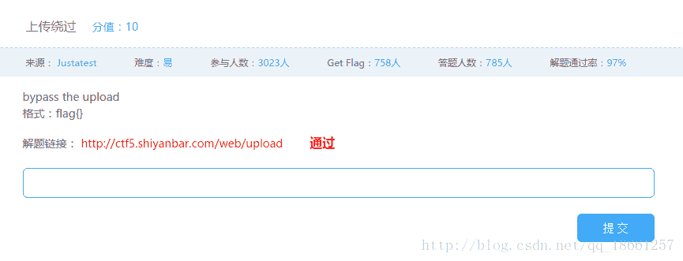
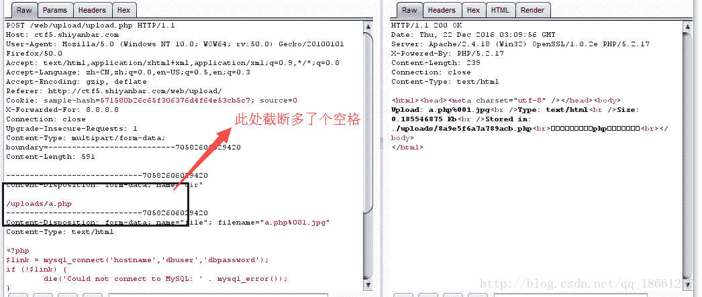
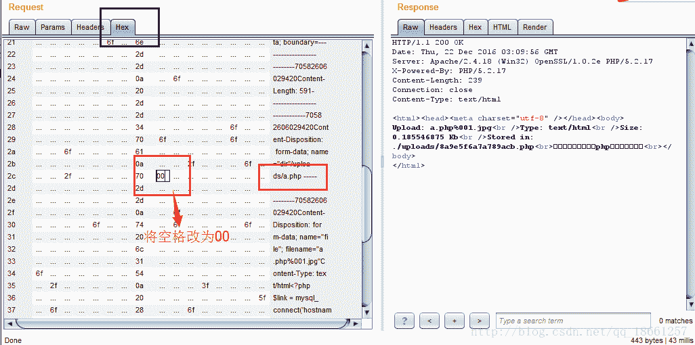
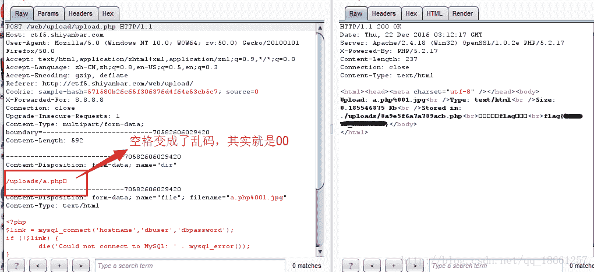
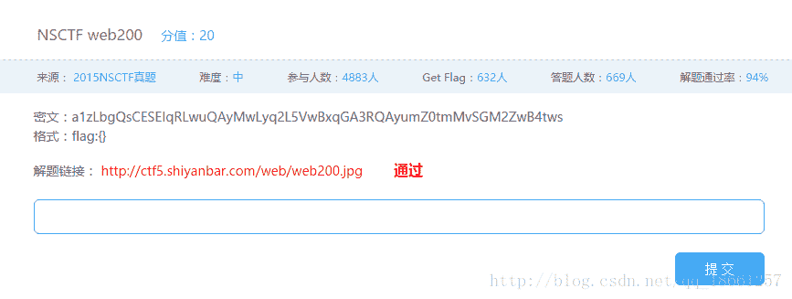
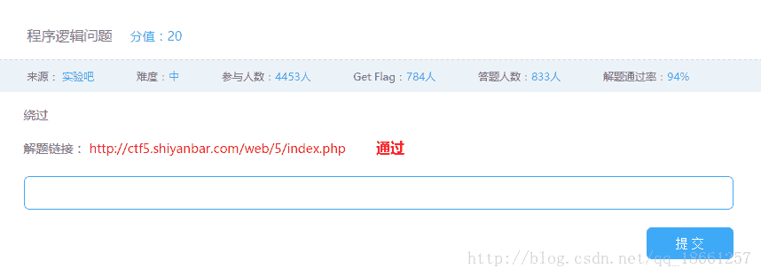
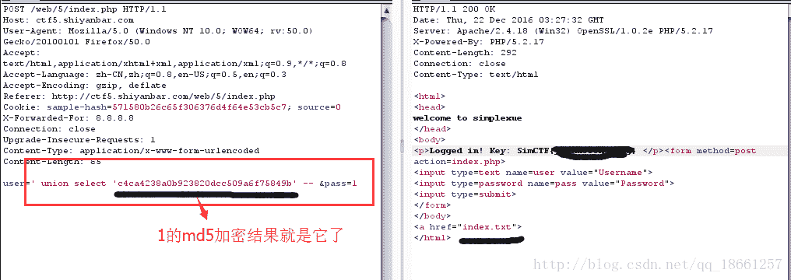
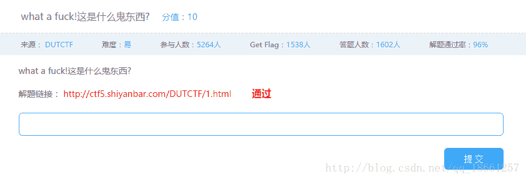
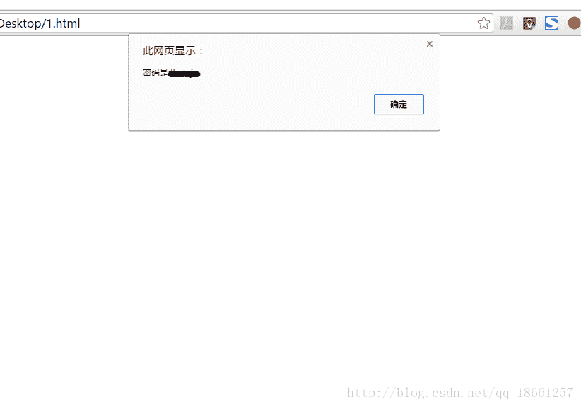

<!--yml
category: 未分类
date: 2022-04-26 14:43:33
-->

# CTF实验吧-WEB专题-5_77458的博客-CSDN博客

> 来源：[https://blog.csdn.net/qq_18661257/article/details/53812433/](https://blog.csdn.net/qq_18661257/article/details/53812433/)

## **1.上传绕过**



> 题解

题目说是绕过，那就绕过吧，发现，上传除了php文件外会报需要传php文件，而传php文件则会报必须上传.jpg这些图片文件，那就从上传漏洞开始吧，一般常见的上传漏洞就是截断了，是0x00数据会截断后续数据，当数据为abc.php0x001.jpg时，服务器会处理为abc.php，而0x00后的数据会忽略（产生原因magic_quotes_gpc未打开，同时相关数据没有进行处理）。那么截断试试，如下图，轻松拿到flag

**现在地址部分修改**


**修改十六进制**




* * *

## **2.NSCTF web200**



> 题解

这道题目嘛，程序倒过来写就可以了，汗颜！，代码如下

```
<?php
   $_ = "a1zLbgQsCESEIqRLwuQAyMwLyq2L5VwBxqGA3RQAyumZ0tmMvSGM2ZwB4tws";
   $_ = str_rot13($_);
   $_ = strrev($_);
   $_ = base64_decode($_);
   $_o = "";
   for($_0 = strlen($_) - 1;$_0 >= 0; $_0 --){
       $tmp = $_[$_0];
       $tmp = ord($tmp);
       $tmp --;
       $tmp = chr($tmp);
       $_o.=$tmp;
   }
   echo $_o;
?>
```

* * *

## **3.程序逻辑问题**



> 题解

查看源码发现一个问题，有个index.txt文件，进入这个文件，你懂得，源代码，还有什么好说的，源代码加密了pass数据，通过md5的方式，但是这货sql语句根本没有处理，然后直接加个如下图的语句就可以了，so easy啊！



* * *

## **4.what a fuck!这是什么鬼东西?**



> 题解

果然是what a fuck，将这源文件下载下来，然后将这个大大的数据左右加上`<script></script>`，再从重新打开文件，结果出来，真是fuck,如下图

