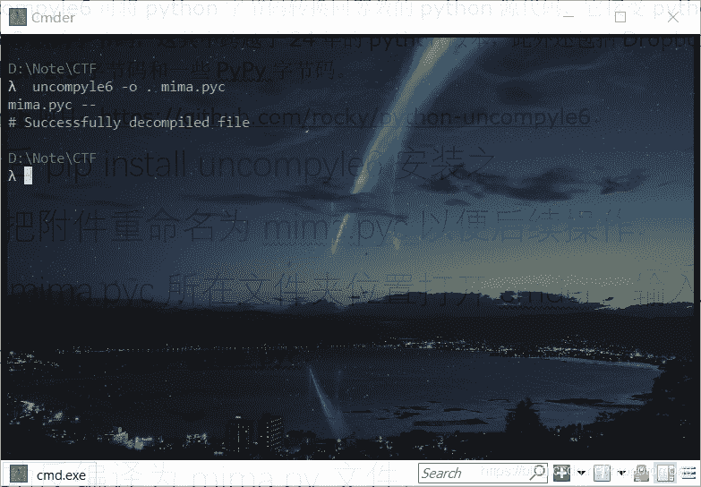
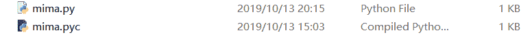
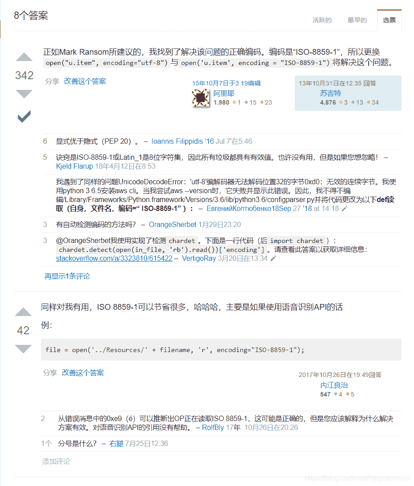
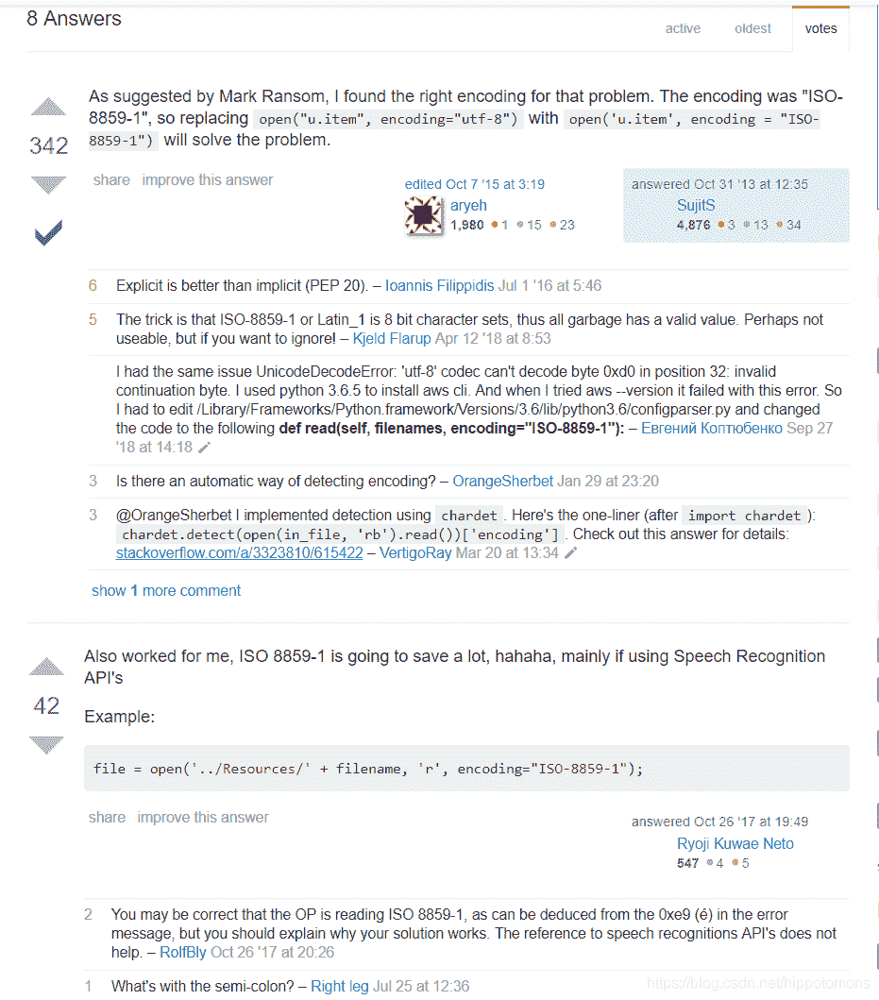
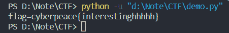
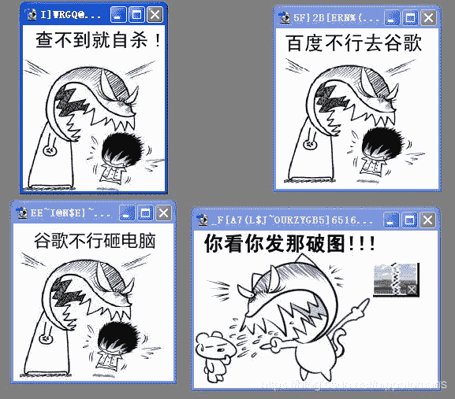

<!--yml
category: 未分类
date: 2022-04-26 14:21:30
-->

# CTF密码学(crypto)题目easychallenge解题过程总结_hippotomons的博客-CSDN博客_easychallenge

> 来源：[https://blog.csdn.net/hippotomons/article/details/102538110](https://blog.csdn.net/hippotomons/article/details/102538110)

## Easychallenge

**难度系数**： ☆
**题目来源**：NJUPT_CTF
**题目描述**：你们走到了一个冷冷清清的谜题前面，小鱼看着题目给的信息束手无策，丈二和尚摸不着头脑 ，你嘿嘿一笑，拿出来了你随身带着的笔记本电脑，噼里啪啦的敲起来了键盘，清晰的函数逻辑和流程出现在了电脑屏幕上，你敲敲键盘，更改了几处地方，运行以后答案变出现在了电脑屏幕上。
————————————————————————
附件下载下来发现是一个.pyc文件

百度得到信息：

> pyc是一种二进制文件，是由py文件经过编译后，生成的文件，是一种byte code，py文件变成pyc文件后，运行加载的速度会有所提高；另一反面，把py文件编译为pyc文件，从而可以实现部分的源码隐藏，保证了python做商业化软件时的安全性

花了一段时间想要用些软件打开它，未果
然后在百度找软件的过程中，发现可以将pyc文件反编译回py文件
于是继续百度，了解到可以用uncompyle6这个第三方python反编译器来进行反编译

> uncompyle6是一个原生python的跨版本反编译器和fragment反编译器，是decompyle、uncompyle、uncompyle2等的接替者。
> uncompyle6可将python字节码转换回等效的python源代码，它接受python 1.3版到3.8版的字节码，这其中跨越了24年的python版本，此外还包括Dropbox的Python 2.5字节码和一些PyPy字节码。
> github项目：https://github.com/rocky/python-uncompyle6

然后pip install uncompyle6安装之
先把附件重命名为mima.pyc以便后续操作

在mima.pyc所在文件夹位置打开cmder，输入命令：

```
uncompyle6 -o . mima.pyc 
```

成功反编译为mima.py文件



用vscode打开mima.py，完整的python源代码便玉体横陈在我们面前了

```
 import base64

def encode1(ans):
    s = ''
    for i in ans:
        x = ord(i) ^ 36
        x = x + 25
        s += chr(x)

    return s

def encode2(ans):
    s = ''
    for i in ans:
        x = ord(i) + 36
        x = x ^ 36
        s += chr(x)

    return s

def encode3(ans):
    return base64.b32encode(ans)

flag = ' '
print 'Please Input your flag:'
flag = raw_input()
final = 'UC7KOWVXWVNKNIC2XCXKHKK2W5NLBKNOUOSK3LNNVWW3E==='
if encode3(encode2(encode1(flag))) == final:
    print 'correct'
else:
    print 'wrong' 
```

这里二话没说，先运行了一下，之后编译器提示错误
一共有两个，第一个是print’correct’报错，第二个是flag = raw_input()报错
继续百度，发现这两处错误都是由于python2和python3版本不兼容造成的
将print’correct’改为print(‘correct’)，将flag = raw_input()改为flag = eval(input())就行了

然后运行发现是需要输入一个flag值，经过运算之后，输出correct或者wrong

再回过头去仔细看代码
发现代码结构很简单，就是要求用户输入一个flag值，然后依次通过三个函数进行加密，其中encode1和encode2是做异或和加和运算，encode3是调用base64库里的b32encode()函数进行base32运算。然后将结果与代码给定的final值进行比较(这里根据final结尾的三个”=”以及均为数字和大写字母的结构也能看出是进行了base32加密)，如果相等输出correct，如果不相等，输出wrong

所以，出题者的意思就很明显了，也就是让我们根据这个加密运算过程，写出逆过程，将final值作为输入进函数的值，然后以与之前相反的顺序调用函数，最后输出的值就是flag

接下来，就修改了原始代码，首先是进入函数的顺序改成先进函数3再进2最后进1。然后就是每个函数内部运算，+变-，-变+，异或运算的逆过程就是再做一次异或，所以不用变，base64.b32encode()改成base64.32decode()。然后把return之前的语句颠倒一下顺序，最后的拍到第一个，以此类推。需要注意的是，还要按照代码逻辑，把i和x给相互换一下，不然会报错

最后代码如下：

```
import base64

def encode1(ans):
    s = ''
    for i in ans:
        x = ord(i) - 25
        x = x ^ 36
        s += chr(x)

    return s

def encode2(ans):
    s = ''
    for i in ans:
        x = ord(i) ^ 36
        x = x - 36
        s += chr(x)

    return s

def encode3(ans):
    return base64.b32decode(ans)

final = 'UC7KOWVXWVNKNIC2XCXKHKK2W5NLBKNOUOSK3LNNVWW3E==='
flag = ' '
flag = encode1(encode2(encode3(final)))
print("flag={}".format(flag)) 
```

兴奋的去运行程序，结果编译器又报错

> PS D:\Note\CTF> python -u “d:\Note\CTF\demo.py”
> Traceback (most recent call last):
> File “d:\Note\CTF\demo.py”, line 29, in
> flag = encode1(encode2(encode3(final)))
> File “d:\Note\CTF\demo.py”, line 16, in encode2
> x = ord(i) ^ 36
> TypeError: ord() expected string of length 1, but int found

错误提示是ord()函数想要一个长度为1的str类型，但是现在是int类型
之后经过一番周折，发现是base64.32decode()的问题，它的返回类型是types，而这里ord()是想要一个str型的数据
继续百度知道可以用decode()函数进行类型转换，于是将encode3(final)改为encode3(final).decode()

运行程序，还是报错，错误提示是

> PS D:\Note\CTF> python -u “d:\Note\CTF\demo.py”
> Traceback (most recent call last):
> File “d:\Note\CTF\demo.py”, line 29, in
> flag = encode1(encode2(encode3(final).decode()))
> UnicodeDecodeError: ‘utf-8’ codec can’t decode byte 0xa0 in position 0: invalid start byte

也就是变成了UTF-8编码不能解码的问题

继续百度，发现decode()函数默认使用UTF-8编码，于是，改成encode3(final).decode(‘unicode’)和encode3(final).decode(‘gbk’)，发现还是一样的错误

最后，在stackoverflow上找到了解决方案，就是用’ISO-8859-1’编码，具体原因还不清楚，以后再研究，问题链接：[UnicodeDecodeError: ‘utf-8’ codec can’t decode byte](https://stackoverflow.com/questions/19699367/unicodedecodeerror-utf-8-codec-cant-decode-byte) 


于是改成encode3(final).decode(‘ISO-8859-1’)之后，程序顺利运行，得到flag


收获：