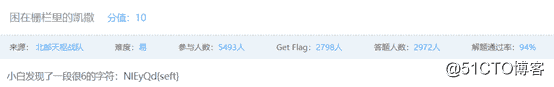
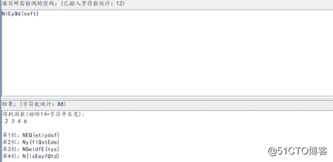
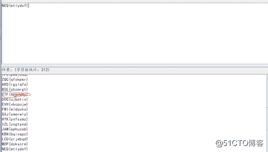
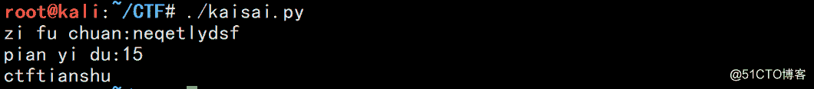

<!--yml
category: 未分类
date: 2022-04-26 14:54:35
-->

# CTF密码学密文脚本解密及WP（凯撒解密）_weixin_33849942的博客-CSDN博客

> 来源：[https://blog.csdn.net/weixin_33849942/article/details/92457376](https://blog.csdn.net/weixin_33849942/article/details/92457376)

题目来源实验吧



分析题意，说是困在栅栏中，所以将字符栅栏解密看看有什么，利用工具CTFcraktools



得到三条密文

然后说是密码是凯撒，在将四栏依次凯撒解码，寻找可能的key，这里很显然，在尝试第一个的时候，解出的明文里有一个“CTF{}”字样的一栏



解题成功。

这时我在想，这些结果那么多，答案不容易找到。于是我写了一个给出密文和偏移度就能写得出唯一的结果。说了那么多上代码

```
#!/usr/bin/python
#encoding=utf-8

import string
import sys

z=[]
for i in string.lowercase:　　　　　　 #string.lowercase表示a~z所有字母
z.append(i)

zifu=raw_input("zi fu chuan:")
n=raw_input("pian yi du:")
str1=''

for i in zifu:
if ord(i)+int(n)>122:　　　　　　　　 #ord()函数给出字母的ASCII码
a=96+ord(i)+int(n)-122
else:
a=ord(i)+int(n)
str1+=chr(a) 　　　　　　　　　　　 #给出ASCII码的对应字母
print str1
```

执行结果：



脚本马马虎虎吧，害怕你们不理解，还用上了拼音（咳咳，承认英语水平欠优）

担待担待。。。。

转载于:https://blog.51cto.com/12332766/2116685