<!--yml
category: 未分类
date: 2022-04-26 14:18:48
-->

# CTF平台题库writeup（三）--BugKuCTF-杂项（1-20题详解）_Hacking黑白红的博客-CSDN博客_ctf题库及详解

> 来源：[https://blog.csdn.net/zsw15841822890/article/details/107013549](https://blog.csdn.net/zsw15841822890/article/details/107013549)

## 一、BugKuCTF-杂项(1-20)

### 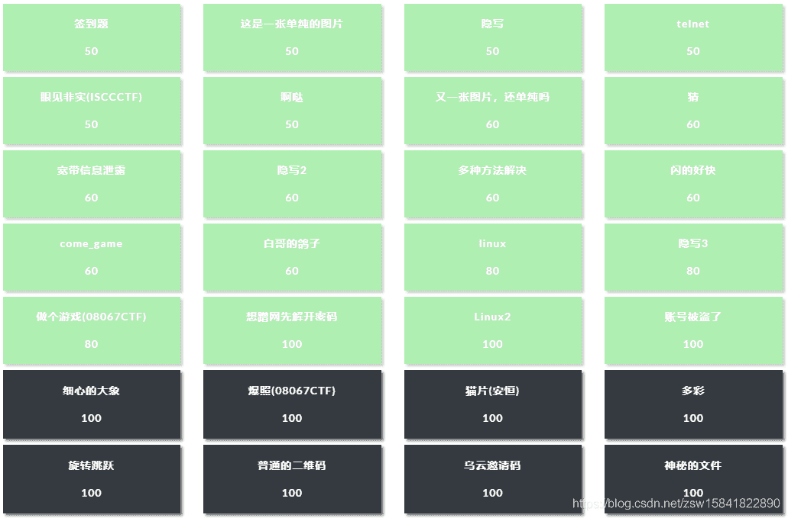

### **1****、签到题**

扫描二维码直接获取flag

### 2、这是一张单纯的图片

<u>[http://120.24.86.145:8002/misc/1.jpg](http://120.24.86.145:8002/misc/1.jpg)</u>

（1）.启蒙级隐写术

         linux下保存到本地当作文本文件cat一下（或记事本、winhex等打开）

　　cat 1.jpg

（2）.在末尾发现&#107;&#101;&#121;&#123;&#121;&#111;&#117;&#32;&#97;&#114;&#101;&#32;&#114;&#105;&#103;&#104;&#116;&#125;

　unicode解码得到flag

利用网页上搜索的unicode转ascii进行转换即得FLAG！（工具可以用小葵花）

key{you are right}

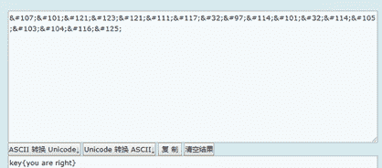

### 3、隐写(文件头)

Linux下提示

下载2.rar，解压得到一张图片，首先放在winhex里看看

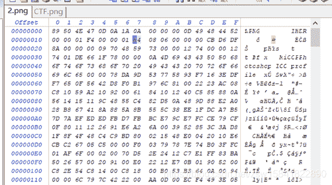

89 50 4E 47PE头是png照片的，就是说没有可能照片中嵌入了Exif信息

在查看PNG文件格式时，IHDR后面的八个字节就是宽高的值

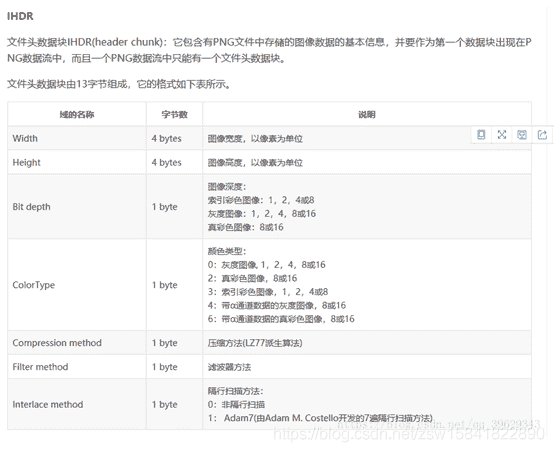

将图片放在Linux下，发现是打不开的，说明图片被截了

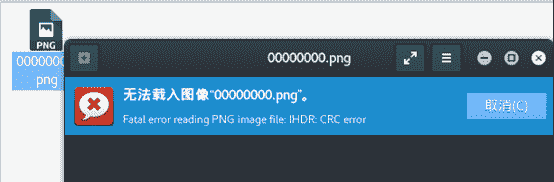

将图片的高改成和宽一样,即将A4改成F4，然后另存为

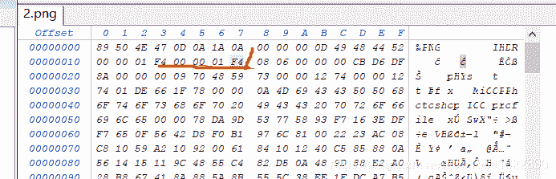

打开刚存的图片就可以得到FLAG了

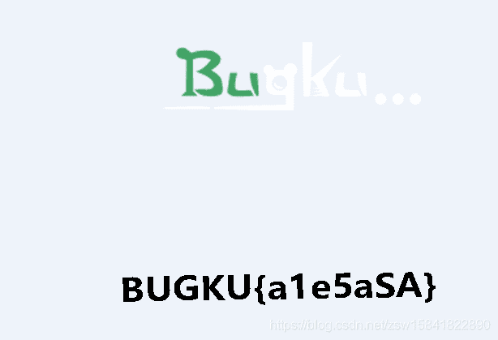

BUGKU{a1e5aSA}

### 4.telnet

将1.zip下载解压得到一个流量包文件，放到Wireshark中走一遍，因为提示的是telnet,所以使用规则显示telnet的包，然后追踪tcp流

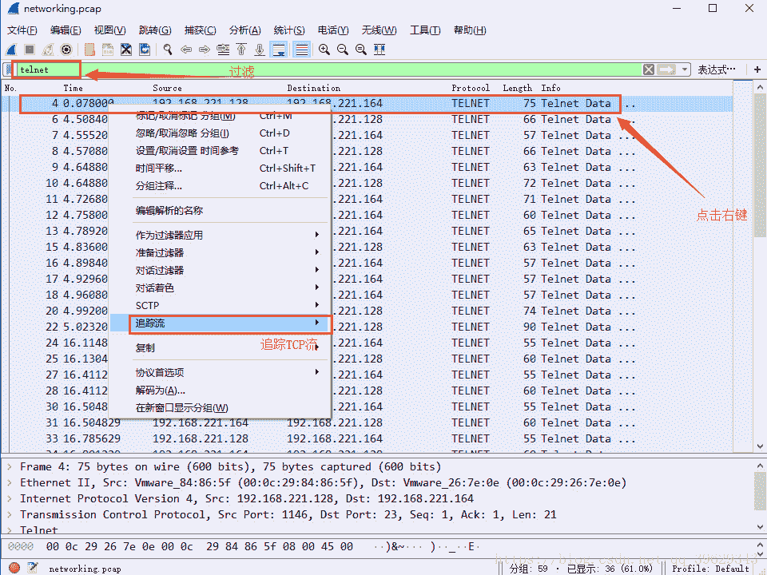

在tcp流中就能直接看到flag,在telnet协议下任意数据流都能看到flag

### 5、眼见非实(ISCCCTF)

下载下来是一个文件的格式，放到winhex中，发现有`50 4B 03 04`这是压缩文件的头，还有`.docx`格式文件，应该压缩包里有一个文档，改文件后缀为`.zip`,解压得到文档

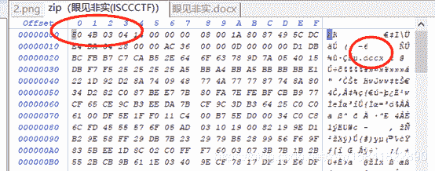

得到`眼见非实``.docx`是打不开的，放到winhex中发现还是zip格式的文件

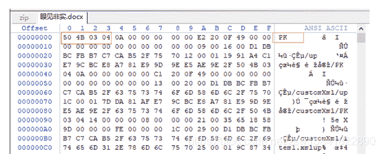

继续改后缀为.zip，然后解压得到一个文件夹

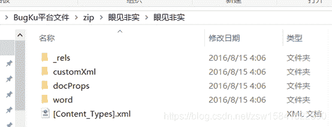

检索flag, 然后在`word->document.xml`中找到了flag

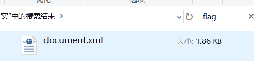

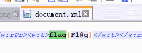

【注】：

方法二

Kaili 下执行binwalk, 和foremost命令 可以不用修改文件扩展名

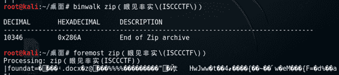

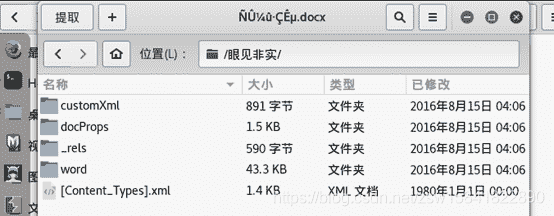

### 6、**啊哒**

拿到压缩包，解压后是一个图片，放到winhex中寻找flag，发现有flag.txt字样，但是不知道怎么处理。

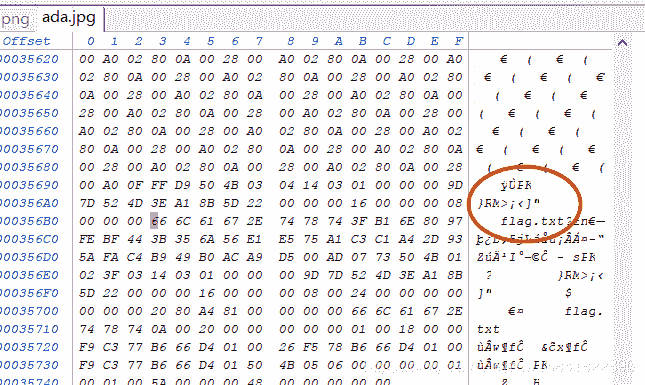

linux下执行：   binwalk ada.jpg

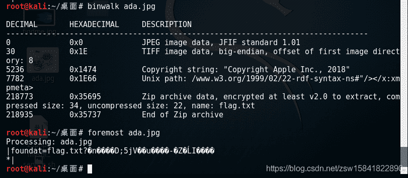

内含一个zip压缩包，分离文件：

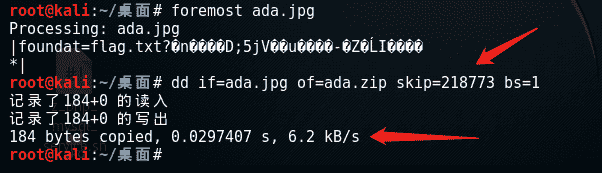

压缩包需要密码：

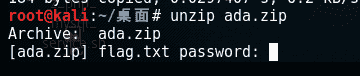

回去看看源图片文件ada.jpg的详细信息

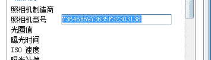

16进制，转化成字符串（Notepad++中的插件，直接16进制转ASCII）：

73646E6973635F32303138

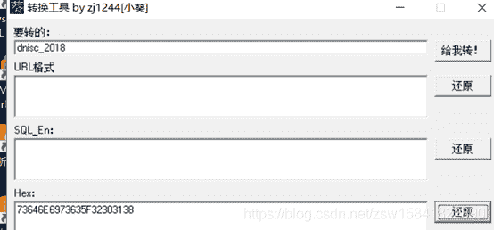

有疑问，为什么在小葵花里解密密码是 dnisc_2018，网上wp上是sdnisc_2018

得到解压密码：    sdnisc_2018

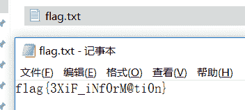

分离文件

（1）使用dd命令分离(linux/unix下)

我们可以使用dd命令分离出隐藏文件：

# dd if=carter.jpg of=carter-1.jpg skip=140147 bs=1

if是指定输入文件，of是指定输出文件，skip是指定从输入文件开头跳过140147个块后再开始复制，bs设置每次读写块的大小为1字节 。

dd命令：http://www.cnblogs.com/qq78292959/archive/2012/02/23/2364760.html

（2）使用foremost工具分离

foremost是一个基于文件文件头和尾部信息以及文件的内建数据结构恢复文件的命令行工具，直接将文件拆解

### 7\. 又一张图片，还单纯吗

图片隐写，套路化，notepad++、winhex、右键属性、binwalk、foremost打一遍

Binwalk和foremost问题解决

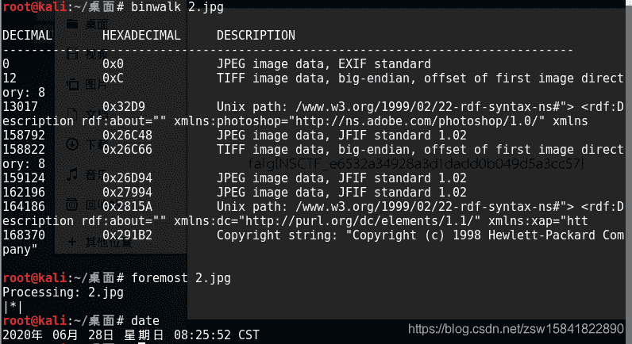

Foremost后out文件夹下看到

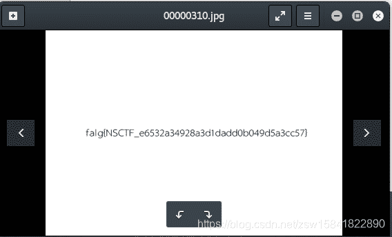

falg{NSCTF_e6532a34928a3d1dadd0b049d5a3cc57}

### 8、**猜**

flag格式key{某人名字全拼}

百度识图：

Key{liuyifei}

### 9、宽带信息泄露

flag格式：flag{宽带用户名}

使用RouterPassView工具查看,

大多数现代路由器都可以让您备份一个文件路由器的配置文件，然后在需要的时候从文件中恢复配置。路由器的备份文件通常包含了像您的ISP的用户名重要数据/密码，路由器的登录密码，无线网络的KEY。

如果你忘记了这些密码，但你仍然有你的路由器配置的备份文件，那么RouterPassView可以帮助你从路由器配置文件中恢复您的密码。该软件可以读取这个路由配置文件。

运行软件，打开"文件"菜单->"打开路由器配置文件"，打开保存的路由器配置文件。
或者Grab Password From IE Window。

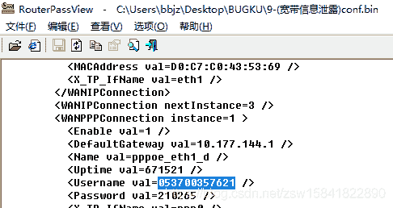

Flag{ 053700357621}

注：秘钥破解工具

Aircrack-ng  kaili下自带

命令：Aircrack-ng miyao.ivs （2017年9月部科信局在线测试题）

### 10、**隐写****2**

Welcome_.jpg

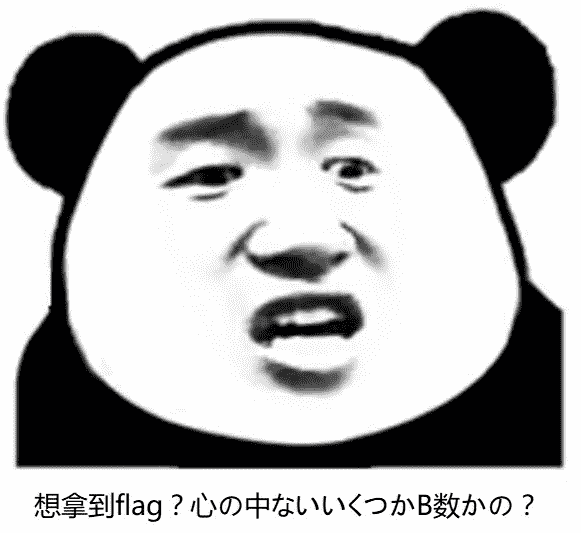

图片隐写，套路化，notepad++、winhex、右键属性、binwalk、foremost打一遍

Notepad++

搜索flag发现文件 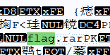  

Winhex打开

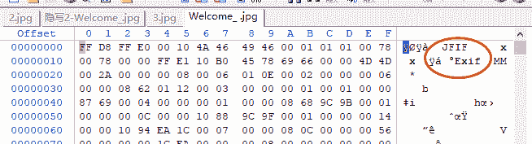

可以看到图片嵌入了Exif信息，但是看属性没看到什么有用的提示，老方法放到kali里找

使用binwalk提取

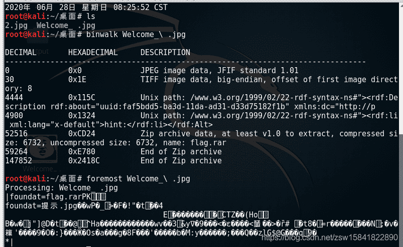

foremost后output文件夹

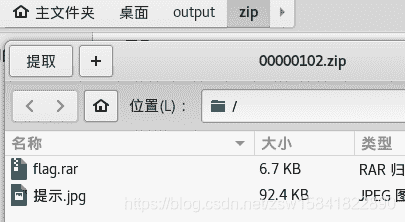

提示.jpg  (提示密码为3个数字)

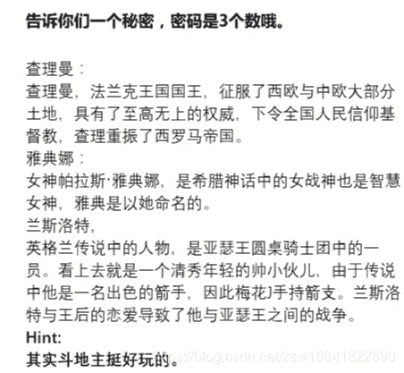

爆破flag.zip,工具 Advanced Archive Password Recovery

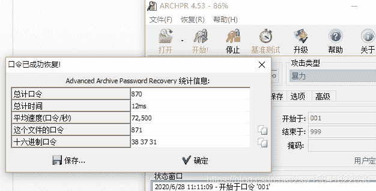

压缩包密码：871

解压后图片

Winhex打开

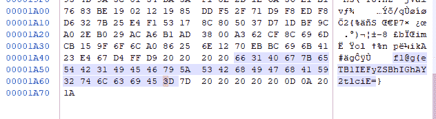

密文eTB1IEFyZSBhIGhAY2tlciE=

带“=”

base64解密，工具小葵花

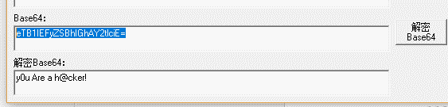

fl@g{ y0u Are a h@cker!}

### 11、多种方法解决

提示：在做题过程中你会得到一个二维码图片

使用winhex打开，发现是一个base64转图片，所以先将后缀改为.txt,然后[将base64编码为图片](http://imgbase64.duoshitong.com/)（base64转换为图片工具）

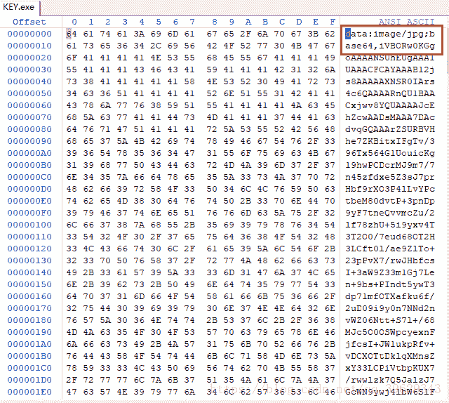

改扩展名为txt

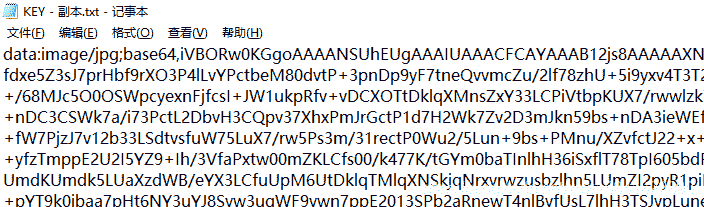

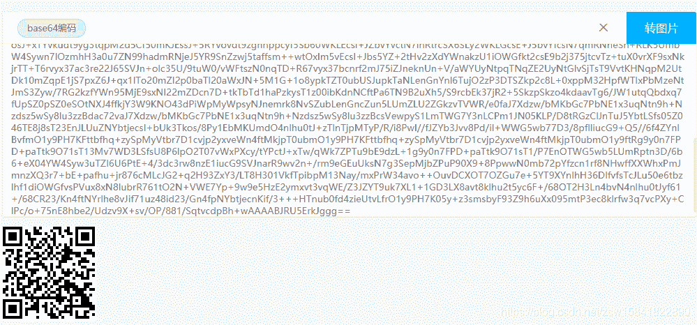

KEY{dca57f966e4e4e31fd5b15417da63269}

### 12、闪的好快

这是二维码吗？嗯。。。是二维码了，我靠，闪的好快。。。

题目来源：第七季极客大挑战

动态的gif图片

1.  发现下载下来是一个gif图片，并且是会动的二维码，我们可以猜测flag很有可能是藏在这些动的二维码里面，这个时候我们可以使用工具尝试分解gif里面的数据

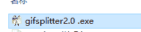

1.  分离出来发现是18张不完整的gif图片，如果尝试每张去修复，工作量太大了，这个时候我们尝试去使用

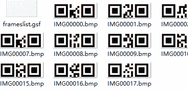

1.  保存图片祭出神器StegSolve。
    然后Analysis->Frame Browser。这里发现是18张图。也就是18张图片。

我拿手机一个挨着一个扫的。
扫出来的结果是SYC{F1aSh-so-f4sT}
但是提交不正确。
最后更改为SYC{F1aSh_so_f4sT}

### 13、come_game

听说游戏通关就有flag
题目来源：第七季极客大挑战

下载好题目，解压打开文件，打开可执行文件

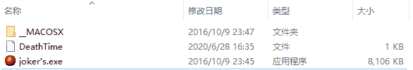

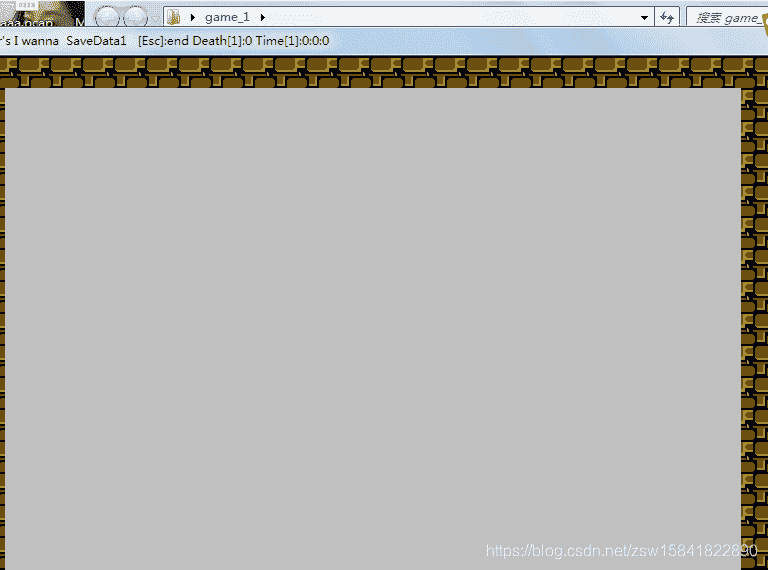

进行通关玩耍，会发现生成一个文件，用记事本打开，你会发现发现里面记录了通关数，考虑更为为最后一关

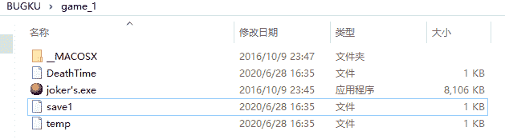

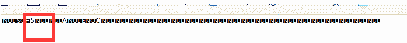

顺着玩是保存通关记录，而逆着玩，则是在读取通关记录，则会发现flag。

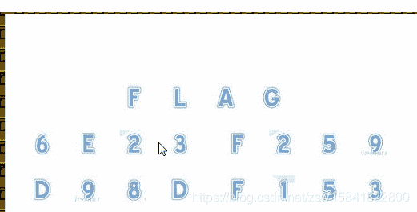

然后提交flag即可。
但是这里有一个坑需要注意就是这里并不是flag的格式而是SYC{6E23F259D98DF153}这种格式。

### 14、白哥的鸽子

图片隐写，套路化，notepad++、winhex、010edit、右键属性、binwalk、foremost打一遍

拿到文件binwalk,一切正常

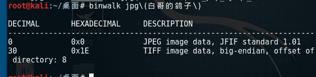

丢进010editor和winhex（后者不清晰）

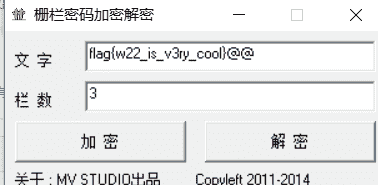  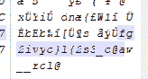

发现文件末位有fg2ivyo}l{2s3_o@aw__rcl@字符串（含flag字样，推断出是栅栏密码，栅栏密码：就是把要加密的明文分成N个一组，形成一段无规律的话）

尝试栅栏密码得出flag{w22_is_v3ry_cool}@@，栏数为3

flag{w22_is_v3ry_cool}

### 15、linux

提示：linux基础问题

放在linux下解压（或者Windows下解压），然后得到一个flag二进制文件，使用linux命令查找关键字grep ‘key’ –a flag

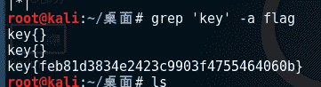

key{feb81d3834e2423c9903f4755464060b}

### 16、**隐写3**

### 

Windows下打开正常（感觉高度少了） ，kaili下打开报错，IHDR:CRC error

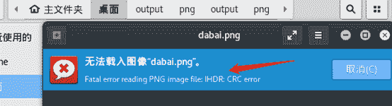

IHDR后的4字节是宽，再后4字节是高,00改成FF

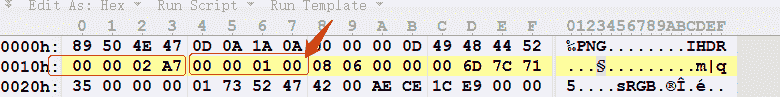

flag{He1l0_d4_ba1}

### 17、做个游戏(08067CTF)

坚持60秒，Java程序heiheihei.jar

拿到题目，下载jar。直接解压，然后Java反编译.class文件

flag{RGFqaURhbGlfSmlud2FuQ2hpamk=} base64解密

### 18、想蹭网先解开密码

提示：flag格式：flag{你破解的WiFi密码}

tips：密码为手机号，为了不为难你，大佬特地让我悄悄地把前七位告诉你
1391040****
Goodluck!!

下载cap包，WIFI连接认证的重点在WPA的四次握手包，也就是eapol协议的包，过滤一下

使用crunch生成密码字典

crunch 11 11 -t 1391040%%%% >>wifipass.txt

或者：crunch 11 11 -t 1391040%%%% -o password.txt

利用aircrack 进行爆破

aircrack-ng w wifipass.txt wifi.cap

或者aircrack-ng -a2 wifi.cap -w wifipass.txt

第三个存在握手包，就是他。

秒出答案

flag{13910407686}

### 19、Linux2

给你点提示吧：key的格式是KEY{}

压缩包brave.zip 解压，产生brave文件，固定的binwalk 和foremost执行

产生图片文件

flag{f0rens!cs!sC00L}

???出错???

flag格式是“KEY{}”

尝试直接搜索brave文件！

grep ‘KEY’ –a brave

KEY{24f3627a86fc740a7f36ee2c7a1c124a}

### 20、BUGku 账号被盗了

http://123.206.87.240:9001/cookieflag.php

文字说我们不是管理员

没什么提示，抓个包看看；

显示false，改成true ，然后repeater下试试看

发现出来个网页，打开后自动下载一个叫123.exe的文件

跟游戏有关的，利用wireshark分析一下；

找到User和pass

选一个右键点击追踪流就行了，这两行用base64解密就是163邮箱的账号和密码。登陆之后找flag。

  

里面有人把flag修改了，不过我发了一份真flag上去了，去收件箱找就行了！

flag{182100518+725593795416}

【注】未完待续