<!--yml
category: 未分类
date: 2022-04-26 14:19:16
-->

# CTF攻防世界web-新手区解题过程及使用工具_Peppa _Peppa的博客-CSDN博客_ctf web 工具

> 来源：[https://blog.csdn.net/weixin_45599193/article/details/108127429](https://blog.csdn.net/weixin_45599193/article/details/108127429)

### CTF攻防世界web-新手区解题思路总结及使用工具

# 作为一个新手小白，如果文章中有什么不错误或者不解的地方，还望谅解。（写了多少就更新多少啦）

（此博客是自己做题时的过程，中间有查找相关的资料以及大佬们的博客链接）

点击图中方框进行加载，若加载不出来网址，刷新或将电脑重启。

## 第一题：X老师让小宁同学查看一个网页的源代码，但小宁同学发现鼠标右键好像不管用了。

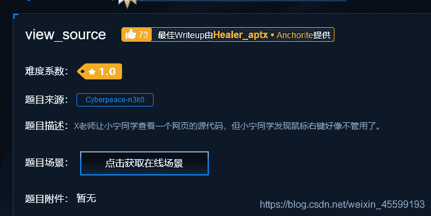

<mark>观察题目</mark>：①查看网页源代码 ②鼠标右键禁止使用
<mark>解题思路</mark>：查看网页源代码的方法有两种：鼠标右键或键盘中的f12（或fn+f12）
题目中已经说明鼠标用不了，所以直接使用键盘打开源代码即可。
<mark>具体操作</mark>：

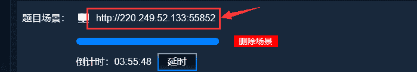
点击跳转网页，按f12直接打开源代码即可得到flag

## 第二题：X老师告诉小宁同学HTTP通常使用两种请求方法，你知道是哪两种吗？

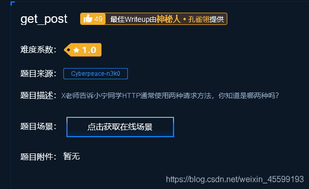

<mark>观察题目</mark>：HTTP的两种常用请求方法
<mark>解题思路</mark>：对HTTP进行大致的了解，在 解题中常用的为GET和POST这两个请求方法
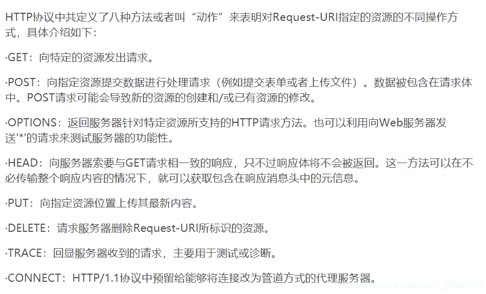<mark>解题工具</mark>：火狐浏览器：**MaxHackbar**（火狐插件，直接在火狐浏览器上搜索）

<mark>具体操作</mark>：第一步：*安装插件*，点击 添加到Firefox即可
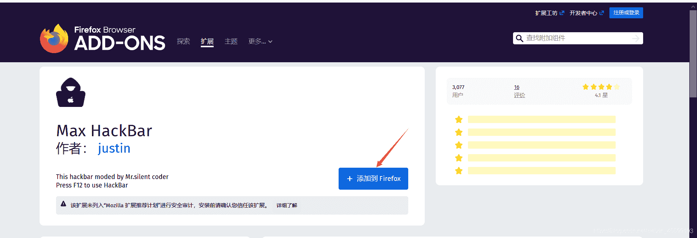
第二步：①点击转跳网页
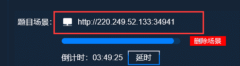

网页内容（直接说明用GET方式,，GET方一般为在url后拼接参数，只能以文本的方式传递参数。）
“统一资源定位符（URL）是Internet上标准资源的地址。URL指示资源的位置以及用于访问它的协议。互联网上的每个文件都有一个唯一的URL，它包含的信息指出文件的具体位置。”
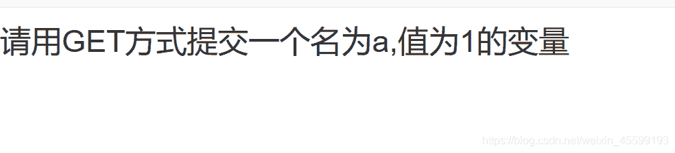
②因此直接在http://220.249.52.133:34941/后进行拼接，根据提示加入 ?a=1
http://220.249.52.133:34941/?a=1(这里使用英文的问号？）
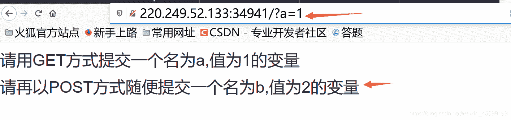

③根据提示再用POST法，用鼠标右键或f12打开如下图所示，这里出现了已经安装好的MaxHackbar，点击直接使用
1）在第一个方框内，将修改后的url复制粘贴
2）勾选Post Data，跳出第二个方框
3）在第二个方框中填入给出的信息：b=2
4）点击左边第三个框框，Execution,得到flag
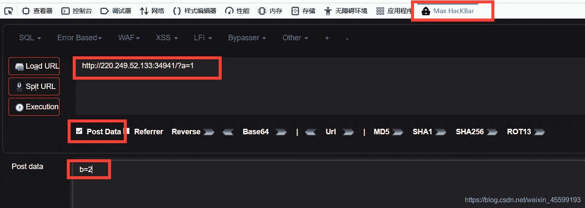
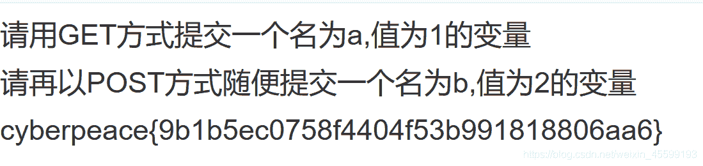

## 第三题：X老师上课讲了Robots协议，小宁同学却上课打了瞌睡，赶紧来教教小宁Robots协议是什么吧。

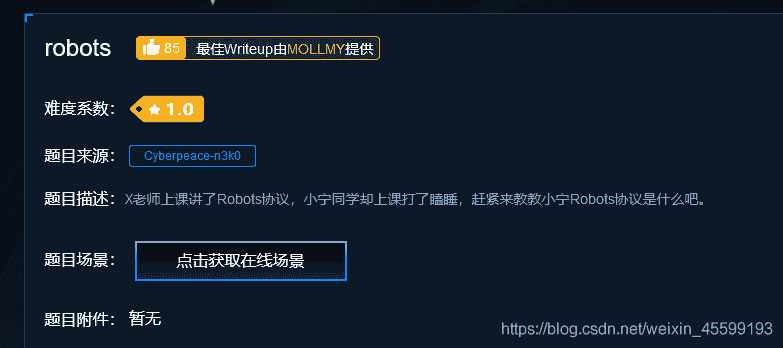
<mark>观察题目</mark>：Robots协议
<mark>解题思路</mark>：对Robots协议进行大致的了解[https://www.cnblogs.com/sddai/p/6820415.html](https://www.cnblogs.com/sddai/p/6820415.html)
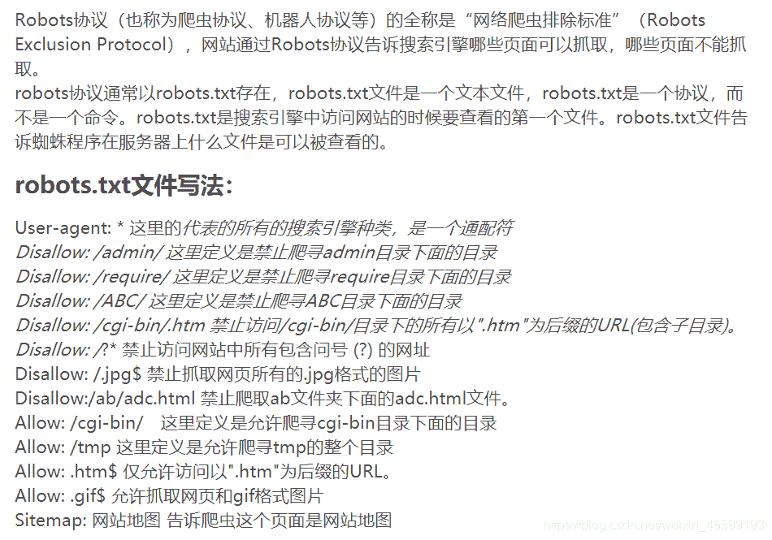<mark>具体操作</mark>： robots.txt是搜索引擎中访问网站的时候要查看的第一个文件。首先检查该站点根目录下是否存在robots.txt
1）观察url，发现没有robots.txt。直接进行添加
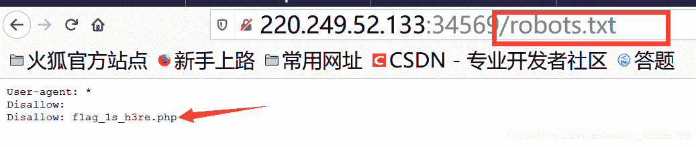2)f1ag_1s_h3re.php这个页面不允许被爬取，将url中的robots.txt删掉，加入f1ag_1s_h3re.php
得到flag

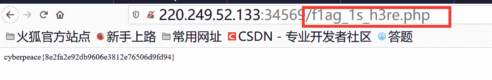

## 第四题：X老师忘记删除备份文件，他派小宁同学去把备份文件找出来,一起来帮小宁同学吧！

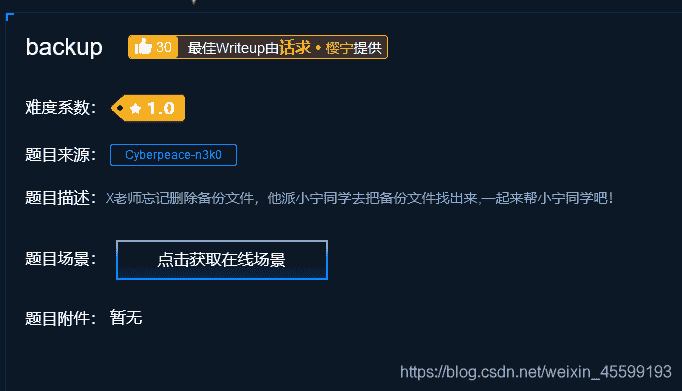<mark>观察题目</mark>：备份文件
<mark>解题思路</mark>：常见的备份文件后缀名有: .git .svn .swp .~ .bak .bash_history
（备份文件名格式通常为文件+.bak）
<mark>具体操作</mark>：
①点击跳转网页，得到问题，可得文件为index.php，则文件名为index.php.bak
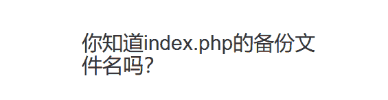
② 1)在url中添加index.php.bak，回车

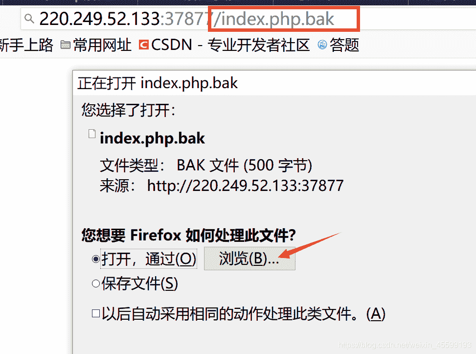
2)点击浏览，在里面选择使用工具（记事本即可）
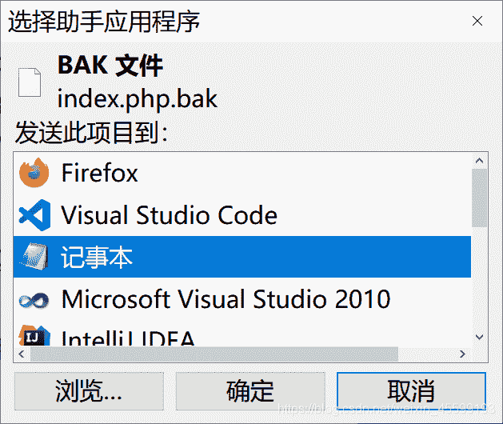

3）在记事本中找出flag

## 第五题：X老师告诉小宁他在cookie里放了些东西，小宁疑惑地想：‘这是夹心饼干的意思吗’

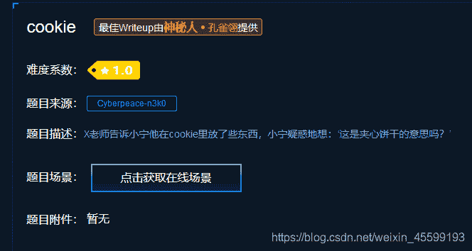
<mark>观察题目</mark>：cookie
<mark>解题思路</mark>：Cookie实际上是一小段的文本信息。客户端请求服务器，如果服务器需要记录该用户状态，就使用response向客户端浏览器颁发一个Cookie。客户端浏览器会把Cookie保存起来。当浏览器再请求该网站时，浏览器把请求的网址连同该Cookie一同提交给服务器。服务器检查该Cookie，以此来辨认用户状态。
<mark>具体操作</mark>：

1.跳转页面后，按F12，选择网络，点击第一行中的框框重新载入。
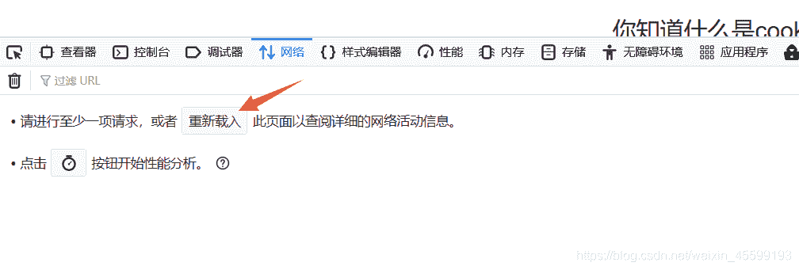2.点开第一行，在右边的响应头中（或点右边上面那行中的Cookie），发现“look-here=cookie.php”

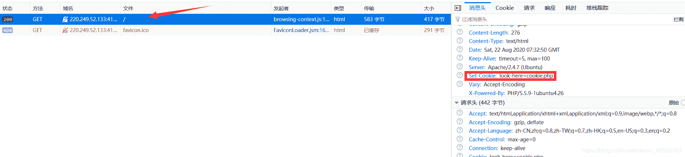
3.在url中加上/cookie.php
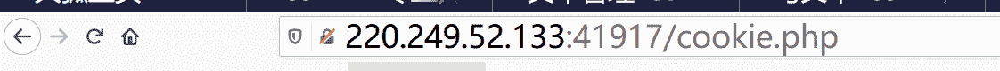

4.F12–>网络–>cookie.php–>响应头 即可找到flag
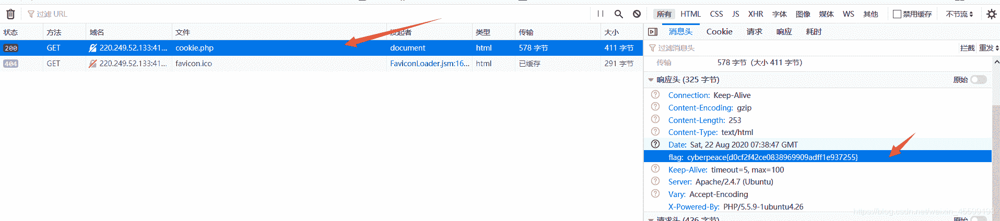

## 第六题：X老师今天上课讲了前端知识，然后给了大家一个不能按的按钮，小宁惊奇地发现这个按钮按不下去，到底怎么才能按下去呢？

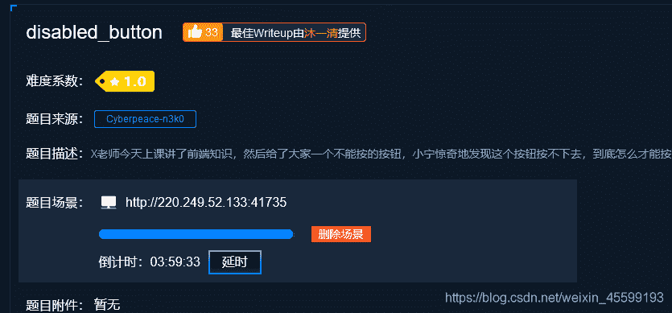
<mark>观察题目</mark>：前端、按钮
<mark>解题思路</mark>：需要对前端中各种标签有大概的印象（[HTML标签及其属性](https://blog.csdn.net/qq_30764991/article/details/79797111?ops_request_misc=%257B%2522request%255Fid%2522%253A%2522159808256319195239702259%2522%252C%2522scm%2522%253A%252220140713.130102334..%2522%257D&request_id=159808256319195239702259&biz_id=0&utm_medium=distribute.pc_search_result.none-task-blog-2~all~top_click~default-1-79797111.first_rank_ecpm_v3_pc_rank_v2&utm_term=html%E6%A0%87%E7%AD%BE%E5%B1%9E%E6%80%A7%E5%A4%A7%E5%85%A8&spm=1018.2118.3001.4187)）
如：

<mark>具体操作</mark>：
1.跳转页面，点击flag，发现按钮不能使用

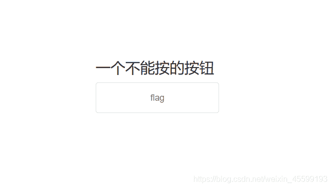
2.F12打开工具栏，点击查看器后,将form action…展开，删除“disabled=”（在disabled处双击 ），刷新，点击页面中flag按钮

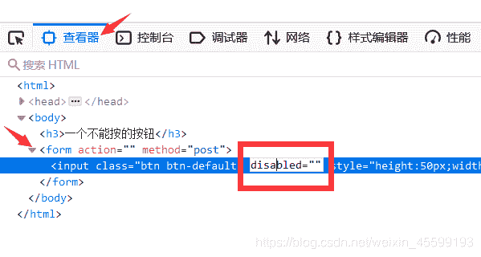
3.得到flag
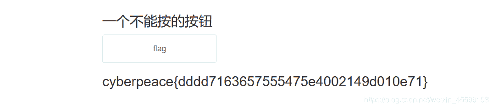

## 第七题：小宁写了一个登陆验证页面，随手就设了一个密码。

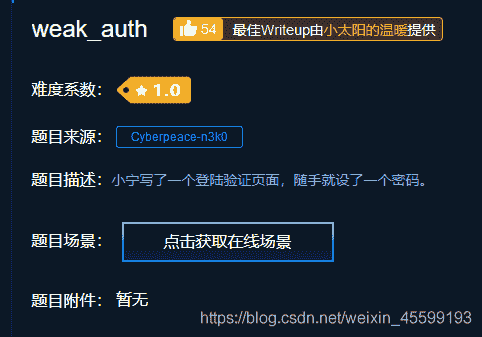