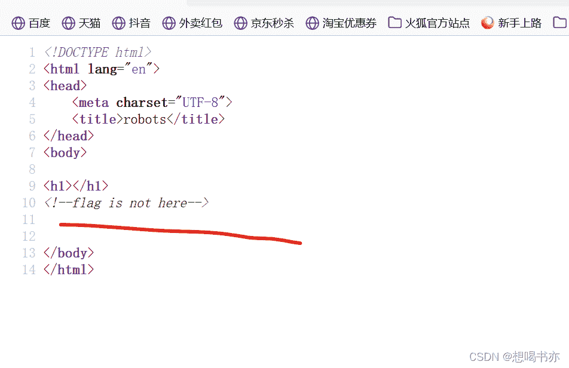
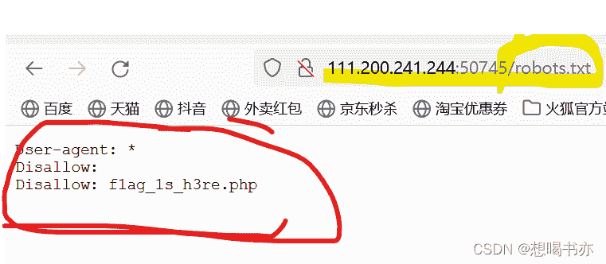
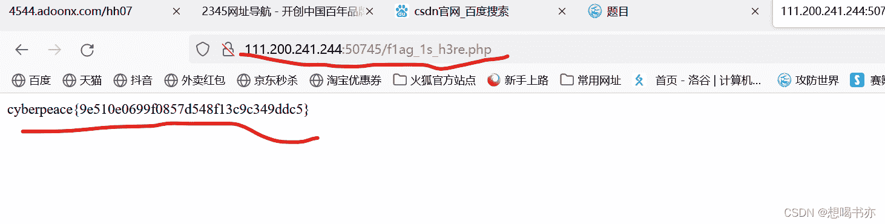

<!--yml
category: 未分类
date: 2022-04-26 14:37:12
-->

# CTF攻防世界web题思路解析2robot_想喝书亦的博客-CSDN博客

> 来源：[https://blog.csdn.net/m0_63687631/article/details/122085354](https://blog.csdn.net/m0_63687631/article/details/122085354)

1.得到了网址，打开；发现是个空白页

 2.然后查看一下源码，发现flag不在这儿

 3.然后结合一下题，查下下robot协议；得到robot协议就是告诉爬虫这个网址里面有东西不能被搜到，然后改变网址查下什么内容不能被搜到，在网址后加/robots.txt,然后访问得到这个

4.根据简单翻译，user-agent是使用者代理的意思，disallow是驳回的意思，所以结合robots协议，就是使用者代理告诉我们disallow的内容被驳回了，导致我们不能正常访问，所以我们在网址后边加上这些/disallow的内容。访问即可得到flag.

**知识点：**

这题就一个robots协议的知识点，在后面加个/robots.txt即可知道不能被搜索引擎搜索出的内容