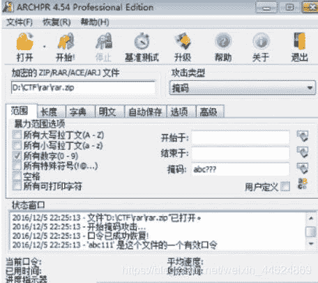

<!--yml
category: 未分类
date: 2022-04-26 14:33:25
-->

# CTF杂项题做题思路_小呆驴的博客-CSDN博客_ctf杂项解题思路

> 来源：[https://blog.csdn.net/weixin_44624869/article/details/97790610](https://blog.csdn.net/weixin_44624869/article/details/97790610)

## **一、文件隐写**

**1、 file命令**
当文件没有后缀或者有后缀无法正常打开，根据识别出的文件类型，来修改后缀即可
格式：file myheat
**2、 winhex**
**3、 文件头缺失**
一种是文件头残缺，另一种是文件头部字段错误。文件头部残缺可使用winhex添加相应文件头，针对头部字段错误，可找一个相同类型的文件进行替换。
**文件分离操作：**
**1、 binwalk工具（遇到压缩包会自动解压）**
DECIMAL:十进制 HEXADECIMAL:十六进制
分析文件：binwalk 文件名
分离文件：binwalk -e 文件名
**2、 foremost 工具**
foremost 文件名 -o 输出目录
**3、 dd**
文件无法自动分离时，可使用dd实现文件手动分离。
格式：
Dd if = 源文件 of=目标文件名 bs=1 skip=开始分离的字节数
参数说明：
If = file #输入文件名，缺省为标准输入
Of=file #输出文件名，缺省为标准输出
Bs=bytes #同时设置读写块的大小为bytes，可代替为ibs和obs
Skip=blocks #从输入文件开头跳过blocks个块后再开始复制
例：dd if =1.txt of 2.txt bs=5 count=1
可先使用binwalk分析文件
**4、 Winhex**
右键保存为需要的文件
**5、010 editor**
**文件合并：**
**1、 Linux下的文件合并**
Linux下对文件名相似的文件进行批量合并
格式：cat 合并文件>输出的文件
加验MD5值：md5sum 文件名

## **二、图片隐写：**

目录：
1、 细微颜色差别
2、 GIF图多帧隐藏
颜色通道隐藏
不同帧图信息隐藏
不同帧对你隐写
3、 exif信息隐藏
4、 图片修复
图片头尾修复
CRC校验修复
长宽高修复
5、 最低有效位LSB隐写
6、 图片加密
Stegdetect
Outguess
Jphide
F5

**1、 firework**
**2、 exif**
**3、 stegsolve**
两张jpg图片外观、大小、像素基本相同，可考虑结合分析，即将两个文件像素RGB值进行XOR、ADD、SUB等操作。
打开第一张图片，依次点击analyse image combiner
两张图片打开的先后顺序不一样，结果也会不一样
**4、 最低有效位LSB隐写**
打开文件依次点击 analyse data extract
勾选R G B 的0值，点击Preview
Webstego4工具（针对.bmp格式的图片）
**5、 CQR**
取反色，自动补全二维码

## **三、压缩文件**

**1、伪加密**
文件头正常，但解压错误，使用winhex，找到文件头第九第十个字符，将其修改为0000。
搜索16进制504B0102，可找到每个加密文件的文件头字段
RAR文件由于有头部校验，使用伪加密时打开文件会出现报错，使用winhex修改标志位后如报错消失且正常解压缩，说明是伪加密。使用winhex打开RAR文件，找到第24个字节，该字节尾数为4表示加密，0表示无加密，将尾数改为0即可破解伪加密。
**2、 暴力破解**
使用ARCHPR
攻击类型选择掩码可以进行复杂的暴力破解，比如知道密码前3位是abc，后3位为数字，则在攻击类型选择掩码，在掩码处输入acb???,暴力范围选项选择所有数字，打开要破解的点击，点击破解。此时? ? ?的部分会被我们选择的暴力破解范围中的字符代替。

有时给出的RAR文件头部各个字块会故意给错导致无法识别。
**四、流量取证**
**1、**
http contains “FLAG”
http contains “key”
**2、wireshark协议分析**
先点再点协议分级
查看数据包的时候，有的数据包有某种特征，就可以筛选出来这种特征:
右键，作为过滤器应用，选中
**3、 wireshark流汇聚**
在关注HTTP数据包或者TCP数据包中选择流汇聚，可将HTTP流或TCP流汇聚或还原成数据，在弹出框内可以看到数据内容
常见的HTTP流关键内容:
●HTML中直接包含重要信息。
●上传或下载文件内容，通常包含文件名、hash值等关键信息，常用POST请求上传。
●一句话木马，POST请求，内容包含eval, 内容使用base64加密