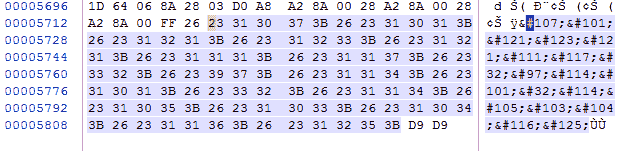
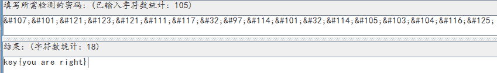
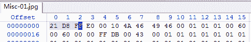
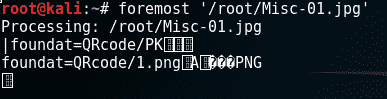
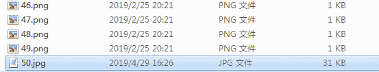
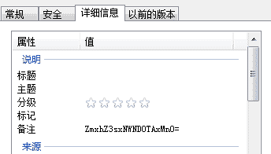
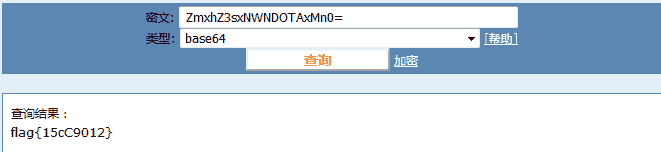

<!--yml
category: 未分类
date: 2022-04-26 14:31:33
-->

# CTF杂项题解题思路_weixin_30808253的博客-CSDN博客

> 来源：[https://blog.csdn.net/weixin_30808253/article/details/99784095](https://blog.csdn.net/weixin_30808253/article/details/99784095)

1.  下载压缩包解压
2.  如果是图片就先查看图片信息
3.  没有有用信息查看图片看是否是一个图片
4.  如果不是图片就将文件进行还原
5.  从还原文件中查找有用信息

例：这是一张单纯的图片

[http://123.206.87.240:8002/misc/1.jpg ](http://123.206.87.240:8002/misc/1.jpg)

（1）查看图片属性后没有任何有效信息


（2）用图片查看器也能打开，证明确实是图片


（3）我们用WinHex或者Notepad++打开可以看到最后有一串规律的Unicode码



```
&#107;&#101;&#121;&#123;&#121;&#111;&#117;&#32;&#97;&#114;&#101;&#32;&#114;&#105;&#103;&#104;&#116;&#125;
```

（4）把得到的码用CTFCrak进行转码为Ascii就可以得到了



注：与Unicode有关的字符转换模式

Ascii　　---->　　Unicode　　　　　　　　　　　　　　　　中文　　---->　     　Unicode　　

flag　　　　　　&#102;&#108;&#97;&#103;　　　　　　　　旗帜　　　　　　　\u65d7\u5e1c

例2：最危险的地方就是安全的

[15584352907afc4ab69ef3c7ca3e905903f171a46d](https://www.zhaoj.in/wp-content/uploads/2019/05/15584352907afc4ab69ef3c7ca3e905903f171a46d.zip) [](https://ctf.bugku.com/files/f8da9b5979e89e91d083c7accdea4427/2.rar "隐写") （1）下载后我们解压得到一个jpg格式的图片，查看图片信息


（2）用图片查看器打开，可以看到打不开，我们就猜测这不是一个jpg格式的图片


（3）用Winhex打开，证实了我们的猜想



（4）此时我们就需要用foremost对文件进行恢复，可以看到恢复后的文件全是二维码图片



（5）将恢复后的文件的列表并显示详细信息，我们局可以发现这个文件格式大小都不一样

 

（6）查看其详细信息，可以发现有个备注了一段Base64加密的密文



 ZmxhZ3sxNWNDOTAxMn0= 

（6）通过解密就可以得到flag



注：

1.winhex打开后的各类常见文件文件头，如果文件头和文件后缀名格式不同，则可以用foremost进行分离或恢复文件

| 文件名                |     文件头                     |
| jpg | FFD8FF |
| png | 89504E47 |
| gif | 47494638 |
| xml | 3C3F786D6C |
| html | 68746D6C3E |
| eml | 44656C69766572792D646174653A |
| xls.or.doc | D0CF11E0 |
| tif | 49492A00 |
| bmp | 424D |
| zip | 504B0304 |
| rar | 52617221 |
| pdf | 255044462D312E |

2.foremost的使用，foremost是kali中自带的，只需要在终端输入foremost 文件名 就可以自行处理，处理后的文件会自动保存到root/output/文件夹下