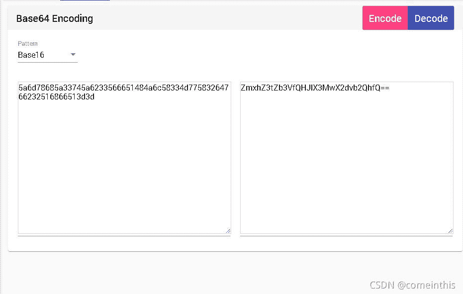
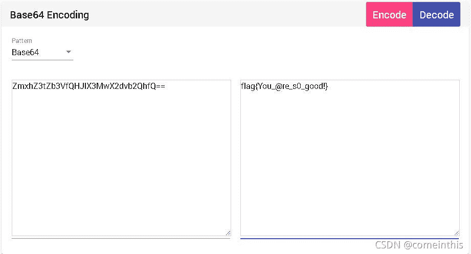
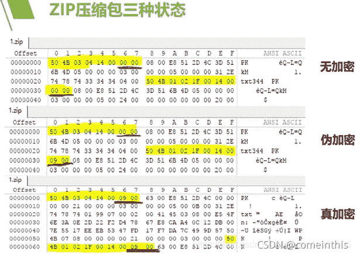
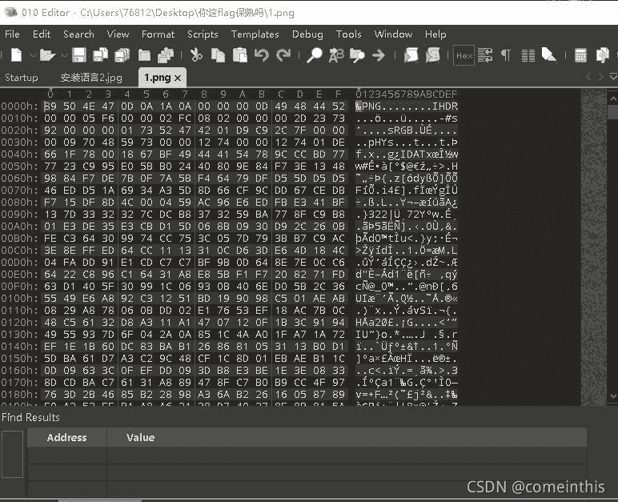

<!--yml
category: 未分类
date: 2022-04-26 14:30:49
-->

# CTF比赛中常见的MISC解题方法（不涉及内存取证和流量分析）仅供菜鸟，大佬绕道_comeinthis的博客-CSDN博客_ctf misc

> 来源：[https://blog.csdn.net/comeinthis/article/details/120389008](https://blog.csdn.net/comeinthis/article/details/120389008)

        我们在ctf比赛中，大多数时候签到题都是misc。

         会不会有小伙伴因为签到题而感到头痛。

        其实misc的签到题是非常简单的，不然怎么可能叫签到。

        好吧，废话不多说，直接说干货：

        **1、题目直接给了编码。**

        比如：前几天的第一届“长城杯”的misc签到题。        5a6d78685a33745a6233566651484a6c58334d77583264766232516866513d3d（这个不是原题，是我举得例子）        

        这里我们首先要考虑的是，如何辨别这是什么类型的编码。

        攻略来了：

<u>**base系列（大部分是字母和数字末尾有=）**</u>

base16：只有0-9和a-f；

base32：只有2-7和大写字母，编码后字符数是8的倍数（不足则加=）；

base64：大小写字母、数字和‘+’，‘/’，编码后字符数是4的倍数（不足则加=）

如：MTY3NDg2NTE2NTE2c2FsbmZsO2xtOw==

编码有大写小写字母和数字；

Flag的base64加密是**ZmxhZw==**

Unicode编码：

&#105;&#110;&#108;&#118;&#97;&#110;&#115;&#108;&#54;&#49;&#54;&#52;&#54;&#49;

或者

\u0034\u0030\u0037\u0030\u000d\u000a\u0031\u0032\u0033\u0034\u000d\u000a

Flag的Unicode加密是\u0066\u006c\u0061\u0067

Md5编码：

2ab79f28e5e7adcd439ebc0f06f4b8b1

由小写字母和数字组成；

Flag的base64加密是327a6c4304ad5938eaf0efb6cc3e53dc

AES编码

U2FsdGVkX18tl8Yi7FaGiv6jK1SBxKD30eYb52onYe0=

有大小写字母和数字组成；

栅栏密码

一般有一长串字母的都有可能

维吉尼亚密码

一半会得到一长串字母和一个有意义的单词，这个单词就是密钥

Ook密码

只出现！？.

Cow密码

只出现moo的大小写组合

brainfuck

只出现><±.[]

我没有列举完，但是做一般misc编码题，这些已经足够了。

回到题目5a6d78685a33745a6233566651484a6c58334d77583264766232516866513d3d，观察一下，这不就是base16吗，有数字且字母只有a到f。那给它解密，

 可以看到是双层加密，再利用base64解密，就可以得到结果。

 

**        2、有关txt的题目。**

        常见的题是我们下载的附件是一个txt文本文件。

        （一）txt中含有编码，这里使用上文中的**“1、题目直接给了编码”**来解题。

        （二）txt中有隐藏的数据。

        由于我找不到buuctf的这类题了，所以这里就不给图片了。

        迷惑性在于，你打开了这个txt，里面什么都没有，看起来就是空白，但是你按下键盘中的ctrl+a时，却可以看到有东西（大部分隐藏的都是摩斯编码），这里我们需要利用到一个工具：Sublime Test（一个文本文档编译器），可以看清楚隐藏的数据，然后通过解密得到的摩斯编码得到flag。

        （三）ntfs流。

        当你对这个txt使用各种方法还是毫无头绪时，就要想到ntfs。

        这里也需要利用到工具ntfsstreamseditor，使用方法建议百度，常见的使用完ntfsstreamseditor后会得到flag，难一点的会得到一个pyc文件。        

 **  3、gif考点。**

        下载附件解压缩后得到一个有趣的gif文件，不管它好不好看，先扔进stegsolve里再说，比较简单的gif题，利用stegsolve中Frame  Browser进行gif一帧一帧播放查看不同。

        gif的题要么简单，要么难得一批。

        利用好stegsolve这个神器，gif不用愁。

       ** 4、压缩包考点。（需要用到010editor或者winhex，后面图片的考点也要用到）**

        最常见的是压缩包的伪加密和弱口令；稍微难点的题就是CRC32爆破（用于压缩包中的zip内容较短且数量很多的时候）；或者ARCHPR掩码爆破（已知密码的几位，其余输入“？”来代替，然后进行爆破）。

        （一）伪加密。（图是盗的）

        

 详细解释可以看[zip伪加密_啊哦的博客-CSDN博客](https://blog.csdn.net/ETF6996/article/details/51946250?ops_request_misc=%257B%2522request%255Fid%2522%253A%2522163210914616780255233971%2522%252C%2522scm%2522%253A%252220140713.130102334..%2522%257D&request_id=163210914616780255233971&biz_id=0&utm_medium=distribute.pc_search_result.none-task-blog-2~all~top_positive~default-1-51946250.pc_search_result_control_group&utm_term=zip%E4%BC%AA%E5%8A%A0%E5%AF%86&spm=1018.2226.3001.4187 "zip伪加密_啊哦的博客-CSDN博客")或者[[CTF]zip伪加密_林毅洋-CSDN博客_ctf zip伪加密](https://blog.csdn.net/kajweb/article/details/76474476?ops_request_misc=&request_id=&biz_id=102&utm_term=zip%E4%BC%AA%E5%8A%A0%E5%AF%86&utm_medium=distribute.pc_search_result.none-task-blog-2~all~sobaiduweb~default-6-76474476.nonecase&spm=1018.2226.3001.4187 "[CTF]zip伪加密_林毅洋-CSDN博客_ctf zip伪加密")

 前面大佬的博客讲解了zip有关的内容，后面的博客讲解了zip伪加密。

这里用到的是神器010 editor或者winhex，修改好伪加密的zip后保存，然后打开zip就没有加密了，同时你就可以看到zip中的内容。

        （二）弱口令。

        解法：爆破。

        涉及到弱口令的题目，会有提示或者给出字典，我们可以使用ARCHPR对zip进行密码爆破，详细操作可以百度或者在csdn里查找操作教程。

            **5、图片考点（上面说到了这里要用到010editor或者winhex）**

（一）鼠标右键查看属性，最简单的题目是属性里备注给出了flag或者各种编码（编码解法在最上面我说过的）

        （二）图片中隐藏了东西。

        使用010editor打开，观察文件头和文件尾。下面给出了常见的文件的文件头和文件尾。

JPEG (jpg): 文件头，FF  D8  FF;文件尾，FF  D9。

PNG (png): 文件头，89  50  4E  47; 文件尾，AE  42  60  82。

GIF (gif): 文件头，47  49  46  38; 文件尾，00  3B.

ZIP Archive (zip): 文件头，50  4B  03  04;文件尾，50  4B.

RAR Archive (rar)， 文件头: 52  61  72  21。

Wave (wav): 文件头，57  41  56  45。

AVI (avi): 文件头，41  56  49  20。

MPEG (mpg): 文件头，00  00  01  BA。

MPEG (mpg):文件头，00  00  01  B3。

Quicktime (mov): 文件头，6D  6F  6F  76。

 可以看到1.png这个图片的文件头，那我们现在需要寻找文件尾，按ctrl+f，查找文件尾AE  42  60  82，如果图片里隐藏了数据，那么文件尾后就会藏有文件：大多数时候都是pk开头的文本格式，这就是压缩包，所以把这个图片扔到binwalk或者foremost里分离一下（嫌麻烦的可以直接将这个1.png文件改后缀），如果是隐藏了zip，直接将1.png改名为1.zip。

图片隐写：比如一个jpg打开开头FF D8 FF 结尾FF D9,但是中间部分含有FF  D9

涉及到分离时，binwalk用不了的时候一定要尝试foremost，

Binwalk无法分离文件头和文件尾正确的文件，

但是foremost可以分离文件中含有的文件