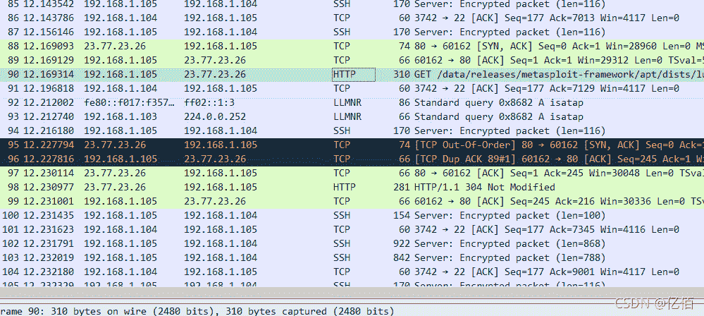
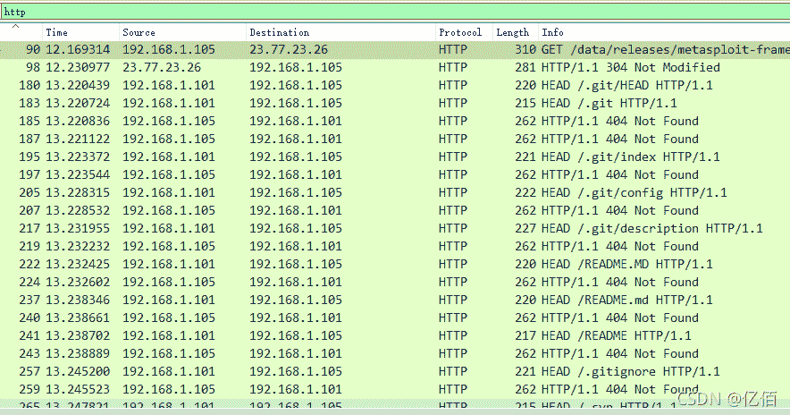
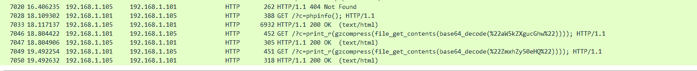
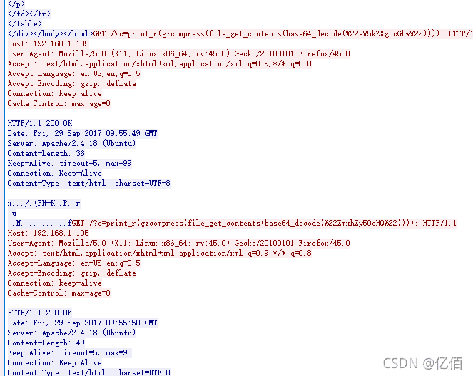
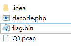

<!--yml
category: 未分类
date: 2022-04-26 14:43:19
-->

# CTF流量分析1_亿佰的博客-CSDN博客_ctf流量分析

> 来源：[https://blog.csdn.net/qq_45766280/article/details/119939767](https://blog.csdn.net/qq_45766280/article/details/119939767)

仅作为学习笔记使用

题目：Q3.pcap

# 题解：

先在wireshark里看一下

有HTTP先看HTTP，直接在过滤器中选择HTTP

这些包就有意思了，这些请求有些想目录扫描在不断的请求，而大部分的回应都是404，那么我们暂时推断会有访问成功的，往后面找找吧。


这两个语句成功通过了，那我们来详细分析分析这两个包。追踪流->HTTP


```
GET /?c=print_r(gzcompress(file_get_contents(base64_decode(%22aW5kZXgucGhw%22)))); HTTP/1.1

GET /?c=print_r(gzcompress(file_get_contents(base64_decode(%22ZmxhZy50eHQ%22)))); HTTP/1.1 
```

看看这两个GET请求，应该是读取一个文件并用base64编码，然后再通过`gzcompress` 进行了压缩。
ok，让我们来看看这两个文件具体是什么。

```
%22aW5kZXgucGhw%22 -> index.php
%22ZmxhZy50eHQ%22 -> flag.txt 
```

既然已经有了flag的标志,那么我们先看第二请求。
选择第二请求的回应，点击内容主体

这一部分就是这个请求的具体内容了，我们点击右键选择导出分组字节流，随便取个名字 flag


打开后是一段乱码，原因是这个段内容是被压缩过的，所以我们要写一个脚本来对他进行解压

```
<?php
$a = file_get_contents('flag.bin');  
$b = gzuncompress($a); 
echo $b;
?> 
```

运行

```
hitctf{85b0ae3a8a708b927bf1a30dff3c6540} 
```

# 总结

这个流量分析的题目比较基础，其中应用的技巧是`过滤流` 和 `导出分组字节流`