<!--yml
category: 未分类
date: 2022-04-26 14:52:57
-->

# CTF解题-网安实验室(基础关)_Tr0e的博客-CSDN博客

> 来源：[https://blog.csdn.net/weixin_39190897/article/details/100592746](https://blog.csdn.net/weixin_39190897/article/details/100592746)

# Base64 编码转换

## 理论基础

**什么是Base64编码？**

在参数传输的过程中经常遇到的一种情况：使用全英文的没问题，但一旦涉及到中文就会出现乱码情况。与此类似，网络上传输的字符并不全是可打印的字符，比如二进制文件、图片等。Base64的出现就是为了解决此问题，它是基于64个可打印的字符来表示二进制的数据的一种方法。

Base64，就是**使用64个可打印字符来表示二进制数据的方法**。Base64的索引与对应字符的关系如下表所示：
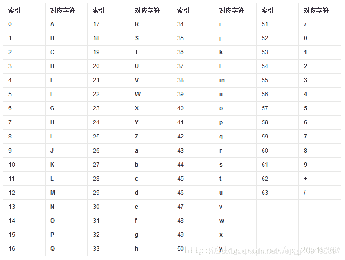
**转换步骤**

1.  将待转换的字符串每三个字节分为一组，每个字节占8bit，那么共有24个二进制位；
2.  将上面的24个二进制位每6个一组，共分为4组；
3.  **在每组前面添加两个0**，每组由6个变为8个二进制位，总共32个二进制位，即四个字节；
4.  根据Base64编码对照表（见上图）获得对应的值。

**示例说明**

以下图的表格为示例，我们具体分析一下整个过程。
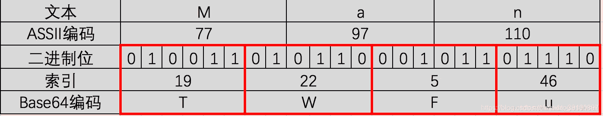

1.  “M”、“a”、"n"对应的ASCII码值分别为77，97，110，对应的二进制值是01001101、01100001、01101110。如图第二三行所示，由此组成一个24位的二进制字符串；
2.  如图红色框，将24位每6位二进制位一组分成四组；
3.  在上面每一组前面补两个0，扩展成32个二进制位，此时变为四个字节：00010011、00010110、00000101、00101110。分别对应的值（Base64编码索引）为：19、22、5、46；
4.  用上面的值在Base64编码表中进行查找，分别对应：T、W、F、u。因此“Man”Base64编码之后就变为：TWFu。

**注意事项**

1.  Base64字符表中的字符原本用6个bit就可以表示，现在前面添加2个0，变为8个bit，会造成一定的浪费。因此，Base64编码之后的文本，要比原文大约三分之一。
2.  大多数编码都是由字符串转化成二进制的过程，而Base64的编码则是从二进制转换为字符串。
3.  Base64编码主要用在传输、存储、表示二进制领域，不能算得上加密，只是无法直接看到明文。也可以通过打乱Base64编码来进行加密。
4.  中文有多种编码（比如：**utf-8、gb2312、gbk**等），不同编码对应Base64编码结果都不一样。

## 解题过程

【基础题3】

猜猜这是经过了多少次加密？[通关地址](http://hackinglab.cn/ShowQues.php?type=bases)
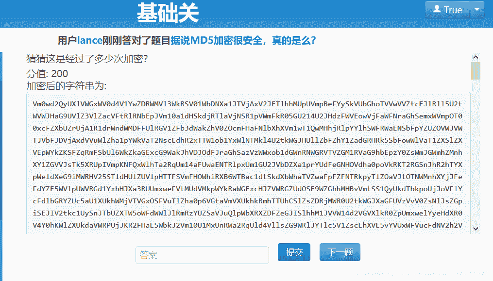

> **可以多次加密，且加密结果以“ `=` ”结束，多半是base64加密**。

搜索base64在线加解密工具，把待解密的数据放进去多次解密：
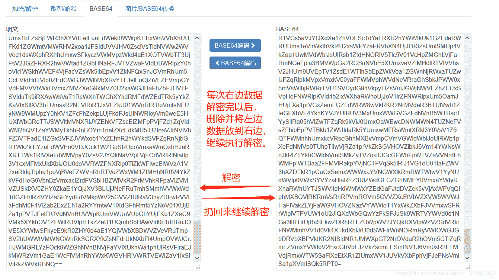

经过20次解密后获得最终结果(拿到Key)：


# HTTP 请求头更改

## Cookie

【基础题9】冒充登陆用户

背景：小明来到一个网站，还是想要key，但是却怎么逗登陆不了，你能帮他登陆吗？

[通关地址](http://lab1.xseclab.com/base9_ab629d778e3a29540dfd60f2e548a5eb/index.php)
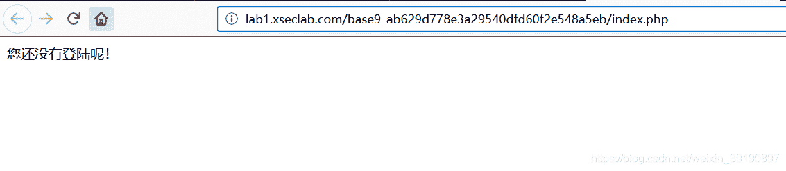【解题过程】

1.  刷新页面，使用BurpSuite抓包，查看数据包：
    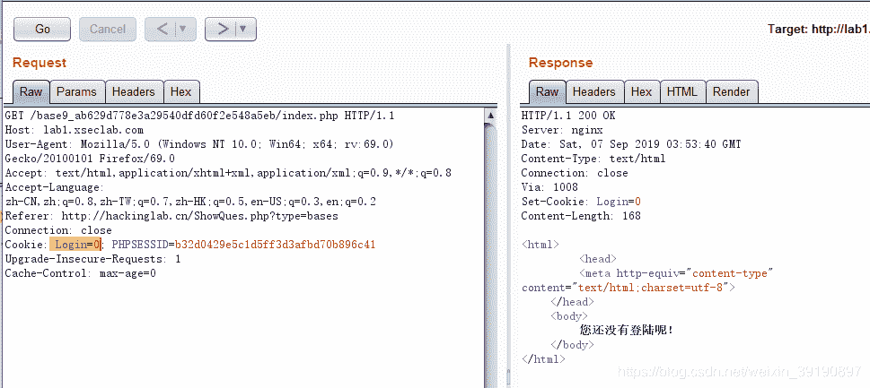
2.  直接在**Cookie**请求头里将**Login**改为即可得到key：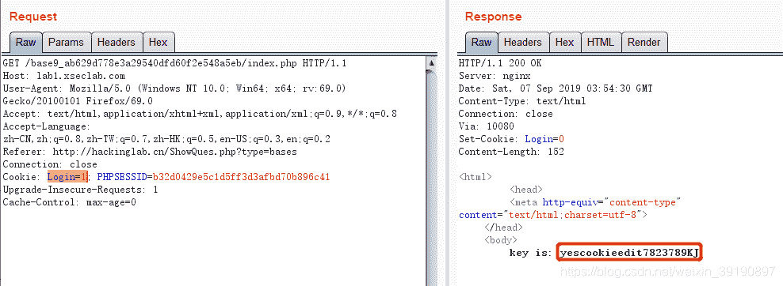

## User-Agent

【基础题6】HAHA浏览器

背景：据说信息安全小组最近出了一款新的浏览器，叫HAHA浏览器，有些题目必须通过HAHA浏览器才能答对。小明同学坚决不要装HAHA浏览器，怕有后门，但是如何才能过这个需要安装HAHA浏览器才能过的题目呢？

[通关地址](http://lab1.xseclab.com/base6_6082c908819e105c378eb93b6631c4d3/index.php)
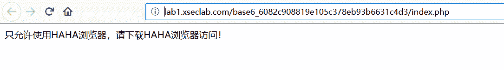【解题过程】

1.  刷新页面，使用BurpSuite抓包，查看数据包：
    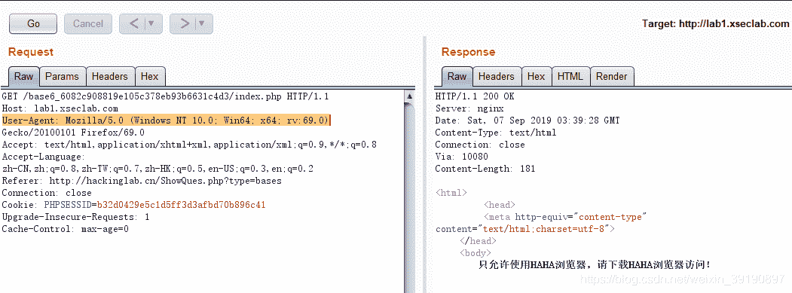
2.  直接在**User-Agent**请求头后面加**HAHA**即可得到key：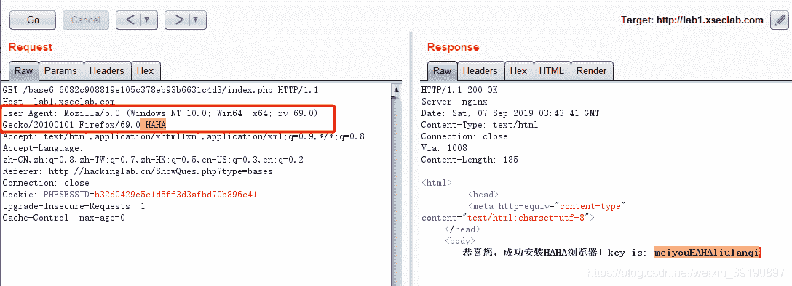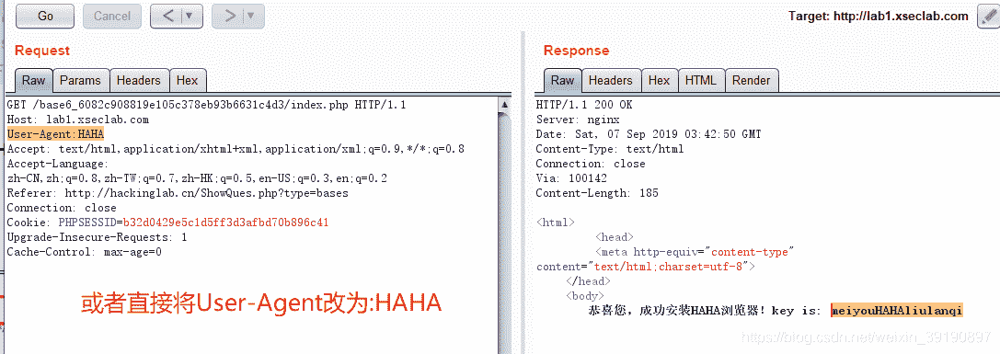

## Accept-Language

【基础题5】种族歧视

背景：小明同学今天访问了一个网站，竟然不允许中国人访问！太坑了，于是小明同学决心一定要进去一探究竟！

[通关地址](http://lab1.xseclab.com/base1_0ef337f3afbe42d5619d7a36c19c20ab/index.php)
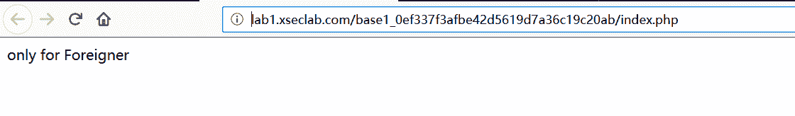【解题过程】

1.  刷新页面，使用BurpSuite抓包，查看数据包：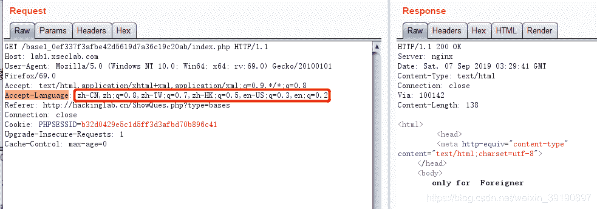
2.  将**Accept-Language**请求头更改为`en-US,en;q=0.8`即可获得key：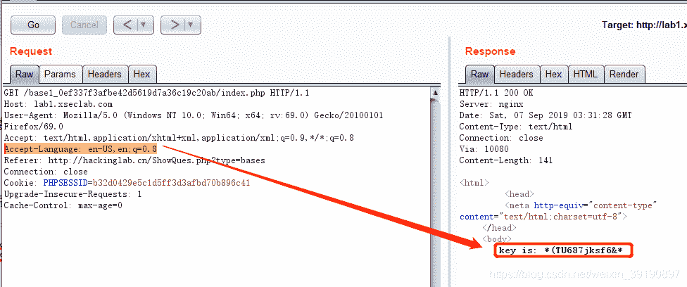

# 修改网页前端限制

【基础题10】比较数字大小

背景：只要比服务器上的数字大就可以了！

[通关地址](http://lab1.xseclab.com/base10_0b4e4866096913ac9c3a2272dde27215/index.php)
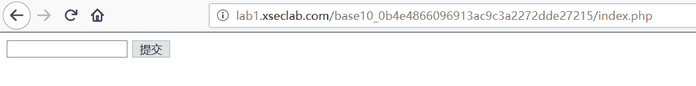
【解题过程】

1.  输入数字999，提交试一下：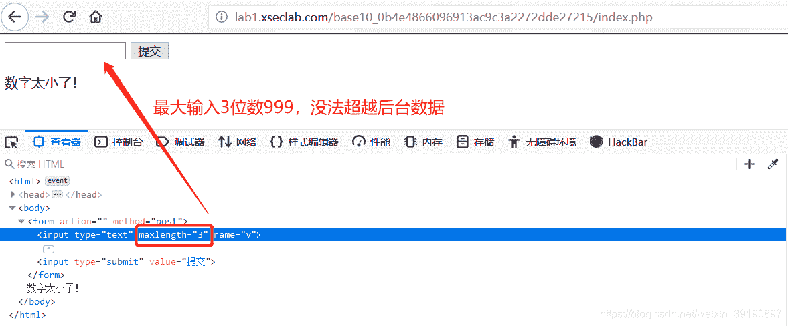
2.  通过网页开发者工具，修改**maxlength**的值为10，即可成功输入大的数字，获得Key：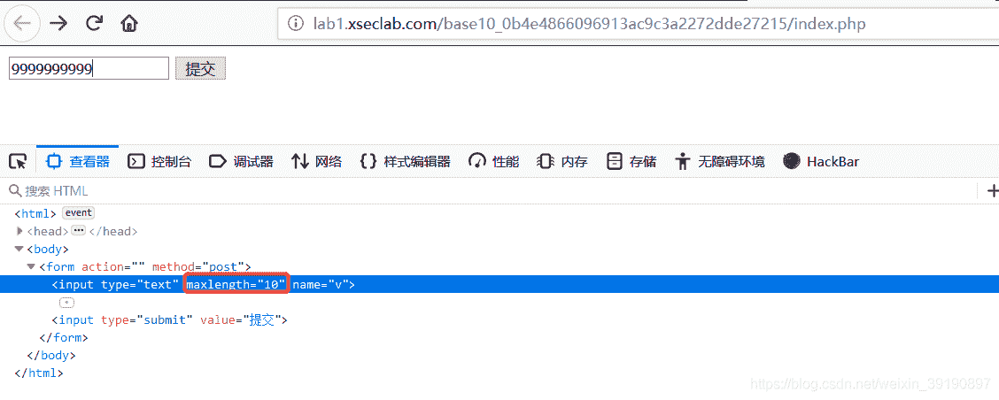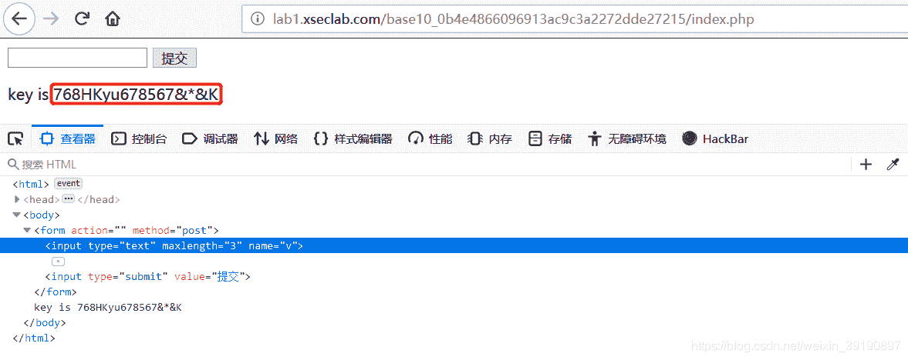
3.  或者通过BurpSuite抓包并绕过前端位数限制：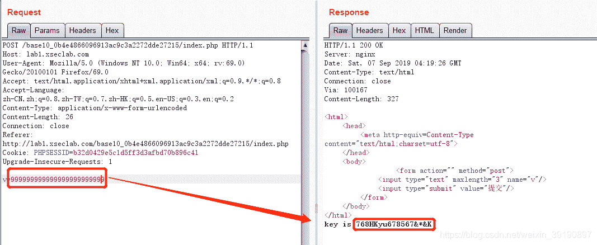

# robots.txt 文件寻找路径

***理论基础***

【robots.txt是什么】

robots.txt是一个纯文本文件，在这个文件中**网站管理者可以声明该网站中不想被搜索引擎访问的部分，或者指定搜索引擎只收录指定的内容**。

当一个搜索引擎（又称搜索机器人或蜘蛛程序）访问一个站点时，**它会首先检查该站点根目录下是否存在robots.txt**，如果存在，搜索机器人就会按照该文件中的内容来确定访问的范围；如果该文件不存在，那么搜索机器人就沿着链接抓取。

> robots.txt 文件必须放在网站的根目录，不可以放在子目录。以某网站为例：比如通过`https://域名aaa/robots.txt` 你就可以访问`域名aaa`的robots.txt文件了。

【robots.txt 示例】

1、禁止搜索引擎抓取特定目录。在这个例子中，该网站有三个目录对搜索引擎的访问做了限制，即搜索引擎不会访问这三个目录。

```
User-agent: * 　　
Disallow: /admin/
Disallow: /tmp/
Disallow: /abc/ 
```

2、禁止admin目录，但允许抓取admin目录下的seo子目录:

```
User-agent: * 　　
Allow: /admin/seo/
Disallow: /admin/ 
```

3、禁止抓取/abc/目录下的所有以".htm”为后缀的URL（包含子目录）

```
User-agent: * 　　
Disallow: /abc
```

4、禁止抓取网站中所有的动态页面(**屏蔽所有带“?”的文件，这样就屏蔽所有的动态路径**)：

```
User-agent: * 　　
Disallow: /? 
```

5、禁止百度蜘蛛抓取网站所有的图片：

```
User-agent: Baiduspider
Disallow: /.jpg$
Disallow: /.jpeg$
Disallow: /.gif$
Disallow: /.png$
Disallow: 
```

***实战题目***

【基础题12】就不让你访问

背景：小明设计了一个网站，因为总是遭受黑客攻击后台，所以这次他把后台放到了一个无论是什么人都找不到的地方…可最后还是被黑客找到了，并被放置了一个黑页，写到:find you ,no more than 3 secs!

[通关地址](http://lab1.xseclab.com/base12_44f0d8a96eed21afdc4823a0bf1a316b/index.php)
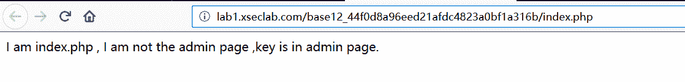
【解题过程】

1.  根据提示，试着访问`admin.php`碰碰运气，失败：
2.  抓包观察，也没收获：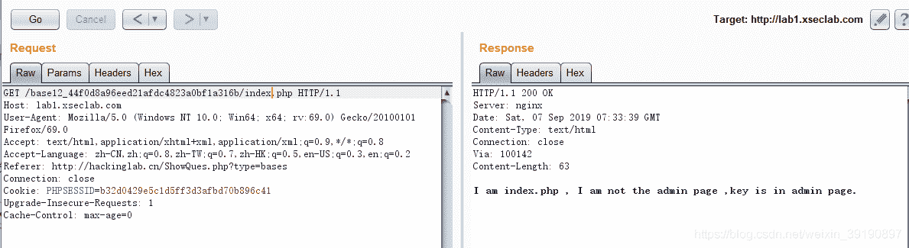
3.  束手无策，试试有没有`robots.txt`文件提供点目录信息，获得生机：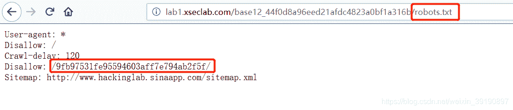
4.  虽然只有`Disallow`的路径，但也访问一下碰碰运气吧，嘿嘿有小惊喜：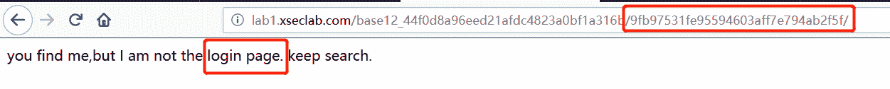
5.  继续干，试着找登录页，尝试`login.php`，成功获得key：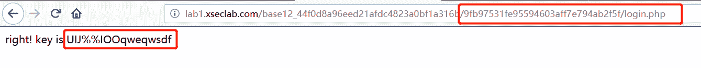