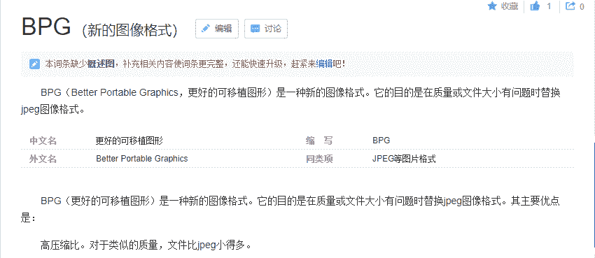

<!--yml
category: 未分类
date: 2022-04-26 14:18:20
-->

# CTF解题基本思路步骤（misc和web）_OceanSec的博客-CSDN博客_ctf misc解题思路

> 来源：[https://blog.csdn.net/q20010619/article/details/109224105](https://blog.csdn.net/q20010619/article/details/109224105)


平时注意收集做题用到的工具和脚本

知识点总结

步骤使用序号列表，并列使用项目列表

找不到思路，或者是出现异常，就回去**仔细读题**

# CTF-web基础解题步骤

1.看源码，F12或者ctrl+u

2.扫目录，御剑或者dirseash

3.burp抓包分析http头

# CTF-misc解题思路

## 图片：

​ 图片内容、图片分析、图片拼接、图片修复、EXIF、LSB

### 主要步骤：

1.  看属性详细信息

2.  010editor或winhex或notepad++打开看有无特殊信息，然后搜索ctf、CTF、flag、key等关键字

    **string、file命令(kali)**

    ```
    strings test | grep -i flag 
    file 1.txt 
    ```

3.  检查图像的开头标志和结束标志是否正确，若不正确修改图像标志恢复图像，打开查看是否有flag或ctf信息，（往往gif属于动图，需要分帧查看各帧图像组合所得数据 若不是直接的ctf或flag信息 需要考虑将其解码）

4.  stegslove或者binwalk

5.  修改高度png改IHDR、jpg改ffc2（16进制搜索）三个字节后的数据

6.  根据对应格式使用响应隐写检测工具

7.  看图片有无异常 盲水印 、f5、Lsb、guess、stegpy、steg、jphide、stegdetect

### JPG：

*   #### 特征

    文件头标识(2 bytes)：FF D8

    文件结束标识(2 bytes)：FF D9

*   #### Lsb

    stegslove

*   #### IDAT隐写

1.  使用pngcheck分析 pngcheck.exe -v file
2.  判断异常IDAT串，使用winhex等工具创建新文件
3.  根据创建后的新文件继续分析

*   #### 修改高度

    jpg改ffc2（16进制搜索）三个字节后的数据

*   **stegdetect (win)**

    （**检查**jpg图片隐写方法,Stegdetect可以检测到通过JSteg、JPHide、OutGuess、Invisible Secrets、F5、appendX和Camouflage等这些隐写工具隐藏的信息）将图片复制到 **stegdetect.exe** 所在文件夹，打开 cmd 输入：

    ```
    stegdetect.exe -tjopi -s 10.0 [stego_file]  
    -s 修改检测算法的敏感度，该值的默认值为1。检测结果的匹配度与检测算法的敏感度成正比，算法敏感度的值越大，检测出的可疑文件包含敏感信息的可能性越大。
    -t 设置要检测哪些隐写工具（默认检测jopi），可设置的选项如下： 
    	j检测图像中的信息是否是用jsteg嵌入的。
        o 检测图像中的信息是否是用outguess嵌入的。
        p 检测图像中的信息是否是用jphide嵌入的。
        i 检测图像中的信息是否是用invisible secrets嵌入的 
    ```

*   **steghide(win)**

    查看图片中嵌入的文件信息：

    ```
    steghide info out.jpg 
    ```

    提取**含有密码**的隐藏内容：

    ```
    steghide extract -sf out.jpg -p 123456 
    ```

    提取**不含有密码**的隐藏内容：

    ```
    steghide extract -sf out.jpg 
    ```

    steghide爆破密码

    有些题目用steghide加密文件但是不给密码，此时就需要爆破，steghide本身并不支持爆破，需要一些其他的方法： https://github.com/Va5c0/Steghide-Brute-Force-Toolpython

    ```
    steg_brute.py -b -d [字典] -f [jpg_file] 
    ```

    需要安装的库：**progressbar**

    ```
    pip install progressbar2 
    ```

*   **F5**

    (F5隐写，需要passwd）

    在**kail**下切换到F5-steganography，在java Extract运行命令：

    ```
    java Extract 123456.jpg图片的绝对地址 -p 123456 
    ```

*   **outguess**

    (**kali**下**图片隐写**+可需要可不要**passwd**）

    ```
    outguess -r /root/angrybird.jpg(绝对路径) 123.txt(信息存放的文本)
    outguess -k 12345 -r 2.jpg out.txt -k后接密码 -r后接解密图片 输出文件 
    ```

### PNG：

​ 文件头标识(8 bytes)：89 50 4E 47 0D 0A 1A 0A

​ 文件结束：00 00 00 00 49 45 4E 44 AE 42 60 82

​ 010打开修改

​ tweakpng.exe打开图片提示IDHRcyc错误，表示文件尺寸被修改，且未修改crc值

​ 1.binwalk分析出**两张图片**

​ 2.用stegslove打开选择image combiner 选择XOR

​ 3.根据XOR后的结果继续分析

​ zsteg可以检测**PNG**和BMP图片里的隐写数据（**lsb隐写、zlib、openstego等**），一般来讲用 zsteg 解密的文件都为 bmp 文件

```
zsteg 图片名 
```

```
 > python bwm.py decode 1.png 2.png flag.png 
```

​ 第二种 频域盲水印

```
import cv2
import numpy as np
import random
import os
from argparse import ArgumentParser
ALPHA = 5
def build_parser():
parser = ArgumentParser()
parser.add_argument('--original', dest='ori', required=True)
parser.add_argument('--image', dest='img', required=True)
parser.add_argument('--result', dest='res', required=True)
parser.add_argument('--alpha', dest='alpha', default=ALPHA)
return parser
def main():
parser = build_parser()
options = parser.parse_args()
ori = options.ori
img = options.img
res = options.res
alpha = options.alpha
if not os.path.isfile(ori):
parser.error("original image %s does not exist." % ori)
if not os.path.isfile(img):
parser.error("image %s does not exist." % img)
decode(ori, img, res, alpha)
def decode(ori_path, img_path, res_path, alpha):
ori = cv2.imread(ori_path)
img = cv2.imread(img_path)
ori_f = np.fft.fft2(ori)
img_f = np.fft.fft2(img)
height, width = ori.shape[0], ori.shape[1]
watermark = (ori_f - img_f) / alpha
watermark = np.real(watermark)
res = np.zeros(watermark.shape)
random.seed(height + width)
x = range(height / 2)
y = range(width)
random.shuffle(x)
random.shuffle(y)
for i in range(height / 2):
for j in range(width):
res[x[i]][y[j]] = watermark[i][j]
cv2.imwrite(res_path, res, [int(cv2.IMWRITE_JPEG_QUALITY), 100])
if __name__ == '__main__':
	main() 
```

​ 使用

```
python pinyubwm.py --original 1.png --image 2.png --result out.png 
```

​ 查看 **out.png** 即可，如果无法得到正常图片，可将 **1.png** 和 **2.png** 调换位置再次尝试

*   **lsb的py脚本解密（lsb隐写+需要passwd）**

    F:\CTF\CTF工具合集\脚本\cloacked-pixel-master

    使用

    ```
    python lsb.py extract [stego_file] [out_file] [password] 
    ```

*   **pngcheck（检查IDAT块_win）**

    在 **pngcheck.exe** 所在文件夹打开cmd

    ```
    pngcheck.exe -v 123.png 
    ```

    可检查 **png** 的 **IDAT** 块是否有问题相关题目可参考： https://blog.csdn.net/u010391191/article/details/80818785

    有关解题脚本可参考 **FzWjScJ** 师傅的blog： http://www.fzwjscj.xyz/index.php/archives/17/

*   **WebP**

    安装（kali中）apt install webp需要的时候按 Y 即可

    使用

    cwebp - 编码器工具：可将png转为webp

    ```
    cwebp 1.png -o 2.webp 
    ```

    dwebp - 解码器工具：可将webp转为png

    ```
    dwebp 1.webp -o 2.png 
    ```

    vwebp - 查看器工具：可直接查看webp格式图片

    ```
    vwebp 1.webp 
    ```

    webpinfo - 格式查看工具：可打印出WebP文件的块级结构以及基本完整性检查

    ```
    webpinfo 1.webp 
    ```

    其余（gif2webp、img2webp等可见 官方文档）

*   **exiftool（查看图片exif信息）**

    ```
    exiftool 1.jpg 
    exiftool 1.jpg | grep flag 
    exiftool * 
    exiftool -b -ThumbnailImage attachment.jpg >flag.jpg 
    ```

### GIF：

​ 文件头标识(6 bytes)：47 49 46 38 39(37) 61 即GIF89a

### 其他：

#### - bgp：



​ 文件头：425047FB

​ 在线网站查看即可：https://webencoder.libbpg.org/show.html

## 音频：

1.  有key mp3steg

    在MP3stego文件夹中打开cmd，然后将 **Decode.exe** 拖到命令行里，将要解密的文件放在文件夹中

    ```
    encode -E hidden_text.txt -P pass svega.wavsvega_stego.mp3

    Decode.exe -X -P pass(密码) svega_stego.mp3(要拷贝到目录下) //解码 
    ```

2.  分析声道audacity

3.  010打开

## 视频：

​ video to pic.exe或者ffmpeg.exe

​ 视频中的音频、视频放到010中查看

## 压缩包：

1.  尽量用winrar避免异常

2.  看属性

3.  伪加密

    ​ 修复工具：

    *   winrar修复

    *   ZipCenOp.jar(win)

    ​ 找到所在文件夹，在地址栏输入cmd

    ```
    java -jar ZipCenOp.jar r 文件名 
    ```

4.暴力破解

5.明文攻击

6.crc32碰撞

7.多个压缩文件合并 cat 文件名(按需) > 保存文件名

## 流量：

​

## 其他：

### pyc文件相关

```
uncompyle6 test.pyc > test.py 
```

### DTMF

[外链图片转存失败,源站可能有防盗链机制,建议将图片保存下来直接上传(img-MRjXBako-1603353529550)(C:\Users\q2723\AppData\Roaming\Typora\typora-user-images\image-20201017144526742.png)]

​ 在线工具http://dialabc.com/sound/detect/

​ 本地工具 **tdmf ton decoder**

​ https://pas-products.com/download.html免费版有限制

### pcap文件修复

​ winpcapfix工具• 在线修复• https://f00l.de/hacking/pcapfix.php

### 乐符解密

​ https://www.qqxiuzi.cn/bianma/wenbenjiami.php?s=yinyue

### linux光盘文件(ext3)

​ linux挂载光盘，使用notepad或者strings、file命令来搜索关键词

```
strings test | grep -i flag 
find | grep 'flag' 或 find -name 'flag*' 
```

​ mount命令挂载文件

### pdf

```
pdfinfo 文件名 
pdftotext 文件名 
```

und/detect/

​ 本地工具 **tdmf ton decoder**

​ https://pas-products.com/download.html免费版有限制

### pcap文件修复

​ winpcapfix工具• 在线修复• https://f00l.de/hacking/pcapfix.php

### 乐符解密

​ https://www.qqxiuzi.cn/bianma/wenbenjiami.php?s=yinyue

### linux光盘文件(ext3)

​ linux挂载光盘，使用notepad或者strings、file命令来搜索关键词

```
strings test | grep -i flag 
find | grep 'flag' 或 find -name 'flag*' 
```

​ mount命令挂载文件

### pdf

```
pdfinfo 文件名 
pdftotext 文件名 
```

