<!--yml
category: 未分类
date: 2022-04-26 14:52:30
-->

# CTF解题技能之MISC基础_cyxl0509的博客-CSDN博客_ctf的misc主要学什么

> 来源：[https://blog.csdn.net/cyxl0509/article/details/109198649](https://blog.csdn.net/cyxl0509/article/details/109198649)

**杂项介绍**

Miscellaneous简称MISC，意思是杂项，混杂的意思。

杂项大致有几种类型：

1.隐写

2.压缩包处理

3.流量分析

4.攻击取证

5.其它

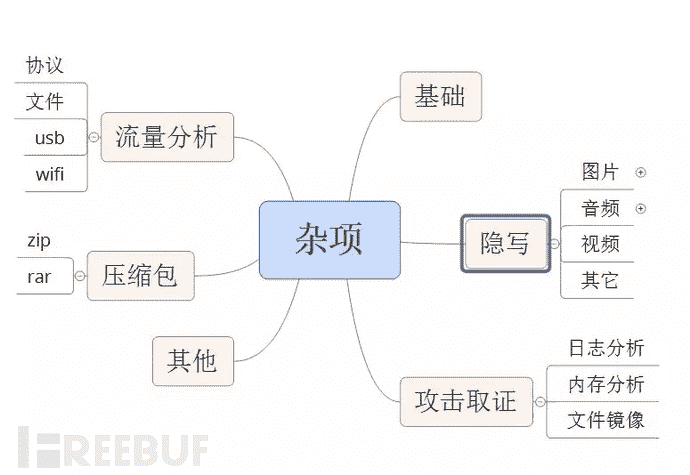

本篇主要介绍杂项基础题目的知识点以及解题思路。

**0x00 文件类型识别**

杂项题目主要是以文件附件作为题目，但是给的文件不一定是有后缀名的，这就需要我们识别这些文件

**1\. file命令**

file命令实际上是一个命令行工具，用来查看文件类型。
使用方法：
将文件复制到kail或者带有file工具的系统中，使用file查看文件。


将文件后缀名补上即可正常打开。
然后根据实际情况进行初步判断可能是什么类型的题目。

**2\. 010Editor**

010Editor是一款快速且强大的十六进制编辑器。用来编辑二进制文件。有一个友好易于使用的界面，无限次的undo和redo操作。另外还可以打印x十六进制的字节或者以书签的方式标出某些重要的字节。我们可以通过使用010Editor查看文件的头部来判断类型。

**以下是常见的文件头:**

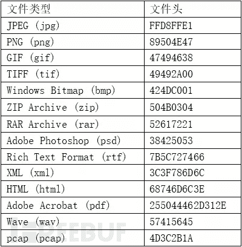

PNG文件头中包含IHDR信息。

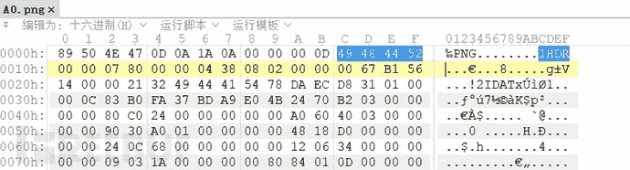

IHDR的作用将在后续的图片类隐写中详细讲解。

当文件类型不确定时就可以尝试查看文件头来判断。

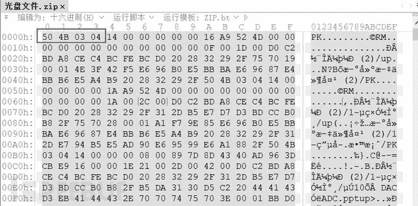

既然会出现没有后缀的文件，那当然也会出现缺少头部的情况，可以根据后缀名来选择文件头部进行填充，如果没有后缀名，则查看文件尾部来判断文件类型。

**以下是常见的文件尾部：**
zip文件的结尾以一串504B0506开始。

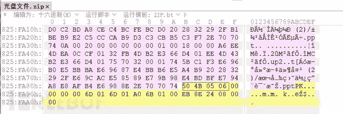

rar文件以C43D7B00400700结尾。

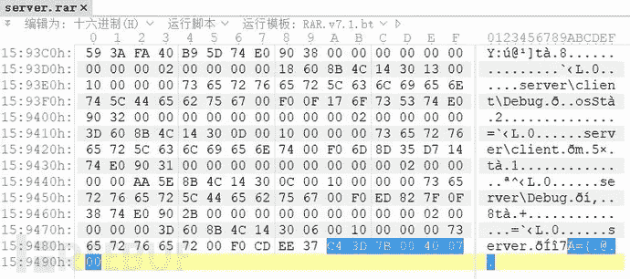

JPG文件结尾为FFD9。

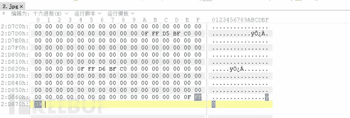

PNG文件 结尾为000049454E44AE426082。

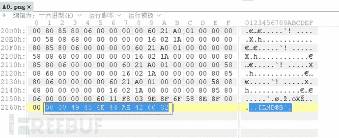

Gif文件结尾为3B。

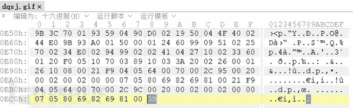

**0x01 文件分离**

介绍了文件类型的识别方法了，接下来来讲一下文件分离
文件分离的原因：
在CTF这个充满脑洞的比赛中，出题人往往会以一些稀奇古怪的出题方式出题，因此你可以常常看见暴打出题人等字眼出现在比赛论坛中。在CTF中一个文件中隐藏着另外其他文件的题目是经常有的。这就需要掌握文件分离的技巧来应对。下面介绍几种姿势

**1\. Binwalk**

1.1 Binwalk工具介绍
Binwalk是一个自动提取文件系统，该工具最大的优点就是可以自动完成指定文件的扫描，智能发掘潜藏在文件中所有可疑的文件类型及文件系统。相比于之前介绍的file命令行工具来说，file只是从文件的第一个字节开始识别，且只能把一个文件识别成一个类型的文件，很难看出是否隐藏着其他的文件，Binwalk就能很好的完成这项任务。

1.2 Binwalk文件扫描和提取
Binwalk分析文件
命令：binwalk +file 通过扫描能够发现目标文件中包含的所有可识别的文件类型。

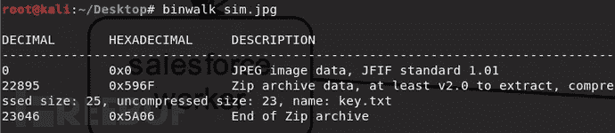

通过Binwalk我们可以看到这一张jpg文件中藏着zip文件。
Binwalk提取文件。
命令 binwalk +file -e。

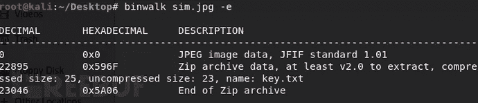

“-e"和“--extract"用于按照定义的配置文件中的提取方法从固件中提取探测到的文件系统。
若提取成功则会生成一个_文件名_extracted的目录，目录中存放的就是提取出的文件

**2\. foremost**

2.1 foremost工具介绍
foremost是基于文件开始格式，文件结束标志和内部数据结构进行恢复文件的程序。该工具通过分析不同类型文件的头、尾和内部数据结构，同镜像文件的数据进行比对，以还原文件。它默认支持19种类型文件的恢复。用户还可以通过配置文件扩展支持其他文件类型。

2.2 foremost提取文件
有时候binwalk无法正确分离出文件，这时候就可以使用foremost，将目标文件复制到kali中，在终端中使用命令行进入文件所在文件夹，使用如下命令：
Foremost+file –o 输出目录名。

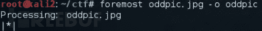

执行成功后会在目标文件的文件目录下生成我们设置的目录，目录有中按照文件类型分离出文件。


**3\. dd**

前面介绍的两种都是自动化分离工具，dd这个工具是一种半自动化工具，有的时候自动化工具不能实现文件的分离，所以需要用这个工具来进行分离。
使用dd命令分离文件格式如下：

```
dd if=源文件名 bs=1 skip=开始分离的字节数 of=目标文件名
参数说明：
if=file #输入文件名，缺省为标准输入。 
of=file #输出文件名，缺省为标准输出。 
bs=bytes #同时设置读写块的大小为 bytes ，可代替 ibs 和 obs 。 
skip=blocks #从输入文件开头跳过 blocks 个块后再开始复制。 
以IDF实验室“抓到一只苍蝇”为例，需要将获得的文件去除前364个字节：
dd if=s1 bs=1 skip=364 of=d1

使用dd命令分离文件格式如下：
dd if=源文件名 bs=1 skip=开始分离的字节数 of=目标文件名

参数说明：
if=file #输入文件名，缺省为标准输入。 
of=file #输出文件名，缺省为标准输出。 
bs=bytes #同时设置读写块的大小为 bytes ，可代替 ibs 和 obs。 
skip=blocks #从输入文件开头跳过 blocks 个块后再开始复制。 
若需要将获得的文件去除前364个字节：
dd if=s1 bs=1 skip=364 of=d1
```

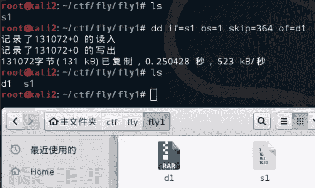

**4\. 010Editor**

在之前文件识别中提到这个工具，手动分离文件也可以使用这个工具
拖动想要分离的部分。

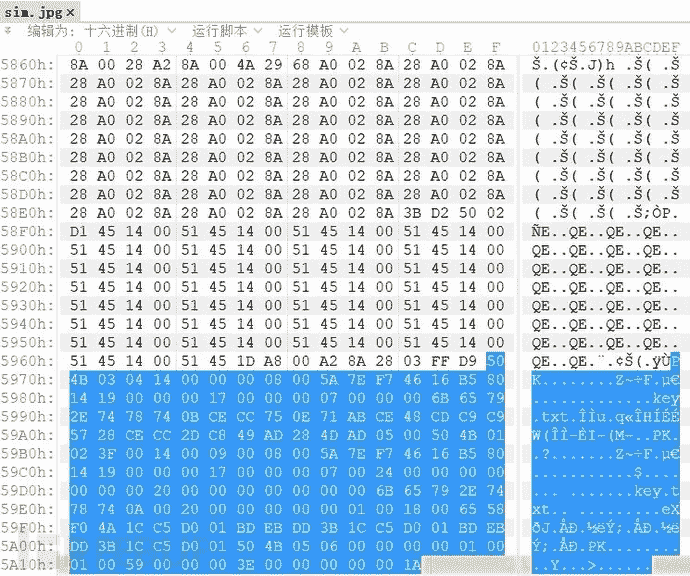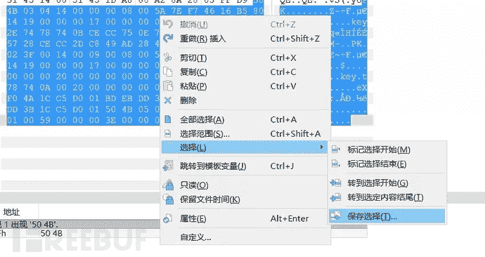

右键->选择->保存选择。

然后根据需要分离的文件类型选择后缀名。


在介绍了文件分离后，还需要提到的是文件合并。
天下之事分久必合合久必分，既然CTF有文件分离的题目，那自然也少不了文件合成的了，但是文件合成还是有技巧的。

**1\. linux环境文件合并**

cat 是linux系统下的一个能提取文件的内容的命令，使用cat命令将文件内容提取出来再导入目标文件。使用方式如下：
将chapter01、chapter02、chapter03三个文件按从左到右顺序合并，输出到book文件中。
所使用的命令：cat chapter01 chapter02 chapter03 > book
将所有以chapter开头的文件按文件名从小到大的顺序合并，输出到book文件中。
所使用的命令：cat  chapter* > book 


但是要注意的一点是，cat是需要遵循顺序来获取文件内容的，所以在cat之前需要判断一下文件的先后顺序。

**2\. windows环境文件合并**

linux中有cat等命令，windows环境下也有类似的命令copy，使用方式如下：
将chapter01、chapter02、chapter03三个文件按从左到右顺序合并，输出到book文件中。
所使用的命令：copy /B chapter01+chapter02+chapter03 book
将所有以chapter开头的文件按文件名从小到大的顺序合并，输出到book1文件中。
所使用的命令：copy /B  chapter* book1 

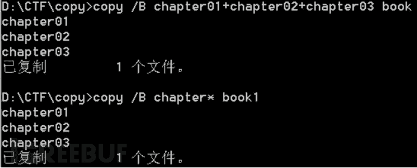

**3\. Python文件合并**

python环境适用于linux也适用于windows，它是通过编写脚本来实现的文件合并，以之前的例子来。

```
# -*- coding: utf8 -*-
def foo():
path=r".\chapter%d"
s=""
for i in xrange(1,4):
f=open(path % i).read()
s+=f
print s
pass
if __name__ == '__main__':
foo()
print 'ok'
```

**0x03 总结**

介绍了这么多关于CTF基础类型的文件处理方法，为了方便大家梳理，提供一个思维导图给大家来参考。
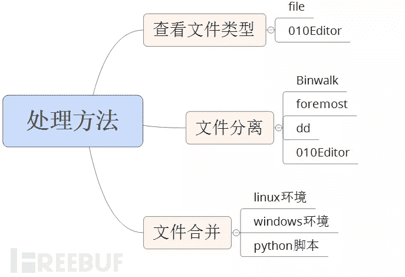