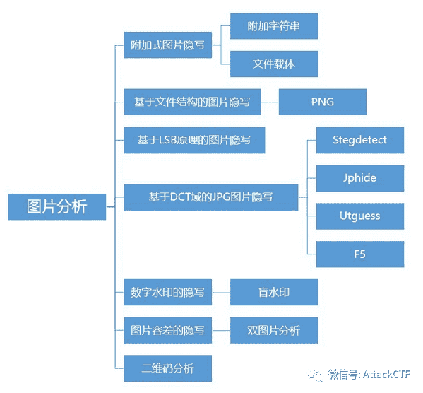
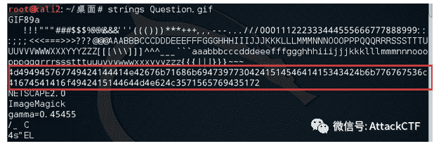
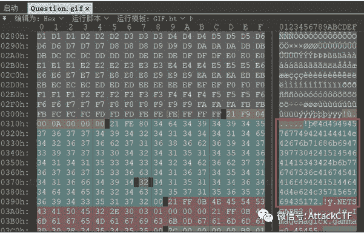
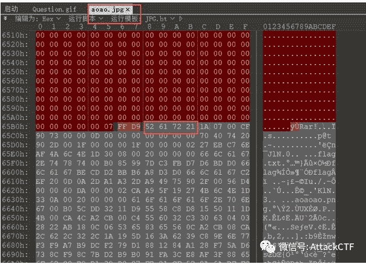
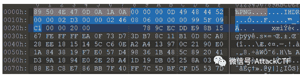
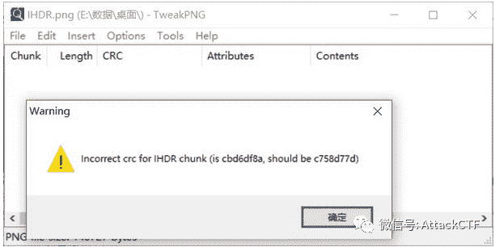
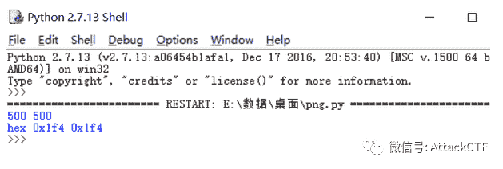
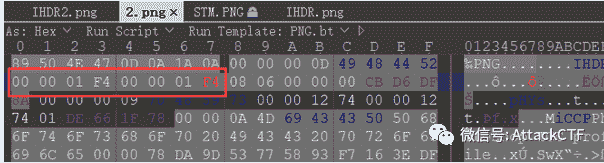
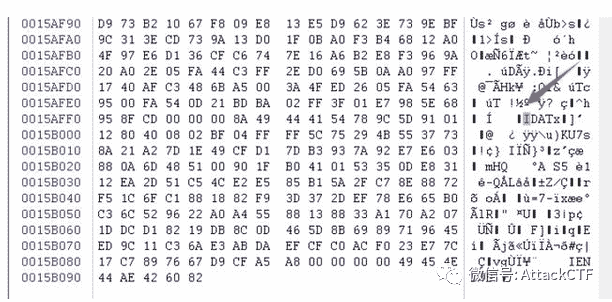
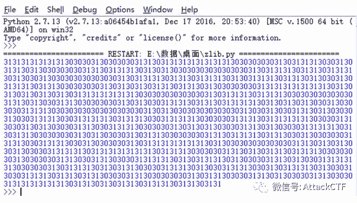

<!--yml
category: 未分类
date: 2022-04-26 14:20:26
-->

# CTF解题技能之图片分析（一）_AttckCTF的博客-CSDN博客_ctf图片题

> 来源：[https://blog.csdn.net/weixin_47767605/article/details/106160497](https://blog.csdn.net/weixin_47767605/article/details/106160497)

原创 AttackCTF 


最近丹丹整理了一波CTF中图片分析的解题思路，在CTF的杂项题中，我们最经常和图片打交道，今天我们就好好的来会一会我们的图片小伙伴。丹丹将从以下几个方面展开图片分析解题思路的整理。在图片分析题中，隐写又是最主要题型，因此，本周先从附加式图片隐写和基于文件结构的图片隐写入手。



隐写术是一门关于信息隐藏的技巧与科学，所谓信息隐藏指的是不让除预期的接收者之外的任何人知晓信息的传递事件或者信息的内容。务必要说的是，隐写与编码加密概念并不相同，但经常会将两者结合起来进行出题。

**附加式图片隐写**

顾名思义，附加式图片隐写就是使用某种方法在载体文件上附加上需要被隐写的内容，而我们要做的就是根据方法提取出载体文件中被隐藏的内容。在CTF赛事中，常见的附加式图片隐写有两种方式，一种是直接附加字符串，另一种是图片作为其他文件的载体呈现。

### **● 附加字符串**

附加字符串就是直接在图片内容中增加字符串，一般我们可以使用strings命令进行查看，也可以使用十六进制文件编辑工具进行附加内容查看。

### **● ****strings**

strings命令在对象文件或二进制文件中查找可打印的字符串。字符串是4个或更多可打印字符的任意序列，以换行符或空字符结束。strings命令对识别随机对象文件很有用。 
命令用法：strings + 文件名



### **● ****十六进制工具**

使用winhex或者010editor也是可以看到图片中附加的内容。



### **● ****文件载体**

图片文件的附加式隐写还会作为其他文件的载体的形式出现，最常见的就是图种了。图种就是利用些特殊的方式将图片文件与压缩包文件结合起来的文件，这类的文件一般保存为图片文件格式，可以正常显示图片。由于操作系统识别的过程中是，从文件头标志，到文件的结束标志位，当系统识别到图片的结束标志位后，默认是不再继续识别的，所以我们在通常情况下只能看到它是只是一张图片。对于这类的隐写，我们可以通过十六进制文件编辑工具进行文件提取也可以使用binwalk分离文件。

**举个栗子**

使用010editor可以看到aoao.jpg文件中包含一个RAR文件，根据文件头可将RAR文件提取出来。



**基于文件结构的图片隐写**

基于文件结构的图片隐写，我们主要就从PNG图片展开进行介绍。 
PNG图像格式文件由一个8字节的文件头和按照特定结构组织的3个以上的数据块（chunk）组成。 
PNG文件格式：文件头（89 59 4E 47 0D 0A 1A 0A）+数据块+数据块+数据块+...... 
PNG图片定义了两种类型的数据块，一种是称为关键数据块，这是必须的数据块，另一种称为辅助数据块，这是可选的数据块。关键数据块定义了4个标准数据块，分别为IHDR、PLTE、IDAT和IEND，每个PNG文件都必须包含它们，PNG读写软件也都必须要支持这些数据块。每个数据块都会包含长度、数据块类型码、数据块数据和循环冗余校验（CRC）四个部分。这里需要注意的是CRC域的值是数据块类型码和数据域的数据计算而来的。 
接着我们就来了解一下四个关键数据块：

**● IHDR**

文件头数据块IHDR是PNG文件中的第一个数据块，而且一个PNG文件中只能有一个文件头数据块，它包含了PNG文件中存储的图像数据的基本信息，包括了图片的宽，高，图像深度，图像类型，压缩方法等。



如图所示，标蓝部分为IHDR数据块，00 00 00 0D代表IHDR头块长13，49 48 44 52代表IHDR标识，00 00 02 D3代表图片的宽，00 00 02 46代表图片的高。其中我们主要关注图片的宽和高。 

在CTF中，经常通过改变宽和高使得图片显示不完整或者无法显示从而达到隐藏信息的目的。对于这种情况，我们不能轻易修改图片的宽或高的值，应该通过CRC的值推算出宽或高的值；或者是修改宽或高的值后，使用CRC计算工具，计算得出新的CRC值替换原本的值，以防图片报错打不开。

**举个栗子：**

1.现有某CTF题目如下，打开为一张图片，可以在Windows下正常打开。


2.使用tweakPNG打开图片可看到提示报错。



3.由于CRC值计算的是数据块类型码及数据块数据，因此可以通过以下脚本计算出图片的原始宽和高。

```
import os
import binascii
import struct

misc = open("2.png","rb").read()

for i in range(1024):
data = misc[12:16] + struct.pack('>i',i)+ misc[20:29]
crc32 = binascii.crc32(data) & 0xffffffff
if crc32 == 0xCBD6DF8A:
print i
```



4.使用十六进制文件编辑器修改图片的宽和高和得出的结果一致，可得出隐藏在图片中的flag。




**● PLTE**

调色板数据块 PLTE（palette chunk）：它包含有与索引彩色图像（indexed-color image）相关的彩色变换数据，它仅与索引彩色图像有关，而且要放在图像数据块（image data chunk）之前。真彩色的 PNG 数据流也可以有调色板数据块，目的是便于非真彩色显示程序用它来量化图像数据，从而显示该图像。

**● IDAT**

图像数据块 IDAT（image data chunk）：它存储实际的数据，在数据流中可包含多个连续顺序的图像数据块。这是一个可以存在多个数据块类型的数据块。它的作用就是存储着图像真正的数据。IDAT采用 LZ77 算法的派生算法进行压缩，可以用 zlib 解压缩。值得注意的是，IDAT 块只有当上一个块充满时，才会继续一个新的块。

**举个栗子**

某CTF题目相关IDAT的部分解题过程： 
1.使用pngcheck识别PNG图片文件（或者使用Stegsolve.jar、tweakPNG查看），可以看到正常充满的长度应该是65524，而倒数第二个IDAT并没有充满，就又起了一个IDAT，明显最后一个IDAT有问题。


2.取出有问题的IDAT块的内容。



3.去掉长度、数据块类型码（IDAT）以及CRC，只留取数据部分： 
789C5D91011280400802BF04FFFF5C75294B5537738A21A27D1E49CFD17DB3937A92E7E603880A6D485100901FB0410153350DE83112EA2D51C54CE2E585B15A2FC78E8872F51C6FC1881882F93D372DEF78E665B0C36C529622A0A45588138833A170A2071DDCD18219DB8C0D465D8B6989719645ED9C11C36AE3ABDAEFCFC0ACF023E77C17C7897667 

4.可查找到789C是zlib的文件头，使用脚本进行解压缩。

```
import zlib
import binascii
IDAT = "789C5D91011280400802BF04FFFF5C75294B5537738A21A27D1E49CFD17DB3937A92E7E603880A6D485100901FB0410153350DE83112EA2D51C54CE2E585B15A2FC78E8872F51C6FC1881882F93D372DEF78E665B0C36C529622A0A45588138833A170A2071DDCD18219DB8C0D465D8B6989719645ED9C11C36AE3ABDAEFCFC0ACF023E77C17C7897667".decode('hex')
result = binascii.hexlify(zlib.decompress(IDAT))
print result
```



根据得出的结果在进行分析结合其他内容得出flag。

●IEND

图像结束数据 IEND（image trailer chunk）：它用来标记 PNG 文件或者数据流已经结束，并且必须要放在文件的尾部。IEND 数据块的长度总是 00 00 00 00，数据标识总是 IEND 49 45 4E 44，因此，CRC 码也总是 AE 42 60 82。

**小总结**

本次丹丹的图片解题思路分享第一篇就到这里啦，如果你有更好的思路，快来跟丹丹妹，讨论讨论。

