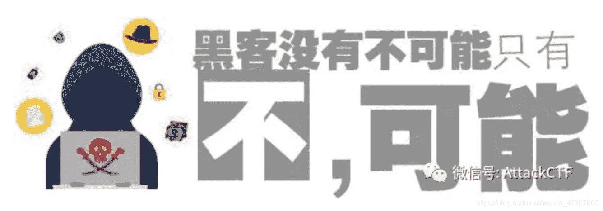
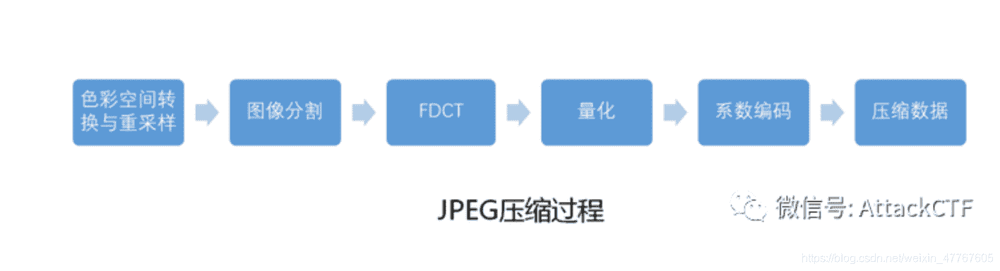
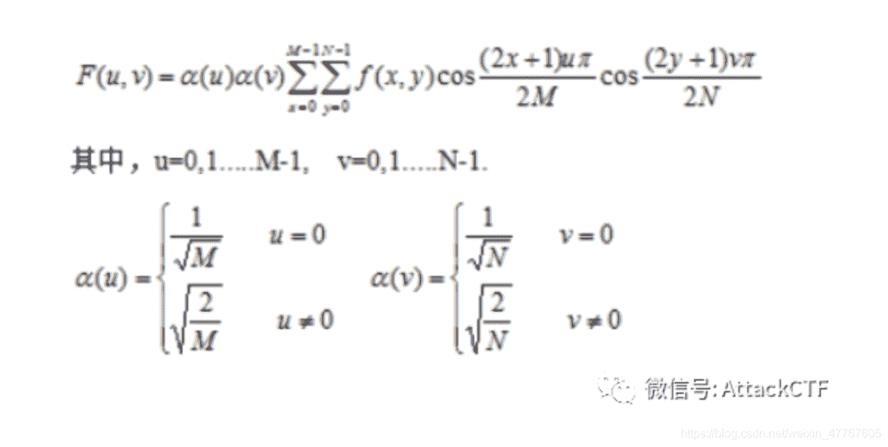
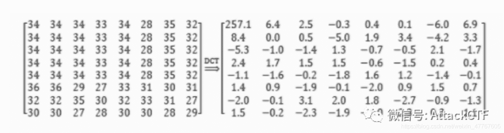
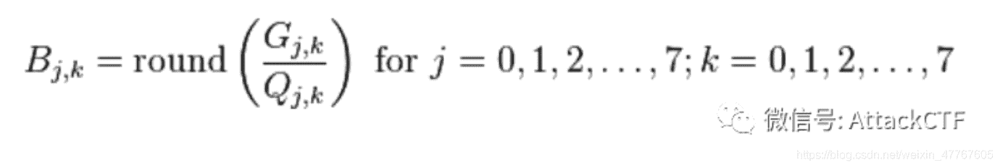
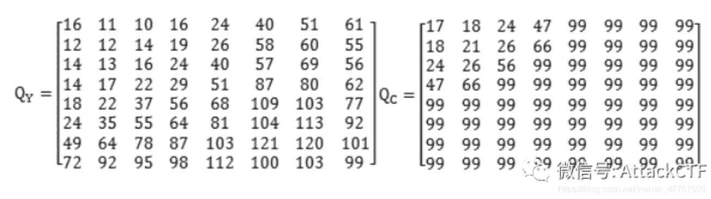
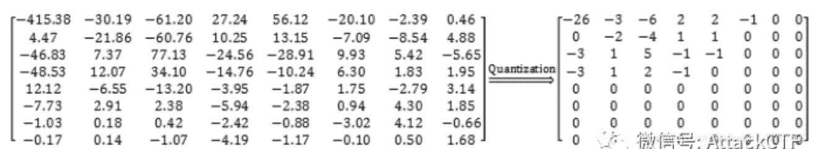
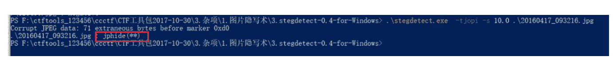
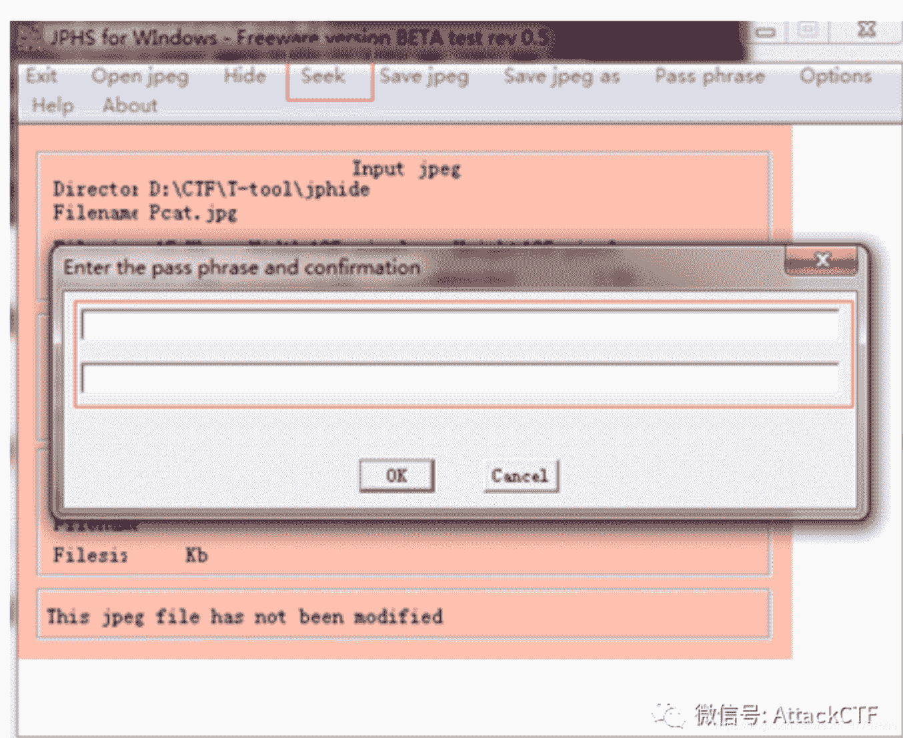
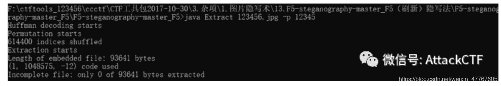

<!--yml
category: 未分类
date: 2022-04-26 14:48:46
-->

# CTF解题技能之图片分析（三）_AttckCTF的博客-CSDN博客_ctf jpg图片

> 来源：[https://blog.csdn.net/weixin_47767605/article/details/106178858](https://blog.csdn.net/weixin_47767605/article/details/106178858)

原创 AttackCTF 

丹丹妹，最近又总结了一波JPG格式的图片分析，本篇内容主要讲的是基于DCT域的JPG图片隐写。

**JPEG压缩原理**

JPEG（全称为joint Photographic Experts Group）是由联合图像专家组开发的，并且简单粗暴的使用组的名字作为该图片格式的名字。之前的文章中我们有讲过PNG图片，JPG图片和PNG图片的不同点是，JPG图片是有损压缩文件，支持多种压缩级别。在讲JPG图片隐写之前，我们先来了解一下JPG图片的压缩原理。 
JPEG压缩的流程图如下，解压缩则是反过来：

整个JPEG压缩算法中最核心的算法就是DCT，在CTF中很多的加密隐写也和DCT相关，接下来我们就来了解一下DCT。

**● DCT**

DCT（Discrete cosine transform），全称为离散余弦变换，类似于离散傅里叶变换，但只使用实数。在进行DCT变换前，会将图像分为8×8的像素块，然后针对8×8的像素块逐一进行DCT变换。 
离散余弦变换变换计算公式：

上述公式的M,N是指水平、垂直方向的像素值，一般为8（实验证明8×8的数据块的计算效率比较高）。8×8的像素块经过DCT操作后，就得到了8×8的变换系数矩阵。F（0,0）是直流系数（DC），是8×8像素块数据的平均值，其他的63个系数则是交流系数（AC）。

正如上图所示（数据来源于网上），经过DCT变换后，矩阵的“能量”集中在左上角，直流分量保存了一个较大的值，其他的分量接近于0。

**离散余弦变换具有很强的“能量集中”特性：大多数的自然信号(包括声音和图像)的能量都集中在离散余弦变换后的低频部分。——百度百科**

DCT变换做的最重要的一件事就是把数据分为“重要部分”和“不重要部分”。经过DCT变换后，每个8×8像素块的低频部分集中在左上角，高频部分分布在右下角。由于离散余弦变换的特性，比较重要的信息（如亮度）会集中在低频部分，而不那么重要的信息会分布在高频，这为进一步的压缩起到了充分的铺垫作用。

**● 量化**

真正造成JPEG有损的就是量化过程，损的是高频部分。JPEG有提供量子化算法如下：

其中，G是需要处理的图像矩阵，Q为量子化系数矩阵。JPEG算法提供了针对亮度和色差的两张标准量化表，如下图所示，分别用于处理亮度数据Y和色差数据Cr及Cb。

以下面亮度数据为例（数据来源于网络），左边的数据一一对应亮度量化表的每个系数，对应相除并取整数（四舍五入）得到右边的结果。

 可以看到量化后大部分的数据都变为了0，这有利于压缩存储。 

关于JPEG压缩原理的，斗哥就讲DCT和量化这两个部分，其他的过程，可访问这里：https://blog.csdn.net/carson2005/article/details/7753499 进一步了解。

**CTF常见的jpg隐写方式及工具**

**● 隐写方式**

对JPEG的隐藏算法一般分为三个步骤，一是对JPEG文件进行格式分析，获取编码信息，采用对应的编码方式进行解码，得到整幅图像的DCT系数；二是按照某个规则对得到的DCT变换系数进行一些小修改，将要隐藏的信息嵌入到DCT系数中；三是将修改后的DCT系数进行编码写入新的JPEG文件中。最关键的是第二步中的修改规则的制定，目前已有多种不同修改原则的密写技术。以下举几个栗子：

**● JSteg**

JSteg将1比特的秘密信息隐藏在量化后的DCT系数不是0,1,-1的最低位。JSteg算法对DCT系数的改变较小，能很好的嵌入秘密信息，对图片改变不大，但可能会因为不是0,1,-1的值较少而限制嵌入秘密信息的长度。

**● outguess**

outgusee算法是Niels Progos针对Jsteg算法的缺陷提出的一种方法，主要是分为两个部分：嵌入过程和纠正过程，嵌入过程不修改量化后值为0、1的DCT系数，将需要隐藏的信息嵌入DCT系数的最低一位，随机决定下一个要嵌入的DCT系数的位置；纠正过程是利用未被修改的DCT系数进行修改来保持仿图不变。

**● F5**

F5隐写在选取载体DCT系数，不同于嵌入LSB位，F5算法采用随机的方式选取载体信息的DCT系数，由伪随机序列得到DCT系数间距，同时跳过DC系数和值为0的DCT系数，用所得的伪随机序列与隐藏信息逐位异或以消除其统计特征。

**隐写工具**

**1.stegdetect**

Stegdetect程序主要用于分析JPEG文件。因此用Stegdetect可以检测到通过JSteg、JPHide、OutGuess、Invisible Secrets、F5、appendX和Camouflage等这些隐写工具隐藏的信息。使用该工具可以分析图片的加密方法，分析后找到对应的工具进行解密。

**2.Jphs**

当stegdetect提示jphide加密时，可以用Jphs工具进行解密。 
如下图，点击seek，输入密码和确认密码，在弹出文件框中选择要保存的解密文件位置即可，结果保存成txt文件。

**3.outguss**

当stegdetect提示outguss加密时，可以用同名工具outguss进行解密。 
解密命令为：
outguess –r 要解密的文件名 输出结果文件名

**4.F5-steganography**

若加密方式为F5，则可用F5-steganography进行解密。 
解密命令为：
java Exrtact 要解密的文件名 –p 密码 
运行完会在当前目录下生成一个output.txt文件，可在文件内看到结果。

好啦，丹丹妹，的分享就到这啦，记得有新思路要和妹妹我一起分享哟~

**参考链接：**
https://www.docin.com/p-352417778.html 

https://www.jianshu.com/p/934269064bfb 

https://www.cnblogs.com/Arvin-JIN/p/9133745.html 

https://blog.csdn.net/abcjennifer/article/details/8074492 

https://www.ixueshu.com/document/edf50e34ff6f6209318947a18e7f9386.html

