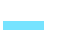
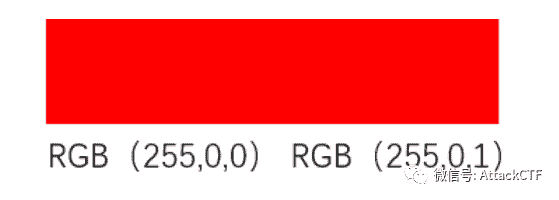
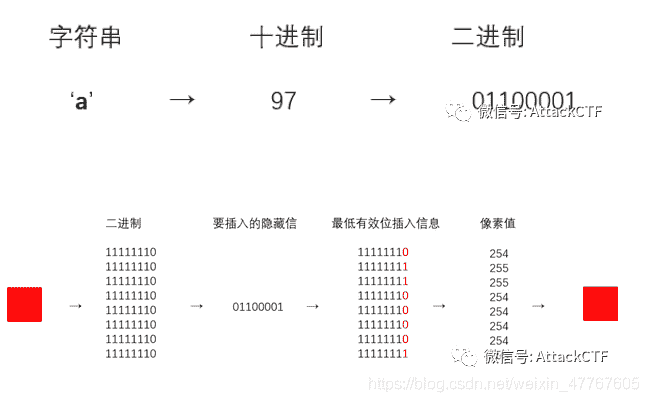
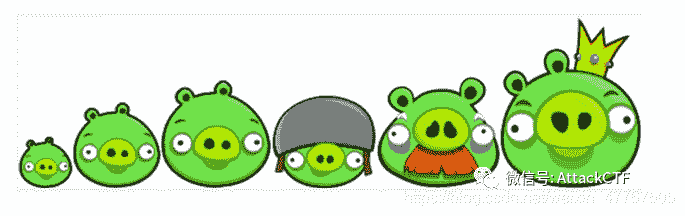
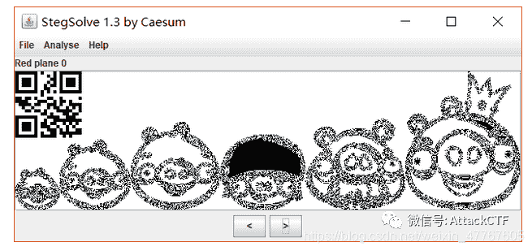
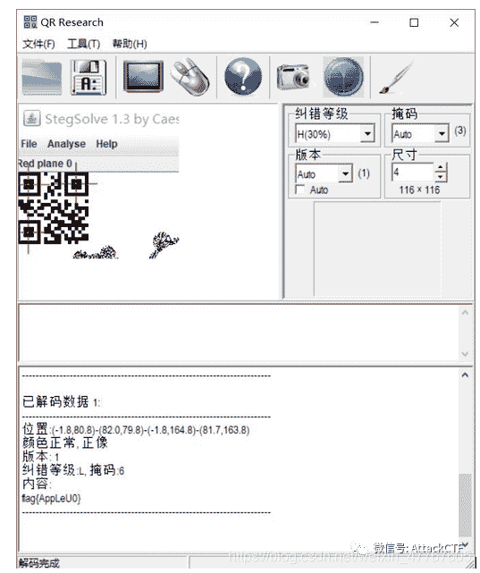
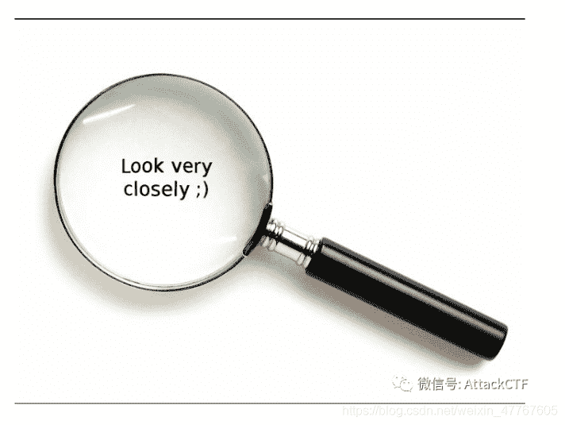
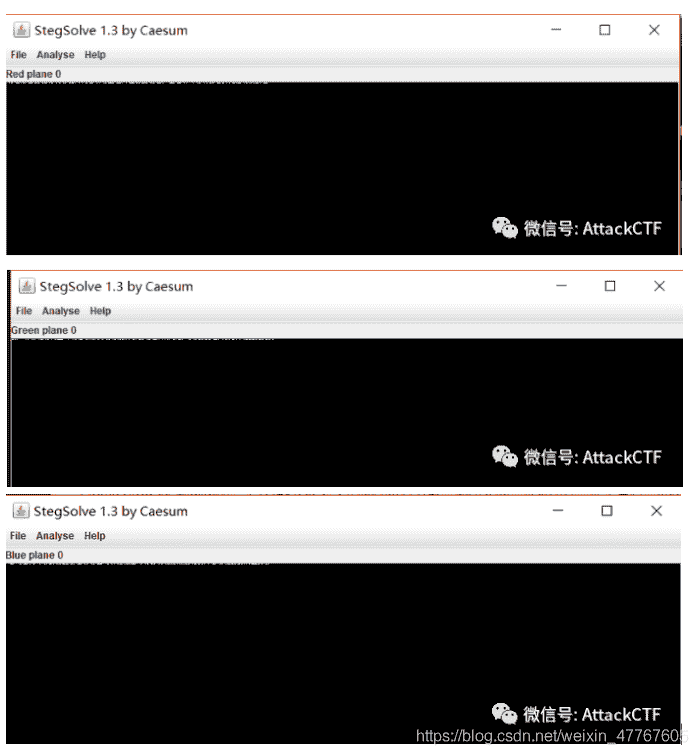
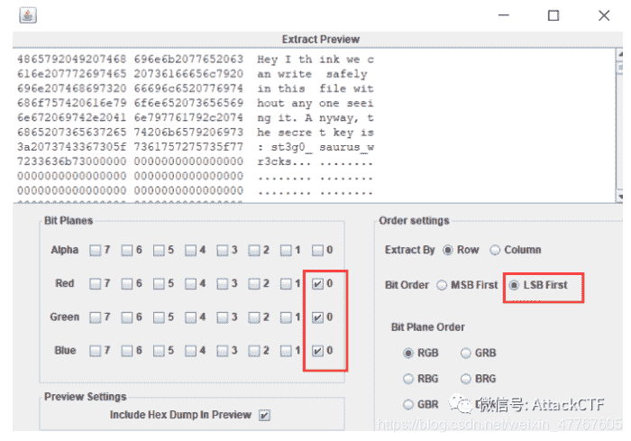

<!--yml
category: 未分类
date: 2022-04-26 14:33:18
-->

# CTF解题技能之图片分析（二）_AttckCTF的博客-CSDN博客_ctf 像素

> 来源：[https://blog.csdn.net/weixin_47767605/article/details/106163183](https://blog.csdn.net/weixin_47767605/article/details/106163183)

丹丹上次介绍过CTF图片分析的附加式图片隐写和基于文件结构的图片隐写两种图片隐写方式。今天继续和大家分享图片隐写术，今天分享的内容主要是基于LSB原理的图片隐写。

**原理介绍**

LSB（LeastSignificant Bits）算法：将秘密信息嵌入到载体图像像素值的最低有效位，也称最不显著位，改变这一位置对载体图像的品质影响最小。LSB图片隐写就是基于LSB算法的图片隐写术，在CTF中也是我们经常会遇到的基础杂项题型。 

图像一般由像素组成，而每个像素由3个颜色组成，也就是我们常说的RGB三原色：红绿蓝。每个颜色占8位，取值范围为0x00~0xFF，也就是256种颜色，所以一共有256³种颜色，也就是16777216种颜色，而人类眼睛可识别的颜色约有1000万种，因此还有6777216种颜色，人类是区分不出来的。 

以下图为例，左半部分是RGB（255,0,0），右半部分是RGB（255,0,1）。用肉眼我们很难区分这两个颜色的区别。

因此我们就可以利用这一情况修改最低位中的信息，实现信息的隐写，而人类的眼睛并不会发现这前后的变化，每个像素可以携带3bit的信息。 

为了让大家更好的理解，我举个栗子哇。比如说我要将’a’隐藏到图片中，先将需要隐藏的字符转换为二进制，然后再将原始图像像素值由十进制转为二进制，将需要隐藏的信息的每一比特信息替换原始图像相对应的最低有效位，将得到的含秘密信息的二进制数据转换为十进制像素值，从而获得含秘密信息的图像。

由于水印信息嵌入的位置是LSB，为了满足水印的不可见性，允许嵌入的水印强度不可能太高。然而针对空域的各种处理，如游程编码前的预处理，会对不显著分量进行一定的压缩，所以LSB算法对这些操作很敏感。因此LSB算法最初是用于脆弱性水印的。——百度百科

通常来说LSB图片隐写术只能用于无压缩或者无损压缩的文件格式中。如果图像是jpg图片的话，就没办法是用LSB隐写，因为jpg图片对像素进行了有损压缩，我们修改的信息会在压缩过程中被破坏。而png图片采用的是无损压缩，修改的信息就能得到正确的表达，不至于丢失。bmp图片把所有的像素都按照原样储存，没有进行压缩，因此bmp图片也是可以进行lsb隐写。 
最后，丹丹来介绍一下图像通道的概念。一幅完整的图像，红色绿色蓝色三个通道缺一不可。即使图像中看起来没有蓝色，只能说蓝色光的亮度均为0或者各像素值的红色和绿色通道不全为0，但不能说没有蓝色通道存在。“存在、亮度为零”和“不存在”是两个不同的概念。一幅图像，如果关闭了红色通道，那么图像就偏青色。如果关闭了绿色通道，那么图像就偏洋红色。如果关闭了蓝色通道，那么图像就偏黄色。除了这三个颜色通道，还有一个Alpha通道，是一个8位的灰度图像通道，该通道用256级灰度来记录图像中的透明度信息，定义透明、不透明和半透明区域，其中黑表示透明，白表示不透明，灰表示半透明。

**举个栗子**

一般在CTF中有两种常见的题型，一种是flag隐藏在某个通道中，一种是将flag置于每个最低有效位。在讲题目之前，我们先介绍一个图片隐写术中的神器——StegSolve。如下图为stegsolve的界面，主要的功能为analyse，对于analyse的几个功能键做个简单的介绍：File Format:文件格式，这个主要是查看图片的具体信息；Data Extract:数据抽取，图片中隐藏数据的抽取；Frame Browser:帧浏览器，主要是对GIF之类的动图进行分解，动图变成一张张图片，便于查看；Image Combiner:对于两张图片的拼接，使用AND、OR、XOR等进行处理。

**● flag****隐藏于某个通道中**

1.题目为SB！SB！SB！，并且有提示LSB。

2.放入stegsolve中，遍历通道，发现red plane 0中存在一个二维码。

3.解码得到flag。

**● flag****隐藏于每个最低有效位中**

1.题目为Chromatophoria，由题目提示the color values可猜测为一题LSB隐写。

2.放入stegsolve中，遍历通道，发现通道7-1的内容差不多，但是到了red plane 0、green plane 0以及blue plane 0 均为黑色，猜测低位被插入数据。

3.使用data extract功能提取数据，得到flag。

好啦，丹丹这期的图片隐写就到这结束啦，下期接着分享其他的图片隐写术，我们下期再见~

