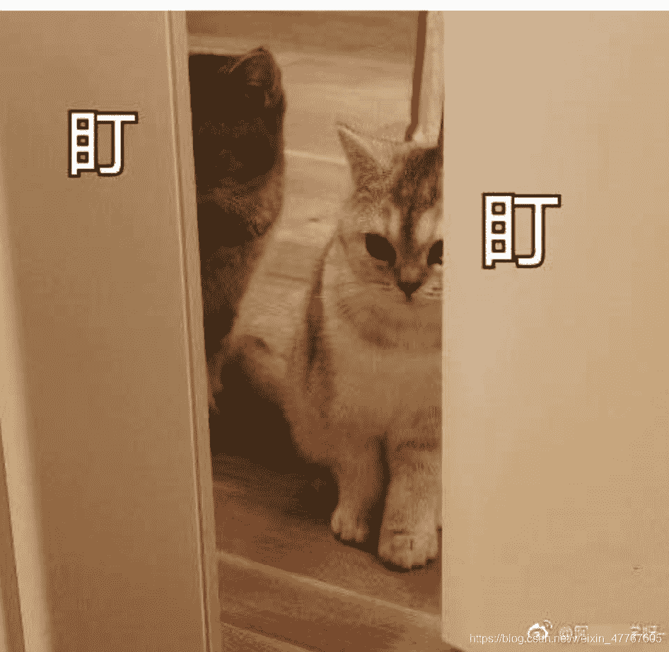
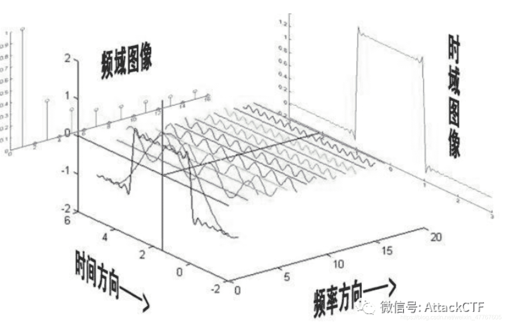
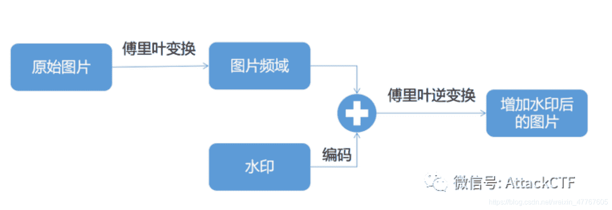
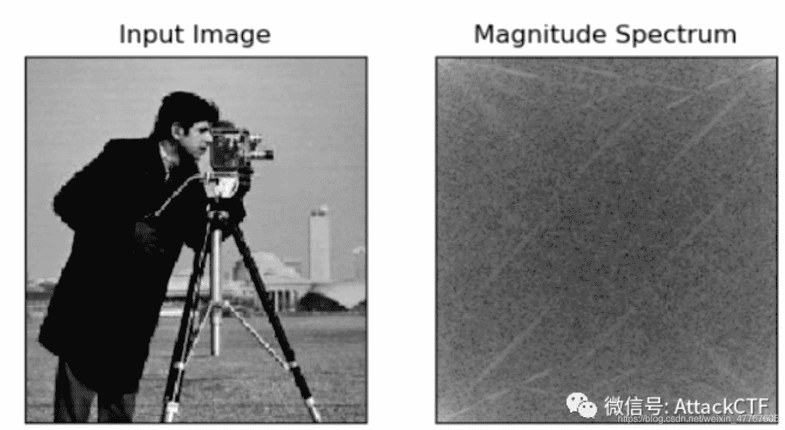
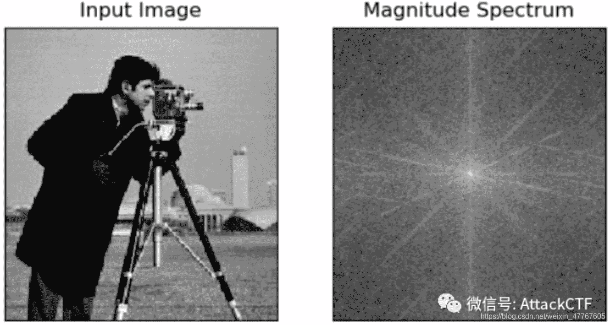
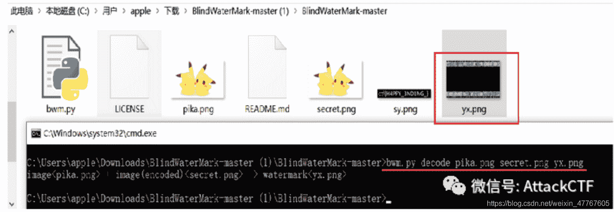
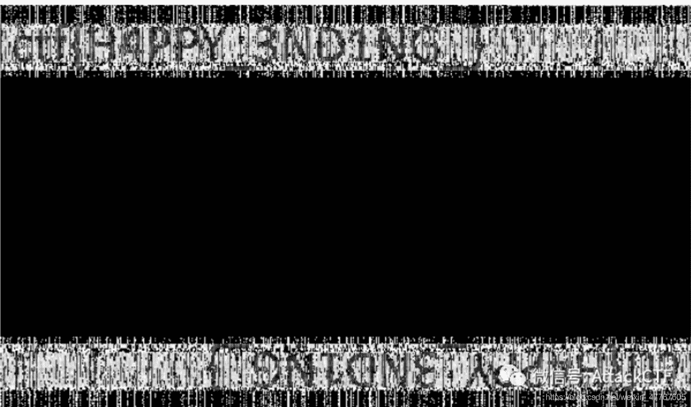

<!--yml
category: 未分类
date: 2022-04-26 14:30:41
-->

# CTF解题技能之图片分析（四）_AttckCTF的博客-CSDN博客

> 来源：[https://blog.csdn.net/weixin_47767605/article/details/106178922](https://blog.csdn.net/weixin_47767605/article/details/106178922)

原创：乌云白帽子

对于CTF中图片隐写的相关解题思路，丹丹最近又总结了关于数字水印的知识点。

**数字水印**

如下图是我们生活中接触的比较多数字水印的场景，在微博上发表一些图片的时候，微博会加上我们的ID，用来标识出处或者声明版权。像这类可以看到的水印称之为可见水印，简单粗暴将水印加在图片上，对原始图片的观感还是有一定的影响。那今天丹丹就来介绍一下另一种不会影响图片观感的数字水印，就是盲水印。盲水印隐匿性强，鲁棒性（抗攻击性）高。双图考盲水印的题目在CTF中还是蛮常见的，接下来就跟丹丹一起来学习学习盲水印吧。

**盲水印**

盲水印技术是在不破坏图片本身的条件下，将水印加入图片中，水印信息从表面看不出来，但可以通过算法和密钥解出。盲水印的原理其实来源于傅里叶变换，我们先来了解一下傅里叶变换。

**● 二维离散傅里叶变换**

在大学期间，想必大家都有接触过傅里叶变换。傅里叶变换最主要的做的就是把时域变换为频域来处理分析信号的频谱结构和变化规律。时域是以时间为参照系，万物随着时间变化而变化，也就是一个自变量为时间，因变量为振幅的函数。而频谱就是自变量为频率，因变量为振幅的函数。如下图（来源于网络）所示，就是傅里叶变换的示意图。

盲水印主要利用的是二维离散傅里叶变换。二维离散傅里叶变换主要就是把图片从空间域变换为频域进行处理分析。二维离散傅里叶变换的常用性质有：可分离性、周期性、共轭对称性和平移性。

**● 盲水印原理**

如下图所示是盲水印的工作流程图，我们由下图开始介绍盲水印是如何进行添加的。

图片是二维的，因此要对图片进行处理要先将图片通过二维离散傅里叶变换转换为频域，由于二维离散傅里叶变换具有分离性，因此我们可以进行两次离散傅里叶变换，且离散信号具有周期性，因此我们进行频谱分析的时候只需要关注一个周期的变换。

如上图所示右边为左边的频谱图，高亮的地方为低频部分，可以看见高亮的部分分布于四个角落，由于傅里叶函数具有平移特性，我们一般会将频谱低频的部分移到中心的，之前的文章我们也说过低频一般存放重要信息，将其聚集在中心也能减少增加水印对图片的损害，如下图。由图也可以发现频谱图是关于中心对称的。

在图片加入水印的时候要进行编码不仅增加了水印的隐蔽性更是增强了水印的安全性，不易被破解。最后将编码过后的水印和图片的频域进行傅里叶逆变换，得到一个增加了水印后的图片，图片与增加水印之前的图片几乎无差别。

**● 例题**

一般对于提供两图的题目来说，我们会考虑到盲水印。对于盲水印的题目我们一般会使用GitHub上工具：BlindWaterMark，这个工具可以进行盲水印图片的合成和提取。我们就会使用该工具进行水印的提取。 
使用方式： 
合成：

python bwm.py encode 原图.png 水印图片.png 合成后的图片.png

提取：

python bwm.py decode 原图.png 合成后的图片.png 提出的水印.png

1.如下图，出题者给了我们两张看上去一模一样的图片。

2.使用BlindWaterMark进行水印的提取，使用以下命令进行提取：

bwm.py decode pika.png secret.png yx.png

3.得到如下图的水印，也就得到我们的flag啦。

END

好啦，丹丹本次的图片分析分享就到这啦，下次再见~ 

●**参考链接： **
1.https://www.cnblogs.com/h2zZhou/p/8405717.html 
2.https://baijiahao.baidu.com/s?id=1636833728798493906&wfr=spider&for=pc

