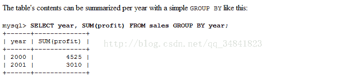
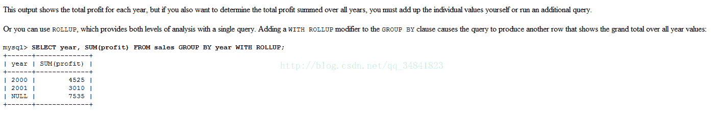
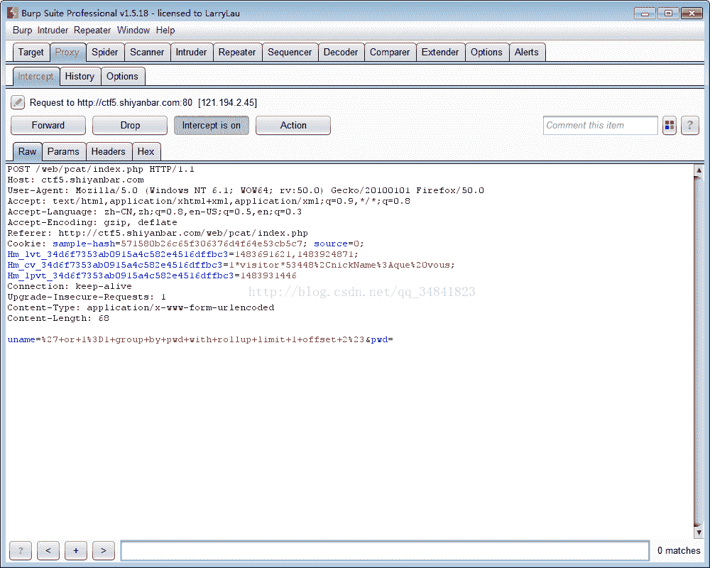
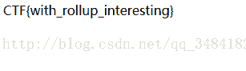
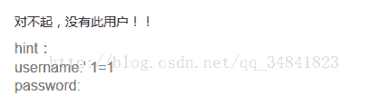
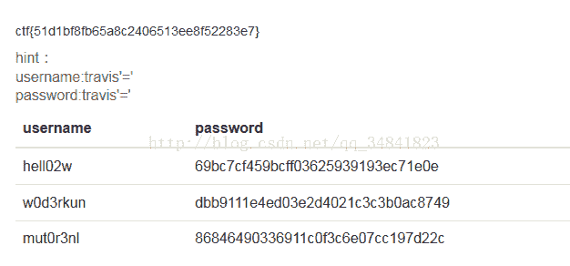

<!--yml
category: 未分类
date: 2022-04-26 14:31:56
-->

# CTF解题笔记（1）_TravisZeng的博客-CSDN博客

> 来源：[https://blog.csdn.net/qq_34841823/article/details/54287419](https://blog.csdn.net/qq_34841823/article/details/54287419)

1.因缺思汀的绕过

解题路径： 

打开后是一个登录框类似的东西，查看页面源码可以看到有source:source.txt的字样

 

打开连接：http://ctf5.shiyanbar.com/web/pcat/source.txt

可以看到登录的php逻辑：

```
<?php
error_reporting(0);

if (!isset($_POST['uname']) || !isset($_POST['pwd'])) {
	echo '<form action="" method="post">'."<br/>";
	echo '<input name="uname" type="text"/>'."<br/>";
	echo '<input name="pwd" type="text"/>'."<br/>";
	echo '<input type="submit" />'."<br/>";
	echo '</form>'."<br/>";
	echo '<!--source: source.txt-->'."<br/>";
    die;
}

function AttackFilter($StrKey,$StrValue,$ArrReq){  
    if (is_array($StrValue)){
        $StrValue=implode($StrValue);
    }
    if (preg_match("/".$ArrReq."/is",$StrValue)==1){   
        print "姘村彲杞借垷锛屼害鍙禌鑹囷紒";
        exit();
    }
}

$filter = "and|select|from|where|union|join|sleep|benchmark|,|\(|\)";
foreach($_POST as $key=>$value){ 
    AttackFilter($key,$value,$filter);
}

$con = mysql_connect("XXXXXX","XXXXXX","XXXXXX");
if (!$con){
	die('Could not connect: ' . mysql_error());
}
$db="XXXXXX";
mysql_select_db($db, $con);
$sql="SELECT * FROM interest WHERE uname = '{$_POST['uname']}'";
$query = mysql_query($sql); 
if (mysql_num_rows($query) == 1) { 
    $key = mysql_fetch_array($query);
    if($key['pwd'] == $_POST['pwd']) {
        print "CTF{XXXXXX}";
    }else{
        print "浜﹀彲璧涜墖锛�";
    }
}else{
	print "涓€棰楄禌鑹囷紒";
}
mysql_close($con);
?>
```

可以看到，这里面有SQL的一个过滤器，把一些sql的关键字例如benchmark，join等都过滤了

而且sql查询语句是： 

```
SELECT * FROM interest WHERE uname = '{$_POST['uname']} 
```

又由： 

```
mysql_num_rows($query) == 1
```

这个判断可以得知数据库中的记录就只有一条，这部分逻辑大概就是然后通过提交的uname查询出结果，如果结果只有一条则继续，如果查询结果中的pwd字段和post过去的key值相同，则给出flag。
这时就要用到注入的一个小技巧，我们使用group by pwd with rollup 来在查询结果后加一行，并且这一行pwd字段的值为NULL
在mysql官方文档中是这样描述rollup函数的：


大概的意思就是在GROUP BY子句中使用WITH ROLLUP会在数据库中加入一行用来计算总数，ROLLUP子句的更加详细的用法，可以参考mysql的官方文档，此处就不多做赘述了。
再结合limit和offset就可以写出一个payload
即：输入的用户名为：' or 1=1 group by pwd with rollup limit 1 offset 2 #
这里解释一下此时执行的SQL:
SELECT * FROM interest where uname=' ' or 1=1
group by pwd with rollup  （在数据库中添加一行使得pwd=NULL）
limit 1 （只查询一行）
offset 2  （从第二行开始查询）
#注释
此时密码只要为空即可查询成功



2.登陆一下好吗？？
解题路径：http://ctf5.shiyanbar.com/web/wonderkun/web/index.html
题目说这个过滤了很多敏感符号，于是先构造一下常用的payload：' or 1=1 #

发现or 和 #都被过滤掉了，通过测试发现--也被过滤了，看起来是很吓人，但是不过幸好'没有被过滤，于是构造payload:
username = travis'='
password=travis'='

这个时候成果获得flag
为什么这样可以绕过呢？
当提交username=travis'='&password=travis'='
语句会变成如下：
select * from user where username='travis'='' and password='travis'=''
这时候还不够清晰，我提取前一段判断出来（后面的同样道理）
username='travis'=''
这是有2个等号，然后计算顺序从左到右，
先计算username='travis' 一般数据库里不可能有我这个小名（若有，你就换一个字符串），所以这里返回值为0（相当于false）
然后0='' 这个结果呢？看到这里估计你也懂了，就是返回1（相当于true）

所以这样的注入相当于
select * from user where 1 and 1
也等于 select * from user
（这题只有筛选出来的结果有3个以上才会显示flag，没有就一直说“对不起，没有此用户！！”）

面那个比较是弱类型的比较，
以下情况都会为true
1='1'
1='1.0'
1='1后接字母(再后面有数字也可以)'
0='除了非0数字开头的字符串'
（总体上只要前面达成0的话，要使语句为true很简单，所以这题的万能密码只要按照我上面的法子去写一大把）